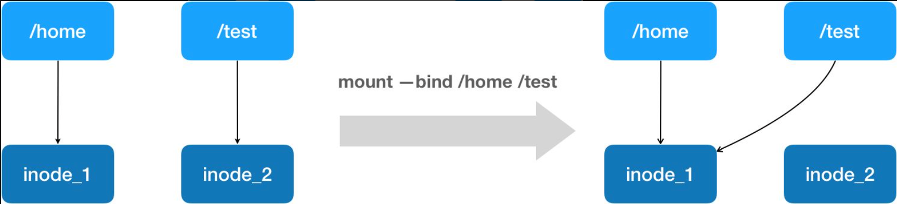
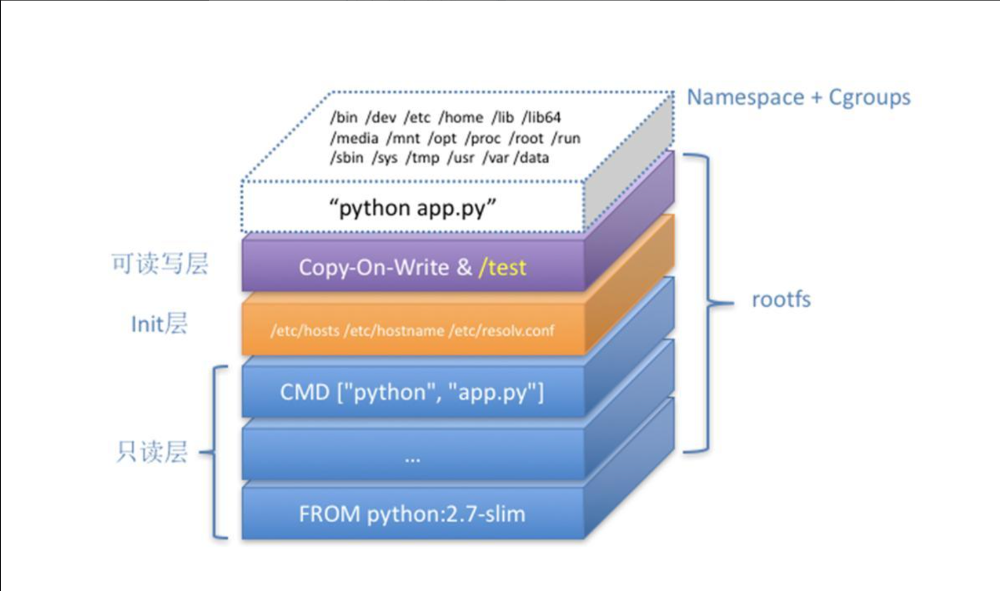

# 04-容器基础：重新认识Docker容器

> 本章内容包括：
>
> * 如何制作一个镜像
> * Docker基础操作
> * 加入一个容器的本质
> * 数据卷原理

在前面三次分享中，已经介绍了Linux Namespace的隔离能力，Linux Cgroups的限制能力，以及基于rootfs的文件系统三个角度，剖析了一个Linux容器的核心实现原理。

> 之所以要强调Linux容器，是因为比如Docker on Mac，以及Windows Docker（Hyper-V实现）​，实际上是基于虚拟化技术实现的

而在今天的分享中，会通过一个实际案例，对前面的所有内容做一次深入的总结和扩展。希望通过这次的讲解，能够让你更透彻地理解Docker容器的本质。

## 1 镜像制作

这一次，我要用Docker部署一个用Python编写的Web应用。这个应用的代码部分（app.py）非常简单：

```python
from flask import Flask 
import socket 
import os 
app = Flask(__name__) 

@app.route('/') 
def hello(): 
    html = "<h3>Hello {name}!</h3>" \ "<b>Hostname:</b> {hostname}<br/>"         return html.format(name=os.getenv("NAME", "world"),hostname=socket.gethostname()) 
if __name__ == "__main__": 
    app.run(host='0.0.0.0', port=80)
```

在这段代码中，我使用Flask框架启动了一个Web服务器，而它唯一的功能是：如果当前环境中有“NAME”这个环境变量，就把它打印在“Hello”之后，否则就打印“Hello world”​，最后再打印出当前环境的hostname。

这个应用的依赖，则被定义在了同目录下的requirements.txt文件里，内容如下所示：

```bash
$ cat requirements.txt 
Flask
```

而将这样一个应用容器化的第一步，是制作容器镜像。

Docker为你提供了一种便捷的方式制作镜像，叫作Dockerfile，如下所示。

```dockerfile
# 使用官方提供的Python开发镜像作为基础镜像 
FROM python:2.7-slim 

# 将工作目录切换为/app 
WORKDIR /app 

# 将当前目录下的所有内容复制到/app下 
ADD . /app 

# 使用pip命令安装这个应用所需要的依赖 
RUN pip install --trusted-host pypi.python.org -r requirements.txt 

# 允许外界访问容器的80端口 
EXPOSE 80 
# 设置环境变量 
ENV NAME World 

# 设置容器进程为：python app.py，即：这个Python应用的启动命令 
CMD ["python", "app.py"]
```

通过这个文件的内容，你可以看到**Dockerfile的设计思想，是使用一些标准的原语（即大写高亮的词语）​，描述我们所要构建的Docker镜像。并且这些原语，都是按顺序处理的**。

比如FROM原语，指定了“python:2.7-slim”这个官方维护的基础镜像，从而免去了安装Python等语言环境的操作。

另外，在使用Dockerfile时，你可能还会看到一个叫作ENTRYPOINT的原语。实际上，它和CMD都是Docker容器进程启动所必需的参数，完整执行格式是：​“**ENTRYPOINT CMD**”​。

但是，默认情况下，**Docker会为你提供一个隐含的ENTRYPOINT，即：/bin/sh -c**。所以，在不指定ENTRYPOINT时，比如在我们这个例子里，实际上运行在容器里的完整进程是：/bin/sh -c "python app.py"，即CMD的内容就是ENTRYPOINT的参数。

接下来，我就可以让Docker制作这个镜像了，在当前目录执行：

```bash
$ docker build -t helloworld .
```

其中，-t的作用是给这个镜像加一个Tag，即：起一个好听的名字。docker build会自动加载当前目录下的Dockerfile文件，然后按照顺序，执行文件中的原语。而这个过程，实际上可以等同于Docker使用基础镜像启动了一个容器，然后在容器中依次执行Dockerfile中的原语。

需要注意的是，**Dockerfile中的每个原语执行后，都会生成一个对应的镜像层。即使原语本身并没有明显地修改文件的操作（比如，ENV原语）​，它对应的层也会存在。只不过在外界看来，这个层是空的。**

## 2 Docker基本操作

创建好镜像之后，就可以使用`docker images`来查看对应镜像的信息。然后使用`docker run`启动容器：

```bash
$ docker run -p 4000:80 helloworld
```

在这一句命令中，镜像名helloworld后面，我什么都不用写，因为在Dockerfile中已经指定了CMD。否则，我就得把进程的启动命令加在后面。

容器启动之后，我可以使用docker ps命令看到：

```bash
$ docker ps 
CONTAINER ID IMAGE COMMAND CREATED 
4ddf4638572d helloworld "python app.py" 10 seconds ago
```

同时，我已经通过-p 4000:80告诉了Docker，请把容器内的80端口映射在宿主机的4000端口上。这样做的目的是，只要访问宿主机的4000端口，我就可以看到容器里应用返回的结果：

否则，我就得先用docker inspect命令查看容器的IP地址，然后访问“http://<容器IP地址>:80”才可以看到容器内应用的返回。

至此，我已经使用容器完成了一个应用的开发与测试，如果现在想要把这个容器的镜像上传到DockerHub上分享给更多的人，我要怎么做呢？

为了能够上传镜像，我首先需要注册一个Docker Hub账号，然后使用docker login命令登录。

接下来，我要用docker tag命令给容器镜像起一个完整的名字：

```bash
$ docker tag helloworld <hubname>/helloworld:v1
```

然后，执行docker push：

```bash
$ docker push geektime/helloworld:v1
```

这样，我就可以把这个镜像上传到Docker Hub上了。

此外，我还可以使用docker commit指令，把一个正在运行的容器，直接提交为一个镜像。一般来说，需要这么操作原因是：这个容器运行起来后，我又在里面做了一些操作，并且要把操作结果保存到镜像里。

docker commit，**实际上就是在容器运行起来后，把最上层的“可读写层”​，加上原先容器镜像的只读层，打包组成了一个新的镜像。当然，下面这些只读层在宿主机上是共享的，不会占用额外的空间**。

而**由于使用了联合文件系统，你在容器里对镜像rootfs所做的任何修改，都会被操作系统先复制到这个可读写层，然后再修改。这就是所谓的：Copy-on-Write**。

而正如前所说，Init层的存在，就是为了避免你执行docker commit时，把Docker自己对/etc/hosts等文件做的修改，也一起提交掉。

## 3 加入一个容器背后发生了什么

说到在运行容器里面做操作，很容易就想到了是使用的`docker exec`命令。但exec命令是怎么进入到容器里面的呢？

实际上，Linux Namespace创建的隔离空间虽然看不见摸不着，但**一个进程的Namespace信息在宿主机上是确确实实存在的，并且是以一个文件的方式存在**。

比如，通过如下指令，你可以看到当前正在运行的Docker容器的进程号（PID）是25686：

```bash
$ docker inspect --format '{{ .State.Pid }}' 4ddf4638572d 25686
```

这时，你可以通过查看宿主机的proc目录，看到这个25686进程的所有Namespace对应的文件：

```bash
$ ls -l /proc/25686/ns 
total 0 
lrwxrwxrwx 1 root root 0 Aug 13 14:05 cgroup -> cgroup:[4026531835] lrwxrwxrwx 1 root root 0 Aug 13 14:05 ipc -> ipc:[4026532278] 
lrwxrwxrwx 1 root root 0 Aug 13 14:05 mnt -> mnt:[4026532276] 
lrwxrwxrwx 1 root root 0 Aug 13 14:05 net -> net:[4026532281] 
lrwxrwxrwx 1 root root 0 Aug 13 14:05 pid -> pid:[4026532279] 
lrwxrwxrwx 1 root root 0 Aug 13 14:05 pid_for_children -> pid:[4026532279] lrwxrwxrwx 1 root root 0 Aug 13 14:05 user -> user:[4026531837] 
lrwxrwxrwx 1 root root 0 Aug 13 14:05 uts -> uts:[4026532277]
```

可以看到，**一个进程的每种Linux Namespace，都在它对应的/proc/\[进程号]/ns下有一个对应的虚拟文件，并且链接到一个真实的Namespace文件上**。

有了这样一个可以“hold住”所有Linux Namespace的文件，我们就可以对Namespace做一些很有意义事情了，比如：加入到一个已经存在的Namespace当中。

这也就意味着：**一个进程，可以选择加入到某个进程已有的Namespace当中，从而达到“进入”这个进程所在容器的目的，这正是docker exec的实现原理**。

而**这个操作所依赖的，乃是一个名叫setns()的Linux系统调用**。它的调用方法，我可以用如下一段小程序为你说明：

```c
#define _GNU_SOURCE 
#include <fcntl.h> 
#include <sched.h> 
#include <unistd.h> 
#include <stdlib.h> 
#include <stdio.h> 
#define errExit(msg) do { perror(msg); exit(EXIT_FAILURE);} while (0) 
int main(int argc, char *argv[]) { 
    int fd; 
    fd = open(argv[1], O_RDONLY); 
    if (setns(fd, 0) == -1) { 
        errExit("setns"); 
        } 
    execvp(argv[2], &argv[2]); 
    errExit("execvp"); 
}
```

这段代码功能非常简单：它一共接收两个参数，第一个参数是argv\[1]​，即当前进程要加入的Namespace文件的路径，比如/proc/25686/ns/net；而第二个参数，则是你要在这个Namespace里运行的进程，比如/bin/bash。

这段代码的核心操作，则是**通过open()系统调用打开了指定的Namespace文件，并把这个文件的描述符fd交给setns()使用。在setns()执行后，当前进程就加入了这个文件对应的Linux Namespace当中了**。

如果编译运行上述代码，你就会发现该代码进程ns目录下的文件指向的是加入的容器的ns文件。

此外，Docker还专门提供了一个参数，可以让你启动一个容器并“加入”到另一个容器的Network Namespace里，这个参数就是-net，比如:

```bash
$ docker run -it --net container:4ddf4638572d busybox ifconfig
```

这样，我们新启动的这个容器，就会直接加入到ID=4ddf4638572d的容器，也就是我们前面的创建的Python应用容器（PID=25686）的Network Namespace中。

而如果我指定–net=host，就意味着这个容器不会为进程启用Network Namespace。这就意味着，这个容器拆除了Network Namespace的“隔离墙”​，所以，它会和宿主机上的其他普通进程一样，直接共享宿主机的网络栈。这就为容器直接操作和使用宿主机网络提供了一个渠道。

## 4 数据卷

最后，再来说一下Docker项目另一个重要的内容：Volume（数据卷）​。

前面已经介绍过，容器技术使用了rootfs机制和Mount Namespace，构建出了一个同宿主机完全隔离开的文件系统环境。这时候，我们就需要考虑这样两个问题：

* 容器里进程新建的文件，怎么才能让宿主机获取到？
* 宿主机上的文件和目录，怎么样才能让容器里的进程访问到？\
  这正是Docker Volume要解决的问题：**Volume机制，允许你将宿主机上指定的目录或者文件，挂载到容器里面进行读取和修改操作**。

在Docker项目里，它支持两种Volume声明方式，可以把宿主机目录挂载进容器的/test目录当中：

```bash
$ docker run -v /test ... 
$ docker run -v /home:/test ...
```

而这两种声明方式的本质，实际上是相同的：都是把一个宿主机的目录挂载进了容器的/test目录。

只不过，在第一种情况下，由于你并没有显示声明宿主机目录，那么Docker就会默认在宿主机上创建一个临时目录/var/lib/docker/volumes/\[VOLUME\_ID]/\_data，然后把它挂载到容器的/test目录上。而在第二种情况下，Docker就直接把宿主机的/home目录挂载到容器的/test目录上。

那么，Docker又是如何做到把一个宿主机上的目录或者文件，挂载到容器里面去呢？难道又是Mount Namespace的黑科技吗？

在前面已经介绍过，当容器进程被创建之后，尽管开启了Mount Namespace，但是在它执行chroot（或者pivot\_root）之前，容器进程一直可以看到宿主机上的整个文件系统。

而宿主机上的文件系统，也自然包括了我们要使用的容器镜像。这个镜像的各个层，保存在/var/lib/docker/aufs/diff目录下，在容器进程启动后，它们会被联合挂载在/var/lib/docker/aufs/mnt/目录中，这样容器所需的rootfs就准备好了。

所以，我们只需要在rootfs准备好之后，在执行chroot之前，把Volume指定的宿主机目录（比如/home目录）​，挂载到指定的容器目录（比如/test目录）在宿主机上对应的目录（即/var/lib/docker/aufs/mnt/\[可读写层ID]/test）上，这个Volume的挂载工作就完成了。

更重要的是，由于执行这个挂载操作时，​“容器进程”已经创建了，也就意味着此时Mount Namespace已经开启了。所以，这个挂载事件只在这个容器里可见。你在宿主机上，是看不见容器内部的这个挂载点的。**这就保证了容器的隔离性不会被Volume打破**。

> 这里提到的"容器进程"，**是Docker创建的一个容器初始化进程(dockerinit)**，而不是应用进程(ENTRYPOINT + CMD)。dockerinit会负责完成根目录的准备、挂载设备和目录、配置hostname等一系列需要在容器内进行的初始化操作。最后，它通过execv()系统调用，让应用进程取代自己，成为容器里的PID=1的进程。

而这里要使用到的挂载技术，就是Linux的绑定挂载（bind mount）机制。它的主要作用就是，允许你将一个目录或者文件，而不是整个设备，挂载到一个指定的目录上。并且，这时你在该挂载点上进行的任何操作，只是发生在被挂载的目录或者文件上，而原挂载点的内容则会被隐藏起来且不受影响。

其实，如果你了解Linux 内核的话，就会明白，绑定挂载实际上是一个inode替换的过程。在Linux操作系统中，inode可以理解为存放文件内容的“对象”​，而dentry，也叫目录项，就是访问这个inode所使用的“指针”​。正如上图所示，mount --bind /home /test，会将/home挂载到/test上。其实相当于将/test的dentry，重定向到了/home的inode。这样当我们修改/test目录时，实际修改的是/home目录的inode。这也就是为何，一旦执行umount命令，/test目录原先的内容就会恢复：因为修改真正发生在的，是/home目录里。

所以，**在一个正确的时机，进行一次绑定挂载，Docker就可以成功地将一个宿主机上的目录或文件，不动声色地挂载到容器中**。

那么，这个/test目录里的内容，既然挂载在容器rootfs的可读写层，它会不会被docker commit提交掉呢？

也不会。这个原因其实我们前面已经提到过。**容器的镜像操作，比如docker commit，都是发生在宿主机空间的。而由于Mount Namespace的隔离作用，宿主机并不知道这个绑定挂载的存在。所以，在宿主机看来，容器中可读写层的/test目录（/var/lib/docker/aufs/mnt/\[可读写层ID]/test）​，始终是空的。**

## 5 小结

在今天的这次分享中，用了一个非常经典的Python应用作为案例，讲解了Docke容器使用的主要场景。熟悉了这些操作，你也就基本上摸清了Docker容器的核心功能。

更重要的是，我着重介绍了如何使用Linux Namespace、Cgroups，以及rootfs的知识。

借助这种思考问题的方法，最后的Docker容器，我们实际上就可以用下面这个“全景图”描述出来：\
这个容器进程“python app.py”，运行在由Linux Namespace和Cgroups构成的隔离环境里；而它运行所需要的各种文件，比如python，app.py，以及整个操作系统文件，则由多个联合挂载在一起的rootfs层提供。

这些rootfs层的最下层，是来自Docker镜像的只读层。

在只读层之上，是Docker自己添加的Init层，用来存放被临时修改过的/etc/hosts等文件。

而rootfs的最上层是一个可读写层，它以Copy-on-Write的方式存放任何对只读层的修改，容器声明的Volume的挂载点，也出现在这一层。
