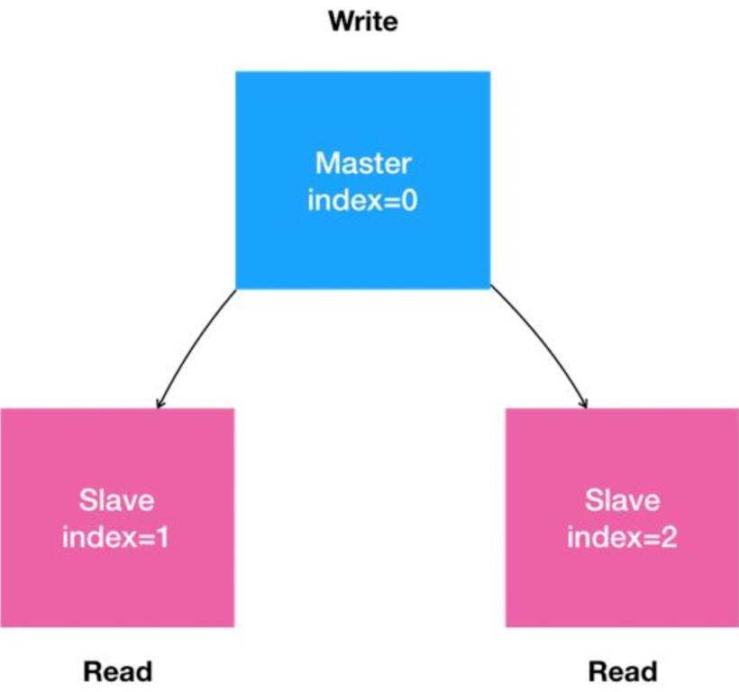

> 本章内容包括：

首先，用自然语言来描述一下我们想要部署的“有状态应用”。

1.  是一个“主从复制”（Maser-Slave Replication）的MySQL集群；

2.  有1个主节点（Master）；

3.  有多个从节点（Slave）；

4.  从节点需要能水平扩展；

5.  所有的写操作，只能在主节点上执行；

6.  读操作可以在所有节点上执行。

这就是一个非常典型的主从模式的MySQL集群了。我们可以把上面描述的“有状态应用”的需求，通过一张图来表示。

在常规环境里，部署这样一个主从模式的MySQL集群的主要难点在于：如何让从节点能够拥有主节点的数据，即：如何配置主（Master）从（Slave）节点的复制与同步。

所以，在安装好MySQL的Master节点之后，你需要做的第一步工作，就是通过XtraBackup将Master节点的数据备份到指定目录。