# zabbix

## 1.Zabbix

### 1.1.监控概述

**监控**是指对行为、活动或其他**变动**中信息的一种**持续性**关注，通常是为了对人达成影响、管理、指导或保护的目的

* 监控
  * 监视主机架构状态
  * 控制，事后追责
  * 目标：早发现早处理(故障、性能、架构) 网站扩容(用数据说话)

> 为什么要监控

* 对系统不间断实时监控
* 实时反馈系统当前状态
* 保证业务持续性运行

> 监控流程

1. 数据采集
2. 数据存储
3. 数据分析
4. 展示/告警

> 监控的内容


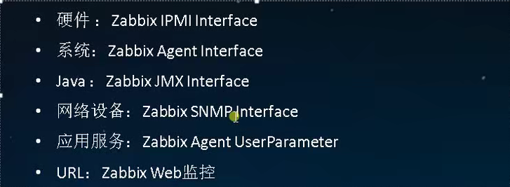

### 1.2.Linux有关性能的指令


### 1.3.企业面试题：公司监控如何做

* 等同于：你们公司监控了什么？
* 单台机器
  * 业务信息：应用、程序代码是否有问题(需要与开发沟通，书写一个页面)
  * 服务信息：各种服务的进程、端口、状态、特定的信息(不同服务)
  * 系统信息：cpu、内存(swap,buffer/cache)、磁盘(io,使用率,inode)、负载、网络....
  * 硬件信息：磁盘、raid状态、温度、风扇转速
* 网站集群监控(用户访问流程)
  * DNS解析与CDN 通过全局访问测试工具(模仿用户在全国(全球)各地访问网站)
    * 在全国各地核心城市部署一台服务器，访问源站/cdn/dns（smokeping）
    * 免费：[17ce.com](https://www.17ce.com/)
    * 商业版：听云、监控宝
  * TCP三次握手-网站负载均衡监控 ss-ant
  * HTTP请求报文-监控web日志查看(状态码) 补充：加上HTTPS监控过期
  * 请求经过网站架构
    * 负载均衡(Nginx)
    * web服务器(php,tomcat...)
    * 缓存
    * 数据库
    * 存储
  * TCP四次挥手-网站负载均衡监控
  * 断开连接

### 1.2.概述

Zabbix 由 Alexei Vladishev 创建，目前由 Zabbix SIA 主导开发和支持。

Zabbix 是一个企业级的**开源分布式监控**解决方案。

Zabbix 是一款监控**网络**的众多参数以及**服务器**、**虚拟机**、**应用程序**、**服务**、**数据库**、**网站**、**云**等的健康和完整性的软件。Zabbix 使用灵活的通知机制，允许用户为几乎任何事件配置基于电子邮件的告警，以实现对服务器问题做出快速反应。Zabbix 基于存储的数据提供出色的报告和数据可视化功能。这使得 Zabbix 成为容量规划的理想选择。

Zabbix 支持轮询和 trapping。所有 Zabbix 报告和统计数据以及配置参数都可以通过基于 Web 的前端访问。基于 Web 的前端确保可以从任何位置评估您的网络状态和服务器的健康状况。如果配置得当，不管对于拥有少量服务器的小型组织还是拥有大量服务器的大公司来讲，Zabbix 都可以在监控 IT 基础设施方面发挥重要作用。

> Linux相关指标命令


Zabbix功能有如下：

[**数据收集**](https://www.zabbix.com/documentation/current/zh/manual/config/items)

* 可用性和性能检查
* 支持 SNMP（trapping 和 polling）、IPMI、JMX、VMware监控
* 自定义检查
* 以自定义间隔收集所需数据
* 由 server/proxy 和 agents 执行

[**灵活的阈值定义**](https://www.zabbix.com/documentation/current/zh/manual/config/triggers)

* 可以定义非常灵活的问题阈值，称为触发器，从后端数据库引用值

[**高度可配置的告警**](https://www.zabbix.com/documentation/current/zh/manual/config/notifications)

* 可以针对升级计划、收件人、媒体类型自定义发送通知
* 使用宏可以使通知变得有意义和有用
* 自动化操作包括执行远程命令

[**实时图形**](https://www.zabbix.com/documentation/current/zh/manual/config/visualization/graphs/simple)

* 采集到的监控项值可以使用内置的绘图功能立即绘图

[**网络监控功能**](https://www.zabbix.com/documentation/current/zh/manual/web_monitoring)

* Zabbix 可以跟踪网站上的模拟鼠标点击路径并检查功能和响应时间

[**广泛的可视化选项**](https://www.zabbix.com/documentation/current/zh/manual/config/visualization)

* 创建自定义图形的能力，可以将多个监控项组合成一个聚合图形
* 网络拓扑图
* 在仪表盘中显示幻灯片
* 报表
* 受监控资源的高级（业务）视图

[**历史数据存储**](https://www.zabbix.com/documentation/current/zh/manual/installation/requirements#database-size)

* 存储在数据库中的数据
* 可配置的历史（保留趋势）
* 内置管家程序

[**建议的配置**](https://www.zabbix.com/documentation/current/zh/manual/config/hosts)

* 将受监控的设备添加为主机
* 一旦主机被数据库添加，就会开始进行数据采集
* 将模板应用于受监控的设备

[**模板的使用**](https://www.zabbix.com/documentation/current/zh/manual/config/templates)

* 在模板中分组检查
* 模板可以继承其他模板

[**网络发现**](https://www.zabbix.com/documentation/current/zh/manual/discovery)

* 网络设备自动发现
* agent 自动注册
* 发现文件系统、网络接口和 SNMP OID

[**便捷的 web 界面**](https://www.zabbix.com/documentation/current/zh/manual/web_interface)

* 基于web的PHP前端
* 可从任何地方访问
* 可以通过你的方式点击（到任何页面）
* 审计日志

[**Zabbix API**](https://www.zabbix.com/documentation/current/zh/manual/api)

* Zabbix API 为 Zabbix 提供可编程接口，用于大规模操作、第 3 方软件集成和其他用途。

[**权限系统**](https://www.zabbix.com/documentation/current/zh/manual/config/users_and_usergroups)

* 安全用户认证
* 某些用户可以被限制仅访问某些视图

[**全功能且易于扩展的 agent**](https://www.zabbix.com/documentation/current/zh/manual/concepts/agent)

* 部署在被监控目标上
* Linux 和 Windows 操作系统都适用于

[**二进制守护进程**](https://www.zabbix.com/documentation/current/zh/manual/concepts/server)

* 用 C 编写，用于提高性能和减少内存占用
* 轻量级、便携

[**为复杂环境做好准备**](https://www.zabbix.com/documentation/current/zh/manual/distributed_monitoring)

* 使用 Zabbix proxy 轻松实现远程监控

### 1.3.Zabbix架构

**Server**

[Zabbix server](https://www.zabbix.com/documentation/current/zh/manual/concepts/server) 是 agents 向其报告可用性和完整性信息和统计信息的中心组件。server 是存储所有配置、统计和操作数据的中央存储库。

**数据存储**

Zabbix 收集的所有配置信息以及数据都存储在数据库中。

**Web 界面**

为了从任何地方和任何平台轻松访问，Zabbix 提供了基于 Web 的界面。该接口是 Zabbix server 的一部分，通常（但不一定）与 server 运行在同一台设备上。

**Proxy**

[Zabbix proxy](https://www.zabbix.com/documentation/current/zh/manual/concepts/proxy) 可以代替 Zabbix server 收集性能和可用性数据。proxy 是 Zabbix 部署的可选部分；但是对于分散单个 Zabbix server 的负载非常有用。

**Agent**

Zabbix agent 部署在被监控目标上，以主动监控本地资源和应用程序，并将收集到的数据报告给 Zabbix server。从 Zabbix 4.4 开始，有两种类型的 agent 可用：[Zabbix agent](https://www.zabbix.com/documentation/current/zh/manual/concepts/agent) （轻量级，在许多平台上支持，用 C 编写）和 [Zabbix agent 2](https://www.zabbix.com/documentation/current/zh/manual/concepts/agent) （非常灵活，易于使用插件扩展，用 Go 编写）。

## 2.使用Zabbix

### 2.1.配置要求

| Name         | Platform                | CPU/Memory        | Database                               | Monitored hosts |
| ------------ | ----------------------- | ----------------- | -------------------------------------- | --------------- |
| _Small_      | CentOS                  | Virtual Appliance | MySQL InnoDB                           | 100             |
| _Medium_     | CentOS                  | 2 CPU cores/2GB   | MySQL InnoDB                           | 500             |
| _Large_      | RedHat Enterprise Linux | 4 CPU cores/8GB   | RAID10 MySQL InnoDB or PostgreSQL      | >1000           |
| _Very large_ | RedHat Enterprise Linux | 8 CPU cores/16GB  | Fast RAID10 MySQL InnoDB or PostgreSQL | >10000          |

下表包含可用于计算 Zabbix 系统所需磁盘空间的公式：

| 参数 所              | 磁盘空间的计算公式 （单位：字节）                                                                                                                                                    |
| ----------------- | -------------------------------------------------------------------------------------------------------------------------------------------------------------------- |
| _Zabbix 配置文件_ 固定大 | 。通常为 10MB 或更少。                                                                                                                                                       |
| _History_(历史数据)   | days\*(items/refresh rate)_2&#x34;_&#x33;600\*bytes items：监控项数量。 days：保留历史数据的天数。 refresh rate：监控项的更新间隔。 bytes：保留单个值所需要占用的字节数，依赖于数据库引擎，通常为 \~90 字节。                   |
| _Trends_（趋势数据）    | days\*(items/3600)_2&#x34;_&#x33;600\*bytes items：监控项数量。 days：保留历史数据的天数。 bytes：保留单个趋势数据所需要占用的字节数，依赖于数据库引擎，通常为 \~90 字节。                                               |
| _Events_（事件数据）    | day&#x73;_&#x65;vent&#x73;_&#x32;&#x34;_&#x33;60&#x30;_&#x62;ytes events：每秒产生的事件数量。假设最糟糕的情况下，每秒产生 1 个事件。 days：保留历史数据的天数。 bytes：保留单个趋势数据所需的字节数，取决于数据库引擎，通常为 \~170 字节。 |

### 2.2.Zabbix安装

* 使用yum和自定义配置安装
  * lnmp+zabbix-server(yum)
  * zabbix-web(源码包)
* nginx和php环境

```bash
# yum配置
cur1 -o /etc /yum.repos.d/Centos-Base.repo http://mirrors.aliyun.com/repo/centos-7.repo
yum install epel-release -y
cur1 -o/etc/yum.pos.d/epel.repo http：//mirrors.aliyun.com/repo/epel-7.repo
rpm -Uvh https://mirror.webtatic.com/yum/el7/webtatic-release.rpm


# 安装nginx先要安装epel源，或者使用nginx官方源
# 使用nginx 1.20 php7.2
yum install nginx php72w-cli php72w-fpm php72w-gd php72w-mbstring php72w-bcmath php72w-xml php72w-ldap php72w-mysqlnd -y


# 开启服务并设置自启
[root@cloud ~]# systemctl enable nginx php-fpm.service 
Created symlink from /etc/systemd/system/multi-user.target.wants/nginx.service to /usr/lib/systemd/system/nginx.service.
Created symlink from /etc/systemd/system/multi-user.target.wants/php-fpm.service to /usr/lib/systemd/system/php-fpm.service.
[root@cloud ~]# systemctl start nginx php-fpm.service 


# nginx配置
[root@cloud ~]# cat /etc/nginx/conf.d/zabbix.conf 
server {
        listen 80;
        server_name zabbix.test;
        root /code/zabbix;
        location / {
                index index.php;
        }
        location ~ \.php$ {
            fastcgi_pass   127.0.0.1:9000;
            fastcgi_index  index.php;
            fastcgi_param  SCRIPT_FILENAME  $document_root$fastcgi_script_name;
            include        fastcgi_params;
        }
}

# 配置php
# 修改组和用户
[root@cloud ~]# cat /etc/php-fpm.d/www.conf
[www]
user = nginx
group = nginx

# 准备会话保持目录
[root@cloud ~]# grep /var/lib/php/session /etc/php-fpm.d/www.conf 
php_value[session.save_path]    = /var/lib/php/session
[root@cloud ~]# mkdir -p /var/lib/php/session
[root@cloud ~]# chown nginx.nginx /var/lib/php/session
[root@cloud ~]# php-fpm -t
[13-May-2023 17:56:35] NOTICE: configuration file /etc/php-fpm.conf test is successful
[root@cloud ~]# systemctl reload php-fpm.service 


# 测试
[root@cloud ~]# mkdir -p /code/zabbix
[root@cloud ~]# chown nginx.nginx /code/zabbix
[root@cloud ~]# vim /code/zabbix/index.php
[root@cloud ~]# cat /code/zabbix/index.php
<?php
phpinfo();
?>
[root@cloud ~]# curl zabbix.test
```

* 数据库配置

```bash
# 安装数据库
yum install -y mariadb-server

# 进行一些安全性设置
[root@cloud ~]# mysql_secure_installation 

NOTE: RUNNING ALL PARTS OF THIS SCRIPT IS RECOMMENDED FOR ALL MariaDB
      SERVERS IN PRODUCTION USE!  PLEASE READ EACH STEP CAREFULLY!

In order to log into MariaDB to secure it, we'll need the current
password for the root user.  If you've just installed MariaDB, and
you haven't set the root password yet, the password will be blank,
so you should just press enter here.

Enter current password for root (enter for none): 
OK, successfully used password, moving on...

Setting the root password ensures that nobody can log into the MariaDB
root user without the proper authorisation.

Set root password? [Y/n] y
New password: 
Re-enter new password: 
Password updated successfully!
Reloading privilege tables..
 ... Success!


By default, a MariaDB installation has an anonymous user, allowing anyone
to log into MariaDB without having to have a user account created for
them.  This is intended only for testing, and to make the installation
go a bit smoother.  You should remove them before moving into a
production environment.

Remove anonymous users? [Y/n] y
 ... Success!

Normally, root should only be allowed to connect from 'localhost'.  This
ensures that someone cannot guess at the root password from the network.

Disallow root login remotely? [Y/n] y
 ... Success!

By default, MariaDB comes with a database named 'test' that anyone can
access.  This is also intended only for testing, and should be removed
before moving into a production environment.

Remove test database and access to it? [Y/n] y
 - Dropping test database...
 ... Success!
 - Removing privileges on test database...
 ... Success!

Reloading the privilege tables will ensure that all changes made so far
will take effect immediately.

Reload privilege tables now? [Y/n] y
 ... Success!

Cleaning up...

All done!  If you've completed all of the above steps, your MariaDB
installation should now be secure.

Thanks for using MariaDB!


# 创建所需库和用户
mysql> create database zabbix character set utf8 collate utf8_bin;
mysql> create user zabbix@% identified by 'password';
mysql> grant all privileges on zabbix.* to zabbix@%;  # 授予所有权限
mysql> set global log_bin_trust_function_creators = 1;  # 允许在启用二进制日志时创建存储函数，而无需有SUPER权限
```

* Zabbix服务端

```bash
# 配置yum
rpm -Uvh https://mirrors.aliyun.com/zabbix/zabbix/5.0/rhel/7/x86_64/zabbix-release-5.0-1.el7.noarch.rpm?spm=a2c6h.25603864.0.0.251e2e2fnsDdRT
# 修改yum
baseurl=https://mirrors.aliyun.com/zabbix/zabbix//5.0/rhel/7/$basearch/

# 安装zabbix
yum install -y zabbix-server zabbix-agent2

# 导入数据
zcat /usr/share/doc/zabbix-server-mysql-5.0.39/create.sql.gz
|mysql -uzabbix -proot zabbix   # 解压缩 create.sql.gz 文件并将其内容输出到标准输出

# 配置zabbix数据库服务
grep ^DB /etc/zabbix/zabbix_server.conf
DBHost=localhost
DBName=zabbix
DBUser=zabbix
DBPassword=zabbix

# zabbix默认开启功能
LogFile=/var/log/zabbix/zabbix_server.log # 日志文件位置
LogFileSize=0 # 日志文件大小，0不限制大小
PidFile=/var/run/zabbix/zabbix_server.pid # 进程 ID 文件位置
SocketDir=/var/run/zabbix # 套接字目录
DBHost=localhost 
DBName=zabbix
DBUser=zabbix
DBPassword=root
SNMPTrapperFile=/var/log/snmptrap/snmptrap.log # SNMP Trapper 文件位置
Timeout=4 # 超时时间
AlertScriptsPath=/usr/lib/zabbix/alertscripts # 警告脚本路径
ExternalScripts=/usr/lib/zabbix/externalscripts # 外部脚本路径
LogSlowQueries=3000 # 记录慢查询的阈值
StatsAllowedIP=127.0.0.1 # 允许访问统计数据信息的IP地址

# 开启服务(默认10051端口)
systemctl start zabbix-server
```

* zabbix前端页面

```bash
# 使用源码包
# 去官网下载源码包
wget https://cdn.zabbix.com/zabbix/sources/stable/5.0/zabbix-5.0.39.tar.gz
[root@cloud nfs] tar xf zabbix-5.0.34.tar.gz 
[root@cloud zabbix-5.0.34]# mv ui/* /code/zabbix/
[root@cloud zabbix-5.0.34]# chown -R named:named /code/zabbix/
```

* 安装zabbix(zabbix前端页面连接数据库与zabbix-server)

```
# 需要在/etc/php.ini中修改的配置
Minimum required size of PHP post is 16M (configuration option "post_max_size").
Minimum required limit on execution time of PHP scripts is 300 (configuration option "max_execution_time").
Minimum required limit on input parse time for PHP scripts is 300 (configuration option "max_input_time").
Time zone for PHP is not set (configuration parameter "date.timezone").
date.timezone = Asia/Shanghai
```

当你其他配置都完成后，出现这个页面就是成功了！并且配置项都可以去conf/zabbix.conf.php文件修改


完成之后就可以登录zabbix了，默认用户名是**Admin**，密码是**zabbix**，登录后可以自己修改密码

### 2.3.监控主机

* 安装zabbix-agent2

```
yum install -y zabbix-server zabbix-agent2
```

|      | zabbix agent | zabbix agent2                      |
| ---- | ------------ | ---------------------------------- |
| 开发语言 | C            | Go和C                               |
| 性能   | 独立进程方式运行     | 1个进程多线程运行，减少资源消耗占用较少tcp资源，能够承受更高并发 |

* 监控流程
  1. 在客户端安装zabbix-agent2
  2. 修改配置文件 指定Server为zabbix服务端
  3. web页面配置 ----> 主机中添加主机
  4. 添加后检测

```bash
# 修改配置文件
[root@cloud code]# grep "Server" /etc/zabbix/zabbix_agent2.conf 
### Option: Server
#       Example: Server=127.0.0.1,192.168.1.0/24,::1,2001:db8::/32,zabbix.example.com
# Server=
Server=127.0.0.1


# agent配置
PidFile=/var/run/zabbix/zabbix_agent2.pid
LogFile=/var/log/zabbix/zabbix_agent2.log
LogFileSize=0
Server=127.0.0.1
ServerActive=127.0.0.1    #  客户端主动模式的服务端ip地址
Hostname=Zabbix server    # 客户端主机名
Include=/etc/zabbix/zabbix_agent2.d/*.conf
ControlSocket=/tmp/agent.sock  # 指定了SSH代理的控制套接字的位置

# 启动agent
[root@cloud code]# systemctl start zabbix-agent2.service 

# 检测客户端服务端是否连通
# 安装zabbix_get命令
yum install -y zabbix-get
# 在服务端执行，如果有值则代表能获取数据
zabbix_get -s 127.0.0.1 -p 10050 -k "system.cpu.load[all,avg1]"
```

### 2.4.自定义监控

以下监控项类型由Zabbix提供：

* [Zabbix agent 检查](https://www.zabbix.com/documentation/6.4/zh/manual/config/items/itemtypes/zabbix_agent)
* [SNMP agent 检查](https://www.zabbix.com/documentation/6.4/zh/manual/config/items/itemtypes/snmp)
* [SNMP traps](https://www.zabbix.com/documentation/6.4/zh/manual/config/items/itemtypes/snmptrap)
* [IPMI 检查](https://www.zabbix.com/documentation/6.4/zh/manual/config/items/itemtypes/ipmi)
* 简单检查
  * [VMware 监控](https://www.zabbix.com/documentation/6.4/zh/manual/config/items/itemtypes/simple_checks/vmware_keys)
* [日志文件监控](https://www.zabbix.com/documentation/6.4/zh/manual/config/items/itemtypes/log_items)
* 可计算监控项
  * [聚合计算](https://www.zabbix.com/documentation/6.4/zh/manual/config/items/itemtypes/calculated/aggregate)
* [Zabbix 内部检查](https://www.zabbix.com/documentation/6.4/zh/manual/config/items/itemtypes/internal)
* [SSH 检查](https://www.zabbix.com/documentation/6.4/zh/manual/config/items/itemtypes/ssh_checks)
* [Telnet 检查](https://www.zabbix.com/documentation/6.4/zh/manual/config/items/itemtypes/telnet_checks)
* [外部检查](https://www.zabbix.com/documentation/6.4/zh/manual/config/items/itemtypes/external)
* [采集器监控项](https://www.zabbix.com/documentation/6.4/zh/manual/config/items/itemtypes/trapper)
* [JMX 监控](https://www.zabbix.com/documentation/6.4/zh/manual/config/items/itemtypes/jmx_monitoring)
* [ODBC 检查](https://www.zabbix.com/documentation/6.4/zh/manual/config/items/itemtypes/odbc_checks)
* [相关监控项](https://www.zabbix.com/documentation/6.4/zh/manual/config/items/itemtypes/dependent_items)
* [HTTP 检查](https://www.zabbix.com/documentation/6.4/zh/manual/config/items/itemtypes/http)
* [Prometheus 检查](https://www.zabbix.com/documentation/6.4/zh/manual/config/items/itemtypes/prometheus)
* [脚本监控](https://www.zabbix.com/documentation/6.4/zh/manual/config/items/itemtypes/script)
* 概述
  * 定制化，监控我们所要的内容
  * 提升性能，提升zabbix性能，去掉不需要的监控项
  * zabbix自定义监控：**只要能够通过命令取出来的内容，就可以做自定义监控**
* 应用场景：
  * 定制：默认的模板中没有我们要的监控项
  * 提升zabbix性能/优化：去掉/定制监控项，提升zabbix服务端的性能
* 自定义监控流程
  * Zabbix客户端，\*\*创建key(键值)\*\*与调试
    * 书写监控命令/脚本
    * 调试Debug命令与脚本
    * 写入到zabbix客户端配置文件中`UserParameter=key，command或脚本`与调试zabbix\_get
  * zabbix服务端web页面
    * 查看Web页面是否可以获取数据
    * 设置Web触发器trigger-什么时候报警

```bash
# 检查80端口是否占用
# 1.创建键值：相当于一个zabbix服务端能识别的命令，来获取zabbix客户端状态
# 内置键值key：zabbix_agent2 -p
# 自定义键值最好写在/etc/zabbix/zabbix_agent2.d/
UserParameter=nginx.alive,ss -tunlp|grep -wc 80
[root@cloud ~]# zabbix_get -s 127.0.0.1 -p 10050 -k nginx.alived
2

# 使用带参数形式
nginx.alive[*],sh nginx_stat.sh "$1" "$2"
nginx.alive[active,80],sh nginx_stat.sh "$1" "$2"
# web页面不支持参数形式，得一个个写


#Key名本身具有有限的允许字符范围，允许的字符是：0-9a-zA-Z_-.
```

* 新建监控项

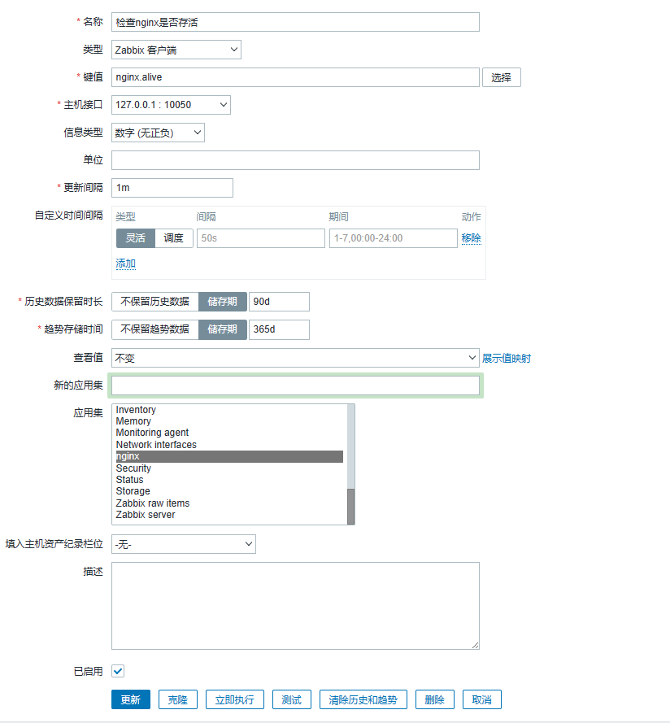

* 历史数据(history)保留时长：每个更新间隔获取到的数据，推荐设置为30d
* 趋势数据(trend)保留时长：记录数据变化的趋势，推荐设置

#### 1.监控项类型

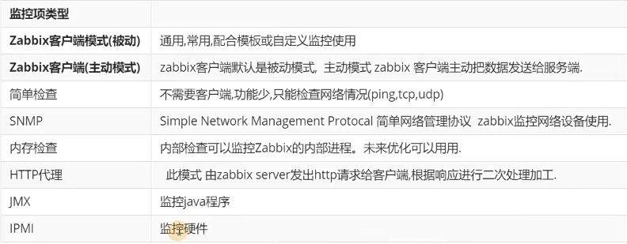

### 2.5.自定义触发器

* 触发器：trigger 什么时候进行告警
* 本质使用监控项获取的数据，与我们设置的条件进行比较，从而触发警报
* 触发器表达式功能


* 触发器表达式格式

```bash
# {主机名:监控项.使用函数}判断条件
{Zabbix server:nginx.alive.last()}=0
```

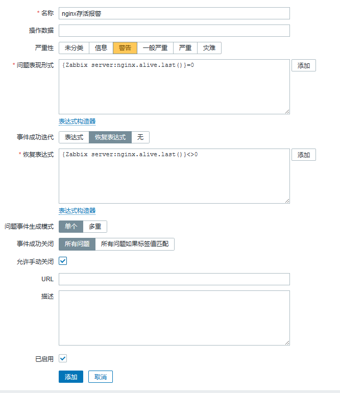

### 2.6.自定义监控故障案例

#### 1.权限

* 原因：zabbix客户端运行的时候zabbix用户，获取数据可能导致权限故障permission denied
* 解决：授权sudo

```bash
zabbix_get -s 127.0.0.1 -p 10050 -k vfs.file.contents[/etc/shadow]
ZBX_NOTSUPPORTED: Cannot open file /etc/shadow: open /etc/shadow: permission denied

[root@cloud ~]# visudo
zabbix ALL=(ALL) NOPASSWD: ALL

# 很难解决源key的权限问题，但是可以自定义key解决
UserParameter=conf.shadow,sudo wc -l /etc/shadow
```

#### 2.脚本执行时间

* zabbix默认限制命令或脚本执行时间不能超过30s
* 修改服务端和客户端Timeout选项

#### 3.awk取列

* 自定义监控的时候推荐使用脚本，尤其是awk
* awk取列的时候容器出现故障 $2 推荐使用\$$2

### 2.7.创建模板

1. 创建模板
2. 创建应用集(监控项分类)
3. 创建自定义监控项
4. 创建触发器
5. 创建图像
6. 模板可以与多个机器关联，避免web页面重复操作

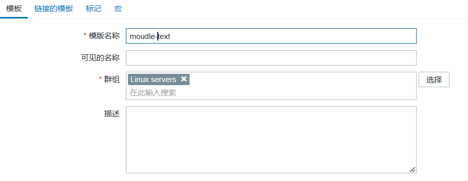

**创建模板成功后，就可以正常添加监控项，触发器等，监控项、触发器、图形都可以直接从其他主机上复制到模板中**


* 主要事项
  * 先找一个主机配置监控项等，进行测试
  * 然后再进行创建模板

### 2.8.告警方案

* 前端消息告警
  * 开启功能并保证前端页面开启，有报警提示时，会发出声音(不推荐)


#### 1.告警分类


#### 2.邮件报警

1. 个人/企业邮箱
2. 开启个人邮箱smtp功能，获取授权码
3. **发件人**：配置zabbix报警媒介类型
4. **收件人**：配置用户接收报警
5. 配置动作

* 配置报警媒介参数


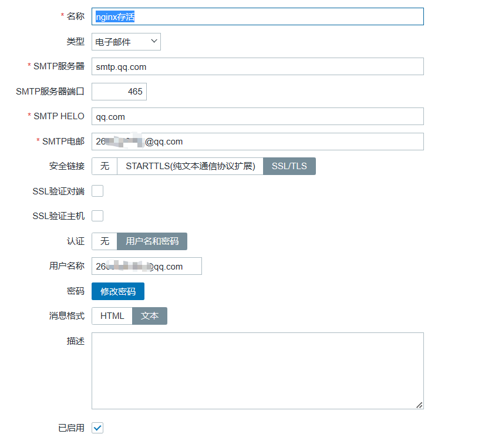

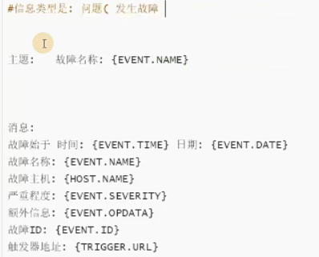

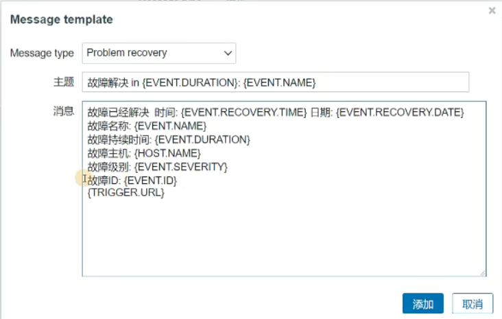

* 收件人配置
  * **对所有人员分组。权限一般以组设置**
  * 创建用户时设置报警媒介


* 配置动作


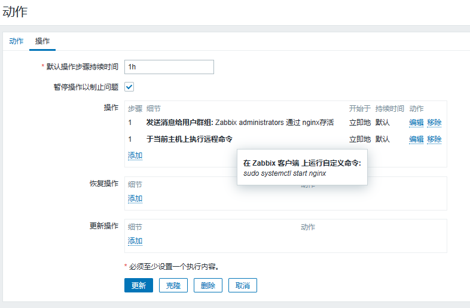

#### 3.脚本报警

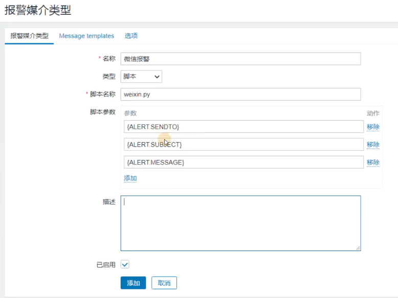

### 2.9.zabbix客户端

| zabbix客户端          |                                                                             |
| ------------------ | --------------------------------------------------------------------------- |
| zabbix-agent2(最常用) | 适用于几乎所有情况，linux，Windows                                                     |
| SNMP               | Simple Network Management Protocal **简单网络管理协议** 监控网络设备                      |
| JMX                | Java-gateway，监控java app(tomcat)。**未来建议自定义监控(zabbix\_agent2 + jmap/jstats)** |
| IPMI               | 监控硬件(物理服务器)，直接使用自定义监控(**ipmitool**+**megacli**)                             |

#### 1.snmp监控

* 应用：
  * 监控网络设备
  * 也支持监控可以启动SNMP设备(Linux，Windows，打印机....)
* 使用snmp
  1. 启动设备的SNMP功能
  2. zabbix服务端进行测试，能否获取到网络设备的信息
  3. web添加主机监控项

```bash
# 1.安装snmp服务端
yum install net-snmp -y

# 2.配置snmp服务端
vim /etc/snmp/snmpd.conf
# 修改community为oldboy
com2sec notConfigUser default oldboy
# 增加一行
view systemview included

# 安装snmp命令
yum install net-snmp-utils -y
# 使用命令
snmpwalk -c oldbox -v 2c 192.168.13.1 sysUptime
-c oldbox：指定community字符串为“oldbox”。
-v 2c：指定SNMP协议版本为SNMPv2c。
192.168.13.1：指定要查询的设备的IP地址。
sysUptime：指定要查询的OID（对象标识符）。
```

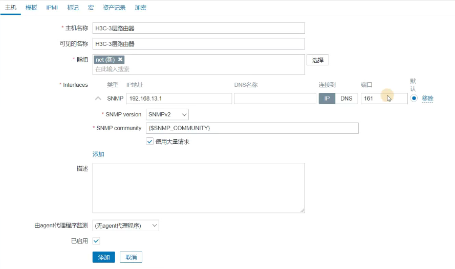

#### 2.JMX监控


1. 安装java程序，并开启远程监控功能
2. 安装zabbix-java-gateway服务端
3. 配置web主机


这个配置只能写成一行


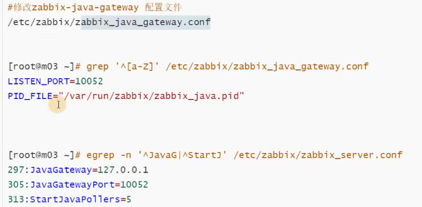

*   获取数据

    ```
    # 
    java -jar cmdline-jmxclient-0.10.3.jar - 10.0.0.7:12345
    ```
* 添加主机

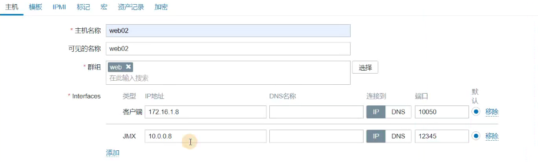


### 2.10.自动化监控

* 自动发现：服务端主动
* 自动注册：客户端主动
* zabbix客户端主动与被动模式
* zabbix分布式监控

#### 1.自动发现和自动注册

|      | 共同点              | 区别                                                          |
| ---- | ---------------- | ----------------------------------------------------------- |
| 自动发现 | 自动添加主机并关联模板，启动主机 | <p>1.客户端被动<br>2.使用简单<br>3.效率或性能较低<br>4.对zabbix服务端压力较大</p>   |
| 自动注册 | 自动添加主机并管理模板，启动主机 | <p>1.客户端主动<br>2.配置繁琐一点<br>3.对zabbix服务端压力较低<br>4.高并发注册机器</p> |

*   自动发现

    * 配置自动发现规则 - 发现主机

    

    

    * 配置自动发现动作 - 发现主机后关联模板等动作

    


*   自动注册(可与ansible结合使用)

    * 修改zabbix客户端配置文件:ServeActive=服务端ip 和Hostname=...

    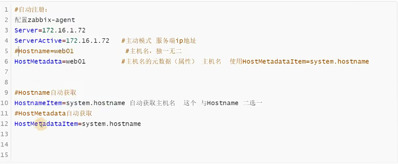

    * web页面，动作---->自动注册 autoreg

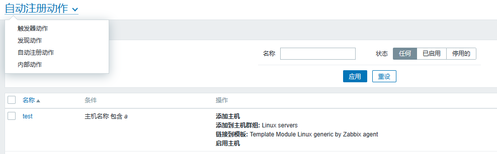

#### 2.zabbix-agent(取值)主动与被动

zabbix-agent主动：主动向zabbix-server汇报，52个监控，请求1次，服务端收集到所有的数据

zabbix-agent被动：等待zabbix-server索要，52个监控，请求52次，效率低，对zabbix服务压力大

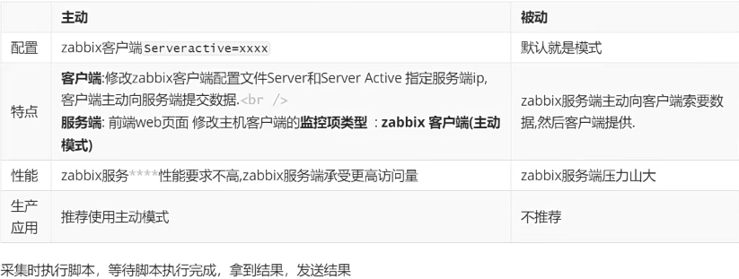

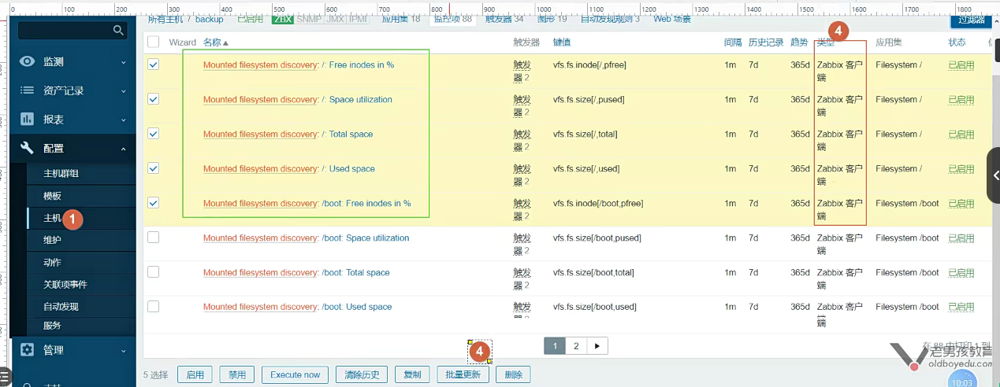

### 2.11.分布式监控

* 应用场景：有多个机房/网段/地域进行监控，分布式监控（proxy代理监控）


* 安装zabbix-proxy-mysql

```bash
yum install -y https://mirrors.aliyun.com/zabbix/zabbix/5.0/rhel/7/x86_64/zabbix-proxy-mysql-5.0.0-1.el7.x86_64.rpm
```

* 导入zabbix表结构

```bash
[root@test ~]# zcat /usr/share/doc/zabbix-proxy-mysql-5.0.0/schema.sql.gz | mysql -uzabbix -pzabbix zabbix
```

* 配置zabbix-proxy

```bash
[root@test ~]# grep '^[a-Z]' /etc/zabbix/zabbix_proxy.conf
Server=192.168.19.136
ServerPort=10051
Hostname=Zabbix proxy        # 代理名字，确保服务端知道代理名称，也可使用HostnameItem
LogFile=/var/log/zabbix/zabbix_proxy.log
LogFileSize=0
PidFile=/var/run/zabbix/zabbix_proxy.pid
SocketDir=/var/run/zabbix
DBHost=localhost
DBName=zabbix_proxy
DBUser=zabbix
DBPassword=zabbix
SNMPTrapperFile=/var/log/snmptrap/snmptrap.log
Timeout=4
ExternalScripts=/usr/lib/zabbix/externalscripts
LogSlowQueries=3000
StatsAllowedIP=127.0.0.1
```

* 配置web代理

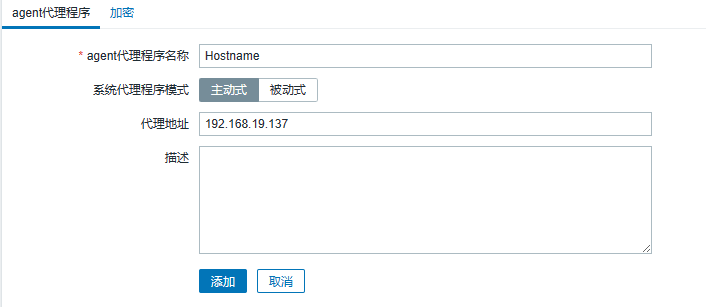

* 修改客户端指向


### 2.12.lld

低级自动发现可以**自动为主机上的不同实体创建监控项、触发器和图表**。比如， Zabbix可以自动监控文件系统和网络接口，并且不需要为其手工创建监控项。另外，可以基于周期性自动发现的结果来删除无用的监控实体。

* **应用场景**
  * 低级自动发现**特别适合用于监控那些有规律，又有差异的监控对象**
*   系统内置的自动发现

    如果想立刻上手熟悉其它类型的自动发现，更多信息和如何实现(how-to)方面可参阅以下章节:

    * [网络接口](https://www.zabbix.com/documentation/current/zh/manual/discovery/low_level_discovery/examples/network_interfaces)的自动发现;
    * [CPU 和 CPU 核心](https://www.zabbix.com/documentation/current/zh/manual/discovery/low_level_discovery/examples/cpu)的自动发现;
    * [SNMP OID](https://www.zabbix.com/documentation/current/zh/manual/discovery/low_level_discovery/examples/snmp_oids)的自动发现;
    * [JMX 对象](https://www.zabbix.com/documentation/current/zh/manual/discovery/low_level_discovery/examples/jmx)的自动发现;
    * 使用[ODBC SQL 查询](https://www.zabbix.com/documentation/current/zh/manual/discovery/low_level_discovery/examples/sql_queries)的自动发现;
    * [Windows 服务](https://www.zabbix.com/documentation/current/zh/manual/discovery/low_level_discovery/examples/windows_services)的自动发现;
    * Zabbix [主机接口](https://www.zabbix.com/documentation/current/zh/manual/discovery/low_level_discovery/examples/host_interfaces)的自动发现。
* 自动发现/自动注册----自动添加主机
* 希望zabbix自动添加监控项：自动监控一些有关联的内容：网卡、磁盘、磁盘分区...低级自动发现(Low Level Discovery)
* 系统模板自带的自动发现规则

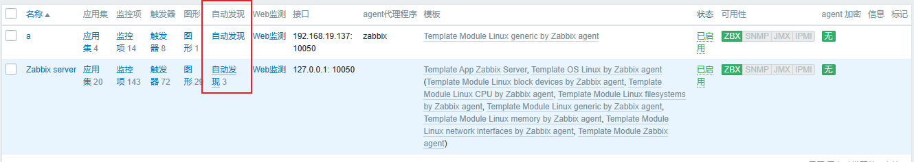

* 系统内置自动发现**键值**


```bash
[root@test zabbix]# zabbix_get -s 192.168.19.137 -p 10050 -k "net.if.discovery"
[{"{#IFNAME}":"lo"},{"{#IFNAME}":"virbr0-nic"},{"{#IFNAME}":"virbr0"},{"{#IFNAME}":"ens33"}]
# zabbix内置宏 {HOST.NAME}
# zabbix 用户定义宏 {$OLDBOY}
# zabbix低级自动发现专用宏 {#IFNAME}
```

* 根据网卡名字创建对应的**监控项原型**：net.if.in\["{#IFNAME}"]-----> net.if.in\[eth0] 然后 net.if.in\[eth1]

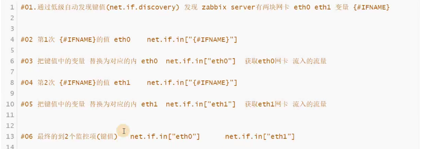


#### 1.案例：统计网卡总流量

1. 监控项原型
2. 流量过大 告警(触发器模型)
3. 流量图形展示

```bash
[root@cloud ~]# zabbix_get -s 127.0.0.1 -p 10050 -k net.if.discovery|jq
[
  {
    "{#IFNAME}": "br-422bc8cc20df"
  },
  {
    "{#IFNAME}": "br-10d894dab180"
  },
  {
    "{#IFNAME}": "lo"
  },
  {
    "{#IFNAME}": "virbr0-nic"
  },
  {
    "{#IFNAME}": "virbr0"
  },
  {
    "{#IFNAME}": "ens33"
  },
  {
    "{#IFNAME}": "br-4871ddbe0355"
  },
  {
    "{#IFNAME}": "docker0"
  }
]
[root@cloud ~]# zabbix_get -s 127.0.0.1 -p 10050 -k net.if.total[ens33]
554386852
```


* 设置触发器原型


* 设置图形


#### 2.从零开始lld

1. 获取你要的内容，磁盘分区的名字，网卡名字
2. 根据自动发现内容，创建自动发现规则
3. 创建监控项原型
4. 创建触发器原型
5. 创建图形原型

```bash
# 官方要求书写格式
# LLD宏的名称允许使用的符号有 0-9 ,A-Z , _ , .
[
    { "{#FSNAME}":"/",                           "{#FSTYPE}":"rootfs"   },
    { "{#FSNAME}":"/sys",                        "{#FSTYPE}":"sysfs"    },
    { "{#FSNAME}":"/proc",                       "{#FSTYPE}":"proc"     },
    { "{#FSNAME}":"/dev",                        "{#FSTYPE}":"devtmpfs" },
    { "{#FSNAME}":"/dev/pts",                    "{#FSTYPE}":"devpts"   },
    { "{#FSNAME}":"/lib/init/rw",                "{#FSTYPE}":"tmpfs"    },
    { "{#FSNAME}":"/dev/shm",                    "{#FSTYPE}":"tmpfs"    },
    { "{#FSNAME}":"/home",                       "{#FSTYPE}":"ext3"     },
    { "{#FSNAME}":"/tmp",                        "{#FSTYPE}":"ext3"     },
    { "{#FSNAME}":"/usr",                        "{#FSTYPE}":"ext3"     },
    { "{#FSNAME}":"/var",                        "{#FSTYPE}":"ext3"     },
    { "{#FSNAME}":"/sys/fs/fuse/connections",    "{#FSTYPE}":"fusectl"  }
]

# 书写脚本 生成格式 ==== net.if.discovery
# 1. 拿取所需端口
# 2. 输出格式
#!/bin/bash
#desc: auto discovery server port

port_list=(`netstat -tunlp|grep zabbix|awk -F'[ :]+' '$4~/^[0-9]+$/{print $4}'`)

echo '['
for port in ${port_list[*]};do
        let i++
        if [ $i -eq ${#port_list[*]} ];then
                echo -e "\t{ \"{#PORT}\":\""$port"\"}"
        else
                echo -e "\t{ \"{#PORT}\":\""$port"\"},"
        fi
done

echo ']'

# 书写配置文件
UserParameter=net.port.discovery,sh /server/scripts/net.port.sh

# 测试
[root@cloud scripts]# zabbix_get -s 127.0.0.1 -p 10050 -k net.port.discovery
[
        { "{#PORT}":"10050"},
        { "{#PORT}":"10051"}
]

```

* 创建发现规则


### 2.13.web场景


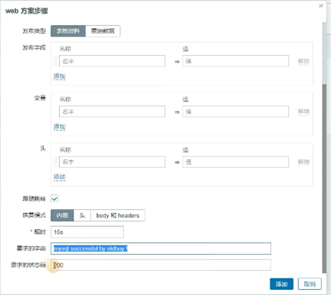

### 2.14.Zabbix api

* application interface 程序接口
* 针对zabbix进行二次开发，公司，运维管理平台 CMDB(存储与管理企业IT架构中设备的各种配置信息)(把zabbix集成成自己的运维平台)
* zabbix api主要的接口功能：通过api接口可以代替web页面操作。增删改查
* api接口应用场景：人脸识别，短信验证，身份证验证...
* 使用与调用：
  * \*\*自己写程序调用：\*\*直接通过程序代码进行调用，需要参考对方的api接口文档
  * \*\*官方写好的，可以直接使用(SDK一般指软件开发工具包)：\*\*通过SDK样例快速调用和使用即可
* api接口使用流程
  * 根据zabbix用户名和密码，获取token
  * 使用token访问或调取zabbix资源
  * [官方API文档](https://www.zabbix.com/documentation/6.4/zh/manual/api)

```bash
当完成了前端的安装配置后，你就可以使用远程HTTP请求来调用API。为此，需要向位于前端目录中的 api_jsonrpc.php 文件发送 HTTP POST 请求。例如，如果你的 Zabbix 前端安装在 http://example.com/zabbix， 那么用HTTP请求来调用 apiinfo.version 方法就如下面这样：

POST http://example.com/zabbix/api_jsonrpc.php HTTP/1.1 
Content-Type: application/json-rpc 
 
{ 
 · "jsonrpc": "2.0", 
 · "method": "apiinfo.version", 
 · "id": 1, 
 · "auth": null, 
 · "params": {} 
} 
请求的 Content-Type 头部必须设置为以下值之一：application/json-rpc，application/json 或 application/jsonrequest。

# 使用curl进行请求
# postman
curl 
-X 修改请求方法
-H 修改请求信息
-d --data 上传的内容
-v 请求详细

# 获取token
在访问 Zabbix 中的任何数据之前，你需要登录并获取身份认证 token。这可以使用 user.login 方法完成。我们假设你想要以标准 Zabbix Admin 用户身份登录。那么，你的 JSON 请求将如下所示：

{
    "jsonrpc": "2.0",
    "method": "user.login",
    "params": {
        "user": "Admin",
        "password": "zabbix"
    },
    "id": 1,
    "auth": null
}
让我们仔细看看示例请求对象。它具有以下属性：

jsonrpc - API 使用的 JSON-RPC 协议的版本; Zabbix API 实现的 JSON-RPC 版本是2.0；
method - 被调用的 API 方法；
params - 将被传递给API方法的参数；
id - 请求的任意标识符；
auth - 用户认证 token；因为我们还没有，它被设置为 null。
如果你正确提供了凭据，API 返回的响应将包含用户身份认证 token：

{
    "jsonrpc": "2.0",
    "result": "0424bd59b807674191e7d77572075f33",
    "id": 1
}
响应对象包含以下属性：

jsonrpc - JSON-RPC 协议的版本；
result - 方法返回的数据；
id - 对应请求的标识符。

# 使用
[root@cloud scripts]# curl -X POST -H "Content-Type: application/json-rpc" -d '
> {
>     "jsonrpc": "2.0",
>     "method": "user.login",
>     "params": {
>         "user": "Admin",
>         "password": "zabbix"
>     },
>     "id": 1,
>     "auth": null
> }' http://127.0.0.1/api_jsonrpc.php
{"jsonrpc":"2.0","result":"798fdaa158f48e89ad412304009265d0","id":1}

# 可以使用jq命令去json格式数据
cat token.txt|jq ".result, .id"
.result[] #进入下一层

我们现在有一个有效的用户身份认证 token，可以用来访问 Zabbix 中的数据。例如，我们使用 host.get 方法检索所有已配置 主机 的ID，主机名和接口 ：

{
    "jsonrpc": "2.0",
    "method": "host.get",
    "params": {
        "output": [
            "hostid",
            "host"
        ],
        "selectInterfaces": [
            "interfaceid",
            "ip"
        ]
    },
    "id": 2,
    "auth": "0424bd59b807674191e7d77572075f33"
}
请注意 auth属性现在设置为我们通过调用 user.login 方法获得的身份认证 token。
响应对象将包含有关主机的请求数据：

{
    "jsonrpc": "2.0",
    "result": [
        {
            "hostid": "10084",
            "host": "Zabbix server",
            "interfaces": [
                {
                    "interfaceid": "1",
                    "ip": "127.0.0.1"
                }
            ]
        }
    ],
    "id": 2
}
```

## 3.zabbix性能优化

* 网站架构调整：尽量让用户的请求往前推(用户请求不要到达网站走cdn，使用缓存，消息队列)
* 根据业务类型调整：读少写多
  * zabbix是一个写多读少的业务，优化数据库的写入性能，建议使用InnoDB或tokudb存储引擎
  * 数据库分离或数据库拆分
* zabbix键值与监控项处理
  * 增加取值的时间
  * 使用自定义模板，控制功能全面监控，监控项少 精简监控项
  * 历史数据保留时长减少，设置为30d或7d，增加趋势存储时间365d
* zabbix触发器
  * 尽量使用last()/diff()/nodata()
  * 避免使用需要计算max()/min()/avg()
  * 整体目标：不要让zabbix服务端进行计算/数据库进行计数，需要计算的内容放在客户端(自定义监控项)
* zabbix服务端
  * 增加zabbix进程数量，那种进程占用大量资源，增加数量 Start...
  * 增加zabbix缓存大小，缓存各种从客户端获取数据 Cache
* zabbix客户端
  * 使用主动模式 `ServerActive`
* zabbix参数配置：**缓存和进程数量**
  * xxxxcache：用于zabbix服务端缓存获取的各类数据(历史数据，趋势数据)
  * poller：zabbix用于接收各类数据的进程数量

> CacheSize 否 128K-64G 8M 缓存大小, 单位为字节。\
> 用于存储主机、监控项、触发器数据的共享内存大小。
>
> CacheUpdateFrequency 否 1-3600 60 Zabbix执行配置缓存更新的频率，以秒为单位。
>
> HistoryCacheSize 否 128K-2G 16M 历史缓存的大小，以字节为单位。\
> 用于存储历史数据的共享内存大小。
>
> HistoryIndexCacheSize 否 128K-2G 4M 历史索引缓存的大小，以字节为单位。\
> 用于索引存储在历史缓存中的历史数据的共享内存大小。\
> 索引缓存一个监控项大约需要 100 字节。\
> 自 Zabbix 3.0.0 版本起开始支持此参数。
>
> TrendCacheSize 否 128K-2G 4M 趋势缓存的大小，以字节为单位。\
> 用于存储趋势数据的共享内存大小。
>
> ValueCacheSize 否 0,128K-64G 8M 历史值缓存的大小，以字节为单位。\
> 用于缓存监控项历史数据请求的共享内存大小。\
> 设置为 0 将禁用缓存（不推荐）。\
> 当值缓存耗尽共享内存时，每 5 分钟会向服务器日志写入一条告警消息。


> StartPollers 否 0-1000 5 轮询进程的初始实例数量，必须非0
>
> StartPollersUnreachable 否 0-1000 1 不可达主机轮询器 (包括 IPMI 和 Java)1 的 pre-forked（预分配）实例数量。\
> 如果启动了常规、IPMI 或 Java轮询器，则必须至少运行一个无法访问主机的轮询器。
>
> StartIPMIPollers 否 0-1000 0 IPMI 轮询器的 pre-forked（预分配）实例数量
>
> StartJavaPollers 否 0-1000 0 Java 轮询器1 的 pre-forked（预分配）实例数量
>
> StartHTTPPollers 否 0-1000 1 HTTP 轮询器1 的 pre-forked（预分配）实例数量
>
> StartProxyPollers 否 0-250 1 passive proxies 被动代理轮询器1 的 pre-forked（预分配）实例数量。

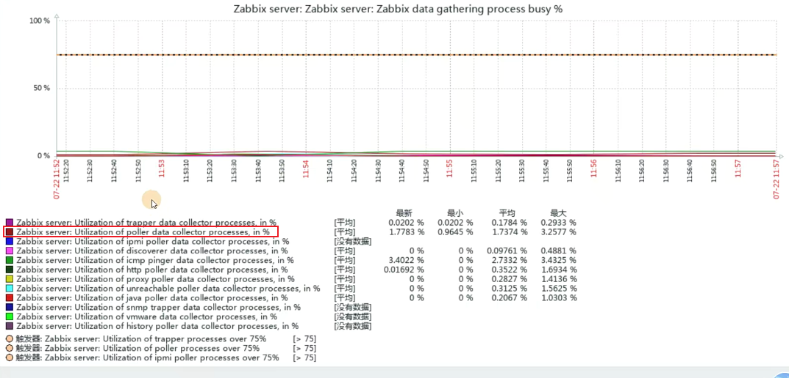

## 4.zabbix与其他

* zabbix收集数据，**grafana**显示图形

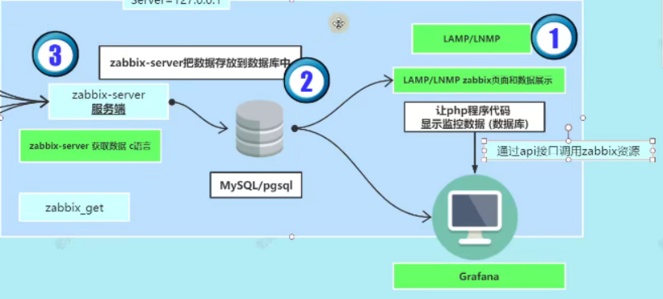

```bash
# 安装Grafana
yum install -y https://mirrors.aliyun.com/grafana/yum/rpm/Packages/grafana-enterprise-9.5.2-1.x86_64.rpm

# 相关文件
/etc/grafana    # 配置文件目录
/etc/init.d/grafana-server
/etc/sysconfig/grafana-server # 配置文件
/usr/lib/systemd/system/grafana-server.service  # 服务管理脚本
/usr/sbin/grafana-cli # grafana管理命令
/usr/sbin/grafana-server # 服务端命令
/usr/share/grafana/public # 家目录，前端页面

# 安装zabbix插件
# 配置grafana通过api 访问zabbix
# web页面添加dashboard
# 导入模板
```

* 登录相关页面ip:3000 用户名：密码：都是admin

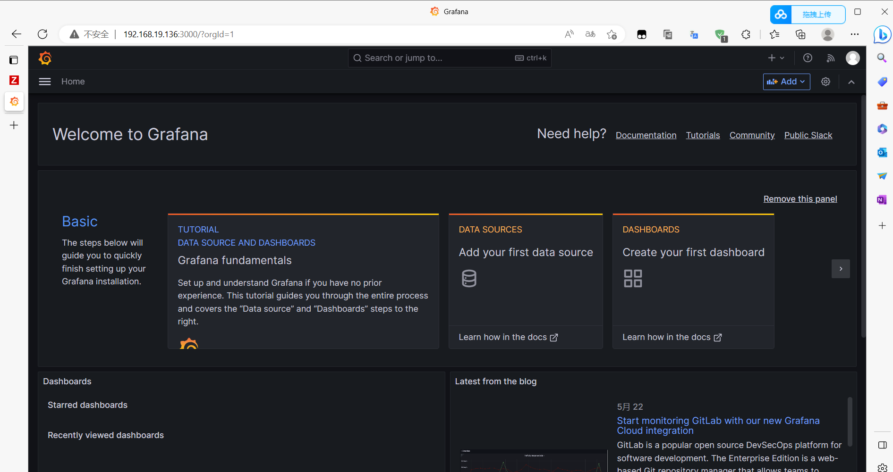

* 安装检查zabbix插件

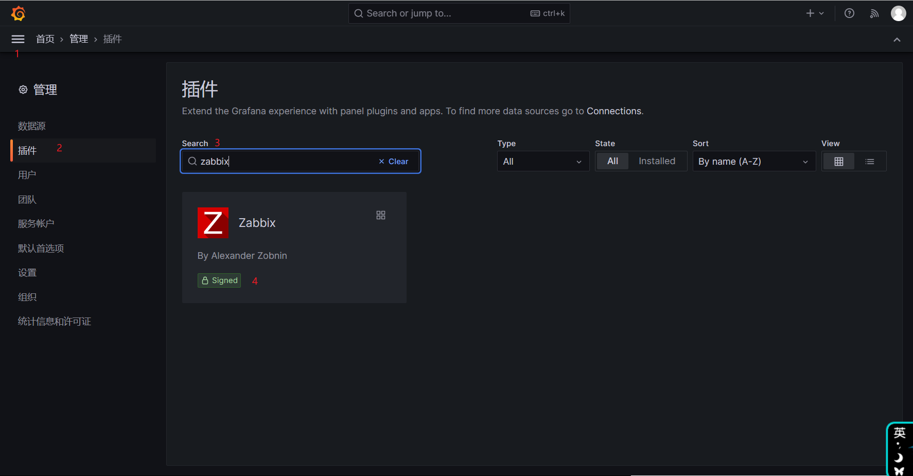

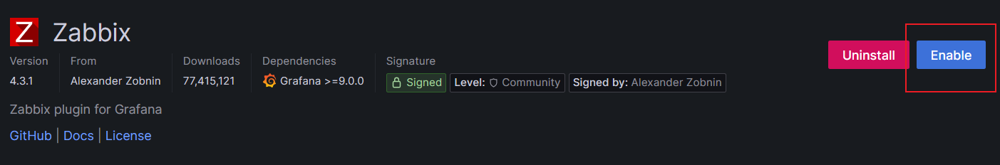

```bash
# 也可以命令行安装
grafana-cli plugins install alexanderzobnin-zabbix-app 版本号
```

* 修改数据源


* 创建图像


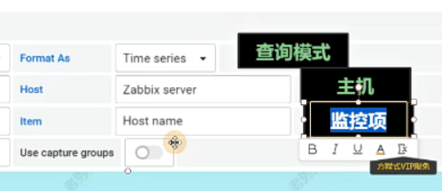

```bash
# 设置监控项时可以用正则
/.*/
```

* 使用模板

[模板下载地址](https://grafana.com/grafana/dashboards/)

下载模板的JSON文件或者复制模板ID后，在Grafana中导入

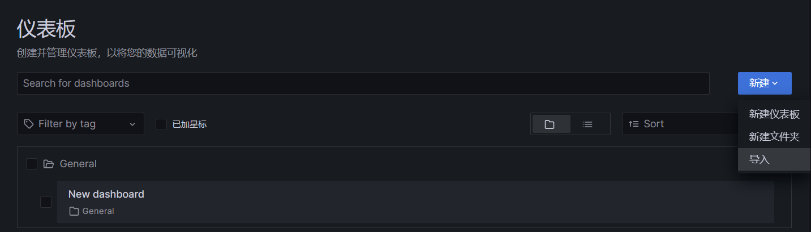

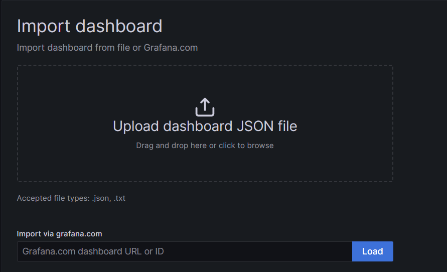

导入之后默认是只读的，需要在设置中修改


## 5.监控架设

### 1.详细要求

* 所有服务器基础监控：cpu、内存、网卡、磁盘(大小/io)、网络带宽、负载...
* cdn/dns：听云/监控宝
* 负载均衡：(nginx lvs haproxy)
  * 端口80监控
  * keepalived服务进程监控
  * tcp11种状态数量监控(当前网站并发)
  * nginx状态监控
  * 日志 每种状态码的数量
  * https证书过期时间
* web服务器
  * 端口80和9000监控
  * nginx状态监控
  * 访问日志状态码数量监控
  * ngin+php 监控
  * php+数据库 连接监控
  * php状态
  * tomcat多实例/单实例监控(jvm内存使用情况)
* 数据库服务监控
  * 进程，端口
* 存储服务
  * 共享了那些目录监控，共享目录大小监控
  * nfs，rpc服务监控
* 备份服务器
  * rsync端口，进程监控
  * rsync守护进程模式监控
  * 是否可以数据传输
* redis缓存
  * 端口，进程
  * 状态(命中率)

### 2.环境准备

| 主机名    | 功能         | ip |
| ------ | ---------- | -- |
| lb01   | 负载均衡       |    |
| web01  | web服务器     |    |
| db01   | 数据库及缓存     |    |
| nfs01  | 存储         |    |
| backup | 备份rsync服务端 |    |
| m02    | zabbix服务器  |    |
