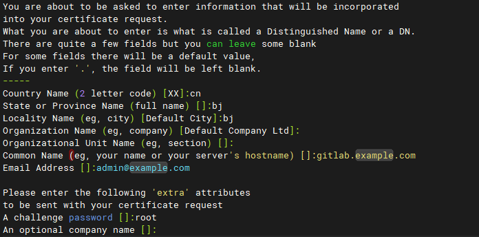

# CICD

## 1.GitLab

> 什么是GitLab

GitLab是一个基于Web的Git存储库，是一个开源分布式版本控制系统。提供免费的开放和私有存储库、问题跟踪功能和维基。它是一个完整的DevOps平台，使专业人员能够执行项目中的所有任务——从项目规划和源代码管理到监控和安全。你可以在gitlab.com/users/sign\_in登录GitLab。

> GitLab优势

* 开源免费，适合中小型公司将代码放置在该系统
* 差异化的版本管理，离线同步以及强大分支管理功能
* 便捷的GUI操作界面以及强大账户权限管理功能
* 集成度很高，能够集成绝大多数的开发工具
* 支持内置HA，保证在高并发下任旧实现高可用

> GitLab服务构成

* Nginx 静态Web服务器
* GitLab-workhorse 轻量级的方向代理服务器
* GitLab-shell 用于处理Git命令和修改authorized keys列表
* Logrotate 日志文件管理工具
* Postgresql 数据库
* Redis 缓存数据库
* sidekiq 用于在后台执行队列任务

### 1.1.GitLab工作流程

* 创建并克隆项目
* 创建项目某Feature分支
* 编写代码并提交至该分支
* 推送该项目分支至远程GitLab服务器
* 进行代码检查并提交Master主分支合并申请
* 项目领导审查代码并合并申请

### 1.2.GitLab安装配置管理

* 安装GitLab前系统预配置准备工作
  * 关闭防火墙
  * 关闭SELINUX
* Omnibus Gitlab-ce package
  * 安装GitLab组件
    * yum -y install curl policycoreutils-utils openssh-server openssh-clients postfix
  * 配置YUM仓库
    * ```csharp
      [gitlab-ce]
      name=Gitlab CE Repository
      baseurl=https://mirrors.tuna.tsinghua.edu.cn/gitlab-ce/yum/el$releasever/
      gpgcheck=0
      enabled=1
      ```
  * 启动postfix邮件服务
    * systemctl start postfix
  * 安装GitLab-ce社区版
    * yum install -y gitlab-ce
* 相关配置初始化并完成安装
  * 证书创建与配置加载
    * 创建目录：mkdir -p /etc/gitlab/ssl/
    * 生成秘钥：openssl genrsa -out /etc/gitlab/ssl/gitlab.example.com.key 2048
    *   生成公钥：openssl req -new -key /etc/gitlab/ssl/gitlab.example.com.key -out /etc/gitlab/ssl/gitlab.example.com.csr

        
    * 生成证书：openssl x509 -req -days 365 -in /etc/gitlab/ssl/gitlab.example.com.csr -signkey /etc/gitlab/ssl/gitlab.example.com.key -out /etc/gitlab/ssl/gitlab.example.com.crt
    * 输出pem证书：openssl dhparam -out /etc/gitlab/ssl//dhparam.pem 2048
    * 修改权限：chmod 600 \*
    * 修改配置文件：
      * external\_url 'https://gitlab.example.com'
      * nginx\['redirect\_http\_to\_https'] = true
      * nginx\['ssl\_certificate'] = "/etc/gitlab/ssl/gitlab.example.com.crt"
      * nginx\['ssl\_certificate\_key'] = "/etc/gitlab/ssl/gitlab.example.com.key"
      * nginx\['ssl\_dhparam'] = /etc/gitlab/ssl/dhparam.pem
    * 初始化：gitlab-ctl reconfigure
  * Nginx SSL代理服务配置
    * vim /var/opt/gitlab/nginx/conf/gitlab-http.conf
      * 在server块中：rewrite ^(.\*)$ https://$host$1 permanent;
      * 重启生效：gitlab-ctl restart
    * 在hosts文件中添加本机的记录
  * 初始化Gitlab相关服务并完成安装

## 2.Ansible

> 什么是Ansible

* Ansible是一个开源部署工具
* 开发语言：Python
* 特点：SSH协议通讯，全平台，无需编译，模块化部署管理
* 作用：推送Playbook进行远程节点快速部署

> Ansible与Chef，Saltstack的不同


### 2.1.Ansible的优势和应用场景

* 轻量无客户端(Agentless)
* 开源免费，学习成本低，快速上手
* 使用Playbook作为核心配置架构，同一的脚本格式批量化部署
* 完善的模块化扩展，支持目前主流的开发场景
* 强大的稳定性和兼容性
* 活跃的官方社区问题讨论，方便Trubleshooting与DEBUG问题

### 2.2.Ansible配合virtualenv安装配置

* Ansible的两种安装模式
  1. Yum包管理安装：yum -y install ansible
  2. Git源代码安装\[推荐]：git clone https://github.com/ansible/ansible.git
* Ansible + Python安装步骤
  1. 预先安装Python3.6版本
  2. 安装virtualenv
     * pip install virtualenv
  3. 创建Ansible账户并安装python virtualenv实例
     * useradd deploy && su - deploy
     * virtualenv -p /usr/local/bin/python3 .py3-a2.5-env
  4. Git源代码安装ansible
     * cd /home/deploy/.py3-a25-env
     * git clone https://github.com/ansible/ansible.git
  5. 加载python3.6 virtualenv环境
     * source /home/deploy/.py3-a25-env/bin/activate
  6. 安装ansible依赖包
     * pip3 install paramiko PyYAML jinja2
  7. 在python虚拟环境下加载ansible
     * source /home/deploy/.py3-a25-env/ansible/hacking/env-setup -q
  8. 验证ansible
     * ansible --version

### 2.2.配置文件

Ansible 的配置文件通常位于 /etc/ansible/ansible.cfg，但也可以在其他位置，例如当前工作目录或用户主目录中。您可以通过设置 ANSIBLE\_CONFIG 环境变量来指定配置文件的位置。

**配置文件的查找顺序**：

1. 环境变量**ANSIBLE\_CONFIG**所指向的位置
2. 当前目录下的ansible.cfg
3. HOME目录下的配置文件\~/.ansible.cfg
4. /etc/ansible/ansible.cfg

下面是一些常用的配置文件选项：

* inventory：指定 Ansible 应使用的清单文件的位置。
* remote\_user：指定用于 SSH 连接的远程用户。
* host\_key\_checking：指定是否在首次连接到远程主机时检查主机密钥。
* roles\_path：指定角色的搜索路径。
* log\_path：指定日志文件的位置。
* forks：指定 Ansible 在并行执行任务时应使用的进程数。

### 2.3.Playbook

Playbooks 是 Ansible的配置,部署,编排语言.他们可以被描述为一个需要希望远程主机执行命令的方案,或者一组IT程序运行的命令集合.

Playbooks 可用于声明配置,更强大的地方在于,在 playbooks 中可以编排有序的执行过程,甚至于做到在多组机器间,来回有序的执行特别指定的步骤.并且可以同步或异步的发起任务.

我们使用 adhoc 时,主要是使用 /usr/bin/ansible 程序执行任务.而使用 playbooks 时,更多是将之放入源码控制之中,用之推送你的配置或是用于确认你的远程系统的配置是否符合配置规范.

下面是一个简单的Playbook的示例，仅包含一个play：

```bash
---
# 指定执行任务的主机
- hosts: webservers
  # 设置变量
  vars:
    http_port: 80
    max_clients: 200
  # 设置执行任务主机的用户
  remote_user: root
  # 任务列表
  tasks:
  # 任务名
  - name: ensure apache is at the latest version
  # 使用的模块
    yum: pkg=httpd state=latest
  - name: write the apache config file
    template: src=/srv/httpd.j2 dest=/etc/httpd.conf
    notify:
    - restart apache
  - name: ensure apache is running
    service: name=httpd state=started
  handlers:
    - name: restart apache
      service: name=httpd state=restarted
```

#### 2.3.1.Playbook基础

playbook 由一个或多个 ‘**plays**’ 组成.它的内容是一个以 ‘**plays**’ 为元素的列表.

在 play 之中,一组机器被映射为定义好的角色.在 ansible 中,play 的内容,被称为 **tasks**,即任务.在基本层次的应用中,一个任务是一个对 ansible **模块**的调用,这在前面章节学习过.

hosts 行的内容是一个或多个组或主机的 **patterns**,以**逗号**为分隔符

remote\_user指定的是用户

也可以指定是否用sudo执行命令

```bash
---
- hosts: webservers
  remote_user: yourname
  become: yes
  become_method: sudo
```

也可以在单个tasks中指定

```bash
---
- hosts: webservers
  remote_user: yourname
  tasks:
    - service: name=nginx state=started
      become: yes
      become_method: sudo
```

运行playbook：

```bash
ansible-playbook playbook.yml -f 10
# ansible-playbook playbook.yml -f 10

--verbose：显示所有信息，否则只有执行失败才会显示信息
--list-hosts：在执行一个 playbook 之前,想看看这个 playbook 的执行会影响到哪些 hosts
```

playbook中除了在play顶层指定用户，还可以为每一个task指定执行的用户

```bash
---
- hosts: webservers
  remote_user: yourname
  vars:
  	ansible_become_pass: root # 用来指定你使用become_user切换用户的密码，不安全，不建议使用
  
  tasks:
    - service: name=nginx state=started
      become: yes  # 是否要切换到另一个用户
      become_user: root # 指定要切换的用户
      become_method: sudo # 指定提权方式，默认是sudo
```

在playbook中使用明文来指定密码是不可取的，所以我们可以使用`ansible vault`

```bash
# 使用ansible-vault创建加密文件
ansible-vault create secret.yml # 创建加密文件
ansible-vault edit secret.yml    # 编辑加密文件

---
- hosts: webservers
  remote_user: yourname
  vars_files:  
  	- secret.yml 
  
  tasks:
    - service: name=nginx state=started
      become: yes  # 是否要切换到另一个用户
      become_user: root # 指定要切换的用户
      become_method: sudo # 指定提权方式，默认是sudo
      
# 注意：在运行指定加密文件的playbook时，需要指定解密密码
ansible-playbook --vault-password-file /path/to/password_file your_playbook.yml
ansible-playbook --ask-vault-pass your_playbook.yml
```

#### 2.3.2.Tasks列表

每一个 play 包含了一个 task 列表（任务列表）.一个 task 在其所对应的所有主机上（通过 host pattern 匹配的所有主机）执行完毕之后,下一个 task 才会执行.有一点需要明白的是（很重要）,在一个 play 之中,所有 hosts 会获取相同的任务指令,这是 play 的一个目的所在,也就是将一组选出的 **hosts 映射到 task**.

如果一个 play 中的 **tasks** 中有任务执行失败，Ansible 默认会停止执行该主机上的剩余任务，并将该主机标记为失败。这意味着，如果您运行一个 playbook，其中一个主机上的任务失败，那么该主机上的剩余任务将**不会被执行**，但其他主机上的任务仍然会**继续执行**。

每个 task 的目标在于执行一个 **moudle**, 通常是带有特定的参数来执行.在参数中可以使用**变量**（variables）.

modules 具有”**幂等**”性,意思是如果你再一次地执行 moudle,moudle 只会执行必要的改动,只会改变需要改变的地方.所以重复多次执行 **playbook** 也很安全.

一个任务列表必须包括**name**和**moudle**

moudle支持**key=value**或**key:value**格式

```bash
vars:
	stat: running 
tasks:
  - name: make sure apache is running
    service: name=httpd state=running
  # service：
  #			name: httpd
  #			state: {{ stat }}
  			
```

#### 2.3.3.Handlers

module 具有”**幂等**”性,所以当远端系统被人改动时,可以重放 playbooks 达到**恢复**的目的. playbooks 本身可以识别这种改动,并且有一个基本的 **event system**（事件系统）,可以响应这种改动.

（当发生改动时）`notify` actions 会在 playbook 的每一个 task 结束时被触发,而且即使有多个不同的 task 通知改动的发生, `notify` actions **只会被触发一次**.

这里有一个例子,当一个文件的内容被改动时,重启两个 services:

```bash
- name: template configuration file
  template: src=template.j2 dest=/etc/foo.conf
  notify:
     - restart memcached
     - restart apache
```

`notify` 下列出的即是 handlers.

Handlers 也是一些 task 的列表,通过名字来引用,它们和一般的 task 并没有什么区别.Handlers 是由通知者进行 notify, 如果没有被 notify,handlers 不会执行.不管有多少个通知者进行了 notify,等到 play 中的所有 task 执行完成之后,handlers 也只会被执行一次.

这里是一个 handlers 的示例:

```bash
handlers:
    - name: restart memcached
      service:  name=memcached state=restarted
    - name: restart apache
      service: name=apache state=restarted
```

Handlers 最佳的应用场景是用来**重启服务**,或者**触发系统重启操作**.除此以外很少用到了.

**handlers 会按照声明的顺序执行**

#### 2.3.4.Roles和Include

基本上，使用 include 语句引用 **task 文件**的方法，可允许你将一个配置策略分解到更小的文件中。使用 include 语句引用 tasks 是将 tasks 从其他文件拉取过来。因为 handlers 也是 tasks，所以你也可以使用 include 语句去引用 **handlers 文件**。handlers 文件来自 ‘handlers:’ section。

Playbook 同样可以使用 include 引用其他 **playbook 文件**中的 play。这时被引用的 play 会被插入到当前的 playbook 中，当前的 playbook 中就有了一个更长的的 play 列表。

Roles 的概念来自于这样的想法：通过 `include` 包含文件并将它们组合在一起，组织成一个**简洁**、**可重用**的抽象对象。这种方式可使你将注意力更多地放在大局上，只有在需要时才去深入了解细节。

**Include** 指令看起来像下面这样，在一个 playbook 中，Include 指令可以跟普通的 task 混合在一起使用:

```bash
tasks:
  - include: tasks/foo.yml
```

给Include传递参数的方式：

1.  使用字典和列表传递参数

    ```bash
    tasks:
      - { include: wordpress.yml, wp_user: timmy, ssh_keys: [ 'keys/one.txt', 'keys/two.txt' ] }
    ```
2.  使用vars语句传递参数

    ```bash
    tasks:
      - include: wordpress.yml
        vars:
          wp_user: timmy
          ssh_keys:
            - keys/one.txt
            - keys/two.txt
    ```
3.  使用with\_items传递参数

    ```bash
    tasks:
      - include: wordpress.yml
        vars:
          wp_user: "{{ item }}"
        with_items:
          - timmy
          - alice
          - bob
    ```

除了显式传递的参数，所有在 **vars section** 中定义的变量也可在这里使用

`include`也可以引用handlers与play

```bash
# handlers
handlers:
  - include: handlers/handlers.yml
  
  
# play
- name: this is a play at the top level of a file
  hosts: all
  remote_user: root

  tasks:

  - name: say hi
    tags: foo
    shell: echo "hi..."

- include: load_balancers.yml
# import_playbook load_balancers.yml
# import_playbook 是一个用于在 playbook 中导入其他 playbook 的关键字。它只能用在 playbook 的顶层，不能用在 tasks、pre_tasks、post_tasks 或 handlers 列表中。
- include: webservers.yml
- include: dbservers.yml
```

除了`include`，你还可以使用`include_tasks`在`tasks`部分来包含任务文件

```yaml
- name: include tasks file
  include_tasks: /path/to/your/tasks/file.yml
```

还可以使用`include_vars`，在任务运行时，递归地从文件或目录动态加载YAML/JSON变量。

```yaml
- name: include vars file
  include_vars:
    file: /path/to/your/vars/file.yml

- file：要从中加载变量的文件名。如果路径是相对的，它将在角色的vars/子目录或相对于剧本中查找文件。
- dir：要从中加载变量的目录名称。如果路径是相对的并且任务位于角色内，则它将查找角色的vars/子目录。如果路径是相对的且不在角色内，则它将相对于剧本进行解析。
- name：包含变量分配的变量名称。如果省略（null），则为顶级变量。
- depth：当使用dir时，默认情况下，此模块将递归遍历每个子目录并加载变量。通过显式设置深度，此模块将仅深入到该深度。
- files_matching：将任何目录中加载的文件限制为此正则表达式。
- ignore_files：要忽略的文件名列表。
- extensions：读取dir时要读取的文件扩展名列表。默认为[“json”, “yaml”, “yml”]。
- ignore_unknown_extensions：忽略目录中未知文件扩展名。


# 应用变量文件，还可以使用vars_files
---

- hosts: all
  remote_user: root
  vars:
    favcolor: blue
  vars_files:
    - /vars/external_vars.yml

  tasks:

  - name: this is just a placeholder
    command: /bin/echo foo
    
# 变量文件书写格式
---
# in the above example, this would be vars/external_vars.yml
somevar: somevalue
password: magic


# 两者区别
vars_files是一个play属性，可以定义在play的顶层或单个任务或角色中。当你在play的顶层定义vars_files时，这些变量文件中定义的变量将对整个play中的所有任务和角色可见。当你在单个任务或角色中定义vars_files时，这些变量文件中定义的变量只对该任务或角色可见。

include_vars是一个模块，可以用来在运行时动态导入变量文件。与vars_files不同，include_vars可以作为一个独立的任务来使用，可以更灵活地控制变量导入的时间和条件。例如：

- hosts: localhost
  tasks:
    - name: Include variables conditionally
      include_vars: my_vars.yml
      when: some_condition
```

还可以使用`include_role`用于在`tasks`部分包含动态角色

```yaml
- name: include role
  include_role:
    name: your_role_name
    
- name（必需）：要执行的角色的名称。
- tasks_from：要从角色的tasks/目录中加载的文件。默认为“main”。
- vars_from：要从角色的vars/目录中加载的文件。默认为“main”。
- defaults_from：要从角色的defaults/目录中加载的文件。默认为“main”。
- handlers_from：要从角色的handlers/目录中加载的文件。默认为“main”。
- allow_duplicates：覆盖角色的元数据设置，以允许使用相同参数多次使用角色。默认为true。
- apply：接受一个任务关键字（例如tags，become）的哈希，这些关键字将应用于包含角色中的所有任务。
- public：此选项决定角色的变量和默认值是否暴露给play。如果设置为true，则变量将可用于include_role任务之后的任务。
```

`include_tasks`、`include_role` 和 `include_vars` 都是 Ansible 的模块，它们只能用在 tasks、pre\_tasks、post\_tasks 或 handlers 列表中。这些模块不能直接在 play 的顶层使用。

> Roles

要创建一个新的角色，你需要在你的Ansible项目中创建一个名为“**roles**”的目录（如果尚未存在）。然后，在“roles”目录下，为你的新角色创建一个目录，目录名称应该与角色名称相同。例如，如果你要创建一个名为“myrole”的角色，那么你应该在“roles”目录下创建一个名为“myrole”的目录。

在角色目录下，你可以创建以下子目录来组织你的角色内容：

* tasks：包含主要的任务列表。
* handlers：包含用于处理特定事件的任务。
* files：包含需要由文件模块复制到远程主机的文件。
* templates：包含需要由模板模块复制到远程主机的模板文件。
* vars：包含变量定义。
* defaults：包含默认变量定义。**最低优先级的变量**
* meta：包含角色元数据，如角色依赖关系。\
  每个子目录都应该包含一个名为“main.yml”的文件，用于定义该子目录的内容。

如果 roles 目录下有文件不存在，这些文件将被忽略。比如 roles 目录下面缺少了 ‘vars/’ 目录，这也没关系。

可以在playbook中使用`roles`或`include_role`包含role

```yaml
---
- hosts: webservers
  roles:
     - common
     - webservers
```

在 Ansible 1.4 及之后版本，你可以为”角色”的搜索设定 **roles\_path** 配置项。使用这个配置项将所有的 common 角色 check out 到一个位置，以便在多个 playbook 项目中可方便的共享使用它们。

注意：你仍然可以在 playbook 中松散地列出 tasks，vars\_files 以及 handlers，这种方式仍然可用，但 roles 是一种很好的具有**组织性**的功能特性，我们强烈建议使用它。如果你在 playbook 中同时使用 roles 和 tasks，vars\_files 或者 handlers，roles 将**优先执行**。

如果你希望定义一些 tasks，让它们在 roles 之前以及之后执行，你可以这样做:

```yaml
---

- hosts: webservers

  pre_tasks:
    - shell: echo 'hello'

  roles:
    - { role: some_role }

  tasks:
    - shell: echo 'still busy'

  post_tasks:
    - shell: echo 'goodbye'
```

> 角色依赖

“角色依赖” 使你可以自动地将其他 roles 拉取到现在使用的 role 中。”角色依赖” 保存在 roles 目录下的 meta/main.yml 文件中。这个文件应包含一列 roles 和 为之指定的参数，下面是在 roles/myapp/meta/main.yml 文件中的示例:

```yaml
---
dependencies:
  - { role: common, some_parameter: 3 }
  - { role: apache, port: 80 }
  - { role: postgres, dbname: blarg, other_parameter: 12 }
```

“角色依赖” 也可以通过源码控制仓库或者 tar 文件或者从Ansible galaxy指定，使用逗号分隔：路径、一个可选的版本（tag, commit, branch 等等）、一个可选友好角色名（尝试从源码仓库名或者归档文件名中派生出角色名）:

```yaml
---
dependencies:
  - { role: 'git+http://git.example.com/repos/role-foo,v1.1,foo' }
  - { role: '/path/to/tar/file.tgz,,friendly-name' }
  - {role: geerlingguy.apache}
```

“角色依赖” 总是在 role （包含”角色依赖”的role）之前执行，并且是递归地执行。默认情况下，作为 “角色依赖” 被添加的 role 只能被添加一次，如果另一个 role 将一个相同的角色列为 “角色依赖” 的对象，它不会被重复执行。但这种默认的行为可被修改，通过添加 allow\_duplicates: yes 到 meta/main.yml 文件中。 比如，一个 role 名为 ‘car’，它可以添加名为 ‘wheel’ 的 role 到它的 “角色依赖” 中:

```yaml
---
dependencies:
- { role: wheel, n: 1 }
- { role: wheel, n: 2 }
- { role: wheel, n: 3 }
- { role: wheel, n: 4 }
```

wheel 角色的 meta/main.yml 文件包含如下内容:

```yaml
---
allow_duplicates: yes
dependencies:
- { role: tire }
- { role: brake }
```

Ansible在搜索角色时会按照以下顺序检查目录：

* 执行ansible-playbook命令时所在的当前目录。
* playbook文件所在的目录及playbook文件所在目录的roles目录。
* 当前系统用户下的～/.ansible/roles目录。
* /usr/share/ansible/roles目录。
* ansible.cfg 中「roles\_path」指定的目录，默认值为/etc/ansible/roles目录。\
  可以通过修改ansible.cfg中的「roles\_path」来更改角色和角色依赖的默认路径。

> 使用ansible-galaxy管理role

* 安装角色：ansible-galaxy install username.rolename
  * -p：指定安装位置
* 构建角色框架：ansible-galaxy init rolename
* 从文件中安装多个角色：

> 想安装多个角色，ansible-galaxy 命令行可以通过一个 requirements 文件实现。各种版本的ansible 都允许使用下面的语法从 Ansible galaxy 网站安装角色。
>
> ansible-galaxy install -r requirements.txt
>
> requirements.txt 文件看起来就像这样
>
> username1.foo\_role username2.bar\_role
>
> 想得到指定版本(tag)的role，使用下面的语法
>
> username1.foo\_role,version username2.bar\_role,version

#### 2.3.5.变量

**变量名可以为字母,数字以及下划线.变量始终应该以字母开头**

在playbook中,可以直接定义变量,如下所示:

```yaml
- hosts: webservers
  vars:
    http_port: 80
```

> 使用变量

Ansible允许你使用Jinja2模板系统在playbook中引用变量.借助Jinja你能做很多复杂的操作,首先你要学习基本使用. 例如,在简单的模板中你可以这样做:

```yaml
My amp goes to {{ max_amp_value }}
```

这就是变量替换最基本的形式. 你也可以在playbook中直接这样用,你偶尔想这样做:

```yaml
template: src=foo.cfg.j2 dest={{ remote_install_path }}/foo.cfg
```

YAML语法要求如果值以\{{ foo \}}开头的话我们**需要将整行用双引号包起来**.这是为了确认你不是想声明一个YAML字典

```yaml
- hosts: app_servers
  vars:
       app_path: "{{ base_path }}/22"
```

> Facts

还有其它地方可以获取变量,这些变量是自动发现的,而不是用户自己设置的.

Facts通过访问远程系统获取相应的信息. 一个例子就是远程主机的IP地址或者操作系统是什么. 使用以下命令可以查看哪些信息是可用的:

```yaml
ansible hostname -m setup
```

可以在playbook中这样引用模型:

```bash
{{ ansible_devices.sda.model }}
```

如果你不需要使用你主机的任何fact数据,你已经知道了你系统的一切,那么你可以**关闭fact**数据的获取.这有利于增强Ansilbe面对大量系统的push模块,或者你在实验性平台中使用Ansible.在任何playbook中可以这样做:

```
- hosts: whatever
  gather_facts: no
```

> Fact缓存

从一个服务器引用另一个服务器的变量是可行的.比如:

```bash
{{ hostvars['asdf.example.com']['ansible_os_family'] }}
```

Fact缓存是在Ansible 1.8中引入的一项功能，它允许您在剧本运行期间存储有关系统的事实。如果您拥有数千台主机的大型基础架构，这可能很有用。可以将Fact缓存配置为在夜间运行，而较小的服务器集群可以配置为在白天任何时间或定期运行Fact缓存。即使启用了Fact缓存，您也不需要访问所有服务器来引用它们的变量和信息。Fact缓存可用于跨组访问变量，即使组之间在当前/user/bin/ansible-playbook执行中没有通信。

目前，Ansible支持两个持久性缓存插件：redis和jsonfile。您可以在ansible.cfg中配置Fact缓存以使用redis：

```bash
[defaults]
gathering = smart
fact_caching = redis
fact_caching_timeout = 86400 # seconds

implicit（默认值）：在每次执行 playbook 时自动收集事实信息。
explicit：只有在 playbook 中使用 gather_facts: yes 时才收集事实信息。
smart：只有在缓存的事实信息过期或不存在时才收集事实信息。
```

您还可以在ansible.cfg中配置Fact缓存以使用jsonfile：

```bash
[defaults]
gathering = smart
fact_caching = jsonfile
fact_caching_connection = /path/to/cachedir
fact_caching_timeout = 86400 # seconds
```

fact\_caching\_connection是一个本地文件路径，指向一个可读目录（如果目录不存在，ansible将尝试创建它），其中将存储缓存文件。

> 注册变量

变量的另一个主要用途是在运行命令时,把**命令结果存储到一个变量中**.不同模块的执行结果是不同的.运行playbook时使用-v选项可以看到可能的结果值. 在ansible执行任务的结果值可以保存在变量中,以便稍后使用它.

```bash
- hosts: web_servers

  tasks:

     - shell: /usr/bin/foo
       register: foo_result
       ignore_errors: True

     - shell: /usr/bin/bar
       when: foo_result.rc == 5
```

你可以访问：

* `result.stdout`：命令的标准输出。
* `result.stderr`：命令的标准错误输出。
* `result.rc`：命令的返回码。

若是一个嵌套的变量，则可以使用

```bash
{{ ansible_eth0["ipv4"]["address"] }}

# 或者使用
{{ ansible_eth0.ipv4.address }}

# 还可以输出数组第一个元素
{{ foo[0] }}
```

> 魔法变量

魔法变量是Ansible自动提供给你的一些变量，即使你并没有定义过它们。由于这些变量名是预留的，所以用户**不应当覆盖它们**

Ansible中常用的魔法变量有：

* `hostvars`：可以让你访问其他主机的变量，包括哪些主机中获取到的facts。
* `group_names`：是当前主机所在所有群组的列表（数组）。
* `groups`：是inventory中所有群组（主机）的列表。可用于枚举群组中的所有主机。
* `inventory_hostname`：是Ansible inventory主机文件中配置的主机名称。
* `inventory_hostname_short`：是inventory\_hostname中域名第一个分号之前的部分。
* `play_hosts`：是在当前play范围中可用的一组主机名。
* `delegate_to`：是使用 ‘delegate\_to’ 代理的任务中主机的inventory主机名。
* `inventory_dir`：是保存Ansible inventory主机文件的目录路径。
* `inventory_file`：是指向Ansible inventory主机文件的路径和文件名。
* `role_path`：会返回当前role的目录名（1.8及以后）。只有在role中才能使用该变量。

> 变量优先级

1. 命令行中的额外变量（-e）始终获胜
2. 然后是清单中定义的连接变量（例如ansible\_ssh\_user等）
3. 然后是“几乎所有其他”（命令行开关，play中的变量，包含的变量，角色变量等）
4. 然后是清单中定义的其余变量
5. 然后是有关系统的事实
6. 最后是“角色默认值”，它们是最“默认”的，并且在所有内容中都失去优先权。

#### 2.3.6.条件选择

> when语句

有时候用户有可能需要某一个主机越过某一个特定的步骤.这个过程就可以简单的像在某一个特定版本的系统上 少装了一个包一样或者像在一个满了的文件系统上执行清理操作一样. 这些操作在Ansible上,若使用`when`语句都异常简单.When语句包含Jinja2表达式(参见:doc:playbooks\_variables). 实际上真的很简单:

```yaml
tasks:
  - name: "shutdown Debian flavored systems"
    command: /sbin/shutdown -t now
    when: ansible_os_family == "Debian"
```

一系列的Jinja2 “过滤器” 也可以在when语句中使用, 但有些是Ansible中独有的. 比如我们想忽略某一错误,通过执行成功与否来做决定,我们可以像这样:

```yaml
tasks:
  - command: /bin/false
    register: result
    ignore_errors: True
  - command: /bin/something
    when: result|failed
  - command: /bin/something_else
    when: result|success
  - command: /bin/still/something_else
    when: result|skipped
```

提示: 有些时候你得到一个返回参数的值是一个字符串,并且你还想使用数学操作来比较它,那么你可以执行一下操作:

```yaml
tasks:
  - shell: echo "only on Red Hat 6, derivatives, and later"
    when: ansible_os_family == "RedHat" and ansible_lsb.major_release|int >= 6
```

```yaml
vars:
  epic: true
```

一个条件选择执行也许看起来像这样:

```yaml
tasks:
    - shell: echo "This certainly is epic!"
      when: epic
```

或者像这样:

```yaml
tasks:
    - shell: echo "This certainly isn't epic!"
      when: not epic
      
      # when: a is not none 判断空值
```

如果一个变量不存在,你可以使用Jinja2的`defined`命令跳过或略过.例如:

```yaml
tasks:
    - shell: echo "I've got '{{ foo }}' and am not afraid to use it!"
      when: foo is defined

    - fail: msg="Bailing out. this play requires 'bar'"
      when: bar is not defined
      
```

这个机制在选择引入变量文件时有时候特别有用,详情如下.

note当同时使用`when`和`with_items` (详见:doc:playbooks\_loops), `when`语句对于不同项目将会单独处理.这个源于原初设计:

```yaml
tasks:
    - command: echo {{ item }}
      with_items: [ 0, 2, 4, 6, 8, 10 ]
      when: item > 5
```

有时候,你想要复制一个配置文件,或者一个基于参数的模版. 下面的结构选载选第一个宿主给予的变量文件,这些可以比把很多if选择放在模版里要简单的多. 下面的例子展示怎样根据不同的系统,例如CentOS,Debian制作一个配置文件的模版:

```
- name: template a file
   template: src={{ item }} dest=/etc/myapp/foo.conf
   with_first_found:
     - files:
        - {{ ansible_distribution }}.conf
        - default.conf
       paths:
        - search_location_one/somedir/
        - /opt/other_location/somedir/
```

这段文本是一个Ansible Playbook的一部分。它定义了一个名为“template a file”的任务，该任务使用template模块来创建一个文件。目标文件的路径为/etc/myapp/foo.conf。

该任务使用了with\_first\_found循环来查找源文件。它将在指定的paths路径中查找第一个匹配的文件，并将其用作模板的源文件。在这个例子中，它将首先查找名为\{{ ansible\_distribution \}}.conf的文件，如果找不到，则查找名为default.conf的文件。

#### 2.3.7.循环

> 标准循环

为了保持简洁,重复的任务可以用以下简写的方式:

```yaml
- name: add several users
  user: name={{ item }} state=present groups=wheel
  with_items:
     - testuser1
     - testuser2
```

如果你在变量文件中或者 ‘vars’ 区域定义了一组YAML列表,你也可以这样做:

```yaml
with_items: "{{somelist}}"
```

`with_items`来迭代简单的字符串列表和哈希列表。此外，您还可以使用其他循环语句来迭代不同类型的数据结构，例如`with_dict`用于迭代字典，`with_fileglob`用于迭代文件列表，`with_nested`用于嵌套循环等

```yaml
# 哈希列表
- name: add several users
  user: name={{ item.name }} state=present groups={{ item.groups }}
  with_items:
    - { name: 'testuser1', groups: 'wheel' }
    - { name: 'testuser2', groups: 'root' }
    
# 字典，返回一个{key: host, value: bob}
- hosts: localhost
  vars:
    users:
      alice:
        name: Alice Appleworth
        telephone: 123-456-7890
      bob:
        name: Bob Bananarama
        telephone: 987-654-3210
  tasks:
    - name: Print phone records
      debug:
        msg: "User {{ item.key }} is {{ item.value.name }} ({{ item.value.telephone }})"
      with_dict: "{{ users }}"

# 文件列表，返回文件绝对路径
---
- hosts: all

  tasks:

    # first ensure our target directory exists
    - file: dest=/etc/fooapp state=directory

    # copy each file over that matches the given pattern
    - copy: src={{ item }} dest=/etc/fooapp/ owner=root mode=600
      with_fileglob:
        - /playbooks/files/fooapp/*
        
```

> 嵌套循环

循环也可以嵌套:

```yaml
- name: give users access to multiple databases
  mysql_user: name={{ item[0] }} priv={{ item[1] }}.*:ALL append_privs=yes password=foo
  with_nested:
    - [ 'alice', 'bob' ]
    - [ 'clientdb', 'employeedb', 'providerdb' ]
    
- hosts: localhost
  vars:
    users:
      - name: alice
        authorized:
          - /tmp/alice/onekey.pub
          - /tmp/alice/twokey.pub
      - name: bob
        authorized:
          - /tmp/bob/id_rsa.pub
  tasks:
    - name: Set authorized key for users
      authorized_key:
        user: "{{ item.0.name }}"
        key: "{{ lookup('file', item.1) }}"
      with_subelements:
        - "{{ users }}"
        - authorized
        
# with_subelements用于迭代列表中的条目，其中每个条目都包含一个子列表。在每次迭代中，您可以访问当前条目和其子元素。users 必须是一个字典列表，其中每个字典都包含一个名为 authorized 的键，其值是一个列表

#with_nested用于嵌套循环。它可以用来迭代多个列表，并在每次迭代中生成一个笛卡尔积。例如，如果您有两个列表A和B，那么使用with_nested来迭代这两个列表将生成A和B的笛卡尔积，即A中的每个元素与B中的每个元素的组合。
```

> 对整数序列使用循环

`with_sequence` 可以以升序数字顺序生成一组序列.你可以指定起始值、终止值,以及一个可选的步长值.

指定参数时也可以使用key=value这种键值对的方式.如果采用这种方式,’format’是一个可打印的字符串.

数字值可以被指定为10进制,16进制(0x3f8)或者八进制(0600).负数则不受支持.请看以下示例:

```yaml
---
- hosts: all

  tasks:

    # create groups
    - group: name=evens state=present
    - group: name=odds state=present

    # create some test users
    - user: name={{ item }} state=present groups=evens
      with_sequence: start=0 end=32 format=testuser%02x

    # create a series of directories with even numbers for some reason
    - file: dest=/var/stuff/{{ item }} state=directory
      with_sequence: start=4 end=16 stride=2

    # a simpler way to use the sequence plugin
    # create 4 groups
    - group: name=group{{ item }} state=present
      with_sequence: count=4
```

> 随机选择

‘random\_choice’功能可以用来随机获取一些值.它并不是负载均衡器(已经有相关的模块了).它有时可以用作一个简化版的负载均衡器,比如作为条件判断:

```
- debug: msg={{ item }}
  with_random_choice:
     - "go through the door"
     - "drink from the goblet"
     - "press the red button"
     - "do nothing"
```

提供的字符串中的其中一个会被随机选中.

还有一个基本的场景,该功能可用于在一个可预测的自动化环境中添加混乱和兴奋点.

> Do-Until循环

有时你想重试一个任务直到达到某个条件.比如下面这个例子:

```
- action: shell /usr/bin/foo
  register: result
  until: result.stdout.find("all systems go") != -1
  retries: 5
  delay: 10
```

上面的例子递归运行shell模块,直到模块结果中的stdout输出中包含”all systems go”字符串,或者该任务按照10秒的延迟重试超过5次.”retries”和”delay”的默认值分别是3和5.

该任务返回最后一个任务返回的结果.单次重试的结果可以使用-vv选项来查看. 被注册的变量会有一个新的属性’attempts’,值为该任务重试的次数.

> 遍历配置文件

ini插件可以使用正则表达式来获取一组键值对.因此,我们可以遍历该集合.以下是我们使用的ini文件:

```yml
[section1]
value1=section1/value1
value2=section1/value2

[section2]
value1=section2/value1
value2=section2/value2
```

以下是使用 `with_ini` 的例子:

```yml
- debug: msg="{{item}}"
  with_ini: value[1-2] section=section1 file=lookup.ini re=true
```

以下是返回的值:

```yml
{
      "changed": false,
      "msg": "All items completed",
      "results": [
          {
              "invocation": {
                  "module_args": "msg=\"section1/value1\"",
                  "module_name": "debug"
              },
              "item": "section1/value1",
              "msg": "section1/value1",
              "verbose_always": true
          },
          {
              "invocation": {
                  "module_args": "msg=\"section1/value2\"",
                  "module_name": "debug"
              },
              "item": "section1/value2",
              "msg": "section1/value2",
              "verbose_always": true
          }
      ]
  }
```
