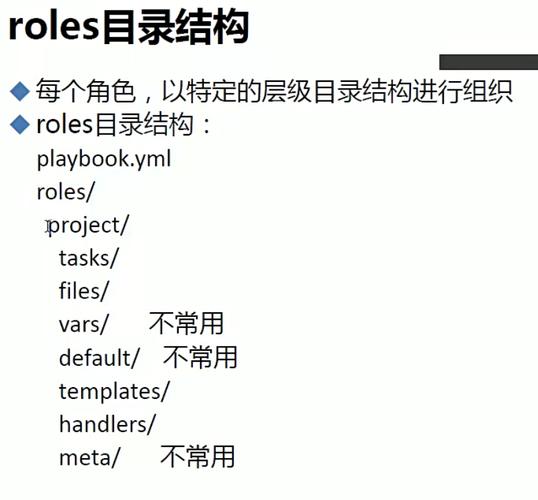

# 1.什么是ansible

ansible是新出现的自动化运维工具，基于Python开发，集合了众多运维工具（puppet、chef、func、fabric）的优点，实现了批量系统配置、批量程序部署、批量运行命令等功能。
ansible是基于 paramiko 开发的,并且基于模块化工作，本身没有批量部署的能力。真正具有批量部署的是ansible所运行的模块，ansible只是提供一种框架。ansible不需要在远程主机上安装client/agents，因为它们是基于ssh来和远程主机通讯的。ansible目前已经已经被红帽官方收购，是自动化运维工具中大家认可度最高的，并且上手容易，学习简单。是每位运维工程师必须掌握的技能之一。

# 2.为什么使用ansible

## 1.ansible特性

- 模块化：调用特定的模块，完成特定的任务
- 有Paramiko，PyYAML，Jinja2(模板语言)三个关键模块
- 支持自定义模块，可以使用任何语言进行开发
- 基于Python语言实现
- 部署简单，基于python和SSH,agentless
- 安全，基于OpenSSH
- 支持playbook编排任务
- 幂等性：一个任务执行1遍和n遍效果一样，不因重复执行带来意外情况，Ansible通过任务模块的设计来实现幂等性
- 无需代理不依赖PKI(无需ssl)
- 可使用任何编程语言写模块
- YAML格式，编排任务，支持丰富的数据结构
- 较强大的多层解决方案

## 2.ansible架构


## 3.ansible工作


- CMDB：CMDB 存储和管理者企业IT架构中的各项配置信息，是构建 ITIL 项目的核心工具，运维人员可以组合 CMDB 和 Ansible，通过 CMDB 直接下发指令调用Ansible 工具集完成操作者所希望达到的目标；
- PUBLIC/PRIVATE 方式：Ansible 除了丰富的内置模块外，同时还提供丰富的 API语言接口，如PHP、Python、PERL 等多种流行语言，基于 PUBLIC/PRIVATE，Ansible 以 API 调用的方式运行；
- Ad-Hoc 命令集：Users直接通过Ad-Hoc命令集调用Ansible工具集来完成任务；
- playbook：任务剧本(任务集)，编排定义ANSIBLE任务集的配置文件，由ANSIBLE顺序执行
- INVENTORY：ANSIBLE管理主机的清单，/etc/ansible/hosts
- MODULES：ansible执行命令的功能模块，多数为内置核心模块，也可定义
- PLUGIN：模块功能的补充，如连接类型插件、循环插件、变量插件、过滤插件等，不常用
- API：供第三方程序调用的应用程序编程接口
- ANSIBLE：组合以上全部功能，可以理解为是ANSIBLE命令根据，为核心执行工具


# 3.ansible使用

## 1.配置文件

```bash
# 基础配置项
[defaults]

# some basic default values...

inventory      = /etc/ansible/hosts  # 主机清单
library        = /usr/share/my_modules/ # 模块库目录
module_utils   = /usr/share/my_module_utils/ # 模块工具目录
remote_tmp     = ~/.ansible/tmp  # 远程脚本目录
local_tmp      = ~/.ansible/tmp  # 本地脚本目录
plugin_filters_cfg = /etc/ansible/plugin_filters.yml # 插件
forks          = 5  # 并发数
poll_interval  = 15 # 间隔
sudo_user      = root # sudo用户
ask_sudo_pass = True # 
ask_pass      = True
transport      = smart
remote_port    = 22
module_lang    = C
module_set_locale = False
host_key_checking = False # 检查对应服务器的host_key，建议取消注释
log_path = /var/log/ansible.log # 日志文件，建议取消注释
```


## 2.ansible系列命令

```bash
# 修改默认的编辑器为vim
echo export EDITOR=vim >> /etc/profile.d/env.sh
```

### 1.ansible-doc


### 2.ansible


- -i PATH（—inventory=PATH）：指定inventory信息，默认为/etc/ansible/hosts；

- --private-key=PRIVATE_KEY_FILE：指定密钥文件；

- -M DIRECTORY（—module-path=DIRECTORY） ：指定模块存放路径，默认为/usr/share/ansible；

- -l subset（—limit=SUBSET）：限制运行主机；


### 3.ansible-galaxy


### 4.ansible-vault


### 5.ansible-console


### 6.ansible-pull、ansible-playbook


- ansible-playbook [option] playbook [playbook ...]

  - `-i INVENTORY, --inventory=INVENTORY`：指定清单文件或主机列表。
  - `--list-hosts`：列出运行任务的主机
  - `list-tasks`：列出playbook中的任务列表

  - `-l SUBSET, --limit=SUBSET`：进一步限制选定的主机/组。

  - `-e EXTRA_VARS, --extra-vars=EXTRA_VARS`：设置额外的变量，可以是键值对或 YAML/JSON 文件。

  - `-t TAGS, --tags=TAGS`：仅运行标记为这些值的任务。

  - `--skip-tags=SKIP_TAGS`：仅运行未标记为这些值的任务。

  - `-C, --check`：不进行任何更改，而是尝试预测可能发生的更改。

  - `-D, --diff`：显示可能更改的文件中的差异。

  - `-v, --verbose`：详细模式，可以使用多个 -v 选项以增加详细程度。


## 3.ansible命令执行过程


## 4.常用模块


- command模块：

  ```bash
  Ansible 的 command 模块用于在目标主机上执行命令。该模块接受命令名称，后跟一系列以空格分隔的参数。给定的命令将在所有选定的节点上执行。命令不会通过 shell 处理，因此像 $HOSTNAME 这样的变量和像 *、<、>、|、; 和 & 这样的操作将无法使用
  ```

- script模块：会把脚本自动发往各主机且自动赋予x权限


- copy模块：文件内容不一致也会进行操作
- fetch模块：自动创建目录，只能抓单个文件

```
if the `dest' directory is `/backup' a
                               `src' file named `/etc/profile' on
                               host `host.example.com', would be
                               saved into `/backup/host.example.c
                               om/etc/profile'. The host name is
                               based on the inventory name.
```


- yum：

```bash
# 如果想装多个包
name=nginx，mysql
```


## 5.playbook

- playbook是由一个或多个play组成的列表
- play的主要功能在于将事先归并为一组的主机装扮成事先通过ansible中task定义好的角色。从根本上讲，所谓task无非是调用ansible的一个module。将多个play组织在一个playbook中，即可让它们连同起来按事先编排的机制同唱一台大戏
- playbook采用yaml语言编写


### 1.playbook组件


### 2.Hosts


### 3.task


```bash
一个name列表里面只能有不重名的模块，否则只会执行最后一个同名模块
如果在playbook中书写相对路径，则该路径是相对与playbook存在位置而言的
```


### 4.handlers


```bash
---
- hosts: 192.168.19.128
  remote_user: root

  tasks:
    - name: yum nginx
      yum: name=nginx
    - name: copy conf file
      copy: src=nginx/nginx.conf dest=/etc/nginx/ backup=yes
      notify: 
      	- restart service
      	- stop seervice
    - name: start nginx
      service: name=nginx state=started
  handlers:
    - name: restart service
      service: name=nginx state=restarted
    - name: stop service
      service: name=nginx state=stopped
```

### 5.tags

```bash
---
- hosts: 192.168.19.128
  remote_user: root

  tasks:
    - name: yum nginx
      yum: name=nginx
      tags: install
    - name: copy conf file
      copy: src=nginx/nginx.conf dest=/etc/nginx/ backup=yes
      notify: 
      	- restart service
      	- stop seervice
    - name: start nginx
      service: name=nginx state=started
      tags: startnginx
  handlers:
    - name: restart service
      service: name=nginx state=restarted
    - name: stop service
      service: name=nginx state=stopped
      
# 使用tag
ansible-playbook -t install,startnginx nginx.yml
```

### 6.变量

- setup模块：查看本机信息，filter参数能过滤


```yaml
# 变量优先级为：命令行 > playbook > 主机清单
# 可以在hosts文件中定义
[w]
192.168.19.120 port=10 node=20
[w:vars]
node=178
node=20

---
- hosts: w
  remote_user: root
  vars:           
    - pkname1: nginx
    - pkname2: httpd
  tasks:
    - name: install nginx
      yum: name={{ pkname1 }}
    - name: install httpd
      yum: name={{ pkname2 }}
      
  # vars_files: 可以使用变量文件
  #    - vars.yml
  # vars.yml
  - var1: httpd
  - var2: nginx
```


### 7.模板


```yaml
---
- hosts: web
  remote_user: root
  
  tasks:
    - name: install service
      yum: name=nginx
    - name: copy file
      template: src=nginx.conf.j2 dest=/etc/nginx/nginx.conf
# nginx.conf.j2
worker_processes {{ ansible_processor_vcpus**2 }}
{# example.j2 #}


User {{ user.name }} is authorized.

User {{ user.name }} is not authorized.


```

### 8.when


### 9.迭代with_items

- 迭代：当有需要重复性执行的任务时，可以使用迭代机制
  - 对迭代项的引用，固定变量名位"item"
  - 要在task中使用with_items给定要迭代的元素列表
  - 列表格式：
    - 字符串
    - 字典

```bash
---
- hosts: w
  remote_user: root

  tasks:
    - name: create file
      file: name={{ item }} state=touch
      when:  item == "f2.txt"
      with_items:
       - f1.txt
       - f2.txt
```


## 6.role





### 1.调用role


> 在这个文件能直接给role传递变量
>
> { role: nginx,username:nginx }


> 关于ansible role注意事项

- vars变量文件中只能使用字典，但是vars_files的变量文件只要带有字典就行
