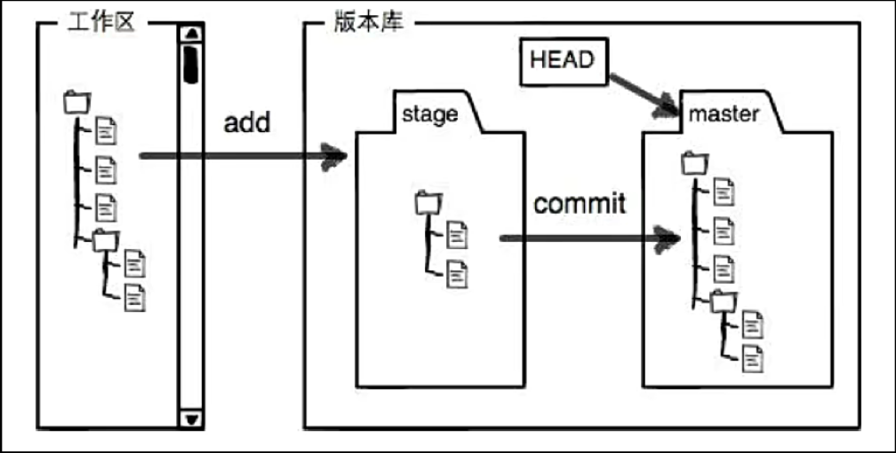
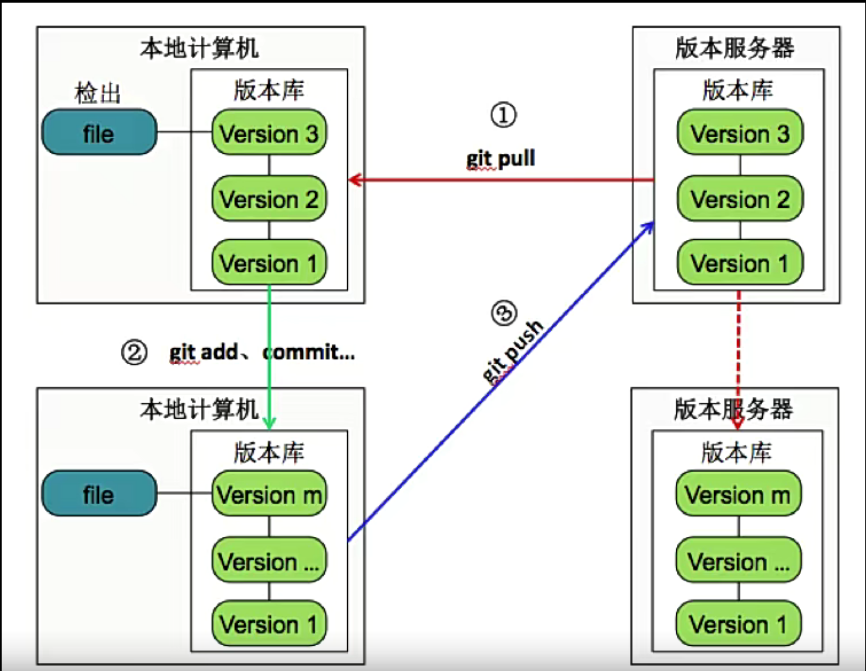

# 1. 简介
- git官方网站：[Git (git-scm.com)](https://git-scm.com/)

# 2.Git入门
## 2.1.Git介绍
自诞生于2005年以来，Git日渐完善，它的速度很快，极其适合管理大型项目，它还有着令人难以置信的非线性分支管理系统，可以应付各种复杂的项目开发需求。
- Git是一个版本控制软件，具有以下几点优点
	- 本地建立版本库
	- 本地版本控制
	- 多主机异地协同工作
	- 重写提交说明
	- 可以进行版本回退
	- 更好的提交列表
	- 更好的差异比较
	- 更完善的分支系统
	- 速度极快
- Github与GitLab都是用于管理版本的服务端软件
- GitLab用于在企业内部管理Git版本库，功能上类似于GitHub
## 2.2.Git工作模式
- 版本库初始化
	- 个人计算机从版本服务器同步
- 操作
	- 90%以上的操作在个人计算机上
	- 添加文件
	- 修改文件
	- 提交变更
	- 查看版本历史等
- 版本库同步
	- 将本地修改推送到版本服务器
	
- Git文件存储方式：以全量的方式管理文件，直接记录快照，而非差异比较
	![[./image/git_time_2.png]]
- Git文件状态
	- Git文件：已经被版本库管理的文件
	- 已修改：在工作目录修改Git文件
	- 已暂存：对已修改的文件执行Git暂存操作，将文件存入暂存区
	- 已提交：将已暂存的文件执行Git提交操作，将文件存入版本库
	
	
- 本地版本库与服务器版本库
	

## 2.3.Git常用命令
- 获得版本库
	- git init
	- git clone
- 版本管理
	- git add
	- git commit
		- 会对提交内容使用sha1计算出一个commitid
		- `git commit --amend -m 'mesge'`:修正上一条提交的信息
		- `git commit -am`：直接把全部修改过文件添加到暂存区并提交，但新增的文件不能
	- git rm：删除文件，本质和rm命令一致
		- 使用`git rm`后不需要再使用`git add`命令将修改添加在暂存区，使用`rm`的话仍然需要使用使用`git add`命令将修改添加在暂存区
		- 如果想将删除的文件恢复，可以使用`git reset HEAD filename`将文件从暂存区移除，再使用`git checkout -- fielname`将工作区中的修改丢弃
	- git mv
	- git branch：分支操作，不带参数则查看所有分支，带`*`为当前所在分支
	- git checkout
		- git checkout branchname:切换分支
- 查看信息
	- git help
	- git log：查看提交历史
		- -p：展开显示每次提交的内容差异
		- -n：只显示n条
		- --pretty=oneline|format:"%h"：指定格式进行输出
	- git diff
- 远程协作
	- git pull
	- git push
- 设置信息：在提交文件时需要进行设置
	- git config --global user.name "Your Name"
	- git config --global user.email you@example.com
	> 可以在三个地方进行设置
	> 1. /etc/gitconfig(几乎不会使用) git config --system
	> 2. ~/.gitconfig git config --global
	> 3. 针对特定项目 .git/config git config --local

## 2.4.gitignore
在git中可以在.gitigore文件中编写一定的规则，让git管理时忽略一些文件。编写规则的语法如下：
```bash
以#号开始的表示注释
以/结尾表示目录
以*通配多个字符
以?通配单个字符
以[]包含单个字符的匹配列表
以!表示不忽略匹配到的文件或目录
```
.gitigore的规则读取方式是采用从上往下的顺序，所以如果上面的规则范围比较大，下面范围较小的规则则不会生效。

## 2.5.分支
分支是git中一个非常重要的概念。分支其实就是一条commit对象链(一条工作记录线)

有常见操作有以下几种：
- git branch \[branchname]: 查看/创建分支，带\*的为当前所在分支。
	- -d/-D：删除分支/如果分支上有未合并的操作
	- -m \<old> \<new>：修改分支名
- git checkout \[branchname]：切换分支
	- -b：创建并切换到分支
- git merge branch：合并分支
在git中，使用`HEAD`指向当前分支，信息存储在.git/HEAD中
快进合并：master没有做任何修改，直接就是把master指向最新的提交。

分支合并：master和分支都做了操作，如果有冲突需要手动解决冲突再合并。有冲突的文件会变成下面这样。解决完冲突后使用`git add filename`标记解决冲突，再使用`git commit`提交合并。


如果可能的话，合并分支时Git会使用fast-forward模式，这种模式下，删除分支时会丢掉分支信息。可以在合并时加上`--no-ff`参数会禁用fast-forward，这样会多出一个`commit id`。
由于Git其实就是由一条提交链组成的，所以我们可以回退到任意一个提交上。
- 回退到上一版本
	- git reset --hard HEAD^
	- git reset --hard HEAD~1
	- git reset --hard commit_id
- 回退到某一个版本
	- git reflog：查看历史操作记录
## 2.6.checkout进阶与stash
- `git checkout -- filename`：丢弃工作区的更改，保持与暂存区内容一致
- `git check <commit id>`：切换HEAD位置
	- 切换当前到任意历史节点上，但这次切换是游离的HEAD，意味着如果做了任何操作都需要提交才能切换回master上
	- 切换回master后可以使用`git branch <new-branch-name> <commit id>`来使用这个游离的节点创建一个分支
- `git stash`：将分支上正在进行的工作进行保存，用来临时保存未经过测试不能提交的修改
	- save "com"：为保存添加说明
	- list：列出保存的列表
	- pop/apply \<stash id>：将最新保存的工作回复并删除记录/不删除
	- 使用apply后可以使用`git stash drop <stash id>`进行删除记录
## 2.7.标签与diff
git中有两种标签，一种是轻量级标签(lightweight)与带有附注标签(annotated)
- `git tag`:查看标签
- `git tag -l 'patter'`:查找标签
- `git tag v1.0.0`:创建轻量级标签
- `git tag -a v1.0.2 -m 'release version'`:创建带附注的标签
- `git tag -d tag_name`:删除标签
在git中可以使用`git blame filename`查看文件具体都是由谁修改提交的。
在git中可以使用`git diff`比较暂存区与工作区的内容。
```bash
[drain@localhost tt]$ git diff
diff --git a/2 b/2  # a/2为暂存区内存，为源文件
index 0cfbf08..4792e70 100644
--- a/2
+++ b/2
@@ -1 +1,2 @@ # 源文件只有一行，目标文件从第一行开始有两行
 2 # 代表一样的内容
+3 # 代表源文件加上这一行后会和目标文件一致
```
也可以使用`git diff HEAD`比较最新提交内容与工作区的差异，或使用`git diff <commit id>`指定提交内容比较。或使用`git diff --cached commit_id`比较提交内容和暂存区的差异。
## 2.8.远程仓库
使用远程仓库时有以下几个关键命令
- push：推送
	- -u origin \<branchname>:推送本地同名分支到远程分支，绑定后可以只执行`git push`推送
- pull：拉取，同时会执行合并
	- pull=fetch+merge
- `git remote add origin <url>`：添加远程仓库
	- show \<remotename>:不带名字列出所有远程仓库别名，带名字列出具体远程仓库详细信息
- `git config --global push.default simple`:在没有指定分支名称时`git push`应该推送那些分支，simple会默认推送到使用`git pull`拉取的分支。
在我们基于git进行开发的时候，可以遵循以下几个模型：
1. Gitflow：最佳实践，但比较复杂
2. 基于Git分支的开发模型：
	1. develop分支(频繁变化的一个分支)
	2. test分支(供产品和测试等人员使用的分支，变化不是特别频繁)
	3. master分支(生产发布分支，变化不频繁)
	4. bugfix(hotfix)分支(生产系统当中出现了紧急bug，用于紧急修复的分支)


