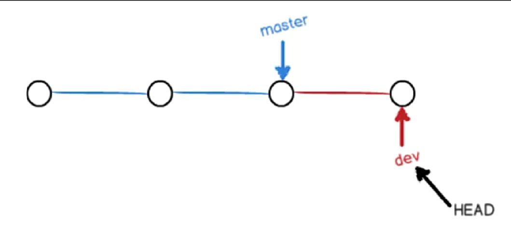

# 1 简介
- git官方网站：[Git (git-scm.com)](https://git-scm.com/)

# 2 Git入门
## 2.1 Git介绍
自诞生于2005年以来，Git日渐完善，它的速度很快，极其适合管理大型项目，它还有着令人难以置信的非线性分支管理系统，可以应付各种复杂的项目开发需求。
- Git是一个版本控制软件，具有以下几点优点
	- 本地建立版本库
	- 本地版本控制
	- 多主机异地协同工作
	- 重写提交说明
	- 可以进行版本回退
	- 更好的提交列表
	- 更好的差异比较
	- 更完善的分支系统
	- 速度极快
- Github与GitLab都是用于管理版本的服务端软件
- GitLab用于在企业内部管理Git版本库，功能上类似于GitHub
## 2.2 Git工作模式
- 版本库初始化
	- 个人计算机从版本服务器同步
- 操作
	- 90%以上的操作在个人计算机上
	- 添加文件
	- 修改文件
	- 提交变更
	- 查看版本历史等
- 版本库同步
	- 将本地修改推送到版本服务器
	
- Git文件存储方式：以全量的方式管理文件，直接记录快照，而非差异比较
	
- Git文件状态
	- Git文件：已经被版本库管理的文件
	- 已修改：在工作目录修改Git文件
	- 已暂存：对已修改的文件执行Git暂存操作，将文件存入暂存区
	- 已提交：将已暂存的文件执行Git提交操作，将文件存入版本库
	
	
- 本地版本库与服务器版本库
	

## 2.3 Git常用命令

### 2.3.1 获得版本库

- git init
    - git init -b branch:初始化仓库并新建分支

- git clone:用于将 ​**远程仓库完整复制到本地**，包含所有文件、分支（默认克隆所有分支，但只检出默认分支）和提交历史。克隆后，本地仓库会自动关联远程仓库（默认命名为 `origin`）。
    	- **检出​**​ 是 Git 中的一个操作，表示 ​**​将某个分支（或提交）的代码版本加载到你的本地工作目录​**​，使你可以查看或修改这些文件。
    ```bash
git clone <仓库地址> [目标目录名]

git clone -b <分支名> <仓库地址>

git clone --depth 1 <仓库地址>  # 只克隆最新一次提交（减少数据量）

#你本地工作目录中看到的是默认分支（如 `main`）的代码，其他分支需要手动检出才能使用。
#手动检出：git switch feature
git branch -a
* master
  remotes/origin/HEAD -> origin/master
  remotes/origin/feature
  remotes/origin/master
    ```

### 2.3.2 版本管理
- git add
    - `.`:提交所有文件，但会检查gitignore
    - `*`:提交所有文件，不会检查gitignore
    - dirname/：暂存该目录下所有文件
    - -u：暂存已追踪文件的修改
    - -f：强制添加ignore忽略的文件
    - \*.js：添加所有js后缀文件
- git commit
    - 会对提交内容使用sha1计算出一个commitid
    - `git commit --amend -m 'mesge'`:修正上一条提交的信息并合并到上一个提交
    - `git commit -am`：直接把全部修改过文件添加到暂存区并提交，但新增的文件不能
    - 执行命令时，git会创建一个commit对象，并且将这个commit对象的parent指针设置为HEAD所指向引用的SHA-1值
    - 使用前七位的SHA-1值即可表示一个commit
- git rm：从版本中删除文件，本质和rm命令一致
    - 使用`git rm`后不需要再使用`git add`命令将修改添加在暂存区，使用`rm`的话仍然需要使用使用`git add`命令将修改添加在暂存区
    - 如果想将删除的文件恢复，可以使用`git reset HEAD filename`将文件从暂存区移除，再使用`git checkout -- fielname`将工作区中的修改丢弃
    - `git rm --cached \<file\>...`:停止跟踪文件，但保留工作区的文件
- git mv

- git branch：分支操作，不带参数则查看所有分支，带`*`为当前所在分支
```bash
git branch -r # 列出所有远程分支

git branch -a # 列出所有本地和远程分支

git branch <branch-name>         # 基于当前提交创建分支（不切换）
git branch <branch-name> <commit-hash>  # 基于指定提交创建
git checkout -b <branch-name>      # 创建并切换到新分支（传统方式）
git switch -c <branch-name>        # 同上（推荐使用 git switch）

git branch -d <branch-name>      # 删除已合并的分支（安全操作）
git branch -D <branch-name>      # 强制删除未合并的分支（慎用！）

git branch -m <old-name> <new-name>  # 重命名分支（需先切换到其他分支）
git branch -M <new-name>             # 强制重命名当前分支（覆盖同名分支）

git branch -v # 查看分支的最后提交信息

git branch -vv # 查看分支与远程的关联状态

git branch --merged # 列出已合并到当前分支的分支
git branch --no-merged # 列出未合并到当前分支的分支

git branch -u origin/<remote-branch>  # 为当前分支设置上游
git branch --set-upstream-to=origin/<remote-branch>  # 同上

git push origin --delete <remote-branch>  # 删除远程分支
```
    
- git switch：2.23 版本引入的 ​**分支管理命令**，旨在替代 `git checkout` 的部分功能，专注于 ​**分支切换** 和 ​**分支创建**，从而解决 `git checkout` 命令的 ​**多义性问题**
```bash
    git switch <branch-name> # 切换分支
    git switch - #快速切换到上一个分支

    git switch --detach a1b2c3d # 进入分离头指针状态

    git switch -c <new-branch>     # 基于当前提交创建并切换到新分支
    git switch -c <new-branch> <commit-hash>  # 基于指定提交创建

    git switch -t origin/<remote-branch>  # 自动跟踪远程分支
    git switch --track origin/<remote-branch>  # 同上

    git switch --discard-changes <branch>  # 强制切换，丢弃工作区修改
    git switch -f <branch>                 # 简写（同 --discard-changes）

    git switch --merge <branch>  # 尝试将未提交的修改合并到目标分支

    git checkout -b <lost-branch> <commit-hash>  # 通过提交哈希重建已删除分支
```

- git restore：Git 2.23 版本引入的 ​**文件恢复命令**，旨在替代 `git checkout` 和 `git reset` 的部分功能，专注于 ​**恢复工作目录或暂存区的文件状态**。
    - **恢复工作目录文件**：丢弃未暂存的修改。
    - ​**恢复暂存区文件**：将已暂存的文件移出暂存区（保留工作目录修改）。
    - ​**从历史提交恢复文件**：将文件恢复到指定提交的版本。
```bash
    git restore file.txt        # 恢复未暂存的修改（等效于 git checkout -- file.txt）
    git restore .              # 恢复当前目录下所有未暂存的修改

    git restore --staged file.txt  # 将文件移出暂存区（保留工作目录修改）
    git restore --staged .        # 取消暂存所有文件

    git restore --staged/-S --worktree/-W file.txt  # 彻底恢复文件到 HEAD 提交的状态 

    git restore --source=HEAD~1 file.txt  # 恢复到上一个提交的版本（保留暂存区和工作目录）
    git restore --source=abc123 file.txt  # 恢复到特定提交的版本
```

- git checkout：主要用于 ​**切换分支** 和 ​**恢复文件**。随着 Git 2.23 版本引入 `git switch` 和 `git restore`，其职责被拆分。
    - **切换分支**：切换到已有分支或新建分支。
    - ​**恢复文件**：将文件从暂存区或提交历史恢复到工作目录。
    - ​**分离头指针（Detached HEAD）​**：临时查看历史提交或实验性修改。
```bash
    git checkout <branch-name>      # 切换到现有分支
    git checkout -b <new-branch>    # 创建并切换到新分支（基于当前提交）
    git checkout -b <new-branch> <commit-hash>  # 基于指定提交创建分支

    git checkout --track origin/<remote-branch>  # 创建本地分支并关联远程分支
    git checkout -f <branch>  # 强制切换分支，丢弃所有未提交的修改（慎用！）

    git checkout -- <file>   # 丢弃工作目录中文件的未提交修改
    git checkout <commit-hash> -- <file>  # 将文件恢复到指定提交的版本
    
    git checkout <commit-hash>  # 进入分离头指针状态，查看历史代码，可以使用-b创建分支

    # 保留当前分支/对方分支的修改（丢弃对方分支/当前分支的冲突部分）
    git restore --ours/--theirs conflicted-file.txt
```
    
- git merge：Git 中用于 ​**合并分支** 的核心命令，可将不同分支的修改内容整合到当前分支
```bash
    git merge [options] <branch-name...> # 把branch-name合并到当前所在分支,可以一次性合并多个分支（仅限无冲突场景）

    # Fast-Forward Merge：当前分支没有提交，合并分支是该分支的直接后继，不会创建新提交而是直接把分支指针移动到合并分支所在位置
    git merge --no-ff feature/login  # 禁用快进合并

    git merge --squash feature/login # 将待合并分支的所有提交压缩为单个提交，合并到目标分支。

    git merge --abort # 工作目录和暂存区恢复到合并开始前的状态。在解决冲突提交前可以执行
```

- git rebase：Git 中用于 ​**​重写提交历史​**​ 的核心命令，能够将分支的提交重新应用到另一个基点上，使历史记录保持线性。
    - rebase不会删除提交，只是新建了提交，旧提交仍然在历史记录中
```bash
    git checkout feature
    git rebase main   # 将 feature 分支的提交变基到 main 分支之后

    # 冲突解决后继续变基：
    git add <冲突文件>
    git rebase --continue
    git rebase --abort  # 放弃变基，恢复原状

    git fetch origin
    git rebase origin/main  # 将当前分支变基到远程 main 分支

    git rebase -X theirs main  # 冲突时自动选择“对方”版本（慎用！）
    git rebase -X ours main    # 冲突时自动选择“我方”版本
```

- git reset：Git 中用于 ​**重置当前分支状态** 的核心命令，能够移动分支指针（HEAD）并修改 ​**暂存区（Stage）​** 和 ​**工作目录（Working Directory）​** 的内容。

|**参数**|​**作用**|​**影响范围**|
|---|---|---|
|​**`--soft`**|仅移动 ​**HEAD 指针**，不修改暂存区和工作目录。|提交历史回退，保留所有修改在 ​**暂存区**。|
|​**`--mixed`**|移动 HEAD 指针并 ​**重置暂存区**​（默认参数），保留工作目录的修改。|提交历史回退，保留所有修改在 ​**工作目录**。|
|​**`--hard`**|移动 HEAD 指针、重置暂存区 ​**并丢弃工作目录的所有修改**。|提交历史回退，​**彻底丢弃所有未提交的修改**。|
|​**`--merge`**|类似 `--mixed`，但在合并冲突时保留未合并的修改。|用于取消合并（`git reset --merge`）。|
|​**`--keep`**|移动 HEAD 指针，但保留工作目录和暂存区的修改（尝试保留未提交的更改）。|用于保留本地修改的同时回退提交。|

```bash
# 回退到上一个提交，保留修改到暂存区（适合修改后重新提交）
git reset --soft HEAD~1

# 回退到上一个提交，保留修改到工作目录（适合重新修改后提交）
git reset --mixed HEAD~1  # 或省略 --mixed

# 回退到上一个提交，丢弃所有未提交的修改（危险！）
git reset --hard HEAD~1

# 将指定文件移出暂存区（保留工作目录修改）
git reset HEAD <file>

# 将所有文件移出暂存区（保留工作目录修改）
git reset

# 回退到某个特定提交（如 commit-id 为 a1b2c3d）
git reset --soft a1b2c3d  # 保留修改到暂存区
git reset --hard a1b2c3d  # 彻底丢弃所有修改

# 强制将本地分支与远程同步（丢弃所有本地修改）
git fetch origin
git reset --hard origin/main
```

- **`HEAD~n`**：向父提交回溯 `n` 步（如 `HEAD~2` 表示上上个提交）。
- ​**`HEAD^`**：等效于 `HEAD~1`，多个 `^` 表示多步（如 `HEAD^^` = `HEAD~2`）。

- git revert：Git 中用于 ​**安全撤销历史提交** 的核心命令，它通过创建新的提交来逆改指定提交的变更，​**不会重写提交历史**，适合用于公共分支（如 `main`）的修改撤销。

|​**参数**|​**作用**|
|---|---|
|​**`<commit>`**|指定要撤销的提交哈希（必选）|
|​**`-n`/`--no-commit`**|撤销更改但不自动提交，允许手动调整后提交|
|​**`-m <parent-number>`**|撤销合并提交时指定主线分支（如 `-m 1` 表示保留第一条分支的改动）|
|​**`--no-edit`**|跳过提交信息编辑（直接使用默认信息）|
|​**`--continue`**|解决冲突后继续执行 `revert` 流程|
|​**`--abort`**|取消 `revert` 操作，恢复至冲突前的状态|
```bash
# 撤销指定提交（如提交哈希为 a1b2c3d），并自动生成提交信息
git revert a1b2c3d

# 撤销后手动修改并提交（适合需要调整撤销内容）
git revert -n a1b2c3d
git add .
git commit -m "revert: 手动调整撤销内容"

# 示例：撤销从 a1b2c3d 到 d4e5f6g 的提交
git revert a1b2c3d^..d4e5f6g

# 合并提交（如哈希为 m1n2o3p）有两个父提交（主线分支为第一个父提交）
git revert -m 1 m1n2o3p

# 解决冲突后继续
git add .
git revert --continue
```

### 2.3.3 查看信息
- git help
- git log：查看提交历史(逆序显示)
```bash
git log --graph --oneline --decorate # 以 ASCII 图形展示分支和合并历史，适合查看多分支开发场景。

#-p：展开显示每次提交的内容差异
git log -p

#查看所有分支提交日志
git log --all

git log -n 3          # 显示最近3条提交
git log --since="2023-01-01" --until="2023-12-31"  # 按时间范围筛选
git log --author="John"  # 显示指定作者的提交
git log --grep="bug"     # 查找提交消息包含 "bug" 的提交
git log --branches="develop" # 查看分支日志
git log --tags="v1.0.0" # 查看标签提交，以上这些都支持正则
git log -- path/to/file  # 查看某文件的修改历史

#--pretty=oneline|format:"%h"：指定格式进行输出
git log --pretty=format:"%h - %an, %ar : %s"

#- `%h`：简短哈希
#- `%an`：作者名
#- `%ar`：相对时间（如 "2 days ago"）
#- `%s`：提交消息

git cat-file -p <commit_hash> # 查看该提交的父节点
```

- git relog： Git 中用于 ​**追踪本地仓库操作历史** 的关键命令，记录了 HEAD 指针和分支的移动轨迹，能够帮助恢复误删的提交、分支或重置操作。

|​**参数**|​**作用**|
|---|---|
|​**`--all`**|显示所有引用（分支、标签、HEAD 等）的操作历史|
|​**`--date=<format>`**|按指定格式显示时间（如 `--date=iso`、`--date=relative`）|
|​**`--since=<time>`**|显示指定时间后的记录（如 `--since="2 days ago"`）|
|​**`--until=<time>`**|显示指定时间前的记录（如 `--until="2023-10-01"`）|
|​**`-n`/`--no-abbrev`**|显示完整的提交哈希（默认显示缩写）|
|​**`-g`/`--walk-reflogs`**|以图形化方式显示操作历史（类似 `git log --graph`）|

```bash
git reflog
# 输出示例：
# a1b2c3d (HEAD -> main) HEAD@{0}: commit: 更新用户登录逻辑
# d4e5f6g HEAD@{1}: reset: moving to HEAD~1
# e7f8h9i HEAD@{2}: merge feature/login: Fast-forward

# 找到误删的提交哈希（如 e7f8h9i）
git reflog
# 创建新分支指向该提交
git branch recovery-branch e7f8h9i
# 或直接重置当前分支
git reset --hard e7f8h9i

# 找到分支删除前的操作记录
git reflog --all
# 示例输出：
# e7f8h9i HEAD@{3}: checkout: moving from main to deleted-branch
# 恢复分支
git branch deleted-branch e7f8h9i


git reflog show feature/login
# 输出示例：
# a1b2c3d feature/login@{0}: commit: 添加登录验证

# 显示过去3天的操作历史
git reflog --since="3 days ago"
```
- **仅限本地操作**：`reflog` 仅记录本地仓库的操作，不会同步到远程仓库。
- ​**过期清理**：默认保留 ​**90天** 的记录（可通过 `git gc` 清理，`reflog expire` 调整期限）。

- git diff
- git status：查看当前工作区和暂存区状态,还能查看与远处仓库的状态比较

### 2.3.4 远程协作
- git remote：Git 中用于 ​**管理远程仓库配置** 的核心命令，支持添加、删除、重命名远程仓库，以及查看远程仓库信息等操作。
```bash
git remote      # 列出所有远程仓库名称
git remote -v   # 显示详细信息（包括 URL）
git remote show <name>  # 显示分支跟踪关系和提交状态

git remote add <name> <url>  # 添加远程仓库并命名

git remote remove <name>    # 删除指定远程仓库
git remote rm <name>        # 同上（简写）

git remote rename <old-name> <new-name>

git remote set-url <name> <new-url>

git remote update <name>  # 更新指定远程仓库的分支信息
git remote update         # 更新所有远程仓库的分支信息

git remote prune <name>  # 删除本地缓存中已不存在的远程分支
```

- git pull ：Git 中用于 ​**从远程仓库同步代码并合并到本地分支** 的核心命令，它将 `git fetch`（获取远程更新）和 `git merge`（合并到本地分支）组合成一步操作
    - ​**同步远程更新**：将远程仓库的最新提交拉取到本地。
    - ​**合并代码**：将远程分支的修改合并到当前本地分支。
    - ​**支持多种合并策略**：如快进合并（Fast-Forward）、普通合并（Merge）或变基（Rebase）。
```bash
    git pull [远程仓库名] [远程分支名]:[本地分支名]

    #如果远程分支和本地分支没有开发记录的分歧，则默认进行快进合并
    #如果有分歧，要指定使用的合并方式，否则报错
    #有分歧建议使用fetch再考虑使用rebase或merge
    git pull origin main --no-rebase  # 默认行为，拉取并合并远程分支
    git pull origin main --rebase  # 将本地提交变基到远程分支之后
    git pull origin main --ff-only  # 仅当可快进合并时执行，否则终止

    git pull -p # 跟fetch -p效果一样

    # 默认使用合并（merge）
    git config --global pull.rebase false

    # 默认使用变基（rebase）
    git config --global pull.rebase true

    # 默认仅允许快进合并（fast-forward only）
    git config --global pull.ff only

    # 当本地和远程仓库有冲突的时候
    git status  # 列出冲突文件，并手动处理冲突文件
    git add <file>  # 将解决后的文件加入暂存区
    git commit  # 自动生成合并提交消息
    git rebase --continue

    # 拒绝合并不相干的历史：fatal: refusing to merge unrelated histories
    # 两个分支没有共同的祖先
    git pull origin main --allow-unrelated-histories

    # 存在已提交的修改：error: Your local changes to the following files would be overwritten by merge...
    git stash        # 暂存本地修改
    git pull         # 拉取远程更新
    git stash pop    # 恢复本地修改并解决冲突
```

- git fetch：Git 中用于从远程仓库获取最新数据但不自动合并到本地分支的命令。
    - - ​**​同步远程更新​**​：将远程仓库（如 `origin`）的最新提交、分支和标签下载到本地。
    - ​**​非侵入式操作​**​：不会修改本地工作目录或当前分支的代码，仅更新远程跟踪分支（如 `origin/main`）。
    - ​**​安全查看变更​**​：允许在合并前先审查远程更改，避免直接合并导致的问题。
```bash
    git fetch [远程仓库名] [分支名]

    git fetch --all #查看所有远程仓库的更新

    git fetch --prune/-p  # 清理远程已删除分支的本地缓存

    git fetch --tags    # 获取所有远程标签
    git fetch origin tag v1.0.0  # 获取特定标签
```
    
- git push：Git 中用于 ​**将本地分支的提交推送到远程仓库** 的核心命令。它实现了本地仓库与远程仓库的同步
    - **推送本地提交到远程仓库**：将本地分支的更新同步到远程分支。
    - ​**创建或删除远程分支**：通过推送空分支或指定参数管理远程分支。
    - ​**同步标签（Tags）​**：将本地标签推送到远程仓库。
```bash
git push [远程仓库名] [本地分支名]:[远程分支名]
git push origin main         # 将本地 main 分支推送到远程 origin/main
git push origin dev:feature  # 将本地 dev 分支推送到远程 feature 分支
git push #等同于上

git push -u origin main  # 推送并设置本地 main 分支跟踪远程 origin/main

git push origin --delete/-d feature  # 删除远程 feature 分支
git push origin :feature          # 同上（旧语法）

git push origin --tags  # 推送本地所有未同步的标签
git push origin v1.0.0  # 推送标签 v1.0.0
git push origin --delete <标签名> # 删除标签

#如果设置的上游分支和本地分支名不一致，会导致推送错误
# 设置 push.default 为 'simple'（推荐，默认行为）：仅当本地分支名与远程分支名 ​**​相同​**​ 时才推送，否则报错。
git config --global push.default simple

# 或设置为 'upstream'（推送时始终关联上游分支，即使名称不同）
git config --global push.default upstream
```

- git cherry-pick：Git 中用于 ​**将指定提交应用到当前分支** 的命令，适用于 ​**选择性合并某个提交的改动**，而无需合并整个分支。

|​**参数**|​**作用**|
|---|---|
|​**`<commit>`**|指定要应用的提交哈希（必选）|
|​**`-n`/`--no-commit`**|应用更改但不自动提交，允许手动调整后提交|
|​**`-e`/`--edit`**|提交前编辑提交信息（默认使用原提交信息）|
|​**`-x`**|在提交信息中追加来源提交哈希（方便追溯）|
|​**`-s`/`--signoff`**|在提交信息末尾添加签名（如 `Signed-off-by: User <user@email.com>`）|
|​**`-m <parent-number>`**|指定合并提交的主线分支（类似 `git revert`，用于处理合并提交）|
|​**`--continue`**|解决冲突后继续执行 `cherry-pick` 流程|
|​**`--abort`**|取消 `cherry-pick` 操作，恢复至冲突前的状态|
|​**`--skip`**|跳过当前提交（如无法解决冲突时放弃该提交）|
```bash
# 将提交 a1b2c3d 的改动应用到当前分支
git cherry-pick a1b2c3d

# 应用连续的多个提交（按提交顺序应用 commit1, commit2, commit3）
git cherry-pick commit1^..commit3

# 应用非连续的多个提交（按需指定多个哈希）
git cherry-pick a1b2c3d d4e5f6g e7f8h9i

# 应用合并提交 m1n2o3p 的改动（需指定主线分支）
git cherry-pick -m 1 m1n2o3p

# 应用提交但不自动提交（-n），调整后手动提交
git cherry-pick -n a1b2c3d
git add .
git commit -m "手动调整后的提交"


# 冲突后手动解决，标记为已解决并继续
git add .
git cherry-pick --continue

# 放弃当前提交（跳过）
git cherry-pick --skip

# 取消整个操作（恢复原状）
git cherry-pick --abort
```

### 2.3.5 设置信息
- git config alias.br branch:给branch命令设置一个br的别名
    - 可以把`branch`替换成`!branch`这样执行的时候会把前面的git去掉，相当于执行Linux命令
- git config --global user.name "Your Name"
- git config --global user.email you@example.com
> 可以在三个地方进行设置，在提交文件时需要进行设置
> 1. /etc/gitconfig(几乎不会使用) git config --system
> 2. ~/.gitconfig git config --global
> 3. 针对特定项目 .git/config git config --local

- 设置信息：
	- git config alias.br branch:给branch命令设置一个br的别名
		- 可以把`branch`替换成`!branch`这样执行的时候会把前面的git去掉，相当于执行Linux命令
	- git config --global user.name "Your Name"
	- git config --global user.email you@example.com
	- 启用自动转换（提交时转 LF，检出时转 CRLF）： git config --global core.autocrlf true
	> 可以在三个地方进行设置，在提交文件时需要进行设置
	> 1. /etc/gitconfig(几乎不会使用) git config --system
	> 2. ~/.gitconfig git config --global
	> 3. 针对特定项目 .git/config git config --local
	
- 参数设置：
	- `git config core.igorecase false`：关闭忽略大小写
	- `git config alias.st status`：设置别名

## 2.4 .gitignore
在git中可以在.gitigore文件中编写一定的规则，让git管理时忽略一些文件。编写规则的语法如下：
```bash
以#号开始的表示注释
以/结尾表示目录
以*通配多个字符
以?通配单个字符
以[]包含单个字符的匹配列表
以!表示不忽略匹配到的文件或目录
```
.gitigore的规则读取方式是采用从上往下的顺序，所以如果上面的规则范围比较大，下面范围较小的规则则不会生效。

## 2.5 分支

分支是git中一个非常重要的概念。分支其实就是一条commit对象链(一条工作记录线)

有常见操作有以下几种：
- git branch \[branchname]: 查看/创建分支，带\*的为当前所在分支。
	- -d/-D：删除分支/如果分支上有未合并的操作
	- -m \<old> \<new>：修改分支名
	- --set-upstream-to=origin/master master：将本地分支和远程分支进行关联
- git checkout \[branchname]：切换分支
	- -b：创建并切换到分支
- git merge branch：合并分支

在git中，使用`HEAD`指向当前分支，信息存储在.git/HEAD中

分支的信息保存在该目录下 `.git/refs/heads/`

当你在一个分支修改了内容没有提交，并想切换到另一个与修改内容冲突的分支时，git会提示报错，除非你提交或使用 `stash`命令暂时把修改存储起来。

当删除一个分支时，不会删除该分支的提交，这意味着想要再引用这些提交会变得很苦难，因为这些提交不再有分支引用他们，且不属于任何现有分支的开发历史的一部分。

当你想删除一个分支的时候，你需要删除远程分支和远程跟踪分支以及本地分支
```bash
git push origin -d feature # 删除远程分支和远程跟踪分支
git branch -d feature # 删除本地分支
```
## 2.6 合并

合并是将一个分支中的更改集成到另一个分支中的一种方法。在任何合并中，都有一个要合并的分支，称为源分支，还有一个要合并的分支，称为目标分支。源分支是包含要集成到目标分支中的更改的分支。目标分支是接收更改的分支，因此是在此操作中唯一更改的分支。

快进合并：master没有做任何修改，直接就是把master指向最新的提交。


三方合并：master和分支都做了操作，如果有冲突需要手动解决冲突再合并。有冲突的文件会变成下面这样。git会把这两个冲突节点和他们共同的祖先节点一起合并，称之为三方合并。解决完冲突后使用`git add filename`标记解决冲突，再使用`git commit`提交合并。


**等号上面的为目标分支，下面的为源分支内容**


当源分支能通过提交历史回溯到目标分支的时候，这两个分支没有分叉可以使用快进式合并。如果有分叉则使用三方合并。

在三方合并时，如果选择使用 `fetch`命令再 `merge`的话，会进入vim编辑器界面手动解决冲突信息。如果使用 `pull` 命令的话，需要自己在文件中解决冲突并使用 `add` 和 `commit`命令提示以及解决了冲突。

如果可能的话，合并分支时Git会使用fast-forward模式，这种模式下，删除分支时会丢掉分支信息。可以在合并时加上`--no-ff`参数会禁用fast-forward，这样会多出一个`commit id`。
由于Git其实就是由一条提交链组成的，所以我们可以回退到任意一个提交上。
- 回退到上一版本
	- git reset --hard HEAD^
	- git reset --hard HEAD~1
	- git reset --hard commit_id
- 回退到某一个版本
	- git reflog：查看历史操作记录，对于HEAD的任何修改都会该命令完整记录下来

还可以在三方合并时使用 `rebase` 命令，该命令有五个阶段，都是自动执行，只有在发生冲突的时候才需要介入：
- 找到共同祖先：git将确认rebase的两个分支的共同祖先，你所在的分支和正在rebase的分支
- 存储关于参与rebase的分支信息：git会将所在分支的每个提交信息存到临时区域

- 重置HEAD：重置HEAD指向正在rebase的分支相同的提交
- 应用和提交更改：依次应用每个提交中的更改，并在每个更改集后进行提交

- 切换到重新定位的分支：将重置的分支指向重新应用到的最后一个提交，并检出该分支使HEAD指向它

**rebase不应该将远程分支变基到本地分支，因为可以合作者已经基于这个分支创建了新分支**
## 2.7 checkout进阶与stash
- `git checkout -- filename`：丢弃文件未提交的修改
- `git checkout <commit id>`：切换HEAD位置
	- 切换当前到任意历史节点上，但这次切换是游离的HEAD，意味着如果做了任何操作都需要提交才能切换回master上
	- 切换回master后可以使用`git branch <new-branch-name> <commit id>`来使用这个游离的节点创建一个分支
- `git stash`：将分支上正在进行的工作进行保存，用来临时保存未经过测试不能提交的修改
	- save "com"：为保存添加说明
	- list：列出保存的列表
	- pop/apply \<stash id>：将最新保存的工作回复并删除记录/不删除
	- 使用apply后可以使用`git stash drop <stash id>`进行删除记录
## 2.8 标签与diff
git中有两种标签，一种是轻量级标签(lightweight)与带有附注标签(annotated)
- `git tag`:查看标签
- `git tag -l 'patter'`:查找标签
- `git tag v1.0.0`:创建轻量级标签
- `git tag -a v1.0.2 -m 'release version'`:创建带附注的标签
- `git tag -d tag_name`:删除标签
- `git show v1.0`：查看标签详细信息
- `git push origin tag[..tag]/--tags HEAD`：推送标签/全部标签和内容
- `git fetch origin tag v7.0`：拉取一个tag
- `git push prigin :refs/tags/v6.0`/`git push origin --delete tag v5.0`：删除远程标签
在git中可以使用`git blame filename`查看文件具体都是由谁修改提交的。
在git中可以使用`git diff`比较暂存区与工作区的内容。
```bash
[drain@localhost tt]$ git diff
diff --git a/2 b/2  # a/2为暂存区内存，为源文件
index 0cfbf08..4792e70 100644
--- a/2
+++ b/2
@@ -1 +1,2 @@ # 源文件只有一行，目标文件从第一行开始有两行
 2 # 代表一样的内容
+3 # 代表源文件加上这一行后会和目标文件一致
```
也可以使用`git diff HEAD`比较最新提交内容与工作区的差异，或使用`git diff <commit id>`指定提交内容比较。或使用`git diff --cached commit_id`比较提交内容和暂存区的差异。
## 2.9 远程仓库

当创建远程存储库时，有两种方法可以对其进行更改：
1.  通过其网站登录托管服务，并在那里直接进行更改。
2.  通过对本地存储库进行更改，并将这些更改上传到托管服务上的远程存储库。
不管使用哪种方式都需要对身份进行验证，第一种方式将使用用户名或电子邮件地址和密码来验证并登录到托管服务帐户。

第二种方式有两种常见的协议
- HTTPS：登录GitHub -- 点击 + 号 -- Settings --  Developer Settings -- Personal access tokens。创建好令牌，在设置远程仓库为HTTPS协议的时候第一次推送需要登陆，用户名是你GITHUB用户名，密码就是这个创建好的令牌
- SSH：如果设置远程仓库为SSH协议，需要在本地生成密钥，并在GITHUB上添加密钥。
    - Your repo -- Settings -- Deploy keys -- 添加密钥粘贴上id_rsa.pub文件内容即可
    - 全局Settings -- SSH keys -- 添加密钥粘贴上id_rsa.pub文件内容即可


- `git config --global push.default simple`:在没有指定分支名称时`git push`应该推送那些分支，simple会默认推送到使用`git pull`拉取的分支。
- `git clone <url> <dic>`:将远程仓库全部克隆下来，可以使用dic指定拉取下来的目录名

请注意，当将特定分支推送到远程存储库时，只有该分支的数据被上传到远程存储库。将主分支推送到远程存储库，但功能分支未被推送到远程存储库。

在我们基于git进行开发的时候，可以遵循以下几个模型：
1. Gitflow：最佳实践，但比较复杂
2. 基于Git分支的开发模型：
	1. develop分支(频繁变化的一个分支)
	2. test分支(供产品和测试等人员使用的分支，变化不是特别频繁)
	3. master分支(生产发布分支，变化不频繁)
	4. bugfix(hotfix)分支(生产系统当中出现了紧急bug，用于紧急修复的分支)
	


### 2.9.1 远程分支&refspec

当我们把本地的分支推送到远程仓库但远程仓库并没有跟本地分支同名的分支，这个时候就会报错，我们可以使用以下命令避免报错
- `git push --set-upstream origin develop`:本地分支 `develop` 推送到远程仓库 `origin`，并设置远程分支与本地分支之间的上游跟踪关系。
在其他协作者新建并上传新的分支后，在本地使用`git pull`会把这个新远程分支也拉取下来，跟`origin/main`一样，所以这个时候本地要基于这个远程分支创建一个本地分支与之对应`git checkout -b origin/develop`/`git checkout --track origin/develop`

如果想要删除远程分支，可以使用`git push origin :dest`/`git push origin --delete dest`，这将删除远程的dest分支。

`Refspec` 是 `Reference Specification` 的缩写，用于在执行 `push` 或 `fetch` 操作时指定本地引用（如分支或标签）与远程引用之间的映射关系。通常，它描述了本地分支或标签与远程库中对应分支或标签之间的关联。

在 Git 中，`refs/heads/` 表示本地分支，`refs/remotes/` 表示远程分支。`refs/heads/*` 匹配所有本地分支，`refs/remotes/origin/*` 匹配远程分支。

例如，以下是一个常见的 refspec，用于从远程库拉取所有分支到本地：
```
# +表示即使不能进行Fast-forward也强制更新远程分支信息
fetch = +refs/heads/*:refs/remotes/origin/*
```
这表示 Git 会将远程库上的所有分支（`refs/heads/*`）拉取到本地的远程分支（`refs/remotes/origin/*`）。如果你只想拉取远程库的 `master` 分支，可以修改为：
```
fetch = +refs/heads/master:refs/remotes/origin/master
```

此外，你还可以在命令行中指定特定的 refspec，例如：
```
$ git fetch origin master:refs/remotes/origin/mymaster
```
这将把远程库的 `master` 分支拉取到本地的 `origin/mymaster` 分支。

在缺省的情况下，`refspec`会被`git remote add`命令所自动生成，git会获取远端上refs/heads下的所有引用，并将他们写到本地的refs/remotes/origin目录下；所以，如果远端上有一个master分支，你在本地就可以通过下面几种方式来访问该分支历史：
1. git log origin/master
2. git log remotes/origin/master
3. git log refs/remotes/origin/master
4. 前两种方式是第三种的简略方式
## 2.10 Git协作
当设置了远程仓库后，在机器本地会维护一个`remotes/origin/main`分支，这个分支会记录远程仓库的最新提交，只有在有拉取和推送动作的时候，这个分支才会更新。可以使用`git branch -av`查看，且使用`git status`时，你可能会看到以下几种信息
```bash
Your branch is up to date with 'origin/main'. # 本地仓库和远程仓库状态一致
Your branch is ahead of 'origin/main' by 1 commit. # 你的本地仓库和远程仓库不一致
```
当使用`git push`的时候，如果跟远程仓库执行的是快进合并的话，没有任何问题，但如果有合并冲突，则必须先执行一次`git pull`，在本地解决完冲突后再推送到远程仓库。


## 2.11 git gc

## 2.12 git目录
- HEAD：文本文件，记录当前所在分支，可以手动修改，但不推荐
```
ref: refs/heads/main
```
- ORIG_HEAD：文本文件，记录远程仓库所处位置
```
3716de57bef8ec0a3b7b45932ceae9f7488806f9
```
- FETCH_HEAD：文本文件，记录从远程拉取的分支
```
60b9b0994ff1f6a8b9e8db7ce0a908cdca315130                branch 'main' of https://github.com/AYO-Al/markdown
```
- refs：目录
	- heads：目录，记录当前本地分支信息，里面的文件都记录着每个分支的commitid
	- remotes：目录，记录远程分支信息
	- tags：目录，存储所有标签信息
- hooks：目录，保存在执行git命令时触发的自定义hooks脚本
- index：文件，用于追踪文件的更改
- logs：目录，用于记录操作信息
## 2.13 Git裸库与submodule
- 裸库：没有工作区的git仓库，仅仅用来存放和中转提交的代码和文件，一般在服务端使用，使用`git init --bare`
- Git 的 Submodule 是一种在一个 Git 仓库中包含另一个 Git 仓库的方法。使用 submodule，可以将一个外部项目作为子项目嵌入到主项目中。这在项目依赖于其他项目或库时非常有用，因为它允许你在保持子项目独立的同时，也可以方便地进行版本管理。常用操作如下：
	- 添加submodule：`git submodule add url path`。path事先不能存在否则报错。添加成功后会在仓库多出一个`.gitmodules`的文件记录子模块相关信息。
	- 如果克隆一个包含submodule的仓库，需要先初始化submodule：`git submodule init`
	- 初始化后还需要获取submodule的数据：`git submodule update`/`git submudole foreach git pull`
		- git submodule update只会更新.gitmodules记录的提交
		- git submudole foreach git pull会遍历所有submodule目录执行pull
	- 如果不想执行以上两步操作，可以直接使用`git clone --recurse-submodules/--recursive url`来自动初始化和更新数据
	- 在子模块更新后，可以直接在子模块目录下执行`git pull origin main`拉取最新提交
	- 在git中没有一个命令可以直接删除submodule，要手动执行一系列动作删除submodule
		- 删除.gitmodules文件
		- 在.git/中移除对应的submodule信息
		- 删除子模块目录
		- 在git缓存中移除子模块追踪：`git rm --cache path`
		- 提交更改即可
## 2.14 subtree
subtree和submodule要解决的问题是一样的，都是为了引用另外的仓库，但subtree可以双向修改，也就是可以在父仓库中修改子仓库的代码，推荐使用subtree。常用操作如下：
- 添加子仓库：`git subtree add --prefix=subtree url branch <--squash>`。squash会把子仓库的所有提交合并成一个新的提交。当add的时候使用了squash，那么后续所有命令都要使用squash。
- 拉取更新：`git subtree pull --prefix=<directory> <repository-url> <branch>`
	- 有可能会出现子仓库修改后，主仓库合并会提示冲突。这是因为在三方合并时，git没有找到共同的parent节点导致的。
- 推送更改：`git subtree push --prefix=<directory> <repository-url> <branch>`
- 合并subtree：`git subtree merge --prefix=<directory> <repository-url> <branch>
- 将子目录内容分离成一个独立的仓库：`git subtree split --prefix=<directory> --branch=<new-branch>`
## 2.15 cherry-pick
`git cherry-pick` 是一个非常有用的 Git 命令，它允许你选择一个或多个特定的提交并将它们应用到当前分支。它在处理特定功能、错误修复或从一个分支提取特定更改时特别有用。常用操作如下：
- `git cherry-pick <commit-hash>`：将提交转移到本分支中。
- 如果有冲突，需执行以下流程：
	- 手动编辑冲突文件，并执行`git add <conflicted-file>`
	- 继续操作：`git cherry-pick --continue`
## 2.16 rebase
- rebase：变基，即改变分支的根基
`git rebase` 是 Git 中一个强大的命令，用于将一个分支上的提交重新应用到另一个基底提交之上。与 `git merge` 相比，`git rebase` 可以创建一个更直线化的提交历史。
- merge作用如下图

- rebase作用如下图
	- 使用rebase合并后，会把c5、c6删除，导致仓库的提交变成一条直线，实际上是把另一条分支的提交作用到主分支上

- 感觉上有点像`cherry-pick`命令，所以解决冲突的方式也和`cherry-pick`类似
	- 把命令改为`git rebase --continue`
	- 终止命令为：`hgit rebase --abort`
	- 以变基分支改动为准：`git rebase --skip`
- 不要对master分支执行rebase，因为会修改提交历史，会出现很多问题
- 一般来说，执行rebase的分支都是自己的本地分支，没有推送到远程版本库
- 一般来说，如果我们要把bugfix分支变基到main上，使用rebase流程如下：
	- 先把分支切换到要变基的分支，也就是bugfix
	- 再使用`git rebase main`，如有冲突要解决完冲突
	- 再切换到main分支，使用`git rebase bugfix`，使HEAD快进到变基后的bugfix节点


#TODO:amend提交