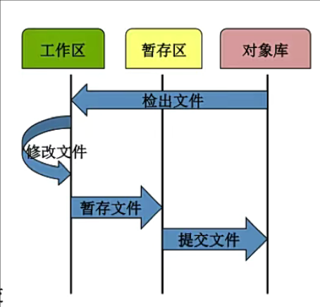
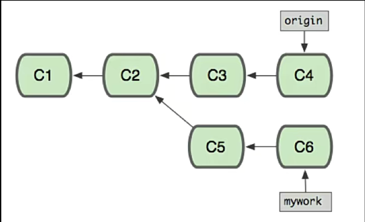

# 1. 简介
- git官方网站：[Git (git-scm.com)](https://git-scm.com/)

# 2.Git入门
## 2.1.Git介绍
自诞生于2005年以来，Git日渐完善，它的速度很快，极其适合管理大型项目，它还有着令人难以置信的非线性分支管理系统，可以应付各种复杂的项目开发需求。
- Git是一个版本控制软件，具有以下几点优点
	- 本地建立版本库
	- 本地版本控制
	- 多主机异地协同工作
	- 重写提交说明
	- 可以进行版本回退
	- 更好的提交列表
	- 更好的差异比较
	- 更完善的分支系统
	- 速度极快
- Github与GitLab都是用于管理版本的服务端软件
- GitLab用于在企业内部管理Git版本库，功能上类似于GitHub
## 2.2.Git工作模式
- 版本库初始化
	- 个人计算机从版本服务器同步
- 操作
	- 90%以上的操作在个人计算机上
	- 添加文件
	- 修改文件
	- 提交变更
	- 查看版本历史等
- 版本库同步
	- 将本地修改推送到版本服务器
	
- Git文件存储方式：以全量的方式管理文件，直接记录快照，而非差异比较
	
- Git文件状态
	- Git文件：已经被版本库管理的文件
	- 已修改：在工作目录修改Git文件
	- 已暂存：对已修改的文件执行Git暂存操作，将文件存入暂存区
	- 已提交：将已暂存的文件执行Git提交操作，将文件存入版本库
	
	
- 本地版本库与服务器版本库
	

## 2.3.Git常用命令
- 获得版本库
	- git init
	- git clone
- 版本管理
	- git add
		- `.`:提交所有文件，但会检查gitignore
		- `*`:提交所有文件，不会检查gitignore
	- git commit
		- 会对提交内容使用sha1计算出一个commitid
		- `git commit --amend -m 'mesge'`:修正上一条提交的信息
		- `git commit -am`：直接把全部修改过文件添加到暂存区并提交，但新增的文件不能
		- 执行命令时，git会创建一个commit对象，并且将这个commit对象的parent指针设置为HEAD所指向引用的SHA-1值
	- git rm：删除文件，本质和rm命令一致
		- 使用`git rm`后不需要再使用`git add`命令将修改添加在暂存区，使用`rm`的话仍然需要使用使用`git add`命令将修改添加在暂存区
		- 如果想将删除的文件恢复，可以使用`git reset HEAD filename`将文件从暂存区移除，再使用`git checkout -- fielname`将工作区中的修改丢弃
	- git mv
	- git branch：分支操作，不带参数则查看所有分支，带`*`为当前所在分支
	- git checkout
		- git checkout branchname:切换分支
- 查看信息
	- git help
	- git log：查看提交历史
		- -p：展开显示每次提交的内容差异
		- -n：只显示n条
		- --pretty=oneline|format:"%h"：指定格式进行输出
	- git diff
- 远程协作
	- git pull 
	- git push origin src:dest
- 设置信息：
	- git config alias.br branch:给branch命令设置一个br的别名
		- 可以把`branch`替换成`!branch`这样执行的时候会把前面的git去掉，相当于执行Linux命令
	- git config --global user.name "Your Name"
	- git config --global user.email you@example.com
	> 可以在三个地方进行设置，在提交文件时需要进行设置
	> 1. /etc/gitconfig(几乎不会使用) git config --system
	> 2. ~/.gitconfig git config --global
	> 3. 针对特定项目 .git/config git config --local
	
- 参数设置：
	- `git config core.igorecase false`：关闭忽略大小写

## 2.4.gitignore
在git中可以在.gitigore文件中编写一定的规则，让git管理时忽略一些文件。编写规则的语法如下：
```bash
以#号开始的表示注释
以/结尾表示目录
以*通配多个字符
以?通配单个字符
以[]包含单个字符的匹配列表
以!表示不忽略匹配到的文件或目录
```
.gitigore的规则读取方式是采用从上往下的顺序，所以如果上面的规则范围比较大，下面范围较小的规则则不会生效。

## 2.5.分支
分支是git中一个非常重要的概念。分支其实就是一条commit对象链(一条工作记录线)

有常见操作有以下几种：
- git branch \[branchname]: 查看/创建分支，带\*的为当前所在分支。
	- -d/-D：删除分支/如果分支上有未合并的操作
	- -m \<old> \<new>：修改分支名
	- --set-upstream-to=origin/master master：将本地分支和远程分支进行关联
- git checkout \[branchname]：切换分支
	- -b：创建并切换到分支
- git merge branch：合并分支
在git中，使用`HEAD`指向当前分支，信息存储在.git/HEAD中
快进合并：master没有做任何修改，直接就是把master指向最新的提交。

三方合并：master和分支都做了操作，如果有冲突需要手动解决冲突再合并。有冲突的文件会变成下面这样。git会把这两个冲突节点和他们共同的祖先节点一起合并，称之为三方合并。解决完冲突后使用`git add filename`标记解决冲突，再使用`git commit`提交合并。


如果可能的话，合并分支时Git会使用fast-forward模式，这种模式下，删除分支时会丢掉分支信息。可以在合并时加上`--no-ff`参数会禁用fast-forward，这样会多出一个`commit id`。
由于Git其实就是由一条提交链组成的，所以我们可以回退到任意一个提交上。
- 回退到上一版本
	- git reset --hard HEAD^
	- git reset --hard HEAD~1
	- git reset --hard commit_id
- 回退到某一个版本
	- git reflog：查看历史操作记录，对于HEAD的任何修改都会该命令完整记录下来
## 2.6.checkout进阶与stash
- `git checkout -- filename`：丢弃工作区的更改，保持与暂存区内容一致
- `git check <commit id>`：切换HEAD位置
	- 切换当前到任意历史节点上，但这次切换是游离的HEAD，意味着如果做了任何操作都需要提交才能切换回master上
	- 切换回master后可以使用`git branch <new-branch-name> <commit id>`来使用这个游离的节点创建一个分支
- `git stash`：将分支上正在进行的工作进行保存，用来临时保存未经过测试不能提交的修改
	- save "com"：为保存添加说明
	- list：列出保存的列表
	- pop/apply \<stash id>：将最新保存的工作回复并删除记录/不删除
	- 使用apply后可以使用`git stash drop <stash id>`进行删除记录
## 2.7.标签与diff
git中有两种标签，一种是轻量级标签(lightweight)与带有附注标签(annotated)
- `git tag`:查看标签
- `git tag -l 'patter'`:查找标签
- `git tag v1.0.0`:创建轻量级标签
- `git tag -a v1.0.2 -m 'release version'`:创建带附注的标签
- `git tag -d tag_name`:删除标签
- `git show v1.0`：查看标签详细信息
- `git push origin tag[..tag]/--tags HEAD`：推送标签/全部标签和内容
- `git fetch origin tag v7.0`：拉取一个tag
- `git push prigin :refs/tags/v6.0`/`git push origin --delete tag v5.0`：删除远程标签
在git中可以使用`git blame filename`查看文件具体都是由谁修改提交的。
在git中可以使用`git diff`比较暂存区与工作区的内容。
```bash
[drain@localhost tt]$ git diff
diff --git a/2 b/2  # a/2为暂存区内存，为源文件
index 0cfbf08..4792e70 100644
--- a/2
+++ b/2
@@ -1 +1,2 @@ # 源文件只有一行，目标文件从第一行开始有两行
 2 # 代表一样的内容
+3 # 代表源文件加上这一行后会和目标文件一致
```
也可以使用`git diff HEAD`比较最新提交内容与工作区的差异，或使用`git diff <commit id>`指定提交内容比较。或使用`git diff --cached commit_id`比较提交内容和暂存区的差异。
## 2.8.远程仓库
使用远程仓库时有以下几个关键命令
- push：推送
	- -u origin \<branchname>:推送本地同名分支到远程分支，绑定后可以只执行`git push`推送
- pull：拉取，同时会执行合并
	- pull=fetch+merge
- `git remote add origin <url>`：添加远程仓库
	- show \<remotename>:不带名字列出所有远程仓库别名，带名字列出具体远程仓库详细信息。执行命令的时候会读取远程仓库信息
	- url可以是https形式的，也可以是ssh形式的，ssh形式需要将主机的公钥添加到仓库中
	- prune origin：清除失效的远程追踪分支
	- set-url origin url：替换指定远程仓库的url
	- remove origin：去除本地关于远程仓库的配置信息
	- -v：查看远程仓库的地址信息
- `git config --global push.default simple`:在没有指定分支名称时`git push`应该推送那些分支，simple会默认推送到使用`git pull`拉取的分支。
- `git clone <url> <dic>`:将远程仓库全部克隆下来，可以使用dic指定拉取下来的目录名

在我们基于git进行开发的时候，可以遵循以下几个模型：
1. Gitflow：最佳实践，但比较复杂
2. 基于Git分支的开发模型：
	1. develop分支(频繁变化的一个分支)
	2. test分支(供产品和测试等人员使用的分支，变化不是特别频繁)
	3. master分支(生产发布分支，变化不频繁)
	4. bugfix(hotfix)分支(生产系统当中出现了紧急bug，用于紧急修复的分支)

### 2.8.1.远程分支&refspec
当我们把本地的分支推送到远程仓库但远程仓库并没有跟本地分支同名的分支，这个时候就会报错，我们可以使用以下命令避免报错
- `git push --set-upstream origin develop`:本地分支 `develop` 推送到远程仓库 `origin`，并设置远程分支与本地分支之间的上游跟踪关系。
在其他协作者新建并上传新的分支后，在本地使用`git pull`会把这个新远程分支也拉取下来，跟`origin/main`一样，所以这个时候本地要基于这个远程分支创建一个本地分支与之对应`git checkout -b origin/develop`/`git checkout --track origin/develop`

如果想要删除远程分支，可以使用`git push origin :dest`/`git push origin --delete dest`，这将删除远程的dest分支。

`Refspec` 是 `Reference Specification` 的缩写，用于在执行 `push` 或 `fetch` 操作时指定本地引用（如分支或标签）与远程引用之间的映射关系。通常，它描述了本地分支或标签与远程库中对应分支或标签之间的关联。

在 Git 中，`refs/heads/` 表示本地分支，`refs/remotes/` 表示远程分支。`refs/heads/*` 匹配所有本地分支，`refs/remotes/origin/*` 匹配远程分支。

例如，以下是一个常见的 refspec，用于从远程库拉取所有分支到本地：
```
# +表示即使不能进行Fast-forward也强制更新远程分支信息
fetch = +refs/heads/*:refs/remotes/origin/*
```
这表示 Git 会将远程库上的所有分支（`refs/heads/*`）拉取到本地的远程分支（`refs/remotes/origin/*`）。如果你只想拉取远程库的 `master` 分支，可以修改为：
```
fetch = +refs/heads/master:refs/remotes/origin/master
```

此外，你还可以在命令行中指定特定的 refspec，例如：
```
$ git fetch origin master:refs/remotes/origin/mymaster
```
这将把远程库的 `master` 分支拉取到本地的 `origin/mymaster` 分支。

在缺省的情况下，`refspec`会被`git remote add`命令所自动生成，git会获取远端上refs/heads下的所有引用，并将他们写到本地的refs/remotes/origin目录下；所以，如果远端上有一个master分支，你在本地就可以通过下面几种方式来访问该分支历史：
1. git log origin/master
2. git log remotes/origin/master
3. git log refs/remotes/origin/master
4. 前两种方式是第三种的简略方式
## 2.9.Git协作
当设置了远程仓库后，在机器本地会维护一个`remotes/origin/main`分支，这个分支会记录远程仓库的最新提交，只有在有拉取和推送动作的时候，这个分支才会更新。可以使用`git branch -av`查看，且使用`git status`时，你可能会看到以下几种信息
```bash
Your branch is up to date with 'origin/main'. # 本地仓库和远程仓库状态一致
Your branch is ahead of 'origin/main' by 1 commit. # 你的本地仓库和远程仓库不一致
```
当使用`git push`的时候，如果跟远程仓库执行的是快进合并的话，没有任何问题，但如果有合并冲突，则必须先执行一次`git pull`，在本地解决完冲突后再推送到远程仓库。


## 2.10.git gc

## 2.11.git目录
- HEAD：文本文件，记录当前所在分支，可以手动修改，但不推荐
```
ref: refs/heads/main
```
- ORIG_HEAD：文本文件，记录远程仓库所处位置
```
3716de57bef8ec0a3b7b45932ceae9f7488806f9
```
- FETCH_HEAD：文本文件，记录从远程拉取的分支
```
60b9b0994ff1f6a8b9e8db7ce0a908cdca315130                branch 'main' of https://github.com/AYO-Al/markdown
```
- refs：目录
	- heads：目录，记录当前本地分支信息，里面的文件都记录着每个分支的commitid
	- remotes：目录，记录远程分支信息
	- tags：目录，存储所有标签信息
## 2.12.Git裸库与submodule
- 裸库：没有工作区的git仓库，仅仅用来存放和中转提交的代码和文件，一般在服务端使用，使用`git init --bare`
- Git 的 Submodule 是一种在一个 Git 仓库中包含另一个 Git 仓库的方法。使用 submodule，可以将一个外部项目作为子项目嵌入到主项目中。这在项目依赖于其他项目或库时非常有用，因为它允许你在保持子项目独立的同时，也可以方便地进行版本管理。常用操作如下：
	- 添加submodule：`git submodule add url path`。path事先不能存在否则报错。添加成功后会在仓库多出一个`.gitmodules`的文件记录子模块相关信息。
	- 如果克隆一个包含submodule的仓库，需要先初始化submodule：`git submodule init`
	- 初始化后还需要获取submodule的数据：`git submodule update`/`git submudole foreach git pull`
		- git submodule update只会更新.gitmodules记录的提交
		- git submudole foreach git pull会遍历所有submodule目录执行pull
	- 如果不想执行以上两步操作，可以直接使用`git clone --recurse-submodules/--recursive url`来自动初始化和更新数据
	- 在子模块更新后，可以直接在子模块目录下执行`git pull origin main`拉取最新提交
	- 在git中没有一个命令可以直接删除submodule，要手动执行一系列动作删除submodule
		- 删除.gitmodules文件
		- 在.git/中移除对应的submodule信息
		- 删除子模块目录
		- 在git缓存中移除子模块追踪：`git rm --cache path`
		- 提交更改即可
## 2.12.subtree
subtree和submodule要解决的问题是一样的，都是为了引用另外的仓库，但subtree可以双向修改，也就是可以在父仓库中修改子仓库的代码，推荐使用subtree。常用操作如下：
- 添加子仓库：`git subtree add --prefix=subtree url branch <--squash>`。squash会把子仓库的所有提交合并成一个新的提交。当add的时候使用了squash，那么后续所有命令都要使用squash。
- 拉取更新：`git subtree pull --prefix=<directory> <repository-url> <branch>`
	- 有可能会出现子仓库修改后，主仓库合并会提示冲突。这是因为在三方合并时，git没有找到共同的parent节点导致的。
- 推送更改：`git subtree push --prefix=<directory> <repository-url> <branch>`
- 合并subtree：`git subtree merge --prefix=<directory> <repository-url> <branch>
- 将子目录内容分离成一个独立的仓库：`git subtree split --prefix=<directory> --branch=<new-branch>`
## 2.13.cherry-pick
`git cherry-pick` 是一个非常有用的 Git 命令，它允许你选择一个或多个特定的提交并将它们应用到当前分支。它在处理特定功能、错误修复或从一个分支提取特定更改时特别有用。常用操作如下：
- `git cherry-pick <commit-hash>`：将提交转移到本分支中。
- 如果有冲突，需执行以下流程：
	- 手动编辑冲突文件，并执行`git add <conflicted-file>`
	- 继续操作：`git cherry-pick --continue`
## 2.14.rebase
- rebase：变基，即改变分支的根基
`git rebase` 是 Git 中一个强大的命令，用于将一个分支上的提交重新应用到另一个基底提交之上。与 `git merge` 相比，`git rebase` 可以创建一个更直线化的提交历史。
- merge作用如下图

- rebase作用如下图
	- 使用rebase合并后，会把c5、c6删除，导致仓库的提交变成一条直线，实际上是把另一条分支的提交作用到主分支上

- 感觉上有点像`cherry-pick`命令，所以解决冲突的方式也和`cherry-pick`类似
	- 把命令改为`git rebase --continue`
	- 终止命令为：`hgit rebase --abort`
	- 以变基分支改动为准：`git rebase --skip`
- 不要对master分支执行rebase，因为会修改提交历史，会出现很多问题
- 一般来说，执行rebase的分支都是自己的本地分支，没有推送到远程版本库
- 一般来说，如果我们要把bugfix分支变基到main上，使用rebase流程如下：
	- 先把分支切换到要变基的分支，也就是bugfix
	- 再使用`git rebase main`，如有冲突要解决完冲突
	- 再切换到main分支，使用`git rebase bugfix`，使HEAD快进到变基后的bugfix节点
