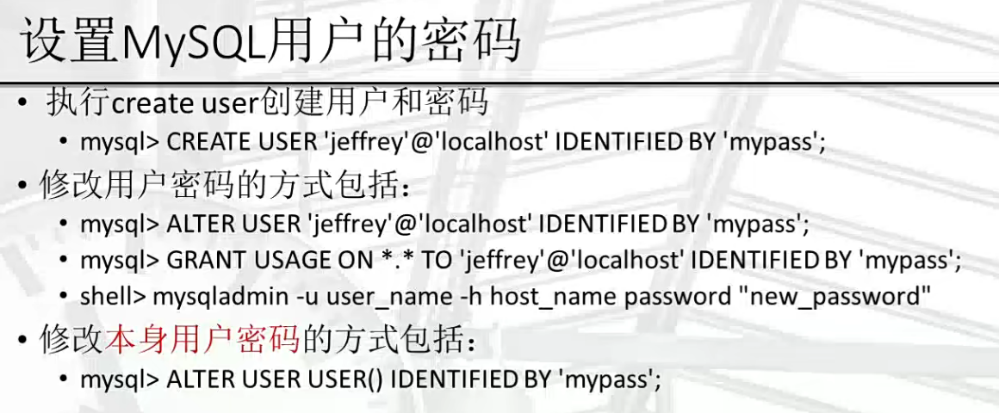

# 1.数据库介绍

- 数据+库：将信息(数据)按照计算机可识别的方式规则存放在磁盘库中，并提供一系列可供读写的方式
- 相比较于磁盘文件，数据库最大的特点是提供了非常灵活的接口、可以获取完整数据或则特定部分数据的方式；并提供了一套完整管理数据的方法(存储结构，备份恢复等)
- 为什么要存储数据？
  - 数据要被随时随地的反复使用，不是一次性消耗品
  - 数据要被记录，防止遗忘

## 1.数据库类型

- 关系型数据库
  - 目前市场上占主要份额的数据库类型，以二维表格(行和列)来存储数据，表格和表格之间的数据关系用字段引用来表示
- 非关系型数据库
  - 出现时间较短，抛弃关系型死板的数据存储方式，提供了更加灵活的方式
  - 面向高性能并发读写的key-value数据库
    - key-value数据库的主要特点即使具有极高的并发读写性能，Redis就是这类代表
  - 面向海量数据访问的文档型数据库
    - 可以在海量的数据中快速的查询数据，以MongoDB为代表
  - 面向可扩展性的分布式数据库
    - 这类数据库想解决的问题就是传统数据库存在可扩展性上的缺陷，以Cassandra为代表

##  2.MySQL数据库介绍

- MySQL是一种开发源代码的关系型数据库管理系统(RDBMS)
- MySQL数据库系统使用常用的数据库管理语言---**结构化查询语言**(SQL)进行数据库管理
- 体积小、速度快、总体拥有成本低，尤其是开发源码这一特点，使得许多企业选择了MySQL作为数据库


## 3.数据库工程师职责

- 数据库开发工程师
  - 负责公司业务数据库系统的模型设计，表结构设计
  - 负责数据处理中的语句实现，存储过程逻辑实现
  - 负责指导开发人员对语句的性能优化和指导
- 数据库管理员(DBA)
  - 负责公司业务数据库系统的部署实现
  - 负责数据库系统的高可用性，备份恢复，性能调优，监控等实现
- 数据库架构师
  - 统筹公司业务数据库系统各个层面的技术实现
  - 指导数据库开发工程师和管理员在各个环节的工作，提供更优的方案

## 4.MySQL下载

- 下载地址：[MySQL](https://dev.mysql.com/downloads/)

- 下载正确的tar包


- 在成功登录mysql之后，需要修改初始密码，否则不能执行命令

  ```bash
  alter user user() identified 'passwd' # user()：内置函数，返回当前用户
  ```

## 5.如何在一台机器上启多个MySQL服务呢？

- 修改配置文件

  ```bash
  [mysqld]
  basedir=/data/mysql
  datadir=/data/mysql/data
  port=3307    # 修改端口
  socket=/tmp/mtsql.sock # 修改socket文件
  mysqlx_port=33060   # 修改mysqlx端口
  mysqlx_socket=/tmp/mysqlx.sock # 修改mysqlx socket
  ```

- 启动时指定配置文件

  ```bash
  bin/mysqld --defaults-file=/etc/my3307.cnf --user=mysql
  ```

## 6.MySQL相关启动参数

- basedir=/usr/local/mysql：MySQL安装路径
- datadir=/data：数据文件路径
- port=3306：端口
- log-error=/tmp/mysql.error：启动和错误日志
- bind-address(默认是*)：监听的IP地址
- character-set-server(默认是latin1)：指定字符集
- collation-server(latin1_swedish_ci)：指定排序规则
- default-storage-engine(InnoDB)：指定默认存储引擎
- default-time-zone：指定默认时区
- open-files-limit(5000)：指定Mysqld运行过程中可以打开的文件数
- pid-file：指定mysqld进程对应的程序ID文件，默认在数据文件目录里
- skip-grant-tables：指定避开MySQL内部的权限表启动服务
- tmpdir：指定临时表文件的存放路径


# 2.MySQL基础命令

## 1.MySQL权限认证

- 权限系统的作用是授予来自**某个主机**的**某个用户**可以查询、插入、修改、删除等数据库操作的权限
- 不能明确的指定拒绝某个用户的连接
- 权限控制的执行语句包括create user，grant，revoke
- 授权后的权限都存放在MySQL的内部数据库中(mysql库)，并在数据库启动之后把权限信息**复制到内存**中
- MySQL用户的认证信息包括用户名和主机（以下不是同一个用户）
  - SHOW GRANTS FOR 'JOKE'@'www.baidu.com'
  - SHOW GRANTS FOR 'JOKE'@'www.baidu.cn'


- 使用`show privileges;`可以查看能赋予的权限

- 创建用户

  ```mysql
  create user user@host identified by 'pass';
  ```

- 赋予权限

  ```mysql
  grant all on *.* to user@host with grant option;
  # all表示所有权限，可以指定具体权限，可以使用'show privileges;'查看
  # *.*第一个*表示那个库，第二个*表示那个表，可以指定具体的库表
  # with grant option表示该用户可以赋予别人相同的权限
  # grant select(id) on mysql.user to user@host;可以指定查那个字段的权限
  ```

- 删除权限

  ```mysql
  revoke all on *.* from user@host;
  ```

### 1.权限详解


## 2.设置MySQL用户的密码



**请注意：在MySQL8.0之后不支持用`grant`命令修改密码**

- 创建用户时设置密码

```bash
# with指定用户身份验证方法
create user 'user'@'host' identified WITH 'mysql_native_password' by 'passwd'
```

- 创建用户后设置密码

```bash
alter user 'user'@'host' identified  WITH 'mysql_native_password' by 'passwd'
```

- mysql查看身份验证方法

```mysql
mysql> select user,host,plugin from mysql.user where user='root';
```

- 身份验证方法

```
mysql_native_password：
这是MySQL的传统身份验证方法。
密码以散列形式存储在MySQL的mysql.user表中。
大多数MySQL用户在使用此方法。

caching_sha2_password：
这是MySQL 8.0版本引入的一种新的身份验证方法。
密码以散列形式存储在mysql.user表中，使用SHA-256算法。
支持更强大的安全性，适用于新的安全标准。

sha256_password：
与caching_sha2_password 类似，是MySQL 5.6.6版本引入的。
使用SHA-256算法存储密码散列。

authentication_windows_client：
用于Windows平台，使用Windows客户端进行身份验证。
用户的身份验证依赖于Windows用户凭据。

authentication_ldap_simple 和 authentication_ldap_sasl：
这两种方法允许MySQL连接到LDAP服务器进行身份验证。
authentication_ldap_simple 使用简单的LDAP身份验证，而 authentication_ldap_sasl 使用SASL身份验证。
```

- 查看密码规则

```sql
# 在mysql中使用validate插件管理密码策略 
show variables like "validate%";

# 这个参数定义了在密码更改时，新密码与旧密码相比必须有多少百分比的字符变化。在这里，设置为 0 表示新密码必须与旧密码完全不同
validate_password.changed_characters_percentage,0
# 如果设置为 OFF，则禁用了检查密码是否包含与用户名相同的字符或序列的功能。
validate_password.check_user_name,OFF
# 这个参数定义了密码验证时要使用的字典文件的路径。在这里，设置为空字符串表示不使用字典文件。
validate_password.dictionary_file,""
# 这个参数定义了密码长度，0表示可以为空
validate_password.length,0
# 定义了密码中必须包含的大写和小写字符的最小数量。在这里，设置为 0 表示密码可以不包含混合大小写字符
validate_password.mixed_case_count,0
# 定义了密码中必须包含的数字的最小数量。在这里，设置为 0 表示密码可以不包含数字
validate_password.number_count,0
# 定义了密码强度策略的级别，可选值包括 LOW、MEDIUM 和 STRONG。在这里，设置为 LOW 表示使用较低的密码策略
validate_password.policy,LOW
# 定义了密码中必须包含的特殊字符的最小数量。在这里，设置为 0 表示密码可以不包含特殊字符。
validate_password.special_char_count,0
```

## 3.设置MySQL用户密码过期策略


# 3.SQL

## 1.SQL

- SQL通用语法

  - SQL语句可以单行或多行书写，以分号结尾
  - SQL语句可以使用空格/缩进来增强语句的可读性
  - MySQL数据库的SQL语句不区分大小写，关键字建议使用大写
  - 注释：
    - 单行注释：-- 注释内容或#注释内容
    - 多行注释：/* 注释内容 */

  - SQL分类

  | 分类 | 全称                       | 说明                                                     |
  | ---- | -------------------------- | -------------------------------------------------------- |
  | DDL  | Data Definition Language   | 数据库定义语言，用来定义数据库对象(数据库，表，字段)     |
  | DML  | Data Manipulation Language | 数据库操作语言，用来对数据库表中的数据进行增删改         |
  | DQL  | Data Query Language        | DML的子集，数据库查询语言，用来查询数据库中表的记录      |
  | DCL  | Data Control Language      | 数据库控制语言，用来创建数据库用户，控制数据库的访问权限 |


## 2.数据类型

MySQL中的数据类型有很多，主要分为三个类：数值类型、字符串类型、日期时间类型

- 数值类型

| 类型         | 大小                                     | 有符号范围（SIGNED）                                         | 无符号范围（UNSIGNED）                                       | 用途            |
| :----------- | :--------------------------------------- | :----------------------------------------------------------- | :----------------------------------------------------------- | :-------------- |
| TINYINT      | 1 Bytes                                  | (-128，127)                                                  | (0，255)                                                     | 小整数值        |
| SMALLINT     | 2 Bytes                                  | (-32 768，32 767)                                            | (0，65 535)                                                  | 大整数值        |
| MEDIUMINT    | 3 Bytes                                  | (-8 388 608，8 388 607)                                      | (0，16 777 215)                                              | 大整数值        |
| INT或INTEGER | 4 Bytes                                  | (-2 147 483 648，2 147 483 647)                              | (0，4 294 967 295)                                           | 大整数值        |
| BIGINT       | 8 Bytes                                  | (-9,223,372,036,854,775,808，9 223 372 036 854 775 807)      | (0，18 446 744 073 709 551 615)                              | 极大整数值      |
| FLOAT        | 4 Bytes                                  | (-3.402 823 466 E+38，-1.175 494 351 E-38)，0，(1.175 494 351 E-38，3.402 823 466 351 E+38) | 0，(1.175 494 351 E-38，3.402 823 466 E+38)                  | 单精度 浮点数值 |
| DOUBLE       | 8 Bytes                                  | (-1.797 693 134 862 315 7 E+308，-2.225 073 858 507 201 4 E-308)，0，(2.225 073 858 507 201 4 E-308，1.797 693 134 862 315 7 E+308) | 0，(2.225 073 858 507 201 4 E-308，1.797 693 134 862 315 7 E+308) | 双精度 浮点数值 |
| DECIMAL      | 对DECIMAL(M,D) ，如果M>D，为M+2否则为D+2 | 依赖于M和D的值                                               | 依赖于M和D的值                                               | 小数值          |

**如果想使用无符号数值类型，可以使用`int UNSIGNED `**指定

- 字符串类型

| 类型       | 大小                  | 用途                            |
| :--------- | :-------------------- | :------------------------------ |
| CHAR       | 0-255 bytes           | 定长字符串                      |
| VARCHAR    | 0-65535 bytes         | 变长字符串                      |
| TINYBLOB   | 0-255 bytes           | 不超过 255 个字符的二进制字符串 |
| TINYTEXT   | 0-255 bytes           | 短文本字符串                    |
| BLOB       | 0-65 535 bytes        | 二进制形式的长文本数据          |
| TEXT       | 0-65 535 bytes        | 长文本数据                      |
| MEDIUMBLOB | 0-16 777 215 bytes    | 二进制形式的中等长度文本数据    |
| MEDIUMTEXT | 0-16 777 215 bytes    | 中等长度文本数据                |
| LONGBLOB   | 0-4 294 967 295 bytes | 二进制形式的极大文本数据        |
| LONGTEXT   | 0-4 294 967 295 bytes | 极大文本数据                    |

- 日期时间类型

| 类型      | 大小 ( bytes) | 范围                                                         | 格式                | 用途                                                 |
| :-------- | :------------ | :----------------------------------------------------------- | :------------------ | :--------------------------------------------------- |
| DATE      | 3             | 1000-01-01/9999-12-31                                        | YYYY-MM-DD          | 日期值                                               |
| TIME      | 3             | '-838:59:59'/'838:59:59'                                     | HH:MM:SS            | 时间值或持续时间                                     |
| YEAR      | 1             | 1901/2155                                                    | YYYY                | 年份值                                               |
| DATETIME  | 8             | '1000-01-01 00:00:00' 到 '9999-12-31 23:59:59'               | YYYY-MM-DD hh:mm:ss | 混合日期和时间值。精确到毫秒。**不带时区信息**       |
| TIMESTAMP | 4             | '1970-01-01 00:00:01' UTC 到 '2038-01-19 03:14:07' UTC结束时间是第 **2147483647** 秒，北京时间 **2038-1-19 11:14:07**，格林尼治时间 2038年1月19日 凌晨 03:14:07 | YYYY-MM-DD hh:mm:ss | 混合日期和时间值，时间戳。精确到秒。**带有时区信息** |

- 枚举与集合类型（Enumeration and Set Types）

  - **ENUM**: 枚举类型，用于存储单一值，可以选择一个预定义的集合。`ENUM` 列的存储效率通常较高，因为它只需要存储一个值，而且内部表示是整数

  ```sql
  CREATE TABLE example (
      blood_type ENUM('A', 'B', 'AB', 'O')
  );
  ```

  - **SET**: 集合类型，用于存储多个值，可以选择多个预定义的集合。

  ```sql
  CREATE TABLE example (
      interests SET('Reading', 'Traveling', 'Sports')
  );
  ```

  


## 3.DDL语句

**DDL全称Data Definition Language，数据库定义语言，用来定义数据库对象(数据库，表，字段)**

- 查询

```sql
# 查询所有数据库/表
SHOW DATABASES/TABLES;

# 查询当前数据库
SELECT DATABASE();

# 查询表结构
DESC 表名;

# 查询指定表的建表语句
SHOW CREATE TABLE 表名
```

- 创建

```bash
# 创建数据库，可以指定字符集和排序规则
CREATE DATABASE [IF NOT EXISTS] database_name [CHARACTER SET charset_name] [COLLATE collation_name];

# 创建表
CREATE TABLE IF NOT EXISTS `runoob_tbl`(
   `runoob_id` INT UNSIGNED AUTO_INCREMENT,
   `runoob_title` VARCHAR(100) NOT NULL,
   `runoob_author` VARCHAR(40) NOT NULL,
   `submission_date` DATE,
   PRIMARY KEY ( `runoob_id` )
)ENGINE=InnoDB DEFAULT CHARSET=utf8mb4 COLLATE utf8mb4_general_ci;
```

- 修改

```sql
# 添加字段
ALTER TABLE 表名 ADD 字段名 类型(长度) [COMMANT 注释][约束];

# 修改数据类型
ALTER TABLE 表名 MODIFY 字段名 新类型(长度);

# 修改字段
ALTER TABLE 表名 CHANGE 旧字段名 新字段名 类型(长度) [COMMANT 注释][约束];

# 删除字段
ALTER TABLE 表名 DROP 字段名;

# 修改表名
ALTER TABLE 表名 RENAME TO 新表名;
```

- 删除

``` sql
# 删除数据库
DROP DATABASE [IF EXISTS] 数据库名;

# 删除表
drop table [IF EXISTS] 表名;
truncate table 表名
```

- 切换数据库

```sql
USE 数据库名
```

## 4.DML语句

**DML全称Data Manipulation Language ， 数据库操作语言，用来对数据库表中的数据进行增删改**

- 添加数据

```sql
# 值和字段的顺序一一对应
INSERT INTO 表名(字段1,字段2...) VALUES(值1.值2...);

# 如果对整个字段进行插入，可以省略字段
INSERT INTO 表名 VALUES(值1.值2...);

# 也可以插入多条记录
INSERT INTO 表名 VALUES(值1.值2...),(值1.值2...)...;
```

- 修改数据

```sql
UPDATE 表名 set 字段=值1,字段=值2... [where 字段=值]
# 如果不用where做限制，会修改所有行
```

- 删除数据

```
delete from 表名 [where 字段=值]
```

`truncate`和`delete`都可以删除数据，它们的区别在哪呢？

- `TRUNCATE` 用于删除表中的所有数据，但保留表的结构，不删除表本身
- `TRUNCATE` 是一个DDL语句（数据定义语言），它比 `DELETE` 更快，因为它不是逐行删除数据，而是直接释放表所占用的数据页
- `DELETE` 用于从表中删除特定的行，也可以删除所有行
- `DELETE` 是一个DML语句（数据操作语言），它逐行删除数据，可能比 `TRUNCATE` 慢，尤其是在删除大量数据时
- `truncate`释放所占用的空间，不可恢复；`delete`不释放表所占用空间，可以使用事务进行回滚

## 5.DQL语句

**DQL全称Data Query Language，DML的子集，数据库查询语言，用来查询数据库中表的记录**

- DQL语法

```sql
SELECT
	字段列表
FROM
	表名
WHERE
	条件列表
GROUP BY
	分组字段列表
HAVING
	分组后条件列表
ORDER BY
	排序字段列表
LIMIT
	分页参数
```

### 1.基本查询

```sql
# 查询多个字段
SELECT 字段1,字段2,字段3... FROM 表名;

# 查询所有字段
SELECT * FROM 表名;

# 也可以给查询字段设置别名
SELECT 字段1 [AS 别名1]... FROM 表名;

# 也可以去除重复记录
SELECT DISTINCT 字段列表 FROM 表名;
```

### 2.条件查询

- 语法

```sql
SELECT 字段列表 FROM 表名 WHERE 条件列表;
```

- 条件运算符

| 运算符           | 说明                                  |
| ---------------- | ------------------------------------- |
| >                | 大于                                  |
| >=               | 大于等于                              |
| <                | 小于                                  |
| <=               | 小于等于                              |
| =                | 等于                                  |
| <>或!=           | 不等于                                |
| BETWEEN...AND... | 在某个范围之内(含边界值)              |
| IN(...)          | 包含在in之后的列表                    |
| LIKE 占位符      | 模糊匹配(_匹配一个字符,%匹配任意字符) |
| IS NULL          | 是NULL                                |
| IS NOT NULL      | 不是NULL                              |
| AND或&&          | 与                                    |
| OR或\|\|         | 或                                    |
| NOT或!           | 非                                    |

### 3.聚合函数

聚合函数是将一列数据作为一个整体，进行纵向计算，NULL值不参与聚合函数运算

- 语法

```sql
SELECT 聚合函数(字段列表) FROM 表名;
```

- 常见的集合函数

| 函数  | 说明     |
| ----- | -------- |
| count | 统计数量 |
| max   | 最大值   |
| min   | 最小值   |
| avg   | 平均值   |
| sum   | 求和     |

### 4.分组查询

- 语法

```sql
SELECT 字段列表 FROM 表名 [WHERE 条件] GROUP BY 分组字段 [HAVING 分组后的过滤条件]
```

- where与having区别
  - 执行时机不同：where是分组之前进行过滤，不满足where条件不参数分组；而having是分组之后对结果进行过滤

  - 判断条件不同：where不能对聚合函数进行判断，而having可以
  - 过滤对象：WHERE 过滤的是表中的行，它作用在每一行上。HAVING 过滤的是分组后的结果，它作用在聚合值上。

**SQL 的严格模式 `ONLY_FULL_GROUP_BY` 引起的，它要求在使用 `GROUP BY` 子句时，`SELECT` 列表中的每个列都要么是一个聚合函数（例如 `COUNT`、`SUM`、`AVG` 等），要么包含在 `GROUP BY` 子句中**

```bash
# 根据性别分组，统计男女员工数量
SELECT sex,count(*) FROM emp group by sex;
# 查询年龄小于45的员工，并根据员工工作地址分组，获取员工数量大于等于3的工作地址
select address,count(*) FROM emp where age>45 group by address having count(*)>=3
```

- 执行顺序
  - where > 聚合函数 > having
  - 分组之后，查询的字段一般为聚合函数和分组字段，查询其他字段无意义

### 5.排序查询

MySQL中的排序操作在内存中完成，大数据排序可以面临着内存空间不足的问题。在排序过程中，可以使用`sort_buffer_size`来控制排序操作使用的内存。排序操作比较消耗内存，所以可以考虑使用索引排序，也就是`order by index`。

- 语法

```sql
SELECT 字段列表 FROM 表名 ORDER BY 字段1 排序方式1,字段2 排序方式2...
```

- 排序方式
  - ASC：升序(默认)
  - DESC：降序

**如果是多字段排序，当第一个字段相同时，才回使用第二个字段进行排序。**

### 6.分页查询

- 语法

```bash
SELECT 字段列表 FROM 表名 LIMIT 起始索引,查询记录数;
```

- 起始索引从0开始，起始索引=(查询页码-1)*每页显示记录数
- 分页查询时数据库的方言，不同数据库有不同的实现
- 如果查询的是第一个数据，可以省略起始索引


### 7.DQL执行顺序


DQL（Data Query Language）语句的执行顺序包括以下步骤。这些步骤用于从数据库中检索数据，并确保结果按照指定的顺序和条件返回：

1. **FROM 子句：**
   - 查询从 FROM 子句中指定的表中获取数据。这是查询的起点。
2. **WHERE 子句：**
   - WHERE 子句用于对行进行条件过滤。只有符合 WHERE 子句中条件的行才会被包括在结果中。
3. **GROUP BY 子句：**
   - 如果有 GROUP BY 子句，数据将按照 GROUP BY 子句中指定的列进行分组。这导致对每个组应用后续的聚合函数。
4. **HAVING 子句：**
   - 如果有 HAVING 子句，它将在 GROUP BY 子句后用于筛选分组后的结果。只有满足 HAVING 子句中条件的组才会被包括在结果中。
5. **SELECT 子句：**
   - SELECT 子句用于选择要包括在结果中的列。这是确定最终输出的列的阶段。在这一步中，可以使用聚合函数（如 SUM、COUNT、AVG 等）对每个分组的结果进行计算。
6. **ORDER BY 子句：**
   - 如果有 ORDER BY 子句，数据库将对结果进行排序。这决定了结果集的顺序。
7. **LIMIT 子句：**
   - 如果有 LIMIT 子句，它将用于限制结果的数量。只有满足前面所有条件的行中的一部分将被返回。

## 4.DCL

DCL全称Data Control Language，数据库控制语言，用来创建数据库用户，控制数据库的访问权限。

### 1.用户管理

- 查询用户

```sql
use mysql;
select * from user;
```

- 创建用户

```sql
create user '用户名'@'主机名' identified by ‘密码’;
```

- 修改用户密码

```sql
alter user '用户名'@'主机名' identified with mysql_native_password by '新密码';
# identified with mysql_native_password:指定使用mysql_native_password密码验证插件
```

- 删除用户

```sql
drop user '用户名'@'主机名';
```

**MySQL用户主机部分可以使用%或_等通配符**

### 2.权限

- MySQL中常用权限


- 查询权限

```sql
show grants for '用户名'@'主机名';
```

- 授予权限

```sql
gtant 权限列表 on 数据库名.表名 TO '用户名'@'主机名';
```

- 删除权限

```sql
revoke 权限列表 on 数据库名.表名 TO '用户名'@'主机名';
```

## 5.正则

- 语法

```bash
SELECT column1, column2, ...
FROM table_name
WHERE column_name REGEXP 'pattern';
```

| 模式       | 描述                                                         |
| :--------- | :----------------------------------------------------------- |
| ^          | 匹配输入字符串的开始位置。如果设置了 RegExp 对象的 Multiline 属性，^ 也匹配 '\n' 或 '\r' 之后的位置。 |
| $          | 匹配输入字符串的结束位置。如果设置了RegExp 对象的 Multiline 属性，$ 也匹配 '\n' 或 '\r' 之前的位置。 |
| .          | 匹配除 "\n" 之外的任何单个字符。要匹配包括 '\n' 在内的任何字符，请使用像 '[.\n]' 的模式。 |
| [...]      | 字符集合。匹配所包含的任意一个字符。例如， '[abc]' 可以匹配 "plain" 中的 'a'。 |
| [^...]     | 负值字符集合。匹配未包含的任意字符。例如， '[^abc]' 可以匹配 "plain" 中的'p'。 |
| p1\|p2\|p3 | 匹配 p1 或 p2 或 p3。例如，'z\|food' 能匹配 "z" 或 "food"。'(z\|f)ood' 则匹配 "zood" 或 "food"。 |
| *          | 匹配前面的子表达式零次或多次。例如，zo* 能匹配 "z" 以及 "zoo"。* 等价于{0,}。 |
| +          | 匹配前面的子表达式一次或多次。例如，'zo+' 能匹配 "zo" 以及 "zoo"，但不能匹配 "z"。+ 等价于 {1,}。 |
| {n}        | n 是一个非负整数。匹配确定的 n 次。例如，'o{2}' 不能匹配 "Bob" 中的 'o'，但是能匹配 "food" 中的两个 o。 |
| {n,m}      | m 和 n 均为非负整数，其中n <= m。最少匹配 n 次且最多匹配 m 次。 |
| \d         | 匹配一个数字字符。                                           |
| \w         | 匹配一个字母数字字符（包括下划线）。                         |
| \s         | 匹配一个空白字符。                                           |


# 4.函数

**函数**是指一段可以直接被另一段程序调用的程序或代码

## 1.字符串函数

| 函数                                  | 描述                                                         | 实例                                                         |
| :------------------------------------ | :----------------------------------------------------------- | :----------------------------------------------------------- |
| ASCII(s)                              | 返回字符串 s 的第一个字符的 ASCII 码。                       | 返回 CustomerName 字段第一个字母的 ASCII 码：`SELECT ASCII(CustomerName) AS NumCodeOfFirstChar FROM Customers;` |
| CHAR_LENGTH(s)                        | 返回字符串 s 的字符数                                        | 返回字符串 RUNOOB 的字符数`SELECT CHAR_LENGTH("RUNOOB") AS LengthOfString;` |
| CHARACTER_LENGTH(s)                   | 返回字符串 s 的字符数，等同于 CHAR_LENGTH(s)                 | 返回字符串 RUNOOB 的字符数`SELECT CHARACTER_LENGTH("RUNOOB") AS LengthOfString;` |
| **CONCAT(s1,s2...sn)**                | 字符串 s1,s2 等多个字符串合并为一个字符串                    | 合并多个字符串`SELECT CONCAT("SQL ", "Runoob ", "Gooogle ", "Facebook") AS ConcatenatedString;` |
| CONCAT_WS(x, s1,s2...sn)              | 同 CONCAT(s1,s2,...) 函数，但是每个字符串之间要加上 x，x 可以是分隔符 | 合并多个字符串，并添加分隔符：`SELECT CONCAT_WS("-", "SQL", "Tutorial", "is", "fun!")AS ConcatenatedString;` |
| FIELD(s,s1,s2...)                     | 返回第一个字符串 s 在字符串列表(s1,s2...)中的位置            | 返回字符串 c 在列表值中的位置：`SELECT FIELD("c", "a", "b", "c", "d", "e");` |
| FIND_IN_SET(s1,s2)                    | 返回在字符串s2中与s1匹配的字符串的位置                       | 返回字符串 c 在指定字符串中的位置：`SELECT FIND_IN_SET("c", "a,b,c,d,e");` |
| FORMAT(x,n)                           | 函数可以将数字 x 进行格式化 "#,###.##", 将 x 保留到小数点后 n 位，最后一位四舍五入。 | 格式化数字 "#,###.##" 形式：`SELECT FORMAT(250500.5634, 2);     -- 输出 250,500.56` |
| INSERT(s1,x,len,s2)                   | 字符串 s2 替换 s1 的 x 位置开始长度为 len 的字符串           | 从字符串第一个位置开始的 6 个字符替换为 runoob：`SELECT INSERT("google.com", 1, 6, "runoob");  -- 输出：runoob.com` |
| LOCATE(s1,s)                          | 从字符串 s 中获取 s1 的开始位置                              | 获取 b 在字符串 abc 中的位置：`SELECT LOCATE('st','myteststring');  -- 5`返回字符串 abc 中 b 的位置：`SELECT LOCATE('b', 'abc') -- 2` |
| LCASE(s)                              | 将字符串 s 的所有字母变成小写字母                            | 字符串 RUNOOB 转换为小写：`SELECT LCASE('RUNOOB') -- runoob` |
| LEFT(s,n)                             | 返回字符串 s 的前 n 个字符                                   | 返回字符串 runoob 中的前两个字符：`SELECT LEFT('runoob',2) -- ru` |
| **LOWER(s)**                          | 将字符串 s 的所有字母变成小写字母                            | 字符串 RUNOOB 转换为小写：`SELECT LOWER('RUNOOB') -- runoob` |
| **LPAD(s1,len,s2)**                   | 在字符串 s1 的开始处填充字符串 s2，使字符串长度达到 len      | 将字符串 xx 填充到 abc 字符串的开始处：`SELECT LPAD('abc',5,'xx') -- xxabc` |
| LTRIM(s)                              | 去掉字符串 s 开始处的空格                                    | 去掉字符串 RUNOOB开始处的空格：`SELECT LTRIM("    RUNOOB") AS LeftTrimmedString;-- RUNOOB` |
| MID(s,n,len)                          | 从字符串 s 的 n 位置截取长度为 len 的子字符串，同 SUBSTRING(s,n,len) | 从字符串 RUNOOB 中的第 2 个位置截取 3个 字符：`SELECT MID("RUNOOB", 2, 3) AS ExtractString; -- UNO` |
| POSITION(s1 IN s)                     | 从字符串 s 中获取 s1 的开始位置                              | 返回字符串 abc 中 b 的位置：`SELECT POSITION('b' in 'abc') -- 2` |
| REPEAT(s,n)                           | 将字符串 s 重复 n 次                                         | 将字符串 runoob 重复三次：`SELECT REPEAT('runoob',3) -- runoobrunoobrunoob` |
| REPLACE(s,s1,s2)                      | 将字符串 s2 替代字符串 s 中的字符串 s1                       | 将字符串 abc 中的字符 a 替换为字符 x：`SELECT REPLACE('abc','a','x') --xbc` |
| REVERSE(s)                            | 将字符串s的顺序反过来                                        | 将字符串 abc 的顺序反过来：`SELECT REVERSE('abc') -- cba`    |
| RIGHT(s,n)                            | 返回字符串 s 的后 n 个字符                                   | 返回字符串 runoob 的后两个字符：`SELECT RIGHT('runoob',2) -- ob` |
| **RPAD(s1,len,s2)**                   | 在字符串 s1 的结尾处添加字符串 s2，使字符串的长度达到 len    | 将字符串 xx 填充到 abc 字符串的结尾处：`SELECT RPAD('abc',5,'xx') -- abcxx` |
| RTRIM(s)                              | 去掉字符串 s 结尾处的空格                                    | 去掉字符串 RUNOOB 的末尾空格：`SELECT RTRIM("RUNOOB     ") AS RightTrimmedString;   -- RUNOOB` |
| SPACE(n)                              | 返回 n 个空格                                                | 返回 10 个空格：`SELECT SPACE(10);`                          |
| STRCMP(s1,s2)                         | 比较字符串 s1 和 s2，如果 s1 与 s2 相等返回 0 ，如果 s1>s2 返回 1，如果 s1<s2 返回 -1 | 比较字符串：`SELECT STRCMP("runoob", "runoob");  -- 0`       |
| SUBSTR(s, start, length)              | 从字符串 s 的 start 位置截取长度为 length 的子字符串         | 从字符串 RUNOOB 中的第 2 个位置截取 3个 字符：`SELECT SUBSTR("RUNOOB", 2, 3) AS ExtractString; -- UNO` |
| **SUBSTRING(s, start, length)**       | 从字符串 s 的 start 位置截取长度为 length 的子字符串，等同于 SUBSTR(s, start, length) | 从字符串 RUNOOB 中的第 2 个位置截取 3个 字符：`SELECT SUBSTRING("RUNOOB", 2, 3) AS ExtractString; -- UNO` |
| SUBSTRING_INDEX(s, delimiter, number) | 返回从字符串 s 的第 number 个出现的分隔符 delimiter 之后的子串。 如果 number 是正数，返回第 number 个字符左边的字符串。 如果 number 是负数，返回第(number 的绝对值(从右边数))个字符右边的字符串。 | `SELECT SUBSTRING_INDEX('a*b','*',1) -- a SELECT SUBSTRING_INDEX('a*b','*',-1)  -- b SELECT SUBSTRING_INDEX(SUBSTRING_INDEX('a*b*c*d*e','*',3),'*',-1)  -- c` |
| **TRIM(s)**                           | 去掉字符串 s 开始和结尾处的空格                              | 去掉字符串 RUNOOB 的首尾空格：`SELECT TRIM('    RUNOOB    ') AS TrimmedString;` |
| UCASE(s)                              | 将字符串转换为大写                                           | 将字符串 runoob 转换为大写：`SELECT UCASE("runoob"); -- RUNOOB` |
| **UPPER(s)**                          | 将字符串转换为大写                                           | 将字符串 runoob 转换为大写：`SELECT UPPER("runoob"); -- RUNOOB` |

## 2.数值函数

| 函数名                             | 描述                                                         | 实例                                                         |
| :--------------------------------- | :----------------------------------------------------------- | :----------------------------------------------------------- |
| ABS(x)                             | 返回 x 的绝对值                                              | 返回 -1 的绝对值：`SELECT ABS(-1) -- 返回1`                  |
| ACOS(x)                            | 求 x 的反余弦值（单位为弧度），x 为一个数值                  | `SELECT ACOS(0.25);`                                         |
| ASIN(x)                            | 求反正弦值（单位为弧度），x 为一个数值                       | `SELECT ASIN(0.25);`                                         |
| ATAN(x)                            | 求反正切值（单位为弧度），x 为一个数值                       | `SELECT ATAN(2.5);`                                          |
| ATAN2(n, m)                        | 求反正切值（单位为弧度）                                     | `SELECT ATAN2(-0.8, 2);`                                     |
| AVG(expression)                    | 返回一个表达式的平均值，expression 是一个字段                | 返回 Products 表中Price 字段的平均值：`SELECT AVG(Price) AS AveragePrice FROM Products;` |
| **CEIL(x)**                        | 返回大于或等于 x 的最小整数                                  | `SELECT CEIL(1.5) -- 返回2`                                  |
| CEILING(x)                         | 返回大于或等于 x 的最小整数                                  | `SELECT CEILING(1.5); -- 返回2`                              |
| COS(x)                             | 求余弦值(参数是弧度)                                         | `SELECT COS(2);`                                             |
| COT(x)                             | 求余切值(参数是弧度)                                         | `SELECT COT(6);`                                             |
| COUNT(expression)                  | 返回查询的记录总数，expression 参数是一个字段或者 * 号       | 返回 Products 表中 products 字段总共有多少条记录：`SELECT COUNT(ProductID) AS NumberOfProducts FROM Products;` |
| DEGREES(x)                         | 将弧度转换为角度                                             | `SELECT DEGREES(3.1415926535898) -- 180`                     |
| n DIV m                            | 整除，n 为被除数，m 为除数                                   | 计算 10 除于 5：`SELECT 10 DIV 5;  -- 2`                     |
| EXP(x)                             | 返回 e 的 x 次方                                             | 计算 e 的三次方：`SELECT EXP(3) -- 20.085536923188`          |
| **FLOOR(x)**                       | 返回小于或等于 x 的最大整数                                  | 小于或等于 1.5 的整数：`SELECT FLOOR(1.5) -- 返回1`          |
| GREATEST(expr1, expr2, expr3, ...) | 返回列表中的最大值                                           | 返回以下数字列表中的最大值：`SELECT GREATEST(3, 12, 34, 8, 25); -- 34`返回以下字符串列表中的最大值：`SELECT GREATEST("Google", "Runoob", "Apple");   -- Runoob` |
| INET_ATON(expr:varchar)            | 将一个IPV4地址转换为整数                                     | select inet_aton('192.168.2.204');                           |
| INET_NTOA(expr:int)                | 将一个整数转换为IPV4地址                                     | select inet_ntoa(3232236236);                                |
| LEAST(expr1, expr2, expr3, ...)    | 返回列表中的最小值                                           | 返回以下数字列表中的最小值：`SELECT LEAST(3, 12, 34, 8, 25); -- 3`返回以下字符串列表中的最小值：`SELECT LEAST("Google", "Runoob", "Apple");   -- Apple` |
| LN                                 | 返回数字的自然对数，以 e 为底。                              | 返回 2 的自然对数：`SELECT LN(2);  -- 0.6931471805599453`    |
| LOG(x) 或 LOG(base, x)             | 返回自然对数(以 e 为底的对数)，如果带有 base 参数，则 base 为指定带底数。 | `SELECT LOG(20.085536923188) -- 3 SELECT LOG(2, 4); -- 2`    |
| LOG10(x)                           | 返回以 10 为底的对数                                         | `SELECT LOG10(100) -- 2`                                     |
| LOG2(x)                            | 返回以 2 为底的对数                                          | 返回以 2 为底 6 的对数：`SELECT LOG2(6);  -- 2.584962500721156` |
| MAX(expression)                    | 返回字段 expression 中的最大值                               | 返回数据表 Products 中字段 Price 的最大值：`SELECT MAX(Price) AS LargestPrice FROM Products;` |
| MIN(expression)                    | 返回字段 expression 中的最小值                               | 返回数据表 Products 中字段 Price 的最小值：`SELECT MIN(Price) AS MinPrice FROM Products;` |
| **MOD(x,y)**                       | 返回 x 除以 y 以后的余数                                     | 5 除于 2 的余数：`SELECT MOD(5,2) -- 1`                      |
| PI()                               | 返回圆周率(3.141593）                                        | `SELECT PI() --3.141593`                                     |
| POW(x,y)                           | 返回 x 的 y 次方                                             | 2 的 3 次方：`SELECT POW(2,3) -- 8`                          |
| POWER(x,y)                         | 返回 x 的 y 次方                                             | 2 的 3 次方：`SELECT POWER(2,3) -- 8`                        |
| RADIANS(x)                         | 将角度转换为弧度                                             | 180 度转换为弧度：`SELECT RADIANS(180) -- 3.1415926535898`   |
| **RAND()**                         | 返回 0 到 1 的随机数                                         | `SELECT RAND() --0.93099315644334`                           |
| **ROUND(x [,y])**                  | 返回离 x 最近的整数，可选参数 y 表示要四舍五入的小数位数，如果省略，则返回整数。 | `SELECT ROUND(1.23456) --1 SELECT ROUND(345.156, 2) -- 345.16` |
| SIGN(x)                            | 返回 x 的符号，x 是负数、0、正数分别返回 -1、0 和 1          | `SELECT SIGN(-10) -- (-1)`                                   |
| SIN(x)                             | 求正弦值(参数是弧度)                                         | `SELECT SIN(RADIANS(30)) -- 0.5`                             |
| SQRT(x)                            | 返回x的平方根                                                | 25 的平方根：`SELECT SQRT(25) -- 5`                          |
| SUM(expression)                    | 返回指定字段的总和                                           | 计算 OrderDetails 表中字段 Quantity 的总和：`SELECT SUM(Quantity) AS TotalItemsOrdered FROM OrderDetails;` |
| TAN(x)                             | 求正切值(参数是弧度)                                         | `SELECT TAN(1.75);  -- -5.52037992250933`                    |
| TRUNCATE(x,y)                      | 返回数值 x 保留到小数点后 y 位的值（与 ROUND 最大的区别是不会进行四舍五入） | `SELECT TRUNCATE(1.23456,3) -- 1.234`                        |

## 3.日期函数

| 函数名                                            | 描述                                                         | 实例                                                         |
| :------------------------------------------------ | :----------------------------------------------------------- | :----------------------------------------------------------- |
| ADDDATE(d,n)                                      | 计算起始日期 d 加上 n 天的日期                               | `SELECT ADDDATE("2017-06-15", INTERVAL 10 DAY); ->2017-06-25` |
| ADDTIME(t,n)                                      | n 是一个时间表达式，时间 t 加上时间表达式 n                  | 加 5 秒：`SELECT ADDTIME('2011-11-11 11:11:11', 5); ->2011-11-11 11:11:16 (秒)`添加 2 小时, 10 分钟, 5 秒:`SELECT ADDTIME("2020-06-15 09:34:21", "2:10:5");  -> 2020-06-15 11:44:26` |
| **CURDATE()**                                     | 返回当前日期                                                 | `SELECT CURDATE(); -> 2018-09-19`                            |
| CURRENT_DATE()                                    | 返回当前日期                                                 | `SELECT CURRENT_DATE(); -> 2018-09-19`                       |
| CURRENT_TIME                                      | 返回当前时间                                                 | `SELECT CURRENT_TIME(); -> 19:59:02`                         |
| CURRENT_TIMESTAMP()                               | 返回当前日期和时间                                           | `SELECT CURRENT_TIMESTAMP() -> 2018-09-19 20:57:43`          |
| **CURTIME()**                                     | 返回当前时间                                                 | `SELECT CURTIME(); -> 19:59:02`                              |
| DATE()                                            | 从日期或日期时间表达式中提取日期值                           | `SELECT DATE("2017-06-15");     -> 2017-06-15`               |
| **DATEDIFF(d1,d2)**                               | 计算日期 d1->d2 之间相隔的天数                               | `SELECT DATEDIFF('2001-01-01','2001-02-02') -> -32`          |
| **DATE_ADD(d，INTERVAL expr type)**               | 计算起始日期 d 加上一个时间段后的日期，type 值可以是：MICROSECONDSECONDMINUTEHOURDAYWEEKMONTHQUARTERYEARSECOND_MICROSECONDMINUTE_MICROSECONDMINUTE_SECONDHOUR_MICROSECONDHOUR_SECONDHOUR_MINUTEDAY_MICROSECONDDAY_SECONDDAY_MINUTEDAY_HOURYEAR_MONTH | `SELECT DATE_ADD("2017-06-15", INTERVAL 10 DAY);     -> 2017-06-25 SELECT DATE_ADD("2017-06-15 09:34:21", INTERVAL 15 MINUTE); -> 2017-06-15 09:49:21 SELECT DATE_ADD("2017-06-15 09:34:21", INTERVAL -3 HOUR); ->2017-06-15 06:34:21 SELECT DATE_ADD("2017-06-15 09:34:21", INTERVAL -3 MONTH); ->2017-04-15` |
| DATE_FORMAT(d,f)                                  | 按表达式 f的要求显示日期 d                                   | `SELECT DATE_FORMAT('2011-11-11 11:11:11','%Y-%m-%d %r') -> 2011-11-11 11:11:11 AM` |
| DATE_SUB(date,INTERVAL expr type)                 | 函数从日期减去指定的时间间隔。                               | Orders 表中 OrderDate 字段减去 2 天：`SELECT OrderId,DATE_SUB(OrderDate,INTERVAL 2 DAY) AS OrderPayDate FROM Orders` |
| **DAY(d)**                                        | 返回日期值 d 的日期部分                                      | `SELECT DAY("2017-06-15");   -> 15`                          |
| DAYNAME(d)                                        | 返回日期 d 是星期几，如 Monday,Tuesday                       | `SELECT DAYNAME('2011-11-11 11:11:11') ->Friday`             |
| DAYOFMONTH(d)                                     | 计算日期 d 是本月的第几天                                    | `SELECT DAYOFMONTH('2011-11-11 11:11:11') ->11`              |
| DAYOFWEEK(d)                                      | 日期 d 今天是星期几，1 星期日，2 星期一，以此类推            | `SELECT DAYOFWEEK('2011-11-11 11:11:11') ->6`                |
| DAYOFYEAR(d)                                      | 计算日期 d 是本年的第几天                                    | `SELECT DAYOFYEAR('2011-11-11 11:11:11') ->315`              |
| EXTRACT(type FROM d)                              | 从日期 d 中获取指定的值，type 指定返回的值。 type可取值为： MICROSECONDSECONDMINUTEHOURDAYWEEKMONTHQUARTERYEARSECOND_MICROSECONDMINUTE_MICROSECONDMINUTE_SECONDHOUR_MICROSECONDHOUR_SECONDHOUR_MINUTEDAY_MICROSECONDDAY_SECONDDAY_MINUTEDAY_HOURYEAR_MONTH | `SELECT EXTRACT(MINUTE FROM '2011-11-11 11:11:11')  -> 11`   |
| FROM_DAYS(n)                                      | 计算从 0000 年 1 月 1 日开始 n 天后的日期                    | `SELECT FROM_DAYS(1111) -> 0003-01-16`                       |
| HOUR(t)                                           | 返回 t 中的小时值                                            | `SELECT HOUR('1:2:3') -> 1`                                  |
| LAST_DAY(d)                                       | 返回给给定日期的那一月份的最后一天                           | `SELECT LAST_DAY("2017-06-20"); -> 2017-06-30`               |
| LOCALTIME()                                       | 返回当前日期和时间                                           | `SELECT LOCALTIME() -> 2018-09-19 20:57:43`                  |
| LOCALTIMESTAMP()                                  | 返回当前日期和时间                                           | `SELECT LOCALTIMESTAMP() -> 2018-09-19 20:57:43`             |
| MAKEDATE(year, day-of-year)                       | 基于给定参数年份 year 和所在年中的天数序号 day-of-year 返回一个日期 | `SELECT MAKEDATE(2017, 3); -> 2017-01-03`                    |
| MAKETIME(hour, minute, second)                    | 组合时间，参数分别为小时、分钟、秒                           | `SELECT MAKETIME(11, 35, 4); -> 11:35:04`                    |
| MICROSECOND(date)                                 | 返回日期参数所对应的微秒数                                   | `SELECT MICROSECOND("2017-06-20 09:34:00.000023"); -> 23`    |
| MINUTE(t)                                         | 返回 t 中的分钟值                                            | `SELECT MINUTE('1:2:3') -> 2`                                |
| MONTHNAME(d)                                      | 返回日期当中的月份名称，如 November                          | `SELECT MONTHNAME('2011-11-11 11:11:11') -> November`        |
| **MONTH(d)**                                      | 返回日期d中的月份值，1 到 12                                 | `SELECT MONTH('2011-11-11 11:11:11') ->11`                   |
| **NOW()**                                         | 返回当前日期和时间                                           | `SELECT NOW() -> 2018-09-19 20:57:43`                        |
| PERIOD_ADD(period, number)                        | 为 年-月 组合日期添加一个时段                                | `SELECT PERIOD_ADD(201703, 5);    -> 201708`                 |
| PERIOD_DIFF(period1, period2)                     | 返回两个时段之间的月份差值                                   | `SELECT PERIOD_DIFF(201710, 201703); -> 7`                   |
| QUARTER(d)                                        | 返回日期d是第几季节，返回 1 到 4                             | `SELECT QUARTER('2011-11-11 11:11:11') -> 4`                 |
| SECOND(t)                                         | 返回 t 中的秒钟值                                            | `SELECT SECOND('1:2:3') -> 3`                                |
| SEC_TO_TIME(s)                                    | 将以秒为单位的时间 s 转换为时分秒的格式                      | `SELECT SEC_TO_TIME(4320) -> 01:12:00`                       |
| STR_TO_DATE(string, format_mask)                  | 将字符串转变为日期                                           | `SELECT STR_TO_DATE("August 10 2017", "%M %d %Y"); -> 2017-08-10` |
| SUBDATE(d,n)                                      | 日期 d 减去 n 天后的日期                                     | `SELECT SUBDATE('2011-11-11 11:11:11', 1) ->2011-11-10 11:11:11 (默认是天)` |
| SUBTIME(t,n)                                      | 时间 t 减去 n 秒的时间                                       | `SELECT SUBTIME('2011-11-11 11:11:11', 5) ->2011-11-11 11:11:06 (秒)` |
| SYSDATE()                                         | 返回当前日期和时间                                           | `SELECT SYSDATE() -> 2018-09-19 20:57:43`                    |
| TIME(expression)                                  | 提取传入表达式的时间部分                                     | `SELECT TIME("19:30:10"); -> 19:30:10`                       |
| TIME_FORMAT(t,f)                                  | 按表达式 f 的要求显示时间 t                                  | `SELECT TIME_FORMAT('11:11:11','%r') 11:11:11 AM`            |
| TIME_TO_SEC(t)                                    | 将时间 t 转换为秒                                            | `SELECT TIME_TO_SEC('1:12:00') -> 4320`                      |
| TIMEDIFF(time1, time2)                            | 计算时间差值                                                 | `mysql> SELECT TIMEDIFF("13:10:11", "13:10:10"); -> 00:00:01 mysql> SELECT TIMEDIFF('2000:01:01 00:00:00',    ->                 '2000:01:01 00:00:00.000001');        -> '-00:00:00.000001' mysql> SELECT TIMEDIFF('2008-12-31 23:59:59.000001',    ->                 '2008-12-30 01:01:01.000002');        -> '46:58:57.999999'` |
| TIMESTAMP(expression, interval)                   | 单个参数时，函数返回日期或日期时间表达式；有2个参数时，将参数加和 | `mysql> SELECT TIMESTAMP("2017-07-23",  "13:10:11"); -> 2017-07-23 13:10:11 mysql> SELECT TIMESTAMP('2003-12-31');        -> '2003-12-31 00:00:00' mysql> SELECT TIMESTAMP('2003-12-31 12:00:00','12:00:00');        -> '2004-01-01 00:00:00'` |
| TIMESTAMPDIFF(unit,datetime_expr1,datetime_expr2) | 计算时间差，返回 datetime_expr2 − datetime_expr1 的时间差    | `mysql> SELECT TIMESTAMPDIFF(DAY,'2003-02-01','2003-05-01');   // 计算两个时间相隔多少天        -> 89 mysql> SELECT TIMESTAMPDIFF(MONTH,'2003-02-01','2003-05-01');   // 计算两个时间相隔多少月        -> 3 mysql> SELECT TIMESTAMPDIFF(YEAR,'2002-05-01','2001-01-01');    // 计算两个时间相隔多少年        -> -1 mysql> SELECT TIMESTAMPDIFF(MINUTE,'2003-02-01','2003-05-01 12:05:55');  // 计算两个时间相隔多少分钟        -> 128885` |
| TO_DAYS(d)                                        | 计算日期 d 距离 0000 年 1 月 1 日的天数                      | `SELECT TO_DAYS('0001-01-01 01:01:01') -> 366`               |
| WEEK(d)                                           | 计算日期 d 是本年的第几个星期，范围是 0 到 53                | `SELECT WEEK('2011-11-11 11:11:11') -> 45`                   |
| WEEKDAY(d)                                        | 日期 d 是星期几，0 表示星期一，1 表示星期二                  | `SELECT WEEKDAY("2017-06-15"); -> 3`                         |
| WEEKOFYEAR(d)                                     | 计算日期 d 是本年的第几个星期，范围是 0 到 53                | `SELECT WEEKOFYEAR('2011-11-11 11:11:11') -> 45`             |
| **YEAR(d)**                                       | 返回年份                                                     | `SELECT YEAR("2017-06-15"); -> 2017`                         |
| YEARWEEK(date, mode)                              | 返回年份及第几周（0到53），mode 中 0 表示周天，1表示周一，以此类推 | `SELECT YEARWEEK("2017-06-15"); -> 201724`                   |

## 4.高级函数

| 函数名                                                       | 描述                                                         | 实例                                                         |
| :----------------------------------------------------------- | :----------------------------------------------------------- | :----------------------------------------------------------- |
| BIN(x)                                                       | 返回 x 的二进制编码，x 为十进制数                            | 15 的 2 进制编码:`SELECT BIN(15); -- 1111`                   |
| BINARY(s)                                                    | 将字符串 s 转换为二进制字符串                                | `SELECT BINARY "RUNOOB"; -> RUNOOB`                          |
| **CASE expression    WHEN condition1 THEN result1    WHEN condition2 THEN result2   ...    WHEN conditionN THEN resultN    ELSE result END** | CASE 表示函数开始，END 表示函数结束。如果 condition1 成立，则返回 result1, 如果 condition2 成立，则返回 result2，当全部不成立则返回 result，而当有一个成立之后，后面的就不执行了。 | `SELECT CASE  　WHEN 1 > 0 　THEN '1 > 0' 　WHEN 2 > 0 　THEN '2 > 0' 　ELSE '3 > 0' 　END ->1 > 0` |
| CAST(x AS type)                                              | 转换数据类型                                                 | 字符串日期转换为日期：`SELECT CAST("2017-08-29" AS DATE); -> 2017-08-29` |
| COALESCE(expr1, expr2, ...., expr_n)                         | 返回参数中的第一个非空表达式（从左向右）                     | `SELECT COALESCE(NULL, NULL, NULL, 'runoob.com', NULL, 'google.com'); -> runoob.com` |
| CONNECTION_ID()                                              | 返回唯一的连接 ID                                            | `SELECT CONNECTION_ID(); -> 4292835`                         |
| CONV(x,f1,f2)                                                | 返回 f1 进制数变成 f2 进制数                                 | `SELECT CONV(15, 10, 2); -> 1111`                            |
| CONVERT(s USING cs)                                          | 函数将字符串 s 的字符集变成 cs                               | `SELECT CHARSET('ABC') ->utf-8     SELECT CHARSET(CONVERT('ABC' USING gbk)) ->gbk` |
| CURRENT_USER()                                               | 返回当前用户                                                 | `SELECT CURRENT_USER(); -> guest@%`                          |
| DATABASE()                                                   | 返回当前数据库名                                             | `SELECT DATABASE();    -> runoob`                            |
| **IF(expr,v1,v2)**                                           | 如果表达式 expr 成立，返回结果 v1；否则，返回结果 v2。       | `SELECT IF(1 > 0,'正确','错误')     ->正确`                  |
| **IFNULL(v1,v2)**                                            | 如果 v1 的值不为 NULL，则返回 v1，否则返回 v2。              | `SELECT IFNULL(null,'Hello Word') ->Hello Word`              |
| ISNULL(expression)                                           | 判断表达式是否为 NULL                                        | `SELECT ISNULL(NULL); ->1`                                   |
| LAST_INSERT_ID()                                             | 返回最近生成的 AUTO_INCREMENT 值                             | `SELECT LAST_INSERT_ID(); ->6`                               |
| NULLIF(expr1, expr2)                                         | 比较两个字符串，如果字符串 expr1 与 expr2 相等 返回 NULL，否则返回 expr1 | `SELECT NULLIF(25, 25); ->`                                  |
| SESSION_USER()                                               | 返回当前用户                                                 | `SELECT SESSION_USER(); -> guest@%`                          |
| SYSTEM_USER()                                                | 返回当前用户                                                 | `SELECT SYSTEM_USER(); -> guest@%`                           |
| USER()                                                       | 返回当前用户                                                 | `SELECT USER(); -> guest@%`                                  |
| VERSION()                                                    | 返回数据库的版本号                                           | `SELECT VERSION() -> 5.6.34`                                 |

以下是 MySQL 8.0 版本新增的一些常用函数：

| 函数            | 描述                                   | 实例                                                         |
| :-------------- | :------------------------------------- | :----------------------------------------------------------- |
| JSON_OBJECT()   | 将键值对转换为 JSON 对象               | `SELECT JSON_OBJECT('key1', 'value1', 'key2', 'value2')`     |
| JSON_ARRAY()    | 将值转换为 JSON 数组                   | `SELECT JSON_ARRAY(1, 2, 'three')`                           |
| JSON_EXTRACT()  | 从 JSON 字符串中提取指定的值           | `SELECT JSON_EXTRACT('{"name": "John", "age": 30}', '$.name')` |
| JSON_CONTAINS() | 检查一个 JSON 字符串是否包含指定的值   | `SELECT JSON_CONTAINS('{"name": "John", "age": 30}', 'John', '$.name')` |
| ROW_NUMBER()    | 为查询结果中的每一行分配一个唯一的数字 | `SELECT ROW_NUMBER() OVER(ORDER BY id) AS row_number, name FROM users` |
| RANK()          | 为查询结果中的每一行分配一个排名       | `SELECT RANK() OVER(ORDER BY score DESC) AS rank, name, score FROM students` |

# 5.约束

- 概念：约束是作用于表中字段上的规则，用于限制存储在表中的数据
- 目的：保证数据库中数据的正确、有效性和完整性
- 常用约束

| 约束                     | 说明                                                     | 关键字      |
| ------------------------ | -------------------------------------------------------- | ----------- |
| 非空约束                 | 该字段的数据不能为null                                   | NOT NULL    |
| 唯一约束                 | 保证该字段的所有数据都是唯一的                           | UNIQUE      |
| 主键约束                 | 主键是一行数据的唯一标识，要求非空且唯一                 | PRIMARY KEY |
| 默认约束                 | 保存数据时，如果未指定该字段的值，则采用默认值           | DEFAULT     |
| 检查约束(8.0.16版本之后) | 保证字段值满足某一条件                                   | CHECK       |
| 外键约束                 | 用来让两张表的数据之间建立连接，保证数据的一致性和完整性 | FOREIGN KEY |

```sql
create table work(
    id int primary key auto_increment, # 自增序列一般一个表中只有一个，通常跟主键搭配
    name varchar(10) NOT NULL unique ,
    age int check ( age > 0 and age <= 120 ),
    status char(1) default 1
);
```

```sql
# 添加外键
create table 表名(
	字段名 数据类型,
    [CONSTRAINT] [外键名称] FOREIGN KEY (外键字段) REFERENCES 主表 (主表列名)
);
ALTER TABLE 表名 ADD CONSTRAINT 外键名称 FOREIGN KEY (外键字段) REFERENCES 主表 (主表列名)

# 删除外键
ALTER TABLE 表名 DROP FOREIGN KEY 外键名 ON UPDATE CASCADE ON DELETE CASCADE;
```


# 6.多表查询

- 指从多张表中查询数据
- 笛卡尔积：笛卡尔乘积是指在数学中，两个集合A和B的所有组合情况(在多表查询时，需要消除无效的笛卡尔积)
- 多表查询分类：
  - 连接查询
    - 内连接：相当于查询A、B交集部分数据
    - 外连接
      - 左外连接：查询左表所有数据，以及两张表交集部分数据，且对于右表没有的数据以NULL填补
      - 右外连接：查询右表所有数据，以及两张表交集部分数据，且对于左表没有的数据以NULL填补
    - 自连接：当前表与自身的连接查询，自连接必须使用表别名
  - 子查询
- 在连接中`on`表示的是连接条件，而`where`定义对查询结果进行过滤的条件。外连接必须使用`on`语句。
- 一般来说，MySQL中的优化器会根据查询条件、索引情况和统计信息来决定先读那个表，但也可以用`STRAIGHT_JOIN`来强制让数据库顺序读

## 1.多表关系

在项目开发中，在进行数据库表结构设计时，会根据业务需求及业务模块之间的关系，分析并设计表结构，由于业务之间相互关联，所以各个表结构之间也存在着各种联系，基本上分为三种：

- 一对多
- 多对多
- 一对一

> 一对多

- 案例：部门与员工的关系
- 关系：一个部门对应多个员工，一个员工对应一个部门
- 实现：在多的一方建立外键，指向一的一方的主键

> 多对多

- 案例：学生与课程的关系
- 关系：一个学生可以选修多门课程，一门课程也可以拱多个学生选择
- 实现：建立第三张中间表，中间表至少包含两个外键，分别关联两方主键

> 一对一

- 案例：用户与用户详情的关系
- 关系：一对一关系，多用于单表拆分，将一张表的基础字段放在一张表中，其他详情字段放在另一张表中，以提升操作效率

- 实现：在任意一方加入外键，关联另一方的主键，并且设置外键为唯一的

## 2.内连接

- 语法

```sql
# 隐式内连接
SELECT 字段列表 FROM 表1,表2 [WHERE 条件..];

# 显式内连接
SELECT 字段列表 FROM 表1 [INNER] JOIN 表2 [ON 条件..];
```

**内连接查询的是两张表交集的部分**

## 3.外连接

- 语法

```sql
# 左外连接
SELECT 字段列表 FROM 表1 LEFT [OUTER] JOIN 表2 ON 条件;
# 查询左表所有数据，以及两张表交集部分数据，且对于右表没有的数据以NULL填补

# 右外连接
SELECT 字段列表 FROM 表1 RIGHT [OUTER] JOIN 表2 ON 条件;
# 查询右表所有数据，以及两张表交集部分数据，且对于左表没有的数据以NULL填补
```

## 4.自连接

- 语法

```sql
SELECT 字段列表 FROM 表A [left/right] JOIN 别名A 表A 别名B ON 条件..;
```

**自连接可以是内连接也可以是外连接,使用自连接必须起别名**

## 5.联合查询

- 语法

```sql
SELECT 字段列表 FROM 表A..
UNION [ALL]
SELECT 字段列表 FROM 表B..
```

**MySQL UNION 操作符用于连接两个以上的 SELECT 语句的结果组合到一个结果集合，并去除重复的行（UNION ALL不去除重复行）。**

**UNION 操作符必须由两个或多个 SELECT 语句组成，每个 SELECT 语句的列数和对应位置的数据类型必须相同。**

## 6.子查询

- SQL语句中嵌套SELECT语句，称为嵌套查询，也称为子查询

```sql
SELECT * FROM t1 WHERE COLUMN1=(SELECT column from t2);
```

子查询外部语句可以是INSERT/UPDATE/DELETE/SELECT任一个。

- 根据子查询结果不同，分为

  - 标量子查询(子查询结果为单个值)
    - 把标量子查询当成单个值使用

  - 列子查询
    - 把列子查询当成集合来使用

  

  - 行子查询

    ```sql
    # 元组方式表示and的逻辑
    SELECT * FROM emp where (salary,managerid)=(select salary,managerid from emp where name = "p")
    ```

  

  - 表子查询(查询结果为多行多列)
    - 可以当成一个中间表来查询，并且可以使用in操作符方式使用元组方式比较

- 根据出现位置：

  - WHERE之后：在对表进行修改操作时，不能在WHERE中子查询引用正在更新的表，可以在WHERE子查询中再嵌套一个子查询

  ```sql
  /* 不能在WHERE后面之间用select  min(id) id from Person group by email
     而是必须在WHERE后面再嵌套一个子查询，这样做的目的是避免WHERE后的表与正在更新的表一致*/
  delete from Person where id not in
                           (select t.id from
                              (select  min(id) id from Person group by email) t);
  ```

  - FROM之后：中间表必须使用别名
  - SELECT之后：只能是标量子查询


# 7.事务

事务是一组操作的集合，它是一个不可分割的工作单位，事务会把所有的操作作为一个整体一起向系统提交或撤销操作请求，即这些操作要么同时成功，要么同时失败。

默认MySQL的事务是自动提交的，也就是说，执行一条DML语句，MYSQL会立即隐式的提交事务。这个由MySQL中的`autocommit`属性控制

- 查看/设置提交方式

```sql
select @@autocommit;
set @@autocommit=1;
```

- BEGIN 或 START TRANSACTION 显式地开启一个事务；
- COMMIT 也可以使用 COMMIT WORK，不过二者是等价的。COMMIT 会提交事务，并使已对数据库进行的所有修改成为永久性的；
- ROLLBACK 也可以使用 ROLLBACK WORK，不过二者是等价的。回滚会结束用户的事务，并撤销正在进行的所有未提交的修改；
- SAVEPOINT identifier，SAVEPOINT 允许在事务中创建一个保存点，一个事务中可以有多个 SAVEPOINT；
- RELEASE SAVEPOINT identifier 删除一个事务的保存点，当没有指定的保存点时，执行该语句会抛出一个异常；
- ROLLBACK TO identifier 把事务回滚到标记点；

## 1.事务四大特性


## 2.并发事务问题

| 问题       | 描述                                                         |
| ---------- | ------------------------------------------------------------ |
| 脏读       | 一个事物读到另一个事物未提交的数据                           |
| 不可重复读 | 一个事物先后读取同一条记录，但两次读取的数据不同             |
| 幻读       | 一个事物按照条件查询数据时，没有对应的数据行，但是在插入数据时，又发现这行数据已经存在 |

## 3.事务隔离级别


# 8.存储引擎

> MySQL体系结构


- 连接层：最上层是一些客户端和链接服务，主要完成一些类似于连接处理、授权认证及相关的安全方案。服务器也会为安全接入的每个客户端验证它所具有的权限
- 服务层：第二层架构主要完成大多数的核心服务功能，如SQL接口，并完成缓存的查询，SQL的分析和优化，部分内置函数的执行。所有跨存储引擎的功能也在这一层实现，如过程、函数等
- 引擎层：存储引擎真正的负责了MySQL中数据的存储和提取，服务器通过API和存储引擎进行通信。不同的存储引擎具有不同的功能，这样我们可以根据自己的需要，来选取合适的存储引擎
- 存储层：主要是将数据存储在文件系统之上，并完成与存储引擎的交互


> 存储引擎

存储引擎就是存储数据、建立索引、更新/查询数据等技术的实现方式。存储引擎是基于表的，而不是基于库的，所以存储引擎也可被称为表类型。**MySQL5.5之后默认存储引擎是INNODB**

- 查看数据库支持的存储引擎：`show engines ;`

```sql
# 在创建表时用ENGINE=来指定表的存储引擎
CREATE TABLE `Employee` (
  `id` int DEFAULT NULL,
  `name` varchar(255) DEFAULT NULL,
  `salary` int DEFAULT NULL,
  `managerId` int DEFAULT NULL
) ENGINE=InnoDB DEFAULT CHARSET=utf8mb3
```

## 1.存储引擎特点

- INNODB
  - INNODB是一种兼顾高可靠性和高性能的通用存储引擎，在MySQL5.5之后，INNODB是默认的MySQL存储引擎
  - DML操作遵循ACID模型，支持事务
  - 行级锁，提高并发访问性能
  - 支持外键约束，保证数据的完整性和正确性
  - xxx.ibd：xxx代表的是表名，innodb引擎每张表都会对应这样一个表空间文件，存储该表的表结构(frm、sdi)、数据和索引。该行为由`innodb_file_per_table`参数控制


- MyISAM
  - MyISAM是MySQL早期默认存储引擎
  - 不支持事物，不支持外键
  - 支持表锁，不支持行锁
  - 访问速度快
  - sdi文件：表结构
  - MYD文件：表数据
  - MYI文件：索引

- MEMORY
  - Memory引擎的表数据时存储在内存中的，由于受到硬件问题、或断电问题的影响，只能将这些表作为临时表或缓存使用
  - 内存存放
  - hash索引
  - sdi：存储表结构信息


# 9.索引

## 1.索引概述

索引(index)是帮助MySQL高效获取数据的数据结构(有序)。在数据之外，数据库系统还维护着满足特定查找算法的数据结构，这些数据结构以某种方式指向数据，这样就可以在这些数据结构上实现高级查找算法，这种数据结构就是索引。索引相当于数据的目录。

| 优势                                                      | 劣势                                                         |
| --------------------------------------------------------- | ------------------------------------------------------------ |
| 提高数据检索的效率，减低数据库的IO成本                    | 索引列也是要占用空间                                         |
| 通过索引对数据进行排序，减低数据排序的成本，降低CPU的消耗 | 索引大大提高了查询效率，同时却也减低了更新表的速度，如对表进行增删改等操作时，效率减低 |

MySQL的索引是在存储引擎层实现的，不同的存储引擎有不同的结构，主要包含：


> hash索引

哈希索引就是采用一定的hash算法，将键值换算成新的hash值，映射到对应的槽位上，然后存储到hash表中。

如果两个(或多个)键值，映射到一个相同的槽位上，他们就产生了hash冲突，可以通过链表解决


- Hash索引只能用于等值(=,in)比较，不支持范围查询
- 无法利用索引进行排序
- 查询效率高，通常只需要一次检索就可以了，效率通常高于B+tree索引
- Memory存储引擎支持Hash索引；InnoDB中具有自适应Hash功能，Hash索引是存储引擎根据B+tree索引在指定条件下自动构建的

- 根据字段特性，索引分类

| 分类     | 含义                                                 | 特点                     | 关键字   |
| -------- | ---------------------------------------------------- | ------------------------ | -------- |
| 主键索引 | 针对表中主键创建的索引                               | 默认自动创建，只能有一个 | PRIMARY  |
| 唯一索引 | 避免同一个表中某数据列中的值重复                     | 可以有多个               | UNIQUE   |
| 常规索引 | 快速定位特定数据                                     | 可以有多个               |          |
| 全文索引 | 全文索引查找的是文本中的关键字，而不是比较索引中的值 | 可以有多个               | FULLTEXT |

- 根据字段个数，索引分为
  - 单列索引
  - 联合索引

- 根据存储形式，索引分为

| 分类                      | 含义                                                       | 特点               |
| ------------------------- | ---------------------------------------------------------- | ------------------ |
| 聚簇索引(Clustered Index) | 将数据和索引存储在一起，索引的叶子结点保存了行数据         | 必须有，且只有一个 |
| 二级索引(Secondary Index) | 将数据与索引分开存储，索引结构的叶子结点关联的是对应的主键 | 可以存在多个       |

聚簇索引选取规则：

- 如果存在主键，主键索引就是聚簇索引
- 如果没有，则使用第一个唯一索引作为聚簇索引
- 如果都没有，则InnoDB会自动生成一个rowid作为隐藏的聚簇索引


## 2.为什么选择b+树作为索引结构

1. 


## 3.索引语法

- 创建索引：Innodb索引最大长度为767字节，但引入了超长索引；MyISAM索引的最大长度是 1000 字节

```sql
# 创建的时候可以只使用字段的一部分作为索引
# CREATE INDEX idx_prefix ON your_table(your_column(10));
CREATE [UNIQUE|FULLTEXT] index index_name ON table_name (column1 [ASC|DESC], column2 [ASC|DESC], ...);
# 用于指定索引的排序顺序。默认情况下，索引以升序（ASC）排序

# 可以直接在创建表的时候指定
CREATE TABLE table_name (
  column1 data_type,
  column2 data_type,
  ...,
  INDEX index_name (column1 [ASC|DESC], column2 [ASC|DESC], ...)
);
```

- 查看索引

```sql
show index from table_name;
```

- 删除索引

```sql
DROP index index_name ON table_name;
```

## 4.性能优化

- SQL执行频率

Mysql客户端连接成功后，通过show [session|global] status命令可以提供服务器状态信息。通过如下指令，可以查看当前数据库执行SQL语句的频次

```sql
SHOW GLOBAL STATUS LIKE 'Com_______';
```

- 慢查询日志

慢查询日志记录了所有执行时间超过指定参数(long_query_time,单位：s，默认10s)的所有SQL语句的日志。

MySQL的慢查询日志默认没有开启，需要在配置文件中配置：

```sql
# 开启MySQL慢日志查询开关
slow_query_log=1
# 设置慢日志的时间
long_query_time=2
# 设置慢查询日志位置
slow_query_log_file = /path/to/your/slow_query.log
```

慢查询日志文件默认位置在：/var/lib/mysql/localhost-slow.log

## 5.profile详情

show profiles能够在做SQL优化时帮助我们了解时间都耗费到哪里了。通过have_profiling参数，能够查看MySQL是否支持profile操作

```sql
SELECT @@have_profiling;
```

默认profiling是关闭的，可以通过set语句在session/global级别开启profiling：

```sql
select @@profiling;
+-------------+
| @@profiling |
+-------------+
|           0 |
+-------------+
SET profiling=1
```

开启后，就可以使用profile查看各sql的耗时了

```sql
# 查看每一条SQL的耗时基本情况
mysql> show profiles;
+----------+------------+--------------------+
| Query_ID | Duration   | Query              |
+----------+------------+--------------------+
|        1 | 0.00064175 | select @@profiling |
+----------+------------+--------------------+
1 row in set, 1 warning (0.00 sec)

# 查看指定query_id的SQL语句各个阶段的耗时情况
/*SHOW PROFILE格式
SHOW PROFILE [type [, type] ... ]
    [FOR QUERY n]
    [LIMIT row_count [OFFSET offset]]

type: {
    ALL ：显示所有性能信息
  | BLOCK IO ：显示块IO操作次数
  | CONTEXT SWITCHES ：显示上下文切换次数，被动和主动
  | CPU ：显示用户CPU时间、系统CPU时间
  | IPC ：显示发送和接受的消息数量
  | MEMORY：截止到8.3版本还未实现
  | PAGE FAULTS ：显示页错误数量
  | SOURCE ：显示源码中的函数名称与位置
  | SWAPS ： 显示swap的次数
}*/
show profile for query query_id;
+----------------------+----------+
| Status               | Duration |
+----------------------+----------+
| starting             | 0.000264 | # MySQL开始执行查询的阶段，表示查询的整体开始
| checking permissions | 0.000073 | # 检查执行查询的用户是否具有足够的权限
| Opening tables       | 0.000019 | # 打开涉及的表，准备执行查询之前的阶段
| init                 | 0.000033 | # 初始化查询的一些内部数据结构
| optimizing           | 0.000058 | # 优化器在这个阶段尝试找到最优的执行计划，选择最有效的方式来执行
| executing            | 0.000039 | # 执行查询的主要阶段，实际执行查询并返回结果
| end                  | 0.000014 | # 查询执行结束的标志
| query end            | 0.000012 | # 查询处理结束的标志，包括了end阶段以及一些后续清理工作
| closing tables       | 0.000024 | # 关闭之前打开的表，释放相应的资源
| freeing items        | 0.000038 | # 释放在执行过程中分配的临时数据结构和资源
| cleaning up          | 0.000069 | # 清理和释放其他与查询执行相关的资源
+----------------------+----------+
11 rows in set, 1 warning (0.00 sec)


# 查看指定query_id的SQL语句CPU使用情况
show profile cpu for query query_id;
```

## 6.explain执行计划

EXPLAIN或者DESC命令获取MySQL如何执行SELECT语句的信息，包括在SELECT语句执行过程中表如何连接和连接的顺序，EXPLAIN的使用直接加在任何一条查询语句的前面即可。

```bash
mysql> explain select  * from  Weather\G;
*************************** 1. row ***************************
           id: 1
  select_type: SIMPLE # 查询类型
        table: Weather # 操作表
   partitions: NULL    # 表分区
         type: ALL     # 连接类型
possible_keys: NULL    # 可能用到的索引
          key: NULL    # 实际用到的索引
      key_len: NULL    # 索引长度
          ref: NULL    # 
         rows: 4
     filtered: 100.00
        Extra: NULL
1 row in set, 1 warning (0.00 sec)
```

- id：SELECT查询的序列号，表示查询中执行SELECT字句或者是操作表的顺序(id相同，执行顺序从上到下；id不同，值越大越先执行)

- select_type：表示SELECT类型，常见的取值有SIMPLE(简单表，即不使用表连接或子查询)、PRIMARY(主查询，即外层的查询)、UNION(UNION中的第二个或后面的查询语句)、SUBQUERY(SELECT/WHERE之后包含子查询)等

- type：表示连接类型，性能由好到坏的连接类型为NULL、system、const、eq_ref、ref、range、index、all

  - NULL：不访问任何表
  - system：访问系统表，这是最好的连接类型，表示表中只有一行记录（系统表），这是常量连接。这个类型通常出现在对 `sys` 等系统表的查询中。
  - const：根据主键或唯一索引访问。也是常量连接，但是与 `system` 不同的是，它用于比较与查询表的所有部分（或索引的所有部分）匹配的常量值。这个类型通常出现在对主键或唯一索引列进行等值查询的情况下。

  ```sql
  EXPLAIN SELECT * FROM users WHERE id = 1;
  ```

  - eq_ref：表示对于前表的每个行组合，都只有一行在后表中匹配。这是一个非常有效的连接类型，通常出现在使用主键或唯一索引进行连接的情况下。

  ```sql
  EXPLAIN SELECT * FROM orders o JOIN users u ON o.user_id = u.id WHERE u.id = 1;
  ```

  - ref：该连接类型表示使用非唯一索引进行连接。这通常用于使用非唯一索引进行连接

  ```sql
  EXPLAIN SELECT * FROM orders WHERE user_id = 1;
  ```

  - range：表示使用索引范围扫描，通常发生在使用 `BETWEEN`、`<`、`>`、`IN()` 这类范围条件的查询中。

  ```sql
  EXPLAIN SELECT * FROM users WHERE age BETWEEN 20 AND 30;
  ```

  - index：表示对整个索引进行扫描，通常在没有找到更好的连接类型时使用。这可能发生在查询不会返回大量数据的情况下，以避免排序操作。

  ```sql
  EXPLAIN SELECT * FROM users WHERE username LIKE 'A%';
  ```

  - all：全表扫描

- possible_key：显示可能应用在这张表上的索引，一个或多个

- key：实际使用呢的索引，如果为NULL，则没有使用索引

- key_len：表示索引中使用的字节数，该值为索引字段最大可能长度，并非实际使用长度，在不损失精确性的前提下，长度越短越好。

- rows：MySQL认为必须要执行查询的行数，在Innodb引擎表中，是一个估计值，可能并不总是准确的。

- filtered：表示返回结果的行数占需读取行数的百分比，filtered的值越大越好

- Extra：额外的信息

## 7.索引的使用

- 最左前缀法则

如果索引联合了多列，要遵守最左前缀法则。最左前缀法则指的是查询从索引的最左列开始，并且不跳过索引中间的列。如果跳过某一列，索引将部分失效(后面的字段索引失效)

```
# abc为联合索引
explain select * from idx_a where a=1  or c=1;
explain select * from idx_a where a=1  and c=1;
```

- 范围查询

联合索引中，出现范围查询(<,>)，范围查询右侧的列索引失效

```sql
explain select * from idx_a where a=1  and b >0 and c=1;
# c索引失效
# 所以尽量使用<=或>=
```

- 索引列运算

不要在索引列上进行运算或函数操作，索引将失效

- 字符串不加引号

字符串类型字段使用时，不加引号，索引将失效

- 模糊查询

如果仅仅是尾部模糊匹配，索引不会失效。如果是头部模糊匹配，索引失效。

- or连接条件

用or分割开的条件，如果or前的条件中的列有索引，而后面的列中没有索引，那么涉及的索引都不会被用到。**使用or时，两侧必须都有索引。**

- 数据分布影响

如果Mysql评估使用索引比全表慢，则不使用索引。

- SQL提示

SQL提示，是优化数据库的一个重要手段，简单来说，就是在SQL语句中加入一些认为的提示来达到优化操作的目的。MySQL在选择使用那个索引的时候，一般会选择基数高的索引，但有的时候我们可以自己指定要使用的索引。

```sql
# use index
explain select * from tb_use use index(idx_user_pro) where id=1;

# ignore index
explain select * from tb_use ignore index(idx_user_pro) where id=1;

# force index
explain select * from tb_use force index(idx_user_pro) where id=1;
```

- 覆盖索引

尽量使用覆盖索引(查询使用了索引，并且需要返回的列，在该索引中已经全部能够找到)，减少select *。**简单来说，就是查找的数据尽量在一个b+tree上面，而不用回表到聚簇索引上进行二次查找。**

- 前缀索引

当字段类型为字符串(varchar,text)时，有时候需要索引很长的字符串，这会让索引变的很大，查询时，浪费大量的磁盘IO，影响查询效率。此时可以只将字符串的一部分前缀，建立索引，这样可以大大节约索引空间，从而提高索引效率。但也有缺点，mysqsl无法对前缀索引做`order by`或`group by`

```sql
create index idx_xxx on table_name(column(n));
```

前缀长度：可以根据索引的选择性来决定，而选择性是指不重复的索引值(基数)和数据表的记录总数的比值，索引选择性越高则查询效率越高，唯一索引的选择性是1，这是最好的索引选择性，性能也是最好的。**所以选择前缀长度要尽可能短，且选择性高的**

```sql
# 选择性
select count(distinct substring(a,1,6))/count(*) from idx_a
```

- 单列索引和联合索引

在业务场景中，如果存在多个查询条件，考虑针对于查询字段建立索引时，建议建立联合索引，而非单列索引


- 索引下推

在使用联合索引查询时，如`SELECT * FROM user WHERE name = 'Alice' AND age = 20;`name和age是一个联合索引，如果没有索引下推，那么存储引擎通过回表去查找第一条name='Alice'的数据，然后让server层判断age是否符合条件，然后根据`next_record`属性去查找下一条记录。如果有索引下推，那么在存储引擎层返回数据的时候会一起判断age是否符合条件才去回表，而不是回表之后让server层去判断。

简单来说没有索引下推的话，存储引擎层只会判断联合索引的第一个索引然后回表全部数据让server层去判断剩下的索引条件；有了索引下推之后，会在存储引擎层判断完所有的索引条件再去回表，减少回表次数，提升查询效率。


## 8.索引涉及原则

1. 针对数据量较大，且查询毕竟频繁的表建立索引
2. 针对于常作为查询条件、排序、分组操作的字段建立索引
3. 简历选择区分度高的列作为索引，尽量建立唯一索引，区分区越高，使用索引的效率越高
4. 如果是字符串类型的字段，字段的长度较长，可以针对于字段的特点，建立前缀索引
5. 尽量使用联合索引，减少单列索引，查询时，联合索引很多时候可以覆盖索引，节省内存空间，避免回表，提高查询效率
6. 要控制索引的数量，索引并不是多多益善，索引越多，维护索引结构的代价也就越大，会影响增删改的效率
7. 如果索引列不能存储NULL值，请在创建表时NOT NULL约束它。当优化器知道每列索引是否包含NULL值时，它可以更好地确定那个索引最有效的用于查询


# 10.SQL优化

一般来说，有两种优化查询技术，即CBO(Cost-Based Optimization)基于成本的优化和RBO(Rule-Based Optimization)基于规则的优化。而MySQL优化器使用的是CBO，可以使用`show status like 'last_query_cost';`语句来查询最近一条查询的成本。


## 1.插入数据优化

- insert优化

  - 推荐使用批量插入，减少连接开销，最好一次插入500-5000条记录
  - 手动提交事务，可以将大批量插入分为几条插入语句
  - 主键顺序插入
  - 大批量插入数据

  

## 2.主键插入

- 数据组织方式

在Innodb存储引擎中，表数据都是根据主键顺序组织存放的，这种存储方式的表称为**索引组织表**(index organized table **IOT**)

- 页分裂

页可以为空，也可以填充一半，也可以填充100%。每个页包含了2-N行数据(如果一行数据过大会行溢出)，根据主键顺序排列。


当主键乱序插入时，因为叶子结点是按顺序排列的，所以出现上面这种情况时，第一页剩余空间不足以插入50这一条数据，所以MySQL会把第一页的50%的数据分到新的一页，再把50按顺序插入。插入完成后还需要对页的顺序指针进行重排。**这就是页分裂现象**，所以主键顺序插入性能要高于乱序插入。

- 页合并

当删除一行记录时，实际上记录并没有被物理删除，只是记录被标记为删除并且它的空间变得允许被其他记录声明使用。

当页中删除的记录达到MEGRE_THRESHOLD(默认为页的50%)，Innodb会开始寻找最靠近的页(前或后)看看是否可以将两个页合并以优化空间使用。`MEGRE_THRESHOLD`可以自行配置

```sql
CREATE TABLE t1 (
   id INT,
  KEY id_index (id) COMMENT 'MERGE_THRESHOLD=40'
);
SELECT * FROM INFORMATION_SCHEMA.INNODB_INDEXES WHERE NAME='id_index' ;
```

- 主键设计原则
  - 满足业务需求的情况下，尽量减低主键的长度
  - 插入数据时，尽量选择顺序插入，选择使用AUTO_INCREMENT自增主键
  - 尽量不要使用UUID做主键或者是其他自然主键，如身份证
  - 尽量减少对主键的修改

## 3.order by优化

1. Using filesort：通过表的索引或全表扫描，读取满足条件的数据行，然后在排序缓冲区`sort buffer`中完成排序操作，所有不是通过索引直接返回排序结果的排序都叫FileSort排序
2. Using index：通过有序索引顺序扫描直接返回有序数据，这种情况即为`using index`，不需要额外排序，操作效率高

```sql
# 在表中有一个abc联合索引
# 不符合最左前缀原则，所以会使用using FileSort
explain select * from idx_a order by b,a;
```

- 根据排序字段建立合适的索引，多字段排序时，也遵循最左前缀法则
- 尽量使用覆盖索引
- 多字段排序，一个升序一个降序，此时需要注意联合索引在创建时的规则(ASC/DESC)
- 如果不可避免的出现FileSort，大数据排序时，可以适当增大排序缓冲区大小`sort_buffer_size`(默认256K)
- 当排序的数据大小超过`sort_buffer_size`后，mysql会选择使用FileSort，即使使用索引。

## 4.group by优化

- Using index：使用索引
- Using temporary：使用临时表，效率低

```sql
# 使用group by也遵循最左原则
# 导致部分索引失效
explain select a,c,count(*) from idx_a group by a,c;

# 可以使用过滤来确保不使用临时表
explain select a,c,count(*) from idx_a where b=1 group by a,c;
```

**所以在分组时尽量使用覆盖索引和满足最左原则**

## 5.limit优化

在大数据进行分页时，数据所在位置越靠后，分页速度越慢

一个常见的问题是`limit 20000000,10`，此时Mysql需要排序前20000010记录，仅仅返回20000000-20000010的记录，其他记录丢弃，查询排序的代价非常大

官方推荐优化：使用覆盖索引加子查询形式进行优化

```sql
# 目前MySQL不支持在子查询中出现limit
select * from idx_a where a in (select a from idx_a limit 2000000,10);

# 可以使用连接来实现
select s.* from idx_a s ,(select a from idx_a limit 2000000,10) f where s.a=f.a;
```

## 6.count优化

```sql
explain select count(*) from tb_user;
```

- MyISAM引擎把一个表的总行数存在磁盘上，因此执行count(*)的时候会直接返回这个数，效率很高；
- Innodb引擎执行count(*)的时候，需要把数据一行行从引擎里面读出来，然后累计计数
- 优化思路：自己计数

> count几种用法

- count是一个聚合函数，对于返回的结果集，一行行判断，如果不是null，累计值加1，否则不加，最后返回累计值
- 用法:count(*)/count(1)/count(主键)/count(字段)


**count(*)和count(1)有会先选择二级索引，因为二级索引比聚簇索引要小； 如果使用主键字段的话，会读取记录的值，但使用前两种方法不用**


## 7.update优化

**Innodb的行锁是针对索引加的锁，不是针对记录加的锁，并且该索引不能失效，否则会从行锁升级为表锁**


# 11.视图 

视图(view)是一种虚拟存在的表。视图中的数据并不在数据库中实际存在，行和列数据来自定义视图的查询中使用的表，并且是在使用视图时动态生成的。

通俗的说，视图只保存了查询了SQL逻辑，不保存查询结果。所以我们在创建视图的时候，主要的工作就落在创建这条SQL查询语句上。

- 创建

```sql
CREATE [OR REPLACE] VIEW 视图名称[(列名列表)] AS SELECT语句 [WITH[CASCADED|LOCAL] CHECK OPTION]
# 实例
create or replace view tt as select * from idx_a where a<3;
```

- 查询

```sql
# 查看创建视图语句
show CREATE view 视图名称;
# 查看视图数据
select * FROM 视图名称...;
```

- 修改

```sql
# 方式一
CREATE OR REPLACE VIEW 视图名称[(列名列表)] AS SELECT语句 [WITH[CASCADED|LOCAL] CHECK;
# 方式二
ALTER VIEW 视图名称[(列名列表)] AS SELECT语句 [WITH[CASCADED|LOCAL] CHECK;               
```

- 删除

```sql
DROP view [if exists] 视图名称[视图名称....]
```

## 1.检查选项


## 2.视图更新

要使视图可以更新，视图中的行与基础表中的行之间必须存在一对一的关系。如果视图包含以下任何一项，则该视图不可更新：

1. 聚合函数或窗口函数
2. DISTINCT
3. GROUP BY
4. HAVING
5. UNION或UNION ALL

> 作用

- 简单：视图不仅可以简化用户对数据的理解，也可以简化他们的操作。那些被经常使用的查询可以被定义为视图，从而使得用户不必为以后得操作每次指定全部的条件。
- 安全：数据库可以授权，但不能授权到数据库特定行和特定列上。通过视图用户只能查询和修改他们所能看到的数据
- 数据独立：视图可以帮助用户屏蔽真是表结构变化带来的影响。就算修改了数据库中的字段名，但可以在创建视图的时候指定别名来使用户无感知


# 12.存储过程

存储过程是事先经过编译并存储在数据库中的一段SQL语句的集合，调用存储过程可以简化应用开发人员的很多工作，减少数据在数据库和应用服务器之间的传输，对于提高数据处理的效率是有好处的

存储过程思想很简单，就是数据库SQL语言层面的代码封装和重用

- 特点
  - 封装，复用
  - 可以接受参数，也可以返回数据
  - 减少网络交互，效率提升

- 创建

```sql
CREATE PROCEDUER 存储过程名称([参数列表])
BEGIN
    ---SQL语句
END;
/* 在命令行创建存储过程可能会出错，因为监测到;自动结束sql语句
   所以要使用delimiter $$ 指定其他分隔符   */
```

- 调用

```sql
CALL 名称([参数]);
```

- 查看

```sql
SELECT * FROM information_schema.ROUTINES where ROUTINE_SCHEMA='xxxx'; # 查询指定数据库的存储过程及状态信息
SHOW CREATE PROCEDURE 存储过程名称;  # 查询存储过程定义
```

- 删除

```sql
DROP procedure [if exists] 存储过程名称;
```

## 1.变量

- 系统变量是MySQL服务器提供的，不是用户定义的，属于服务器层面。分为全局变量(GLOBAL)、会话变量(SESSION)


- 用户自定义变量


- 用户自定义变量


## 2.IF条件判断

- 语法

```sql
IF 条件1 THEN
...
ELSEIF 条件2 THEN
...
ELSE
...
END IF;
```

```sql
create procedure p1()
BEGIN
    declare score int default 58;
    declare result varchar(10);
    if score >= 85 then
        set result:="优秀";
    elseif score >= 60 then
        set result:="合格";
    else
        set result:="不合格";
    end if;
    select result;
end;
call p1();
```

## 3.参数

- 类型

| 类型  | 含义                                         | 备注 |
| ----- | -------------------------------------------- | ---- |
| IN    | 该类参数作为输入，也就是需要调用时传入值     | 默认 |
| OUT   | 该类参数作为输出，也就是该参数可以作为返回值 |      |
| INOUT | 既可以作为输入参数，也可以作为输出参数       |      |

- 定义

```sql
CREATE PROCEDUER 存储过程名称([IN/OUT/INOUT 参数名 参数类型])
BEGIN
    ---SQL语句
END;
```

```sql
# in/out示例
create procedure p1(in score int ,out result varchar(10))
BEGIN
    if score >= 85 then
        set result:="优秀";
    elseif score >= 60 then
        set result:="合格";
    else
        set result:="不合格";
    end if;
    select result;
end;
call p1(58,@result);
select @result;

# inout示例
create procedure p2(inout score double)
BEGIN
    set score:=score*0.5;
end;
set @score=50;
call p2(@score);
select @score;
```

## 4.case语句

- 语法

```sql
# 1
CASE case_value
	WHEN when_value1 THEN statement_list
	WHEN when_value2 THEN statement_list2..
	[ELSE statement_list]
END CASE;

# 2
CASE
	WHEN search_condition1 THEN statement_list
	WHEN search_condition2 THEN statement_list2..
	[ELSE statement_list]
END CASE;
```

## 5.循环

- while

```sql
# 判断condition为TRUE执行
WHILE condition DO
SQL
end WHILE
```

- repeat

```sql
# 满足条件时退出循环
REPEAT
SQL
UNTIL 条件
END REOEAT;
```

- loop

LOOP实现简单的循环，如果不在SQL逻辑中增加退出循环的条件，可以用来使用简单的死循环。

```sql
[begin_label:] LOOP
sql
END LOOP [end_label]
# LEAVE label:相当于break
# ITERATE label:相当于continue
```

```sql
create procedure p3(in n int)
begin
    declare sum int default 0;
    l:loop
    set sum:=sum+n;
    set n:=n-1;
    if n<=0 THEN
        leave l;
    end if;
    end loop l;
    select sum;
end;
drop procedure p3;
call p3(100);
```


## 6.游标

在之前的用户自定义变量都只能接收单个值，不能接收多行多列数据，而游标可以；

游标(cursor)是用来存储查询结果集的数据类型，在存储过程和函数中可以使用游标对结果集进行循环的处理。游标的使用包括游标的声明、OPEN、FETCH和CLOSE

```sql
# 游标声明
# 游标声明在普通变量之后
DECLARE 游标名称 CURSOR FOR 查询语句;
# 打开游标
OPEN 游标名称;
# 获取游标记录
FETCH 游标名称 INTO 变量,[变量..];
# 关闭游标
CLOSE 游标名称;
```

- 条件处理程序


# 13.存储函数


```sql
mysql> delimiter //
mysql> create function fun() returns int DETERMINISTIC BEGIN RETURN 2; END//
mysql> delimiter ;

mysql> select fun();
+-------+
| fun() |
+-------+
|     2 |
+-------+
1 row in set (0.00 sec)

mysql> set @a=fun();
Query OK, 0 rows affected (0.01 sec)

mysql> select @a;
+------+
| @a   |
+------+
|    2 |
+------+
```


# 14.触发器

触发器是与表有关的数据库对象，指正在insert/update/delete之前或之后，触发并执行触发器中定义的SQL语句集合。触发器的这种特性可以协助应用在数据库端确保数据的完整性，日志记录，数据校验等操作。

使用别名OLD和NEW来引用触发器中发生变化的记录内容，这与其他数据库是相似的。现在触发器还只支持行级触发，不支持语句级触发。

| 触发器类型 | NEW和OLD                                             |
| ---------- | ---------------------------------------------------- |
| INSERT类型 | NEW表示将要或已经新增的数据                          |
| UPDATE类型 | OLD表示修改之前的数据，NEW表示将要或已经修改后的数据 |
| DELETE类型 | OLD表示将要或者已经删除的数据                        |

- 定义

```sql
CREATE TRIGGER trigger_name
BEFORE/AFTER INSERT/UPDATE/DELETE
on table_name FRO EACH ROW --行级触发器
BEGIN 
trigger_stmt;
END;
```

- 查看

```sql
SHOW TRIGGERS;
```

- 删除

```sql
DROP TRIGGER [schema_name..] trigger_name; # 没有指定数据库，则默认当前数据库
```

- 示例

```sql
create trigger tri
    after insert
    on Employee for each row
    BEGIN
        insert into t2 values (new.name);
    end;
```


# 15.锁

锁是计算机协调多个进行或线程并发访问某一资源的基址。在数据库中，除传统的计算资源(CPU、RAM、I/O)的争用以外，数据也是一种供许多用户共享的资源。如何保证数据并发访问的一致性、有效性是所有数据库必须解决的一个问题，锁冲突也是影响数据库并发访问性能的一个重要因素。从这个角度来说，锁对数据库而言显得尤其重要，也更加复杂。

MySQL中的锁，按照粒度分，分为以下三类：

1. 全局锁：锁定数据库中的所有表
2. 表级锁：每次操作锁住整张表
3. 行级锁：每次操作锁住对应的行数据

## 1.全局锁

全局锁就是对整个数据库实例加锁，加锁后整个实例就处于只读状态，后续的DML的写语句，DDL语句，已经更新操作的事务提交语句都将被阻塞。

典型的使用场景是做全库的逻辑备份，对所有表进行锁定，从而获取一致性视图，保证数据的完整性。

```sql
# 加锁
flush tables with read lock；
# 解锁
unlock tables；
# 备份test库
mysqldump -uroot -proot test > test.sql
```

- 在数据库中加全局锁，可能存在以下问题
  - 如果在主库上备份，那么在备份期间都不能执行更新，业务基本上就得停摆
  - 如果在从库上备份，那么备份期间从库不能执行主库同步过来的二进制日志，会导致主从延迟
- 在Innodb引擎中，可以在备份时加上`--single-transaction`参数来完成不加锁的一致性数据备份。

## 2.表级锁

表级锁，每次操作锁住整个表。锁粒度大，发生锁冲突的概率最高，并发度最低。应用在MyISAM、Innodb、BDB等存储引擎中。

表级锁主要分为以下三类：

- 表锁
- 元数据锁(meta data lock,DML)
- 意向锁

> 表锁

- 表锁分为
  - 表共享读锁（read lock）
  - 表独占写锁（write lock）

- 语法
  - 加锁：lock tables 表名... read/write
  - 释放锁：unlock tables / 客户端断开连接

**读锁不会阻塞其他客户端的读，但是会阻塞写。写锁两者都会**

****

> 元数据锁

MDL加锁过程是系统自动控制，无需显式使用，在访问一张表的时候会自动加上。MDL锁主要作用是维护表元数据的数据一致性，在表上有活动事务时，不可以对元数据进行写入操作。**为了避免DML与DDL冲突，保证读写的正确性**


```sql
# 查看元数据锁信息
select OBJECT_TYPE,OBJECT_SCHEMA,OBJECT_NAME,LOCK_TYPE,LOCK_DURATION from performance_schema.metadata_locks;
```

> 意向锁

为了避免DML在执行时，加的行锁和表锁的冲突，在Innodb中引入了意向锁，使得表锁不用检查每行数据是否加锁，使用意向锁来减少表锁的检查。

如果没有意向锁，在一个事物想对表加表锁的时候，需要一行行数据去检查是否加了行锁及行锁的类型是否兼容，性能极低。

- 语法
  - 意向共享锁(IS)：由语句SELECT...lock in share mode添加
    - 与表read兼容，与表write互斥
  - 意向排他锁(IX)：由insert、update、delete、select...for update添加
    - 与表read和writr互斥。意向锁之间不会互斥

```sql
# 查看意向锁及行锁的加锁情况
select OBJECT_SCHEMA,OBJECT_NAME,INDEX_NAME,LOCK_TYPE,LOCK_MODE,LOCK_DATA from performance_schema.data_locks;
```


## 3.行级锁

行级锁，每次操作锁住对应的行数据。锁定粒度最小，发生锁冲突的概率最低，并发度最高。应用在Innodb存储引擎中。

Innodb的数据是基于索引组织的，行锁是通过对索引上的索引项加锁来实现的，而不是对记录加的锁。对于行级锁，主要分为

1. 行锁(Record Lock)：锁定单个行记录的锁，防止其他事物对此进行update和delete。在RC、RR隔离级别支持
2. 间隙锁(Gap Lock)：索引索引记录间隙(不含该记录)，确保索引记录间隙不变，防止其他事物在这个间隙进行insert，产生幻读。在RR隔离级别支持
   - 间隙锁锁定的是两个索引记录之间的间隙，而不是实际的记录本身。
   - 当一个事务在某个范围内的记录上使用了 SELECT ... FOR UPDATE 或 SELECT ... FOR SHARE 语句时，InnoDB 会对这个范围的间隙进行间隙锁定，防止其他事务在这个范围内插入新记录，从而保证该范围内的幻读问题不会发生。
3. 临键锁(Nect-Key Lock)：行锁和间隙锁组合，同时锁住数据，并锁住数据前面的间隙Gap。在RR隔离级别支持。
   - 临键锁是 InnoDB 存储引擎的一种组合锁，它结合了行级锁和间隙锁的特性。
   - 当一个事务在某个范围内的记录上使用了 SELECT ... FOR UPDATE 或 SELECT ... FOR SHARE 语句时，InnoDB 会对范围内的记录进行行级锁定，并对记录前的间隙和记录后的间隙进行间隙锁定。这样可以避免在范围内插入新记录或者在范围前后插入新记录，防止幻读。

> 行锁

Innodb实现了以下两种类型的行锁：

1. 共享锁(s)：允许一个事物去读一行，阻止其他事物获得相同数据集的排它锁
2. 排它锁(x)：允许获取排它锁的事务更新数据，阻止其他事物获得相同数据集的共享锁和排它锁


默认情况下，Innodb在RR事务隔离级别运行，Innodb使用next-key锁进行搜索和索引扫描，以防止幻读。

1. 针对唯一索引进行检索时，对已存在的记录进行等值匹配时，将会自动优化为行锁
2. Innodb的行锁是针对于索引加的锁，不通过索引条件检索数据，那么Innodb将对表中的所有记录加锁，此时就会升级为表锁。

> 间隙锁/临键锁

默认情况下，Innodb在RR事务隔离级别运行，Innodb使用next-key锁进行搜索和索引扫描，以防止幻读。

1. 索引上的等值查询(唯一索引)，给不存在的记录加锁时，优化为间隙锁

2. 索引上的等值查询(普通索引)，向右遍历时最后一个值不满足查询需求时，next-key Lock退化为间隙锁。
3. 索引上的范围查询(唯一索引)，会访问到不满足的条件的第一个值为止

**间隙锁唯一目的是防止其他事物插入间隙。间隙锁可以共存，一个事物采用的间隙锁不会阻止另一个事物在同一间隙上采用间隙锁**


# 16.Innodb存储引擎


## 1.架构

MySQL5.5版本开始，默认使用Innodb存储引擎，它擅长事务处理，具有奔溃恢复特性，在日常开发中使用非常广泛。下面是Innodb架构图，左侧为内存结构，右侧为磁盘结构。


### 2.内存架构


- **Buffer Pool**：缓存池是主内存中的一个区域，里面可以缓存磁盘上经常操作的真实数据，在执行增删改查操作时，先操作缓冲池中的数据(若缓冲池没有数据，则从磁盘加载并缓存)，然后再以一定频率刷新到磁盘，从而减少磁盘IO，加快处理速度。
  - innodb_buffer_pool_size：缓冲区大小，一般可以设置为物理内存的60%-80%

- 缓冲池以Page页为单位，底层采用链表数据结构管理Page。根据状态，将Page分为：
  - free page：空闲page，未被使用
  - clean page：被使用page，数据没有被修改过
  - dirty page：脏页，被使用page，数据被修改过，池中数据与磁盘数据不一致
- **Change Buffer**：更改缓冲区(针对于非唯一二级索引页)，在执行DML语句时，如果这些数据Page没有在Buffer Pool中，不会直接操作磁盘，而会将数据变更在更改缓冲区Change Buffer中，在未来数据没有被读取时，再将数据合并恢复到Buffer Pool中，再将合并后的数据刷新到磁盘中。
- change Buffer的意义是什么？
  - 与聚簇索引不同，二级索引通常是非唯一的，并且以相对随机的顺序插入二级索引。同样，删除和更新可能会影响索引树中不相邻的二级索引页，如果每一次都操作磁盘，会造成大量的磁盘IO。有了Change Buffer之后，可以在缓冲池中进行合并处理，减少磁盘IO。

- **Adaptive Hash Index**：自适应Hash索引，用于优化对Buffer Pool数据的查询。Innodb存储引擎会监控表上各索引页的查询，如果观察到Hash索引可以提升速度，则建立Hash索引，称之为自适应Hash索引。**自适应哈希索引，无需人工干预，是系统工具情况自动完成。**
- 参数
  - innodb_adaptive_hash_index：是否开启自适应哈希
  - innodb_adaptive_hash_index_parts：自适应哈希的桶数量

- **Log Buffer**：日志缓冲区，用来保存要写到磁盘中的log日志数据(redo log/undo log)，默认大小为16M，日志缓冲区会定期刷新到磁盘中，如果需要更新、插入或删除许多行的事务，增加日志缓冲区的大小可以节省磁盘IO。
- 参数
  - Innodb_log_buffer_size：缓冲区大小
  - Innodb_flush_log_at_trx_commit：日志刷新到磁盘时机
    - 1：日志每次事务提交时写入并刷新到磁盘
    - 0：每秒将日志写入并刷新到磁盘一次
    - 2日志在每次事务提交后写入，并每秒刷新到磁盘一次

### 3.磁盘结构


- **System Tablespace**：系统表空间时更改缓冲区的存储区域。如果表时在系统表空间而不是每个表空间或通用表空间中创建的，它也有可能包含表和索引数据
  - 参数：innodb_data_file_path
- **File-per_Table Tablespaces**：每个表的文件表空间包含单个Innodb表的数据和索引，并存储在文件系统上的单个数据文件中。
  - 参数：Innodb_file_per_table

- **General Tablespaces**：通用表空间，需要通过CREATE TABLESPACE语法创建通用表空间，在创建表时，可以指定该表空间

  ```sql
  # 创建
  CREATE TABLESPACE spacename ADD DATAFILE 'file_name' ENGINE=engine_name;
  # 指定
  CREATE TABLE xxx  TABLESPACE ts_name;
  ```

- **Undo Tablespaces**：撤销表空间，MySQL实例在初始化时会自动创建两个默认的undo表空间(初始大小16M)，用于存储undo log

- **Temporary Tablespaces**：Innodb使用会话临时表空间和全局临时表空间。存储用户创建的临时表等数据。

- **Doublewrite Buffer Files**：双写缓冲区，Innodb引擎将数据页从Buffer Pool刷新到磁盘前，先将数据页写入双写缓冲区文件中，便于系统异常时恢复数据。

  - 文件以dblwr结尾

- **Redo Log**：重做日志，是用来实现事务的持久性。该日志文件由两部分组成：重做日志缓冲区(redo log buffer)和重做日志文件(redo log),前者在内存中，后者在磁盘中。当事务提交之后会把所有修改信息都会存到该日志中，用于在刷新脏页到磁盘时，发生错误时，进行数据恢复使用。
  - 以循环方式写入重做日志文件，默认有两个文件：ib_logfile0、ib_logfile1

### 4.后台线程


1. **Master Thread**：核心后台线程，负责调度其他线程，还负责将缓冲池中的数据异步刷新到磁盘中，保持数据的一致性，还包括脏页的刷新、合并插入缓存、undo页的回收。
2. **IO Thread**：在Innodb存储引擎中大量使用了AIO来处理IO请求，这样可以极大的提高数据库的性能，而IO Thread主要负责这些IO请求的回调

| 线程类型             | 默认个数 | 说明                         |
| -------------------- | -------- | ---------------------------- |
| Read thread          | 4        | 负责读操作                   |
| Write thread         | 4        | 负责写操作                   |
| Log thead            | 1        | 负责将日志缓冲区刷新到磁盘   |
| Insert Buffer thread | 1        | 负责将写缓冲区内存刷新到磁盘 |

```sql
# 可以在存储引擎状态中查看IO线程的状态
show engine innodb status;
```

3. **Purge Thread**：主要用于回收事务已经提交了的undo log，在事务提交之后，undo log可能不用了，就用它来回收。
4. **Page Cleaner Thread**：协助Master Thread刷新脏页到磁盘的线程，它可以减轻Master Thread的工作压力，减少阻塞。


## 2.事务原理


> redo log

重做日志，记录的是事务提交时数据页的物理修改，是用来实现事务的持久性。

该日志由两部分组成：操作日志缓冲(redo log buffer)及重做日志文件(redo log file)，前者在内存中，后者在磁盘中。当事务提交之后会把所有修改信息都存到该日志文件中，用于在刷脏到磁盘出错后，进行数据恢复用的。


> undo log

回滚日志，用于记录数据被修改前的信息，作用包含两个：提供回滚和MVCC(多版本并发控制)

undo log和redo log记录物理日志不一样，它是逻辑日志。可以认为当delete一条记录时，undo log中会记录一条对应的Insert记录。当执行rollback时，就可以从undo log中的逻辑记录读取到相应的内容并进行回滚。

**undo log销毁**：undo log在事务执行时产生，事务提交时，并不会立即删除undo log，因为这些日志还可能应用于MVCC。

**undo log存储**：undo log采用段方式进行管理和记录，存放在**rollback segment**回滚段中，内部包含1024个**undo log segment**。


## 3.MVCC

- 当前读

读取的是记录的最新版本，读取时还要保证其他并发事务不能修改当前记录，会对读取的记录进行加锁。对于我们的日常操作，如：select..lock in share mode(共享锁)，select...update/update/insert/delete(排它锁)都是一种当前读

- 快照读

简单的select(不加锁)就是一种快照读，快照读，读取的是记录数据的可见版本，有可能是历史数据，不加锁，是非阻塞读。

- Read Committed：每次select都生成一个快照读
- repeatable read：开启事务后第一个select语句才是快照读的地方
- serializable：快照读会退化为当前读


> MVCC

全称**multi-Version Concurrency control**，多版本并发控制。指维护一个数据的多个版本，使的读写操作没有冲突，快照读为MySQL实现MVCC提供了一个非阻塞读功能。MVCC的具体实现，还需要依赖于数据库中的三个隐藏字段、undo log日志、readView。


> MVCC依赖

- 三个隐藏字段

| 隐藏字段    | 说明                                                         |
| ----------- | ------------------------------------------------------------ |
| DB_TRX_ID   | 最近修改事务ID，记录插入这条记录或最后一次修改该记录的事务ID |
| DB_ROLL_PTR | 回滚指针，指向这条记录的上一个版本，用于配合undo log，指向上一个版本 |
| DB_ROW_ID   | 隐藏主键，当表结构没有指定主键时，将会生成该隐藏字段         |

- undo log

回滚日志，在Insert、update、delete的时候产生的便于数据回滚的日志。

当Insert的时候，产生的undo log日志只在回滚时需要，在事务提交后，可被立即删除。

而在update、delete的时候，产生的undo log日志不仅在回滚时需要，在快照读时也需要，不会立即删除。


- readView

ReadView(读视图)是**快照读**SQL执行时MVCC提取数据的重要依据，记录并维护系统当前活跃的事务(未提交的)ID。

ReadView中包含了四个核心字段：

| 字段           | 含义                                               |
| -------------- | -------------------------------------------------- |
| m_ids          | 当前活跃的事务ID集合                               |
| min_trx_id     | 最小活跃事务ID                                     |
| max_trx_id     | 预分配事务ID，当前最大事务ID+1(因为事务ID是自增的) |
| creator_trx_id | ReadView创建者的事务ID                             |


- 不同的隔离级别，生成的ReadView时机不同

  - Read Committed：在事务中每一次执行快照读时生成ReadView

  

  - REPEATABLE READ：仅在事务中第一次执行快照读时生成ReadView，后续复用该ReadView


# 17.MySQL管理

## 1.系统数据库

MySQL数据库安装完成后，自带了一下四个数据库

| 数据库             | 含义                                                         |
| ------------------ | ------------------------------------------------------------ |
| mysql              | 存储MySQL服务器正常运行所需要的各种信息(时区、主从、用户、权限等) |
| infomation_schema  | 提供了访问数据库元数据的各种表和视图，包含数据库、表、字段类型及访问权限 |
| performance_schema | 为MySQL服务器运行时状态提供了一个底层监控功能，主要用于收集数据库服务器性能参数 |
| sys                | 包含了一系列方便DBA和开发人员利用performance_schema性能数据库进行性能调优和诊断的视图 |

## 2.常用工具

- mysql

```bash
# 语法
mysql [options] [database]

# 选项
-u 指定用户名
-p 指定密码
-h 指定服务器IP
-P 指定端口
-e 执行SQL语句并退出
```

- mysqladmin

mysqladmin是一个执行管理操作的客户端程序，可以用来检查服务器的配置和当前状态、创建并删除数据库等

- mysqlbinlog

由于服务器生成的二进制日志文件以二进制格式保存，所以如果想检查这些文本的文本格式，就会使用mysqlbinlog日志管理工具。

```bash
# 语法
mysqlbinlog [options] log-file1...

# 选项
-d 指定数据库名称，只列出指定数据库相关操作
-o 忽略日志中的前n行
-r 将输出的文本格式日志输出到指定文件
-s 显示简单格式
--start-datatime=date1 --stop-datatime=date2 指定日期间隔内的所有日志
--start-position=pos1 --stop-position=pos2 指定位置间隔内的所有日志
```

- mysqlshow

mysqlshow客户端对象查找工具，用来很快的查找存在哪些数据库、数据库中的表、表中的列或索引

```bash
# 语法
mysqlshow [options] [db_name[table_name[col_name]]]

# 选项
--count 显示数据库及表的统计信息(库、表都可以不指定)
-i 显示指定数据库或者表的状态信息

# 查询test库中t1表的详细信息
mysqlshow -uroot -proot  test t1 --count
```

- mysqldump

mysqldump客户端工具用来本分数据库或在不同数据库之间进行数据迁移。备份内容包括创建表、插入表的SQL语句。

```bash
# 语法
mysqldump [options] db_name [tables] > name.sql
mysqldump [options] -B/--databases db1...
mysqldump [options] -A/--all-databases
mysqldump  --databases db1 --tables a1 a2
# 不加选项只会导出数据库下面的所有表
# 输出选项
--add-drop-database 在每个数据库创建语句前加上drop database语句
--add-drop-table 在每个表创建语句前加上drop table语句
-n 不包含数据库的创建语句
-t 不包含数据库的建表语句
-d 不包含数据
-T 自动生成两个文件：一个.sql文件，创建表结构语句；一个.txt文件，数据文件
--where：根据条件备份，--where="id='1'"
-F：导出数据之后，生成一个新的binlog
--single-transaction：导出数据之前提交一个BEGIN SQL语句，BEGIN 不会阻塞任何应用程序且能保证导出时数据库的一致性状态。
--lock-tables/-l：开始导出前，锁定所有表。


# 将db01库中score表备份到/var/lib/mysql-files/目录下
mysqldump -uroot -proot -T /var/lib/mysql-files/ db01 score
# 使用mysql> show variables like '%secure_file_priv%';
+------------------+-----------------------+
| Variable_name    | Value                 |
+------------------+-----------------------+
| secure_file_priv | /var/lib/mysql-files/ |
+------------------+-----------------------+
```

- mysqlimport/source


# 18.日志

## 1.错误日志

错误日志是MySQL中最重要的日志之一，它记录了当mysqld启动和停止时，以及服务器在运行过程中发生任何严重错误时的相关信息。当数据库出现任何故障导致无法正常使用时，建议首先查看此日志。

该日志默认开启，默认位置为`/var/log/mysqld.log`。查看位置：

```sql
show variables like '%log_error%';
> log_error,/var/log/mysqld.log
```


## 2.二进制日志

二进制日志(BINLOG)记录了所有的DDL(数据定义语言)语句和DML(数据操纵语言)语句，但不包括SELECT、SHOW语句。

作用：1. 灾难时的数据恢复；2.MySQL的主从复制。在MySQL8.0中，默认开启

```sql
show variables like 'log_bin%';
> log_bin,ON
log_bin_basename,/var/lib/mysql/binlog
log_bin_index,/var/lib/mysql/binlog.index
```

> 日志格式

MySQL服务器中提供了多种格式来记录二进制日志

| 格式      | 含义                                                         |
| --------- | ------------------------------------------------------------ |
| STATEMENT | 基于SQL语句的日志记录，记录的是SQL语句，对数据进行修改的SQL都会记录在日志文件中。 |
| ROW       | 基于行的日志记录，记录的是每一行的变更(默认)                 |
| MIXED     | 混合前两种格式，默认采用STATEMENT，在某些特殊情况下会自动切换为ROW进行记录 |

```sql
show variables like 'binlog_format';
> binlog_format,ROW
```

```bash
# 在row格式下的binlog日志文件中记录的是数据变更，需要加-v参数将数据变更重构为sql语句
mysqlbinlog -v binlog.000019
```

> 日志删除

对于业务比较繁忙的系统来说，每天会产生大量的binlog数据，将会占用大量的磁盘空间，所以需要删除不用的binlog。

| 指令                                           | 含义                                            |
| ---------------------------------------------- | ----------------------------------------------- |
| reset masert                                   | 删除全部日志，binlog日志重新从1开始编号         |
| purge master logs to binlog.xxxx               | 删除xxxxx编号之前的所有日志                     |
| purge master logs before 'yyyy-mm-dd hh:mi:ss' | 删除日志为yyyy-mm-dd hh:mi:ss之前产生的所有日志 |

```sql
purge master logs to "binlog.000002";
purge master logs before "2023-12-09";
```

在MySQL中可以为binlog设置过期时间，过期之后会自动删除，默认为30天

```sql
select @@binlog_expire_logs_seconds;
> 2592000
```


## 3.查询日志

查询日志记录了客户端的所有操作语句，而二进制日志不包含查询数据的SQL语句。默认情况下，查询日志是没有开启的。

```sql
show variables like '%general%';
> general_log,OFF
general_log_file,/var/lib/mysql/localhost.log
```


## 4.慢查询日志

 慢查询日志记录了所有执行时间超过`long_query_time`设置值并且扫描数不小于`min_examined_row_limit`的所有SQL语句的日志，默认未开启。`long_query_time`默认为10秒，最小为0，精度可以到微秒。

```bash
# 开启
slow_query_log=1
# 执行时间参数
long_query_time=2
```

默认情况下，不会记录管理语句，也不会记录未使用索引进行查找的查询。

```bash
# 记录较慢的管理语句
log_slow_admin_statements=1
# 记录未使用索引的语句
log_queries_not_using_indexes=1
```


# 19.主从复制

> 概述

主从复制是指将主数据库的DDL和DML操作通过二进制日志传到从库服务器中，然后在从库上对这些日志重新执行(重做)，从而使得从库和主库的数据保持同步。

MySQL支持一台主库同时向多台从库进行复制，从库同时也可以作为其他从服务器的主库，实现链状复制。

MySQL主从复制优点：

1. 主库出现问题，可以快速切换到从库提供服务
2. 实现读写分离，减低主库的访问压力
3. 可以在从库执行备份，以避免备份期间影响主库服务。


## 1.原理


1. Master主库在提交事务时，会把数据变更记录在二进制日志文件中
2. 从库读取主库的二进制日志文件Binlog，写入到从库的中继日志Relay Log。(需要**REPLICATION SLAVE**权限)
3. slave重做中继日志中的时间，将改变反映到它自己的数据。


## 2.主从搭建

```bash
# 进入mysql配置文件 /etc/my.cnf
[mysqld]
log-bin=/var/lib/mysql/mysql-bin  # binlog日志所在目录
server-id=123456  				  # 在同一个集群中不一样即可，范围1-2^32-1
plugin-load="rel_semi_sync_master=semisync_master.so;rel_semi_sync_slave=semisync_slave.so"                              # 配置半同步插件
read_only=1;                      # slave配置只读
# 指定不需要同步的数据库
#binlog-ignore-db=db1
# 指定同步的数据库
#binlog-do-db=db1

# 在主库给从库创建备份账户
# replication slave它允许从库连接到主库并获取二进制日志事件
create user root@'192.168.19.1' identified by 'password';
grant replication slave on *.* to root@'192.168.19.1' with grant option ;

# 在配置slave时，要先给master上全局锁备份数据给slave
# 使用show master status;查看master binlog执行情况
# 配置slave
mysql> change master to
    -> MASTER_HOST='192.168.19.199', # 8.0.23之后将master换成source
    -> MASTER_USER='root',
    -> MASTER_PASSWORD='123',
    -> MATER_LOG_FILE='mysql-bin.000001',
    -> MASTER_LOG_POS=154;

# 配置完成
start slave;       # 开启slave，8.0.23：start replica
show slave status; # 查看slave状态

# 若不想设置MATER_LOG_FILE，MASTER_LOG_POS，就要给每个事务配一个唯一ID
[mysqld]
gtid_mode=on  # 开启gtid功能   
enforce_gtid_consistency=on  # 增强gtid的一致性

# 配置slave
mysql> change master to
    -> MASTER_HOST='192.168.19.199',
    -> MASTER_USER='root',
    -> MASTER_PASSWORD='123',
	-> MASTER_AUTO_POSITION=1;
```


# 20.分库分表

随着互联网及移动互联网的发展，应用系统的数据量也是指数级增长，若采用单数据库进行数据存储，存在一下瓶颈：

1. IO瓶颈：热点数据太多，数据库缓存不足，产生大量磁盘IO，效率较低。请求数据太多，带宽不够，网络IO瓶颈。
2. CPU瓶颈：排序、分组、连接查询、聚合统计等SQL会消耗大量的CPU资源，请求数太多，CPU出现瓶颈。

**分库分表的中心思想都是将数据分散存储，使得单一数据库/表的数据量变小来缓解单一数据库的性能问题，从而达到提升数据库性能的目的**

> 拆分策略


- 垂直分库：以表为依据，根据业务将不同表拆分到不同库中
  - 每个库的表结构不一样
  - 每个库的数据也不一样
  - 所有库的并集是全量数据

- 垂直分表：以字段为依据，根据字段属性将不同字段拆分到不同表中
  - 每个表结构不一样
  - 每个表数据不一样，一般通过一列(主键/外键)关联
  - 所有表的并集是全量数据

- 水平分库：以字段为依据，按照一定策略，将一个库的数据拆分到多个库中
  - 每个库的表结构一样
  - 每个库的数据不一样
  - 所有所有库的并集是全量数据
- 水平分表：以字段为依据，按照一定策略，将一个表的数据拆分到多个表中
  - 每个表的表结构一样
  - 每个表的数据不一样
  - 所有表的并集是全量数据

## 1.Mycat

Mycat是开源的、活跃的、基于java语言编写的MySQL数据库中间件。可以像使用mysql一样来使用mycat，用户无感知。**Mycat默认端口8066**

下载mycat地址：[mycat]([Releases · MyCATApache/Mycat-Server (github.com)](https://github.com/MyCATApache/Mycat-Server/releases))

- 目录结构
  - bin：存放可执行文件，用于启动停止mycat
  - conf：存放mycat的配置文件
  - lib：存放mycat的项目依赖包
  - logs：存放mycat的日志文件

> 分片(schema.xml)配置


> 用户(server.xml)配置


## 2.Mycat配置

> schema.xml

schema.xml作为Mycat中最重要的配置文件之一，涵盖了Mycat的逻辑库、逻辑表、分片规则、分片节点及数据源的配置

- schema标签：
  - schema标签用于定义Mycat实例中的逻辑库，一个Mycat实例，可以有多个逻辑库，可以通过schema标签来划分不同的逻辑库。Mycat中的逻辑库的概念，等同与MySQL中的database概念，需要操作某个概念库下的表时，也需要切换逻辑库(use xxx).
    - name:指定自定义的逻辑库库名
    - checkSQLschema:在SQL语句操作时指定了数据库名称，执行时是否自动去除；true：自动去除，false：不自动去除
    - sqlMaxLimit:如果未指定limit进行查询，列表查询模式查询多少条记录
  - table标签定义了逻辑库中的逻辑表，所有需要拆分的表都需要再table标签中定义
    - name：定义逻辑表名，在该逻辑库唯一
    - dataNode：定义逻辑表所属的dataNode，该属性需要与dataNode标签中的name对应，对个dataNode逗号分隔
    - rule：分片规则的名字，分片规则名字在rule.xml中定义
    - primaryKey：逻辑表对应真实表的主键
    - type：逻辑表 类型，目前只有全局表和普通表，如果未配置则为普通表；全局表配置为global


- datanode标签：
  - dataNode标签中定义了Mycat中的数据节点，也就是数据分片。一个dataNode就是一个独立的数据分片
    - name：定义数据节点名字
    - dataHost：数据库实例主机名称，引用自dataHost标签中的name属性
    - database：定义分片所属数据库


- datahost标签：
  - 该标签在mycat逻辑库中作为底层标签存在，直接定义了具体的数据库实例、读写分离、心跳语句。
    - name：唯一标识，供上层标签使用
    - maxCon/minCon：最大/最小连接数
    - balance：负载均衡策略，取值0,1,2,3
    - writeType：写操作分发方式(0：写操作转发到第一个writeHost，第一个挂了，切换到第二个；1：写操作随机分发到配置的writeHost)
    - dbDriver：数据库驱动，支持native、jdbc


> rele.xml

rule.xml中定义所有拆分表的规则，在使用过程中可以灵活的使用分片算法，或者对同一个分片算法使用不用参数，它让分片过程可配置换。主要包含两类标签：tableRule、Function


> server.xml

server.xml配置文件包含了mycat的系统配置信息，主要有两个重要标签：system、user


## 3.分片

> 垂直分库

在mycat中进行多表联查的时候，需要保证所有的表都在一个节点上，所以最好将常用表设置为global。


> 水平分表


## 4.分片规则

- 范围分片
  - 根据指定字段的范围进行分片和节点对应情况来分片


- 取模分片

  - 根据指定的字段值与节点数量进行求模运算，根据运算结果，来决定该数据属于哪一个分片

  

- 一致性hash分片

  - 所谓一致性哈希，相同的哈希因子计算值总是被划分到相同的分区表中，不会因为分区节点的增加而改变原来数据的分区位置

  

- 枚举分片

  - 通过在配置文件中配置可能的枚举值，指定数据分布到不同数据节点上，本规则适用于按照省份、性别、状态拆分数据等业务

  

- 应用指定分片
  - 运行阶段由应用自主决定路由到那个分片，直接根据字符子串(必须是数据)计算分片号


- 固定分片hash算法
  - 该算法类似于十进制的求模运算，但是为二进制的操作，例如，去id的二进制低10位与1111111111进行为&运算


- 字符串hash解析
  - 截取字符串中的指定位置的子字符串，进行hash计算，算出分片，1111111111进行为&运算


- 按天分片


- 按月分片


## 5.监控Mycat

> Mycat原理


Mycat默认开放两个端口，可以在server.xml中进行修改

- 8066数据访问端口，即进行DML和DDL操作
- 9066数据库管理端口，即Mycat服务管理控制功能，用于管理Mycat的整个集群状态


Mycat监控可以通过Mycat-eye，或者Zabbix进行监控


# 21.表分区

表分区是将一个表的数据按照一定的规则水平划分为不同的逻辑快，并分别进行物理存储，这个存在就叫做分区函数，可以有不同的分区规则

表分区修剪是MySQL优化的一种，其核心就是只扫描需要的分区。

```sql
# 5.7可以通过这个语句查看是否支持表分区
show plugins ;
# partition 
```

**8.0移除了show plugins里对partition的显示，但默认开启**

```sql
# 创建表分区
create table  tt(
    id int primary key
)partition by range (id)
(partition p0 values less than (6),partition p1 values less than (11));
# 可以认为指定使用的分区
select * from tt partition (p1);
```

当表中含有主键或唯一键时，则每个被用作分区函数的字段必须是表中唯一键和主键的全部或一部分，否则就无法创建分区表

- 表分区优势
  - 可以允许在一个表里存储更多的数据，突破磁盘限制或文件系统限制。一个表分区会具体化为一个ibd文件
  - 对于从表里将过期或历史的数据移除是很容易的，只需要将对应的分区移除即可
  - 对某些查询和修改语句来说，可以自动将数据范围缩小到一个或几个表分区上，优化语句执行效率。而且可以通过指定表分区来执行语句


## 1.表分区类型

表分区类型分为：

- RANGE表分区：范围表分区，按照一定的范围值来确定每个分区包含的数据
- LIST表分区：列表表分区，按照一个个确定的值来确定每个分区包含的数据
- HASH表分区：哈希表分区，按照一个自定义的函数返回值来确定每个分区包含的数据
- KEY表分区：key表分区，与哈希表分区类似，只是用MySQL自己的HASH函数来确定每个分区包含的数据

```sql
# 查看表分区信息
show table status;
# 查看表分区有多少行数据
 select PARTITION_name,SUBPARTITION_NAME from information_schema.PARTITIONS where TABLE_NAME='ts';

# 可以用这条语句刷新上面的结果，这条语句是用来分析表的索引分布情况
# 使用这语句表被上读锁
analyze table tt1;
```


> RANGE表分区

分区函数使用的字段必须是整数类型，分区的定义范围必须是连续的，且不能有重叠部分，通过使用`VALUES LESS THEN`来定义分区范围，范围由小到大定义，会把null值放在最小的表分区

```
CREATE TABLE your_table (
    id INT,
    name VARCHAR(50),
    created_at DATE
)
PARTITION BY RANGE (YEAR(created_at)) (
    PARTITION p0 VALUES LESS THAN (1990),
    PARTITION p1 VALUES LESS THAN (2000),
    PARTITION p2 VALUES LESS THAN (2010),
    PARTITION p3 VALUES LESS THAN MAXVALUE # MAXVALUE表示未确定的上限
);
```

> LIST表分区

通过`PARTITION BY LIST(expr)`分区函数表达式必须返回整数，取值范围通过`VALUES IN (value_list)`定义。必须要定义，否则不能插入null值

```mysql
CREATE TABLE h2 (
    ->   c1 INT,
    ->   c2 INT
    -> )
    -> PARTITION BY LIST(c1) (
    ->   PARTITION p0 VALUES IN (1, 4, 7),
    ->   PARTITION p1 VALUES IN (2, 5, 8)
    -> );

```


> 多字段分区

对range和list表分区来说，分区函数可以包含多个字段

分区多字段函数(column partition)所涉及的字段类型可以包括


范围多字段分区函数和普通的范围分区函数的区别在于

- 字段类型多样化
- 范围多字段分区函数不支持表达式，只能用字段名
- 范围多字段分区函数支持一个或多个字段
- 每个column_list里的字段和value_list里的数值必须一一对应，数据类型也要一致
- 对范围多字段分区来说，有时一行数据的分区列表的第一个元素等于VALUES LESS THEN 的值列表的第一个元素会被插入到相应的分区

```
# 对比的时候会(5,10)<(5,11)这样对比
# 对比逻辑是第一个相等就比较第二个
CREATE TABLE your_range_table (
    id INT,
    date_column DATE,
    category_column VARCHAR(50),
    value_column INT,
    -- other columns
)
PARTITION BY RANGE COLUMNS (date_column, category_column) (
    PARTITION p0 VALUES LESS THAN ('2023-01-01', 'category1'),
    PARTITION p1 VALUES LESS THAN ('2024-01-01', 'category2'),
    PARTITION p2 VALUES LESS THAN (MAXVALUE, MAXVALUE) -- catch-all for values not covered by previous partitions
);


CREATE TABLE your_list_table (
    id INT,
    date_column DATE,
    category_column VARCHAR(50),
    value_column INT
)
PARTITION BY LIST COLUMNS (category_column) (
    PARTITION p0 VALUES IN ('category1'),
    PARTITION p1 VALUES IN ('category2')
);
```

> hash表分区

哈希表分区，按照一个自定义的函数返回值来确定每一个分区包含的数据，这个自定义函数也可以仅仅是一个字段名，通过`PARTITION BY HASH(expr)`字句来定义哈希表分区，其中的expr表达式必须返回一个整数，基于分区的数量的取模运算(%)，根据余数插入到指定分区。null值会被放在p0分区。

对哈希表分区来说只需要定义分区的个数，其余的事情内部完成

```sql
# 分区表名为p0，p1.....
create table t(
    no int
)
partition by hash ( no )
partitions 4;
```

> key表分区

与哈希表分区类似，key表分区依赖MySQL自身

```sql
create table t(
    no int unique ,
    num int
)
partition by key ( no ) # 不写入值则使用主键，可以使用非整数类型
partitions 4;
```


## 2.子表分区

子表分区，是在表分区的基础上再创建表分区的概念，每个表分区下的子表分区个数必须一致

```
# 子表分区必须是range/list+hash/key子表组合
# 分区键必须一样，子分区名p1sp1
create table ts (id int ,pur date)
partition by range (year(pur))
subpartition by hash ( to_days(pur) )
subpartitions 2
(partition p1 values less than (1990),
partition p2 values less than (2000));

# 也可以显示指定子分区名
create table ts (id int ,pur date)
partition by range (year(pur))
subpartition by hash ( to_days(pur) )
(partition p1 values less than (1990)
(subpartition s1,subpartition s2),
partition p2 values less than (2000)
(subpartition t1,subpartition t2));
```


## 3.分区表操作

- 删除表分区

```sql
# 删除表分区也会把里面的数据删除
alter table tablename drop partition partitionname;

# 删除表分区数据
alter table p1 tuncate partition p
```

- 交换数据

```sql
# 交换数据两表必须结构完全相同，包括字段、类型、索引、存储引擎
# 交换时nt的数据必须在p分区范围之内
# 可以添加without validation来跳过行验证
# 当有子分区时，只能交换子分区而不能交换整个分区
alter table pt exchange partition p with table nt;
```

- 增加表分区

```sql
# 对于范围表分区来说，增加必须在尾部，否则会失败
# 对于列表表分区来说，要保证新增值没有出现过
alter table mem add partition (partition n values less then (1970));

# 为了解决这个问题，可以使用
# 范围表分区：表示把p0表分区拆分成n和n1两个分区，n1分区必须和p0一致；也可以合并回来
# 列表表分区：要保持分区值一致，且必须是相邻的分区；如果分区值不一致，有可能导致数据丢失
alter table mem reorganize partition p0 into (partition n values less then (1970)，partition n1 values less then (1980));
```

- 哈希表分区和key表分区

```sql
# 这两类型不能删除表分区
# 能合并表分区num表示缩减的个数，而不是缩减到的个数
alter table p coalesce partition num;

# 增加表分区
alter tbale p add partition partitions 8;
```


# 22.读写分离

读写分离，简单的说就是把对数据库的读和写操作分开，以对应不同的数据库服务器。主数据库提供写操作，从数据库提供读操作，这样能有效的减轻单台数据库的压力

Mycat控制后台数据的读写分离和负载均衡由schema.xml文件datahost标签的balance属性控制


- balance
  - 0：不开启读写分离机制，所有读操作都发送到当前可用的writeHost上
  - 1：全部的readHost与备用的writeHost都参数SELECT语句的负载均衡(双主)
  - 2：所有的读写操作都随机到writeHost，readHost上分发
  - 3：所有的读操作随机分发到writeHost对应的readHost上执行，writeHost不负担读压力


- writeType
  - 0：写操作都转发到第一台writeHost，writeHost1挂了会切换到writeHost2上
  - 1：所有的写操作都随机的发送到配置的writeHost上

- switchType
  - -1：不自动切换
  - 1：自动切换


