# 三高数据库

## 第一章：介绍

### 1.概述

> 什么是三高数据库？

* 高并发：同时处理的事物数高
* 高性能：事物/SQL的执行速度高
* 高可用：系统可用时间高

> 实现三高的手段

* 复制
  * 目的：数据冗余
  * 手段：binlog传送
  * 收获：并发量提升、可用性提高
  * 问题：占用更多硬件资源
* 扩展
  * 目的：扩展数据库容量
  * 手段：数据库分片分库、分表
  * 收获：性能、并发量的提升
  * 问题：可能减低可用性
* 切换
  * 目的：提高可用性
  * 手段：主从身份切换
  * 收获：并发量的提升
  * 问题：丢失切换时期数据
* 三高实现
  * 高并发：通过复制和扩展，将数据分散至多节点
  * 高性能：复制提升速度，扩展提升容量
  * 高可用：节点间身份切换保证随时可用

> 如何提升单点性能

* 建表：表结构合理，索引高效
* 查询：优化SQL语句，选择正确索引
* 更新：正确使用锁，合理优化事务

> 为什么有了Excel表格还需要数据库？

* 数据库理论上没有行数上限
* 单机数据库若行数太多遇到性能问题，可以通过分库分表等技术解决、
* 数据库有结构化查询语言
* Excel是文件级别的，直接面向终端用户。而数据库面向软件，提供软件接口。
* Excel没有事务，无法做到不同人的工作同时进行。数据库事务是关系型数据库的核心优势
* Excel是单体的，面向文件的。数据库具有主备复制、高可用、分布式等形态

## 第二章：SQL语句是这样执行的

### 1.软件经典架构

> 分层架构


> 事件驱动架构

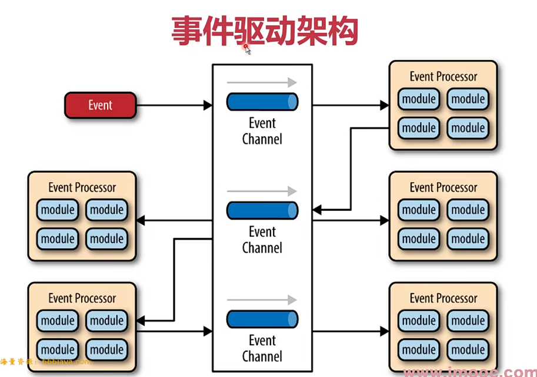

> 管道-过滤器架构


> 微核架构


### 2.MYSQL软件架构

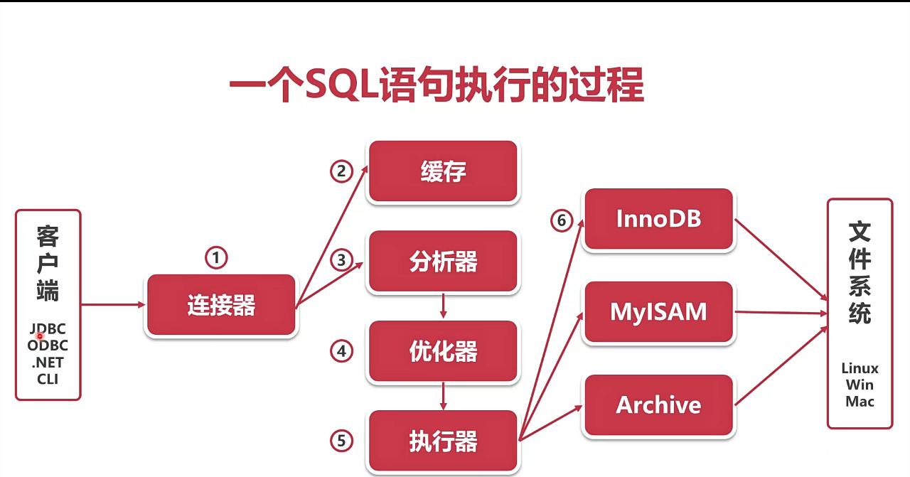

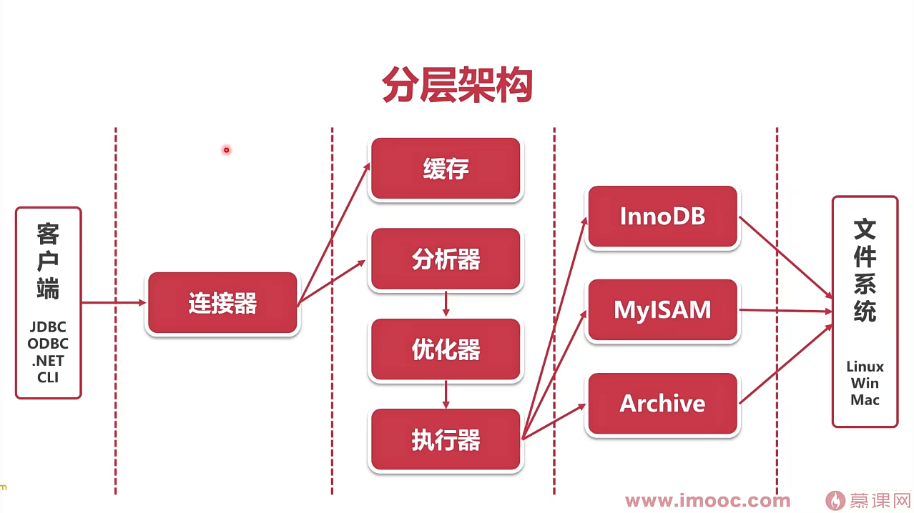

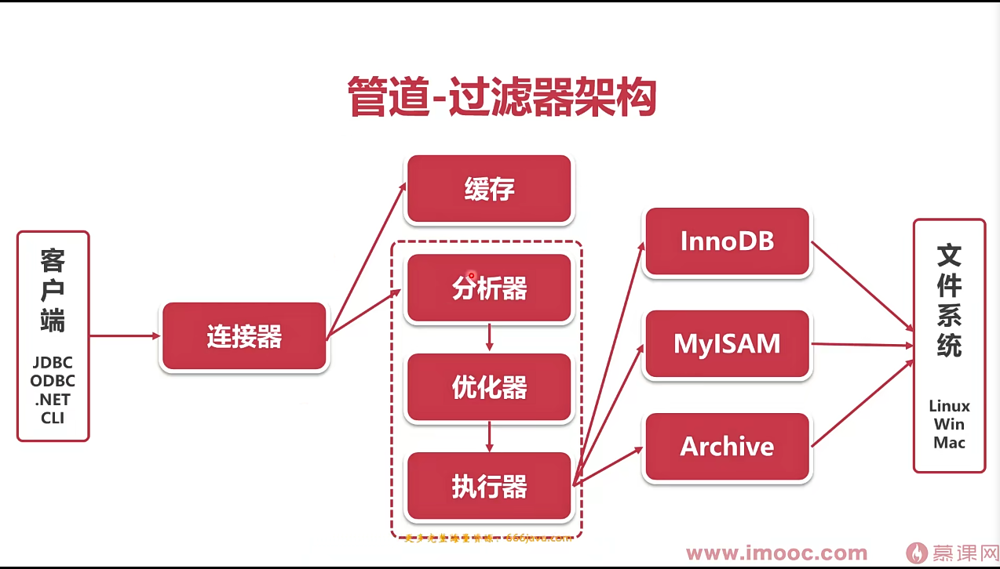


> 软件工程当中有很多经典的架构设计
>
> 大型软件往往不是使用单一的架构设计，而是多种混合
>
> 研究问题要有清晰的视野，分清微观和宏观

### 3.客户端与mysql的连接方式

1. TCP/IP连接
2. 命名管道
   * 同一台服务器通讯
3. 共享内存
   * 客户端和服务端通过一片内存交互
4. UNIX域套接字

> TCP/IP连接

TCP/IP连接是MYSQL在任何平台上都提供的连接方法

* 三次握手建立TCP连接
* 认证连接
* 认证通过之后，客户端开始与服务端之间交互
* 四次挥手断开TCP连接

> TCP通讯协议 - 认证连接

1. 服务端---->客户端：发送握手初始化包
2. 客户端---->服务端：发送验证
3. 服务端---->客户端：认证结果消息

> TCP报文格式

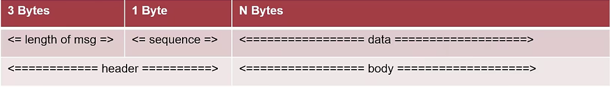

* 消息头：3字节报文长度，1字节序号
* 消息体：1字节指令，其余为参数

### 4.一个SQL语句时怎么执行的


> 连接器

监听客户端的请求

> 查询缓存

之前执行过的语句会KV的形式缓存在内存中。查询之前先查找之前执行过的相同语句

不推荐使用缓存：数据表修改后，会删除所有相关缓存

> 分析器

分析器的作用是知道你要干什么

先做词法分析，识别SQL语句中的关键字

再做句法分析，判断SQL语句是否符合语法

> 优化器

优化器的作用是要知道怎么做

优化器的主要工作时决定如何使用索引

> 执行器

执行器的主要工作是校验权限、调用存储引擎

执行器首先校验从用户对目标数据有无权限

执行器会以行为粒度，调用存储引擎。执行SQL

在没有索引情况下，执行器会循环查询所有行

> 存储引擎

任务时将执行器的指令落实在数据文件上

不同存储引擎原理和执行方法有很大不同

> SQL语句执行的过程涉及到了MYSQL几乎所有的模块
>
> 一个SQL语句是按照分析-优化-执行-落盘的步骤执行的
>
> MYSQL8.0之后已经停用了缓存功能

### 5.MYSQL存储引擎

1. InnoDB
2. MyISAM
3. Memory
4. Archive

> MyISAM

MySQL5.5.5之前的默认存储引擎

* 插入数据快
* 空间利用率高
* 不支持事物

> InnoDB

MySQL5.5.5之后的默认存储引擎

* 支持事物、外键
* 支持崩溃修复能力和并发控制

> Memory

所有的数据都在内存中，速度快

* 数据安全性差

> Archive

数据压缩、空间利用率高

* 插入速度快
* 不支持索引，查询性能差

> InnoDB是目前最流行的存储引擎，适合各种互联网业务
>
> 查询效率要求非常高可以考虑MyISAM
>
> 日志信息归档可以考虑Archive
>
> 临时表可以考虑Memory

## 第三章：如何建表更符合业务

### 1.索引组织表

* 索引组织表不是一种”组织表“
* 索引组织表是由索引“组织起来的”表
* InnoDB中，表都是根据主键顺序组织存放的

> 索引

* 索引是数据库中对某一列或多个列的值进行预排序的数据结构
* 索引可以理解为数据的目录
* InnoDB中，主键是一个特殊索引字段

> 主键

* InnoDB存储引擎表中，每张表都有一个主键
* 若表中有一个非空唯一索引，即为主键
* 若有多个非空唯一索引，选择第一个定义的索引
* 若无，InnoDB自动创建一个6字节的指针，作为主键

### 2.索引所使用的的算法

> 主流索引查找算法

1. 线性查找
2. 二分查找
3. 二叉查找树
4. 平衡二叉树
5. B树
6. B+树

> 线性查找

* 时间复杂度O(N)
* 从第一个数据开始，逐个匹配

> 二分查找

* 时间复杂度O(logN)
* 拿出有序数列中点位置作为比较对象
* 根据中点数据大小，选取一半数据作为新的数列
* 每次可以将数据量减少一半

> 二叉查找树

* 时间复杂度(logN)
* 使用经典的二叉树数据结构
* 由根节点开始查找
* **可能会退化为线性查找**

> 平衡二叉树

* 时间复杂度(logN)
* 查找时跟二叉搜索树相同
* 增删改时，通过旋转操作，维护树的平衡
* 可以保证不会退化成线性查找

> B树

* B树是线性数据结构和树的结合
* B树通过多数据节点大大降低了树的高度
* B数不需要旋转就可以保证树的平衡

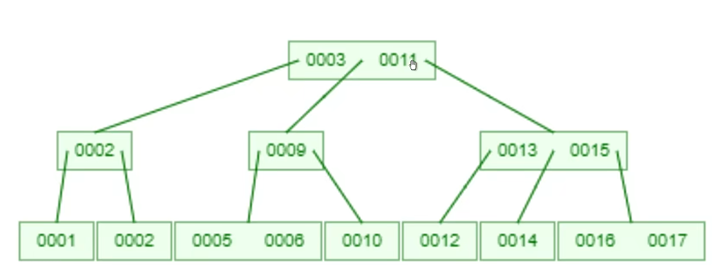

> B+树

* 是由B树发展而来的
* B+树的所有数据均在叶子节点
* B+数的所有数据形成了一个线性表

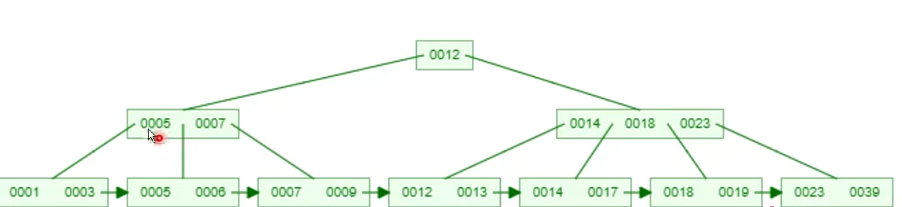

> B+树是目前最主流的数据库索引算法
>
> B+法由线性表、二叉树、B树发展而来
>
> B+树集成了线性表、平衡二叉树的优势

### 3.InnoDB索引

> B+树索引

* InnoDB使用B+树作为索引的数据结构
* B+树的高度一般为2-4层，查找速度非常快
* InnoDB索引分为聚簇索引(主索引)和辅助索引

> 聚簇索引

* 根据表的主键构造一个B+树
* 叶子节点直接存放数据，而不是指针
* 索引组织表中，数据也是B+树的一部分


> 辅助索引

* 每张表可以有多个辅助索引
* 叶子节点并不包含行数据
* 叶子节点记录了行数据的主键，用来指示数据位置
* 采用辅助索引只能查到主键数据，然后通过主键再次进行B+查找，这种行为称为`回表`

> InnoDB索引分为聚簇索引和辅助索引
>
> 在同层B+树节点之间，为双向链表
>
> 在b+树节点之内，数据条目之间为单向链表
>
> 所谓索引即数据，是把数据直接记录在主索引中

### 4.InnoDB数据存储

> InnoDB逻辑存储结构

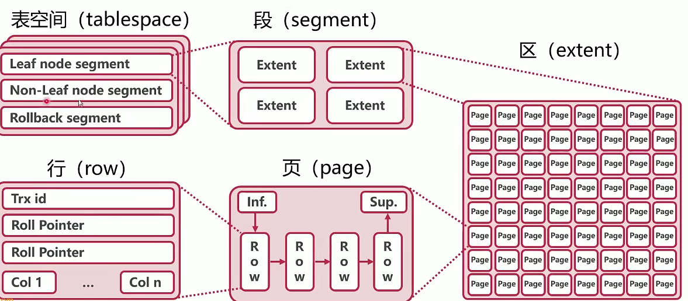

* 表空间
  * 表空间指的是数据表在硬盘上的存储空间
  * 默认所有表的数据都存在共享表空间
  * 每个表的数据也可以放在独占表空间(ibd文件)
* 段
  * 数据段(Leaf node segment)：B+树的叶子节点
  * 索引段(Non-Leaf node segment)：B+树的非叶子节点
  * InnoDB中，段由存储引擎自动管理
* 区
  * 区是由连续页组成的空间，大小为1MB
  * 一次从磁盘申请4\~5个区
  * 一般含有64个页
* 页
  * 页是InnoDB中磁盘读写的最小逻辑单位，默认是16KB
  * 一个数据页就是一个B+数节点
  * 页的大小充分考虑了机械硬盘和SSD的最小单元（512B和4KB）

> InnoDB的逻辑存储结构为表空间、段、区、页、行
>
> InnoDB的逻辑存储结构充分考虑了以基于B+树的表结构
>
> InnoDB的页是InnoDB自身的概念逻辑，与硬件的页无关

> 为什么页不能太大

1. 因为页是InnoDB读写的最小逻辑单位，读取太大对硬盘的压力过大
2. 一次读取的数据可能很小，所以如果页过大就会导致取出太多垃圾数据，增加内存负担
3. 页结构里是一个链表，页的内存太大会导致页中数据过多，导致查询困难

> 为什么页不能太小

1. 因为要考虑机械硬盘和SSD的最小单元

### 5.InnoDB的数据行

> InnoDB中的变长列

* 长度不固定的数据类型：
  * varchar
  * varbinary
  * blob
  * text
  * 占用空间大于768Byte的char类型
  * 变长编码下的char

> 行溢出数据

* 由于InnoDB每个数据页容量有限，导致数据字段也是有限的
* 当数据字段过大时，InnoDB会使用行溢出机制
* 行溢出机制会把超长字段放入单独开辟的数据页


### 6.InnoDB行记录格式

* InnoDB行记录格式主要分为两个时代：
  * Redundant/Compact（Antelope文件格式）
  * Dynamic/Compressed（Barracuda文件格式）

> Redundant

mysql5.0之前的默认Row Format


> Compact

mysql5.1之前的默认Row Fromat


> Dynamic

MySQL5.7之后默认Row Fromat

| 变长字段长度表              | NULL标志位                  | Header          | RowID                  | TxID | Roll Pointer | Col 1           | Col 2                     | ...... | Col n |
| -------------------- | ------------------------ | --------------- | ---------------------- | ---- | ------------ | --------------- | ------------------------- | ------ | ----- |
| 每个变长字段的长度 按照列的顺序逆序放置 | 指示行记录中的NULL值 每个bit代表一个字段 | 列数量、下一行记录的指针等信息 | 没有可用主键时，使用Row ID作为隐藏主键 | 事务ID | 回滚指针         | 未溢出的数据，小于40Byte | 数据长度大于40Byte，则只记录一个BLOB指针 |        |       |

> Compressed

在Dynamic基础上，对表的数据行使用zlib算法进行了压缩存储

可以节约40%左右空间但对CPU的压力较大

> InnoDB行记录格式经历了两个时代、四种类型
>
> 行记录格式化的核心需求是节约行记录空间
>
> 节约行记录空间从而增加每个页的数据行数，提高查询效率

### 7.索引有哪些“左侧用法”

> 联合索引

* 使用两个或以上字段生成的索引
* 联合索引可以加速`最左前缀`的查询
* 联合索引可以代替**最左侧字段**的单独索引
* `带头大哥不能死，中间兄弟不能丢`

> 联合索引的B+树结构

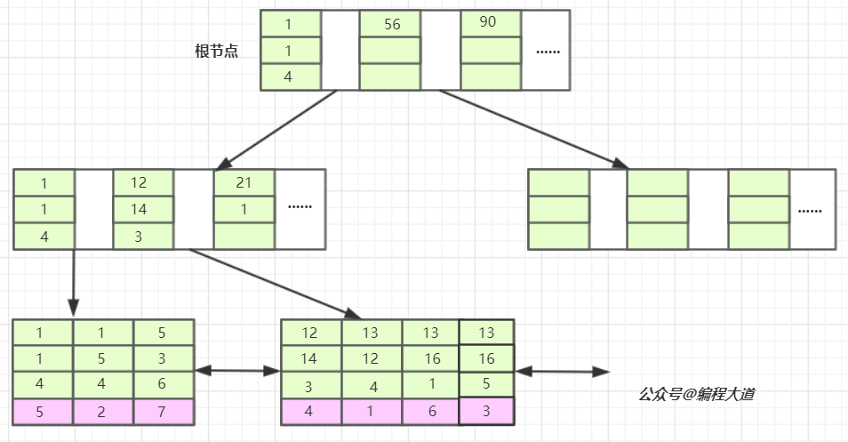

* 上述B+树数据

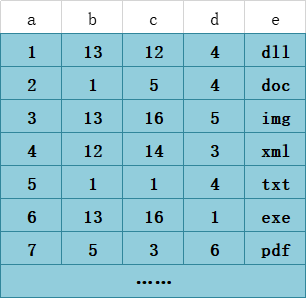

> 字符串的前缀索引

* 如果字符串过长，可以考虑使用前缀索引节约空间
* 如果前缀区分度太小，可以考虑两种变通方法
  * 如果前缀相同：倒叙存储
  * 如果前后缀都相同：新建Hash字段
*   新增前缀索引SQL语句

    ```sql
    alter table user add index index2(email(6))
    ```

> 字符串like

* (like %%关键字)(like %关键字)会使索引失效
* (like 关键字%)左模糊才可以使用索引

> MySQL有很多`左侧用法`
>
> 联合索引可以代替最左侧字段的单独索引
>
> 字符串的前缀索引可以节约磁盘空间
>
> 字符串左模糊可以有效利用索引

### 8.如何约束数据

> InnoDB约束数据的方法

1. Primary key/Unique key
2. Foreign key
3. Default/NOT NULL
4. 触发器

> Primary key/Unique key

* Primary key：唯一，不为空
* Unique key：唯一
* 唯一约束插入时的性能开销较大

> Foreign key

* 外键可以对数据的正确性实现约束

> Default/NOT NULL

* Default：数据默认值
* NOT NULL：数据不为空

> 触发器

* 插入、修改数据时，使用触发器校验数据
* 容易干扰业务，使用很少

> InnoDB有多重约束数据方法
>
> 将数据设置为索引字段快银约束数据的唯一性，但开销较大
>
> 外键可以对数据有效性进行校验
>
> NOT NULL的行为可能收到`sql_mode`参数的影响

### 9.如何使用不存在的数据表

> 视图View

* 使用视图可以创建不存在的虚拟表
* 视图的原理是预设一个SELECT语句
* SELECT语句的查询结构作为虚拟表的数据

> 视图算法的选择

* MERGE：将视图SQL合并到主查询SQL中
* TEMPTABLE：将视图作临时表(中间结果)来处理
* 一般来讲，MERGE的性能优于TEMPTABLE

> 无法使用MERGE的SQL

1. 聚集函数
2. distinct
3. group by
4. hanving
5. union，union all
6. 子查询

> 视图可以在不改变原有数据的情况下，创建虚拟表
>
> 尽量使用MERGE视图算法，尽量不使用无法使用MERGE的SQL语句

## 第四章：这么查询速度更快

### 1.where查询太慢怎么办

#### 1.1.覆盖索引

* 查询语句从执行到返回结果均使用同一个索引
* 覆盖索引可以有效减少回表

```sql
explain select store_id,film_id from sakila.inventory where store_id=1;
```


#### \*索引解释详情

* Extra
  * Using index：使用了覆盖索引

> 覆盖索引通过取消回表操作，提升查询效率
>
> 如数据的查询不只使用了一个索引，则不是覆盖索引
>
> 可以通过优化SQL语句或优化联合索引，来使用覆盖索引

### 2.有更合适的索引不走，怎么办？

#### 2.1.如何确定用那条索引

* MySQL在选取索引时，会考虑索引的基数(Cardinality)
  * 查看各个索引的基数
    * show index from city\_1;
* 基数是MySQL估算的，反映这个字段有多少种取值
* 怎么估算的：选取几个页算出取值的平均值，再乘以页数，即为基数
* 当MySQL在选择索引的时候，会选择基数更大的那一条索引

#### 2.2.强制使用索引

* MySQL的基数估算是有可能出错的，这个时候我们可以强制指定要使用的索引
*   force index(索引名)

    ```sql
    select * from my force index(word) where my=1 ;
    ```

#### 2.3.优化索引

* 当基数估计出错的时候，也不想使用强制索引，这个时候可以让MySQL重新估计基数
* \*\*analyze table 表名;\*\*可以重新统计索引信息
* 重新统计索引信息时，会重新计算索引的基数

> 根据索引基数，可以判断索引性能的好坏
>
> 使用force index可以强制使用索引
>
> analyze table可以重新统计索引信息，修复基数信息

### 3.Count这么慢，怎么办

MySQL count()函数用来统计结果集中不为null的数据个数

> Count步骤

* 首先存储引擎查询出结果集
* server层逐个判断是否为null，不为null则加一

**count(非索引字段)时**，server层需要判断每个数据是否为null，而且查询本身无法使用覆盖索引，理论上最慢

**count(索引字段)时**，可以使用覆盖索引，依然需要每次判断字段是否为null

**count(主键)时**，同理

**count(1)时**，count(1)只扫描了索引树，没有解析数据行的过程，理论更快。但server层依然每次需要判断`1是否为空`

**count(\*)**，一般用来返回数据表行数

* MyISAM的count(\*)直接返回数据库中记录的数据表行数
* 由于InnoDB支持事物，数据库中不记录数据表行数
* MySQL专门优化了count(\*)函数直接返回索引树中数据的个数

> count(非索引字段)：无法使用覆盖索引，最慢
>
> count(索引字段)：可以使用覆盖索引 但依然要去除数据判空
>
> count(1)：不需要去除数据，但要判断1是否为空
>
> count(\*)：经过专门优化，不需要判空，理论最快

### 4.ORDER BY这么慢，怎么办

> ORDER BY步骤原理

例如：SELECT \* FROM FILM WHERE FILM\_ID>80 ORDER BY TITLE;

1. 根据WHERE等条件查询
2. 将查询结果放入sort\_buffer(专门用于排序的缓存)
3. 对中间结果集按照ORDER字段排序
4. 回表生成完整结果集(若需要)

> 优化步骤

1. 条件查询
   * 给查询字段加索引，改善条件查询速度
2. 中间结果集
   * 中间表比较小时，直接放在内存中
   * 比较大与sort\_buffer\_size时，会放在硬盘中
   * 若需要优化内存占用，减少sort\_buffer\_size
   * 若需要优化排序查询时间，增加sort\_buffer\_size
3. 回表生成完整结果集
   * 当行小于max\_length\_for\_sort\_data时，生成全字段结果集
   * 当行大于max\_length\_for\_sort\_data时，只生成排序字段+主键中间表，需要回表
   * 调大阈值并不一定改善效率，因为太大的结果集排序效率低
4. 最高效-索引覆盖
   * 索引覆盖可以跳过生成中间结果集，直接输出查询结果
   * ORDER字段需要有索引，或在联合索引左侧(和查询条件索引一致)
   * 其他相关字段(条件、输出)均在上述的索引中
   * **满足以上条件即可使用索引覆盖**

> 中间结果集是一个**临时表**，不存在任何索引。但是满足条件可以使用索引覆盖
>
> MySQL一般需要生成中间结果集、排序、回表的过程
>
> 索引覆盖式最高效的处理排序的方式

### 5.随机选取这么慢，怎么办

* select RAND():输出一个0-1的随机值

> ORDER BY RAND()原理

例如：SELECT TITLE,DESCRIPTION FROM FILM ORDER BY RAND() LIMIT 1;

1. 创建一个临时表，临时表的字段为rand、title、description
2.  从表中取出一行，调用RAND()将结果和数据放入临时表，依次类推

    
3.  针对临时表，将rand字段+行位置(主键)放入sort\_buffer

    * 如果临时表为内存表，则有行位置
    * 如果为磁盘表，则有主键(临时表)

    
4. 对sort\_buffer排序，取出第一个的行位置(主键)，查询临时表


> 为什么会慢

* SQl执行过程中出现了两次中间结果，都是全长度的
* 仅需要一个随机结果，却经历了不必要的排序(虽然优化过)
* 调用了很多次RAND()

> 优化

1.  临时方案

    ```sql
    # 设置film_id的最大值和最小值的变量
    select max(film_id),min(film_id) into @M,@N from film;

    # 给最大值和最小值中间随机取出的数赋给变量
    set @X=floor((@M-@N+1)*rand()+@N);

    # 在大于随机值中取出第一个，因为可能中间数据不连续
    select title,description from film where film_id >= @X limit 1;
    ```
2. 业务方案
   1. 查询数据表总数total
   2.  total范围内，随机选取一个数字r

       ```sql
       set @T = floor((select count(*) from film) * rand());
       ```
   3.  执行一下SQL

       ```sql
       select title,description from film limit r,1;
       ```

> ORDER BY RAND() LIMIT 1是效率很低的随机查询方式
>
> 原因主要是，上述方法有两次中间结果，还有排序过程
>
> 可以通过修改SQL，选取随机主键方式，提升性能
>
> 最好还是在业务中处理，尽量减少复杂SQL

### 6.带头大哥丢了，怎么办

#### 6.1.索引下推

```sql
# 建表语句与插入语句
CREATE TABLE `inventory_3` (
  `inventory_id` mediumint unsigned NOT NULL AUTO_INCREMENT,
  `film_id` smallint unsigned NOT NULL,
  `store_id` tinyint unsigned NOT NULL,
  `last_update` timestamp NOT NULL DEFAULT CURRENT_TIMESTAMP ON UPDATE CURRENT_TIMESTAMP,
  PRIMARY KEY (`inventory_id`),
  KEY `idx_store_id_film_id` (`store_id`,`film_id`)
) ENGINE=InnoDB AUTO_INCREMENT=101 DEFAULT CHARSET=utf8mb4 COLLATE=utf8mb4_0900_ai_ci
insert into inventory_3 select * from sakila.inventory;

# 查询语句
# 5.6之前，需要先使用索引查询store_id in (1,2)再全部回表验证film_id=3
# 在5.6之后，如果索引中可以判断，直接使用索引过滤
# Extra：Using index condition
select * from inventory_3 where store_id in (1,2) and film_id=3;
```


#### 6.2.松散索引扫描

```sql
# 查询语句
# 丢失带头大哥，不能走联合索引
select film_id from inventory_3 where film_id=3;


# 松散扫描
# MySQL8.0新特性
# 在MySQL8.0中，使用上述查询语句可以使用松散索引扫描，大大减少扫描行数
# Extra:Using index fro skip scan:松散索引扫描
# 在松散索引扫描中，也是走联合索引
# 例如上述表中使用松散索引扫描，先在store_id确定，例如在store_id=1中，扫描film_id字段
# 因为这两个字段是联合索引，所以只要带头大哥确认，film_id字段就能有序，更好查找，能有效减少扫描行数
```

> 联合索引可以加速一些特殊查询场景
>
> 索引下推可以大大减少回表次数
>
> 松散索引扫描可以打破`左侧原则`，解决带头大哥丢失问题(8.0)

### 7.明明有索引，就是不走，怎么办

> select \* from film where film\_id + 1 =100

* 不会走索引，全表扫描
* 对函数字段做函数操作，优化器会放弃索引

> select \* from rental where month(rental\_date)=5

* 使用month()函数后，无法使用索引
* 如果需要查询时间，需要去掉month()

```sql
select * from rental where rental_date between '2005-5-1' and '2005-6-1'
or return_date between '2006-5-1' and '2006-6-1';
```

#### 7.1.字符串与数字比较

> select \* from t1 where f1=6;

* MySQL中若出现字符串与数字比较，会将字符串转换为数字
*   如果t1表中f1字段为varchar类型，则此SQL相当于

    ```sql
    select * from t1 where CAST(f1 AS signed int)=6
    # CAST(f1 AS signed int):强制转换为int类型
    # convert(6 ,char)：把数字强转为字符串
    ```
* 解决方案：把6换成'6'

#### 7.2.隐式字符编码转换

```sql
# 建t1表
create table t1(
    f1 varchar(32) not null,
    f2 int not null ,
    key idx_f1(f1),
    key idx_f2(f2)
)engine=InnoDB DEFAULT CHARSET=utf8mb4;

# 建t2表，注意字符集不一样
create table t2(
    f1 varchar(32) not null,
    f2 int not null ,
    key idx_f1(f1),
    key idx_f2(f2)
)engine=InnoDB DEFAULT CHARSET=utf8;

# 插入相关数据，进行查询
explain select t2.* from t1,t2 where t1.f1=t2.f1 and t1.f2=3;
# 结果
1,SIMPLE,t1,,ref,"idx_f1,idx_f2",idx_f2,4,const,1,100,
1,SIMPLE,t2,,ALL,idx_f1,,,,3,33.33,Using where; Using join buffer (hash join)
```

> 按说，确认t1表行数据后，再对t2表数据查询f1字段会进行索引查询，为什么会按照全表查询？

*   MySQL中，utf8与utf8mb4字段比较时，会把utf8转为utf8mb4

    ```
    select t2.* from t1,t2 where t1.f1=t2.f1 and t1.f2=3;

    # 相当于

    select t2.* from t1,t2 where t1.f1=convert(t2.f1 USING utf8mb4) and t1.f2=3;
    ```
*   解决方案：将查询条件转换为索引字段的编码

    ```sql
    select t2.* from t1,t2 where convert(t1.f1 USING utf8)=t2.f1 and t1.f2=3;

    # 结果
    1,SIMPLE,t1,,ref,idx_f2,idx_f2,4,const,1,100,
    1,SIMPLE,t2,,ref,idx_f1,idx_f1,98,func,1,100,Using index condition

    ```

> MySQL中，对索引字段做函数操作，优化器会放弃索引
>
> 这种情况可能包括：时间函数，字符串转数字，字符编码转换
>
> 解决方案：时间函数转区间、数字强转字符串、高级编码转低级

### 8.分页查询这么慢，这么办

> 偏移量大时，效率低

例如：select film\_id,title,description from film order by title limit 900,10;

* 执行前面的语句，在执行limit操作
* 丢弃很多无用数据，效率低下

> 优化策略

* 先想办法走索引覆盖
* 得到所需数据的ID
*   根据所需数据的ID，得到最终结果集

    ```
    # 优化SQL语句
    # 得到所需数据的主键
    select film_id from film order by title limit 900,10;

    # 原表与上面的结果链表，获取最终结果
    select f.film_id,f.title,f.description from file f
    inner join (select film_id from film order by title limit 900,10) m
    on f.film_id = m.film_id;
    ```

> 排序偏移量大时，会丢弃大量无用数据，导致效率低下
>
> 当索引不可随便改动时，可以采用先索引覆盖，再用最终ID回表的方法，优化效率

### 9.总结

> 慢查询的怀疑方向

1. 索引设计有问题
2. SQL语句有问题
3. 数据库选错索引

## 第五章：如何处理数据更新

### 1. 数据库"动起来"之后，会发生什么

> 产生日志数据

* 数据库在更新时，会产生binlog、redo log、undo log
* binlog：server层产生的逻辑日志
* redo log：InnoDB产生的物理日志。保证持久化
* undo log：InnoDB产生的逻辑日志，保证隔离性、原子性

> 客户端之间因为锁而相互影响

* 客户端执行SQL时，会产生各种行锁、表锁、原数据锁
* 一个客户端产生的锁，会干扰其他客户端SQL的执行
* 两个客户端之间可能产生死锁

> 事务造成查询到的数据与磁盘上不一致

* 客户顿可能暂时看不到已经更新的数据
* 事务可能产生隐式锁，造成性能问题

> 数据库"动起来"之后，会产生一系列性能问题
>
> 需要理解日志、锁、事务的底层原理，才能应对问题

### 2.什么日志不是给人看的

> MySQL日志体系

* MySQL为了满足主从复制、事务等，有复杂的日志体系
* Server层产生binlog，用来进行数据复制
* InnoDB产生undo log、redo log，用来实现事务ACID

#### 2.1.binlog 归档日志

* binlog是server层产生的**逻辑日志**
* 用来进行数据复制和数据传送
* binlog完整记录了数据库每次的数据操作，可作为`数据闪回`手段

#### 2.2.undo log 回滚日志

* InnoDB自身产生的**逻辑日志**，用于事务回滚和展示旧版本
* 对任何数据(缓存)的更新，都先写undo log
* undo log位于表空间的undo segment中
* SQL：UPDATE name='b'---->undo：UPDATE name='a'(记录相反的数据变化情况)

#### 2.3.redo log 重做日志

* InnoDB自身产生的**物理日志**，记录数据页的变化
* InnoDB"`日志优先于数据`"，记录redo log视为数据已经更新
* 内存中的数据更新后写redo log，数据被写入硬盘后删除
* redo log存储在4个1GB文件中，并且循环写入


### 3.数据更新流程


#### 3.1.redo log 刷盘

* innodb\_flush\_log\_at\_trx\_commit参数控制redo log刷盘
  * 0：异步每秒刷盘
  * 1：每一个事务刷盘
  * N：没N个事务刷盘
* `建议设置为1，保证数据安全`

#### 3.2.binlog 刷盘

* sync\_binlog参数控制刷盘
  * 0：异步每秒刷盘
  * 1：每一个事务刷盘
  * N：没N个事务刷盘
* `建议设置为1，保证数据安全`

#### 3.3.持久化分析

* redo log刷盘前系统崩溃
  * 数据丢失
* redo log刷盘后系统崩溃
  * 重启时会对redo log进行重写、重写内存中数据页、重写binlog
* 为什么redo log在binlog之前
  * redo log是系统关键节点，相当于"决断点"
  * binlog一旦写入无法撤回，因为可能已经被传送至备库

> MySQL日志主要由binlog、undo log、redo log
>
> MySQL实行日志优先(WAL)的策略，日志刷盘，数据就不会丢失

### 4.锁：怎样平衡功能与性能

> MySQL锁的种类

* 按照粒度，MySQL锁可以分为全局锁、表级锁、行锁
* 全局锁会锁住整个库，整个库无法修改
* 表级锁分为表锁(数据锁)和元数据锁
* 行锁会锁住数据行，分为共享锁和独占锁

> 全局锁

* FTWRL(Flush tables with read lock)
* 此命令使整个库处于只读状态
* 主要用途是保证备份的一致性
* 不要随意使用，杀伤性极大，要在备库中使用

> 表级锁(数据锁)

* 命令 ：lock tables 表名 read/write
* 表锁是非常重的表，在InnoDB中使用很少

> 元数据锁(matadata lock)

* 元数据指的是表的结构、字段、数据类型、索引等
* 事务访问数据时，会自动给表加MDL读锁
* 事务修改元数据时，会自动给表加MDL写锁，修改完会自动释放

> 行锁

* 行锁也有两种类型，有很多其他叫法：
  * 读锁/写锁
  * 共享锁/排它锁
  * 共享锁/独占锁
  * S锁/X锁
* S锁不是不让读，而是自己要读，不让别人写
* X锁不只是不让写，而是自己要写，不让别人读写
* 只有S锁和S锁之间可以兼容，其他均不兼容


> 锁是MySQL高效率执行事务的必备基础
>
> 锁会引发很多的性能问题，可能造成等待和死锁
>
> 锁还会引发很多的功能问题，如脏读和不可重复读等

### 5.事务：InnoDB的杀手锏

> 事务的特性

* 原子性(Atomicity)
* 一致性(Consistency)
* 隔离性(Isolation)
* 持久性(Durability)


> 原子性(Atomicity)

* 事务要么全部成功，要么全部失败
* MySQL的两阶段提交保证了事务的原子性
* undo log用来回滚事务的更改

> 一致性(Consistency)

* 事务必须使数据库从一个一致性状态变换到另一个一致性状态
* 锁和两阶段提交保证了一致性

> 隔离性(Isolation)

* 事务不能被其他事物的操作数据所干扰
* 多个并发事务之间要相互隔离
* 锁和undo log实现了MySQL事务的隔离性

> 持久性(Durability)

* 一个事物一旦被提交，它对数据库中数据的改变就是永久的
* redo log实现了MySQL事务的持久性

### 6.隔离级别

```sql
# 查看隔离级别
select @@transaction_isolation;

# 设置全局的隔离级别
set global transaction isolation level 隔离级别名称;

# 设置会话级别隔离 
set session transaction isolation level 隔离级别

# 设置一次操作的级别
set transaction isolation level 隔离级别
```

> 隔离级别

* 读未提交(READ UNCOMMITTED)
* 读提交(READ COMMITED)
* 可重复度(REPEATABLE READ)
* 串行化(SERIALIZABLE)

> 读未提交(READ UNCOMMITTED)

* 读、写都不加锁，不隔离
* 每次查询都查询到数据的最新版本
* 性能最好，但是等于没有事务，很少采用

> 读提交(READ COMMITED)

* 一般读取时，读取此时已经提交的数据
* 写数据时，加X锁，提交时释放
* Oracle默认隔离级别

> 可重复度(REPEATABLE READ)

* 一般读取时，读取本事务开始时的数据状态
* 写数据时，加X锁，提交时释放
* MySQL默认的隔离级别

> 串行化(SERIALIZABLE)

* 读加S锁，写加X锁，提交时释放
* 对于一条数据，同时只能有一个事物进行写操作
* 事物隔离性最高，性能太差，很少采用

> 事物是InnoDB最核心的功能点
>
> 事物也是引发性能问题最多的点
>
> 读提交和可重复读是如何查询到历史版本的，需要提交

### 7.MVCC是怎样做到千人千面的

MVCC是多版本并发控制（Multi-Version Concurrency Control）的缩写。它是一种并发控制的方法，一般在数据库管理系统中，实现对数据库的并发访问。

> 行记录的版本控制

* 由于undo log的存在，可以从最新版本推算之前版本


#### 7.1.快照读(一致性非锁定读)

* 不锁定数据的情况下，读取数据的特定历史版本
* 版本由事务的具体需求确定：
  * 读已提交：根据每次SELECT时，其他事物的提交情况
  * 可持续读：根据事务开始时，其他事物的提交情况

#### 7.2.当前读(一致性锁定读)

* 读取数据的当前版本，并加锁
* 串行化(SERIALIZABLE)都是当前读
* 若当前版本已经被加锁且不兼容，则阻塞等待
* X锁：UPDATE、DELETE、SELECT FOR UPDATE
* S锁：SELECT LOCK IN SHARE MOOD

### 8.隔离问题

* 脏读：读到了其他事物未提交的数据
* 不可重复读：同样的查询读到的数据内容不一样
* 幻读：同样的查询读到了更多的数据

> MySQL不同隔离级别的问题


#### 8.1.如何解决幻读问题

* MySQL在可重复读级别时，通过Next-Key锁解决了幻读问题
* Next-Key锁是行锁+间隙锁


* 间隙锁的功能与行锁相同，只是针对间隙加锁
* 间隙锁不分读写，也可以认为是读锁，不允许在间隙插入
* 可重复读加锁时，将同时锁住数据及其左右间隙

> InnoDB使用undo log实现了行记录历史查询
>
> 快照读不需加锁，属于乐观锁的一种思路
>
> 当前读需加行锁，为了并发控制
>
> Next-Key锁解决了可重复读下的幻读问题

### 9.间隙锁把全表都锁住了，怎么办

> Next-Key Lock的加锁逻辑

1. 加锁时以Next-Key为基本单位
2. 查找过程中扫描过的范围才加锁
3. 唯一索引等值查询，没有间隙锁，只加行锁
4. 索引等值查询最右一个扫描到的不满足条件值不加行锁
5. 索引覆盖且只加S锁时，不锁主键索引


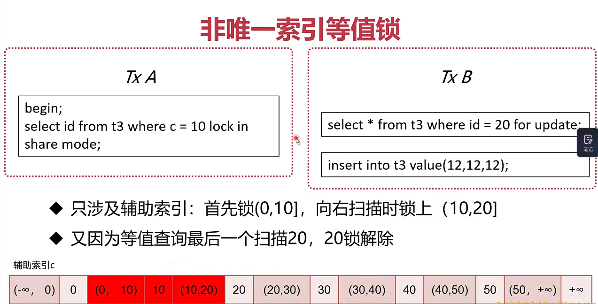

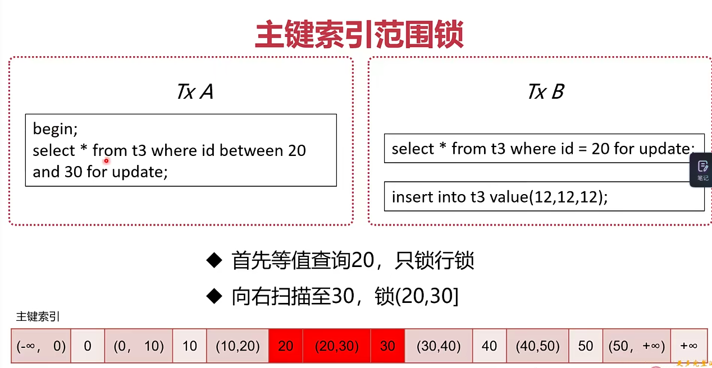

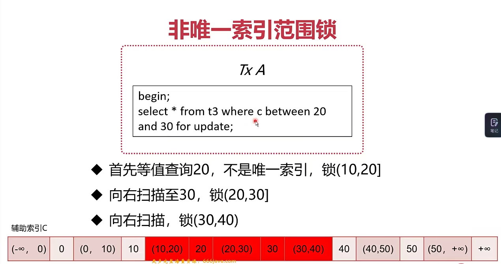


> 目的：在可重复读的隔离级别下部分预防幻读
>
> 手段：Next-Key Lock(行锁+间隙锁)
>
> 特点：规则复杂
>
> 注意：当前读时，不要查询没有索引的项目

### 10.MySQL也有"垃圾回收"嘛

> MySQL的"垃圾回收"

* **MySQL并没有所谓的垃圾回收**
* 但是会发现数据卡几秒，磁盘IO很高
* 此时MySQL正在`"刷脏页"`

#### 10.1.脏页

* 更新数据时，只更新了内存中的数据页，没有更新磁盘
* 内存中数据页与磁盘中数据页不一致，称为脏页

> 什么是刷脏

* 将内存中数据页保存至磁盘
* 同时删除与此页相关的redo log，推进check point

> 为什么要刷脏

1. 内存中的脏页太多，内存不足
2. redo log文件写满，需要推进check point
3. 系统空闲，提前刷脏，预防上述情况
4. MySQL关闭前，保存数据
5. 前两种会产生性能问题，导致MySQL卡住

> 如何避免被迫刷脏

1. 正确告知InnoDB，服务器的硬盘性能
2. 配置合理的脏页比例上限
3. 控制"顺便刷脏"策略

> 服务器Io配置

* 配置项：innodb\_io\_capacity
* 用来告知服务器的硬盘性能
* linux可以使用fio工具测试服务器磁盘性能
* 常见IOPS(每秒IO)：
  * 7200rpm SATA，70 IOPS
  * 10000rpm FC，125IOPS
  * SSD SATA，300-40000 IOPS

> 配置合理的脏页比例上限

* 配置：innodb\_max\_dirty\_pages\_pct
* 脏页与磁盘中数据的比例
* 当脏页比例接近此值，会加速刷脏页
* 最好为75%

> 控制"顺便刷脏"策略

* 配置：innodb\_flush\_neighbors
* 传统的磁盘连续写性能最好，尽量刷连续的页
* SSD建议设为0

> 刷脏可能会导致MySQL卡住，造成性能问题
>
> 通过告知服务器IO性能，可以控制合理刷脏IO
>
> 合理的脏页比例上限，建议保存默认
>
> "顺便刷脏"功能需在SSD下关闭

### 11.长事务有哪些危害

> 主要危害：锁无法释放

* 行级锁长时间无法释放，导致其他事物等待
* 容易产生死锁
* MDL锁hold住大量事务，造成MySQL崩溃

> 行级锁长时间无法释放

* 当前读会对数据加锁，事务提交前无法释放
* 其他事物更新相同数据时会等待锁，造成更新性能差

> 解决方案

* 调整innodb\_lock\_wait\_timeout参数
* 默认为50，即等待50秒还未获取锁，当前语句报错
* 如果等待时间过长，可以适当缩短此参数

> 容易产生死锁

* 长事务的锁长时间不释放，任意与其他事物产生死锁
* 死锁指的是两个事务都依赖对方的锁释放

> 解决方案

* 主动死锁检测：innodb\_deadlock\_detect
* 发现死锁时会回滚代价较小的事物
* 默认开启

> MDL锁

* 事务访问数据时，会自动给表加MDL锁
* 事务修改元数据时，会自动给表加MDL写锁
* 遇到锁不兼容时，申请MDL锁的事物形成一个队列

> 解决方案

* alter table之前，查看是否有长事务还未提交
* 查看长事务：information\_schema库innodb\_trx表

> 如何查看影响性能的锁

* 查看长事务：information\_schema库innodb\_trx表
* 查看锁：information\_schema库INNODB\_LOCKS表
* 查看阻塞上的事务：information\_schema库INNODB\_LOCK\_WAITS表
* 查看锁(8.0)：performance\_schema.data\_locks
* 查看锁等待：performance\_schema.data\_lock\_waits
* 查看MDL锁：performance\_schema.metadata\_locks

> 业务建议

* 控制长事务，没有必要的情况下不开启事务
* 数据修改(当前读)尽量放在事务后部，降低锁时间

> 长事务可能会造成行锁(死锁)、MDL锁等待
>
> 可以通过参数调整，减低锁影响
>
> 可以通过系统表识别长事务和锁
>
> 业务上尽量将加锁的操作后移，降低锁时间

## 第六章：ORM框架原理

### 1.ORM基础

> 什么是ORM

* 对象(Object)
* 关系(Relational)
* 映射(Mapping)
* 对象与关系型数据库的映射关系

> 著名的ORM框架

* Java：Mybatis，Hibernate
* Python：Django，SQLAlchemy
* GO：GORM

> ORM框架的意义

* 将数据库操作与程序员编码解耦，提高开发效率
* 自动拼装生成SQL语句，避免SQL注入风险
* 自动管理数据库连接、自动重试、自动回滚等操作
* 自动管理事务

### 2.ORM框架是怎么设计的

> ORM框架-架构层次

* 接口层：向上支持程序调用
* 处理层：参数映射--->SQL生成--->SQL执行--->结果处理
* 支撑层：事务管理、连接池隔离
* 连接层：数据库连接驱动

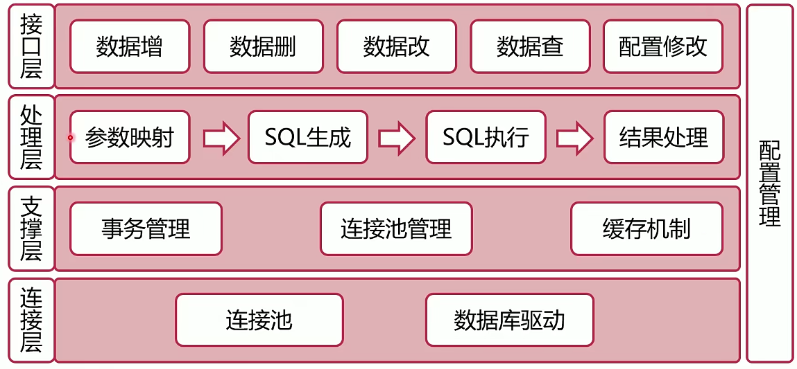

### 3.ORM框架有哪些常见问题

> ORM与DAO是什么关系

* DAO这个概念在Java中比较常见，一般是ORM生成的
* DAO(Data Access Object)是ORM框架的接口层

> 如何定位出问题的SQL

* 业务应用：根据代码推断、查看相关日志
* 数据库：查看慢日志
* 网络：监听数据库端口，解析TCP报文

## 第七章：怎么给数据上保险

### 1.数据库有哪些种类的备份？

> 备份的分类纬度

1. 备份时数据库的状态
2. 备份文件的格式
3. 备份的内容

> 备份时数据库的状态

* Hot Backup(热备)：正常运行中直接备份
* Cold Backup(冷备)：完全停止后备份
* Warm Backup(温备)：数据库只读

> 备份文件的格式

* 逻辑备份：输出文本或SQL语句
* 物理备份(裸文件)：备份数据库底层文件

> 备份的内容

* 完全备份：备份完全数据
* 增量备份：备份数据差异
* 日志备份：备份binlog

> 备份工具

* mysqldump：逻辑、热、全量备份
* xtrabackup：物理、热、全量+增量备份

### 2.使用OUTFILE命令备份

> OUTFILE

* MySQL原生的SQL指令
* 最原始的逻辑备份方式
* 备份的功能和效果却绝育如何写SQL语句

> OUTFILE的使用方式

*   首先查找MySQL的导出路径

    ```mysql
    show variables like '%secure%';
    ```
*   使用into outfile指令将查询结果导出至文件

    ```mysql
    select * into outfile '/file' from z;
    ```

> OUTFILE的注意事项

* 在InnoDB事务下，可以做到一致性视图
* 修改分隔符：fields terminated by
* 修改换行符：lines terminated by

> OUTFILE缺陷

* 输出的文本比较简略
* 很难进行还原，现在往往用来简单导出数据

> 总结

* OUTFILE时最简单且原生的数据备份工具
* 使用简单、灵活性高
* 不适合数据还原场景，基本用来导出数据

### 3.使用mysqldump进行备份

> OUTFILE如何改进

* 自动发SELECT语句，不需要手动发送
* 自动开始事务
* 输出INSERT语句，可以直接用于还原

> mysqldump

* 非常常用的MySQL逻辑备份工具
* MySQL Server自带
* 输出的备份内容为SQL语句，平衡了阅读和还原
* SQL语句占空间较小

> mysqldump原理

*   mysqldump使用以下语句对数据进行备份

    ```mysql
    select SQL_NOCACHE from 't';
    # SQL_NOCACHE查询出的数据不会进入SQL缓存
    ```

> mysqldump使用方法

*   mysqldump使用以下语句对数据进行备份

    ```mysql
    mysqldump -uroot -proot --databases d1 --single-transaction > test.sql
    ```
*   直接执行导出的sql文件即可进行还原

    ```mysql
    source test.sql
    ```

> mysqldump注意事项

* \--single-transaction：在RR级别下进行(InnoDB)
* \--lock-all-tables：使用FTWRL锁所有表(MyISAM)
* \--lock-tables：使用READ LOCAL锁当前库的表(MyISAM)
* \--all-databases：备份所有库

> mysqldump缺点

* 导出逻辑数据，备份较慢
* 还原需要执行sql，速度也比较慢

### 4.如何使用mysqldump增量备份

> mysqldump增量备份思路

* binlog忠实记录了MySQL数据的变化
* mysqldump全量备份后，可以用binlog作为增量
* mysqldump全量备份时，切换新的binlog文件
* 从零还原时，采用全量+binlog还原

> mysqldump增量备份

*   使用以下语句对数据进行全量备份

    ```mysql
    mysqldump -uroot -proot --databases d1 --single-transaction --flush-logs --master-data=2 > test.sql
    # --flush-logs:备份后切换binlog文件
    # --master-data=2：记录切换后的binlog文件名
    ```
*   需要增量备份时，切换binlog文件

    ```mysql
    mysqldump -uroot -proot flush-logs;
    ```
* 将所有新增的binlog文件备份

> 还原

*   首先恢复旧的全量备份

    ```mysql
    source test.sql;
    ```
*   然后将binlog增量还原至数据库

    ```mysql
    mysqlbinlog MySQL-bin.000002...|mysql -uroot -proot
    ```

### 5.使用XtraBackup物理备份

> 为什么需要物理备份

* 直接备份InnoDB底层数据文件
* 导出不需要转换，速度快
* 工作时对数据库的压力较小
* 更容易实现增量备份

> 直接裸拷贝可行嘛

* 理论上可行，但有很多问题
* 要同时备份frm文件、ibd文件、binlog文件、redo log文件等
* 在不同版本的数据库和操作系统上还原可能有兼容问题
* 必须冷备份，影响业务

> 如何实现 物理+热+全量备份？

* 思路：利用redo log，备份ibd文件+备份期间的redo log

1. 启动redo log监听线程，开始收集redo log
2. 拷贝ibd数据文件
3. 停止收集redo log
4. 加FTWRL锁拷贝元数据frm

> 如何实现 物理+热+增量备份？

* 思路：与全量级别相同
* 如何确认增量：根据每个页的LSN号，确认变化的页

> 如何实现物理还原

* 思路：mysqld crash奔溃恢复流程相似
* 还原ibd文件，重放redo log

### 6.ibbackup与XtraBackup

> ibbackup

* 现名MySQL Enterprise Backup，InnoDB官方出品
* 实现了上述的功能，性能优秀

> XtraBackup

* Percona公司开发的开源版本，实现ibbackup所有功能
* XtraBackup 8.0--->MySQL 8.0
* XtraBackup 2.4--->MySQL 5.1，5.5，5.7

```bash
# 参数
--apply-log-only：prepare备份的时候只执行redo阶段，用于增量备份。
--backup：创建备份并且放入--target-dir目录中
--close-files：不保持文件打开状态，xtrabackup打开表空间的时候通常不会关闭文件句柄，目的是为了正确处理DDL操作。如果表空间数量非常巨大并且不适合任何限制，一旦文件不在被访问的时候这个选项可以关闭文件句柄.打开这个选项会产生不一致的备份。
--compact：创建一份没有辅助索引的紧凑备份
--compress：压缩所有输出数据，包括事务日志文件和元数据文件，通过指定的压缩算法，目前唯一支持的算法是quicklz.结果文件是qpress归档格式，每个xtrabackup创建的*.qp文件都可以通过qpress程序提取或者解压缩
--compress-chunk-size=#：压缩线程工作buffer的字节大小，默认是64K
--compress-threads=#：xtrabackup进行并行数据压缩时的worker线程的数量，该选项默认值是1，并行压缩（'compress-threads'）可以和并行文件拷贝('parallel')一起使用。例如:'--parallel=4 --compress --compress-threads=2'会创建4个IO线程读取数据并通过管道传送给2个压缩线程。
--create-ib-logfile：这个选项目前还没有实现，目前创建Innodb事务日志，你还是需要prepare两次。
--datadir=DIRECTORY：backup的源目录，mysql实例的数据目录。从my.cnf中读取，或者命令行指定。
--defaults-extra-file=[MY.CNF]：在global files文件之后读取，必须在命令行的第一选项位置指定。
--defaults-file=[MY.CNF]：唯一从给定文件读取默认选项，必须是个真实文件，必须在命令行第一个选项位置指定。
--defaults-group=GROUP-NAME：从配置文件读取的组，innobakcupex多个实例部署时使用。
--export：为导出的表创建必要的文件
--extra-lsndir=DIRECTORY：(for --bakcup):在指定目录创建一份xtrabakcup_checkpoints文件的额外的备份。
--incremental-basedir=DIRECTORY：创建一份增量备份时，这个目录是增量别分的一份包含了full bakcup的Base数据集。
--incremental-dir=DIRECTORY：prepare增量备份的时候，增量备份在DIRECTORY结合full backup创建出一份新的full backup。
--incremental-force-scan：创建一份增量备份时，强制扫描所有增在备份中的数据页即使完全改变的page bitmap数据可用。
--incremetal-lsn=LSN：创建增量备份的时候指定lsn。
--innodb-log-arch-dir：指定包含归档日志的目录。只能和xtrabackup --prepare选项一起使用。
--innodb-miscellaneous：从My.cnf文件读取的一组Innodb选项。以便xtrabackup以同样的配置启动内置的Innodb。通常不需要显示指定。
--log-copy-interval=#：这个选项指定了log拷贝线程check的时间间隔（默认1秒）。
--log-stream：xtrabakcup不拷贝数据文件，将事务日志内容重定向到标准输出直到--suspend-at-end文件被删除。这个选项自动开启--suspend-at-end。
--no-defaults：不从任何选项文件中读取任何默认选项,必须在命令行第一个选项。
--databases=#：指定了需要备份的数据库和表。
--database-file=#：指定包含数据库和表的文件格式为databasename1.tablename1为一个元素，一个元素一行。
--parallel=#：指定备份时拷贝多个数据文件并发的进程数，默认值为1。
--prepare：xtrabackup在一份通过--backup生成的备份执行还原操作，以便准备使用。
--print-default：打印程序参数列表并退出，必须放在命令行首位。
--print-param：使xtrabackup打印参数用来将数据文件拷贝到datadir并还原它们。
--rebuild_indexes：在apply事务日志之后重建innodb辅助索引，只有和--prepare一起才生效。
--rebuild_threads=#：在紧凑备份重建辅助索引的线程数，只有和--prepare和rebuild-index一起才生效。
--stats：xtrabakcup扫描指定数据文件并打印出索引统计。
--stream=name：将所有备份文件以指定格式流向标准输出，目前支持的格式有xbstream和tar。
--suspend-at-end：使xtrabackup在--target-dir目录中生成xtrabakcup_suspended文件。在拷贝数据文件之后xtrabackup不是退出而是继续拷贝日志文件并且等待知道xtrabakcup_suspended文件被删除。这项可以使xtrabackup和其他程序协同工作。
--tables=name：正则表达式匹配database.tablename。备份匹配的表。
--tables-file=name：指定文件，一个表名一行。
--target-dir=DIRECTORY：指定backup的目的地，如果目录不存在，xtrabakcup会创建。如果目录存在且为空则成功。不会覆盖已存在的文件。
--throttle=#：指定每秒操作读写对的数量。
--tmpdir=name：当使用--print-param指定的时候打印出正确的tmpdir参数。
--to-archived-lsn=LSN：指定prepare备份时apply事务日志的LSN，只能和xtarbackup --prepare选项一起用。
--user-memory = #：通过--prepare prepare备份时候分配多大内存，目的像innodb_buffer_pool_size。默认值100M如果你有足够大的内存。1-2G是推荐值，支持各种单位(1MB,1M,1GB,1G)。
--version：打印xtrabackup版本并退出。
--xbstream：支持同时压缩和流式化。需要客服传统归档tar,cpio和其他不允许动态streaming生成的文件的限制，例如动态压缩文件，xbstream超越其他传统流式/归档格式的的优点是，并发stream多个文件并且更紧凑的数据存储（所以可以和--parallel选项选项一起使用xbstream格式进行streaming）。
```

> XtraBackup全量使用方法

*   备份

    ```mysql
    innobackupex --user=root --password=root bakdir/
    xtrabackup --backup --user=root --password=123456  --target-dir=/data/backups/base
    ```
*   还原(停掉mysqld)

    ```mysql
    innobackupex --copy-back bakdir/xxxxx/
    ```
*   准备

    ```bash
    xtrabackup --prepare --target-dir=/data/backups/
    ```

> XtraBackup增量使用方法

*   增量备份

    ```mysql
    innobackupex --user=root --password=root --incremental bakdir/ --incremenral-basedir='/bakdir/xxxxx/'

    xtrabackup --backup --target-dir=/data/backups/inc1 --incremental-basedir=/data/backups/base
    ```
*   增量备份合并至全量备份

    ```mysql
    innobackupex --apply-log bakdir/xxxx/ --incremental-dir=bakdir/YYYY/
    ```

> 使用场景

```
#备份：
1：指定--defaults-file
xtrabackup --defaults-file=/etc/mysql/my.cnf --user=root --password=123  --backup --target-dir=/home/zhoujy/xtrabackup/

2：用--datadir取代--defaults-file
xtrabackup --user=root --password=123  --backup --datadir=/var/lib/mysql/ --target-dir=/home/zhoujy/xtrabackup/

#还原：
1：(关闭mysql)先prepare
xtrabackup --prepare --target-dir=/home/zhoujy/xtrabackup/

2：再copy
rsync -avrP /home/zhoujy/xtrabackup/* /var/lib/mysql/

3：改权限、启动
chown -R mysql.mysql *


#备份，这里指定几个库和表，也可以是所有库
1：库全量备份
xtrabackup --user=root --password=123 --datadir=/var/lib/mysql/ --backup --parallel=3 --databases="xtra_test dba_test" --target-dir=/home/zhoujy/xtrabackup/

2：增量备份
xtrabackup --user=root --password=123 --datadir=/var/lib/mysql/ --backup --parallel=3 --databases="xtra_test dba_test" --target-dir=/home/zhoujy/xtrabackup1/ --incremental-basedir=/home/zhoujy/xtrabackup/

注意：要是有多个增量备份，第2个增量需要指定第一个增量的目录。和innobackupex一样。

3：还原
#先prepare全备
xtrabackup --prepare --apply-log-only --target-dir=/home/zhoujy/xtrabackup/
#再prepare增量备份
xtrabackup --prepare --apply-log-only --target-dir=/home/zhoujy/xtrabackup/ --incremental-dir=/home/zhoujy/xtrabackup1/

4：最后prepare 全备
xtrabackup --prepare --target-dir=/home/zhoujy/xtrabackup/

5：最后copy、改权限。另外说一个指定表的备份：和innobackupex一样，用--databases=dbname.tablename和--tables-file，也可以用--tables（--include），支持正则。如备份t开头的数据库下的所有表：xtrabackup --user=root --password=123 --datadir=/var/lib/mysql/ --backup --parallel=3 --tables="^t[.]*.*" --target-dir=/home/zhoujy/xtrabackup/
```

> 总结

* 物理备份是一种高效的备份方式
* XtraBackup采用了备份ibd+备份期间redo log方式
* XtraBackup时醉常用的MySQL物理备份工具
* 物理备份的缺点是备份文件无法直接阅读

### 7.MySQL备份工具如何指导我们的创新

> mylvmbackup

* 物理、温备
* 利用LVM逻辑卷管理器
* 直接备份磁盘数据

> mydumper

* 跟mysqldump类似的工具
* 实现了多线程并发的备份还原
* 速度更快

> Zmanda Recovery Manager

* 功能强大的备份恢复管理工具
* 集成了多种备份工具
* 集成binlog分析功能

### 8.如何防患于未然

1. 权限隔离
   * 给业务应用分配的账户只给DML权限
   * 开发只使用只读账号
   * DBA破事使用时使用只读账号，特殊操作时切换账号
2. SQL审计
   * DBA在开发环境审计即将上线的SQL语句
   * 开发修改在线数据，提交给DBA执行
   * Inception自动审核工具
3. 伪删表
   * 删表之前将表改名，观察业务是否受影响
   * 不直接删表，给表名加特殊后缀，用脚本删除
4. 完备流程
   * 上线之前备份数据
   * 准备生产环境事故预案

## 第八章："三高框架"基础

> 什么是三高？

* 高并发：同时处理的事物数高
* 高性能：事物/SQL的执行速度快
* 高可用：系统可用时间高

> 为什么不直接讲"三高"？

* "三高"只是目的，并不是手段，手段有：
* 复制
  * 目的：数据冗余
  * 手段：binlog传送
  * 收获：并发量提升、可用性提升
  * 问题：占用更多硬件资源
* 扩展
  * 目的：扩展数据库容量
  * 手段：数据库分片分库、分表
  * 收获：性能、并发量的提升
  * 问题：可能减低可用性
* 切换
  * 目的：提高可用性
  * 手段：主从身份切换
  * 收获：并发量的提升
  * 问题：丢失切换时期数据

> "三高"的实现

* 高并发：通过复制和扩展，将数据分散至多节点
* 高性能：复制提升速度，扩展提升容量
* 高可用：节点间身份切换保证随时可用

### 1.复制有哪些类型？


* 根据复制同步的类型，可以分为：
  * 异步复制(Asynchronous Replication)
  * 半同步复制(Semisynchronous Replication)
  * 组复制(Group Replication)

> 异步复制(Asynchronous Replication)


* 原理简单
* 对网络延迟要求较小
* 不能保证日志被传送到了备库，可能丢失数据

> **半同步复制**(Semisynchronous Replication)

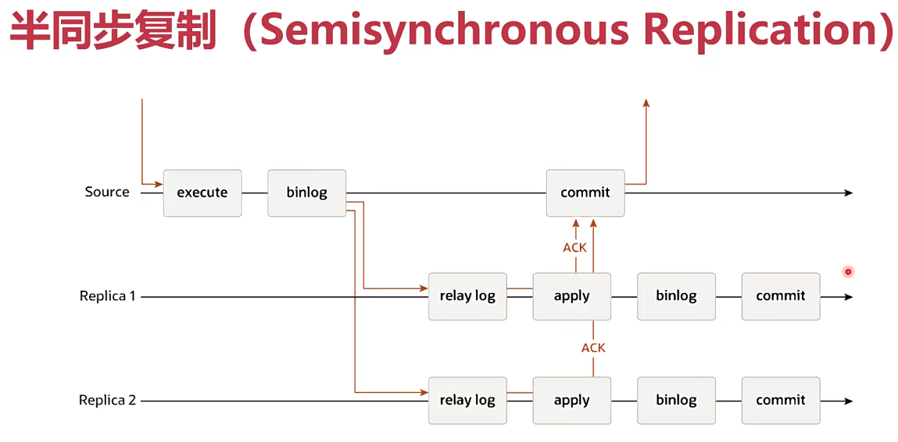

* 原理简单
* 对网络延迟有一定要求，最好在同一机房
* 可以保证日志被传送到了备库，不易丢失数据
* rpl\_semi\_sync\_master\_timeout参数可以调整脱扣时间，默认为10s

> 组复制(Group Replication)


* 原理比较复杂
* 需要依赖共识算法
* 实际应用较少
* 时数据库走向原生分布式的示范

### 2.主从复制

```bash
# 进入mysql配置文件 /etc/my.cnf
[mysqld]
log-bin=/var/lib/mysql/mysql-bin  # binlog日志所在目录
server-id=123456  				  # 在同一个集群中不一样即可
plugin-load="rel_semi_sync_master=semisync_master.so;rel_semi_sync_slave=semisync_slave.so"                              # 配置半同步插件
read_only=1;                      # slave配置只读

# 在配置slave时，要先给master上全局锁备份数据给slave
# 使用show master status;查看master binlog执行情况
# 配置slave
mysql> change master to
    -> MASTER_HOST='192.168.19.199',
    -> MASTER_USER='root',
    -> MASTER_PASSWORD='123',
    -> MATER_LOG_FILE='mysql-bin.000001',
    -> MASTER_LOG_POS=154;

# 配置完成
start slave;       # 开启slave
show slave status; # 查看slave状态

# 若不想设置MATER_LOG_FILE，MASTER_LOG_POS，就要给每个事务配一个唯一ID
[mysqld]
gtid_mode=on  # 开启gtid功能   
enforce_gtid_consistency=on  # 增强gtid的一致性

# 配置slave
mysql> change master to
    -> MASTER_HOST='192.168.19.199',
    -> MASTER_USER='root',
    -> MASTER_PASSWORD='123',
	-> MASTER_AUTO_POSITION=1;
```

> GTID

* mysql5.6版本引入了GTID
* GTID = server\_uuid:gno
* server\_uuid:节点的UUID
* gno事务流水号(回滚会收回)
* GTID可以给事务分配全局唯一ID
* GTID方便了主从复制的配置，推荐打开
* GTID对主从切换、故障恢复也有很大意义

### 3.为什么binlog格式会影响复制？

> binlog格式

* statement格式
  * 5.0之前的MySQL默认使用的格式
  * binlog记录的是SQL语句原文
  * 由于主备库对于SQL的执行不一致，可能有数据安全风险
* row格式
  * 不记录SQL语句原文
  * 记录数据行的变化
  * 不是物理日志，还是逻辑日志
  * 占用空间较大
* mixed格式
  * 两种格式混合使用
  * 有数据风险的语句使用ROW
  * 无风险的使用statement’

> 基于语句的复制=statement
>
> 基于行的复制=row
>
> **推荐使用row格式**

### 4.备库延迟太大，怎么办？

> 备库延迟的原因

* log传送开销较小，主要是消费relay log耗时
* 备库性能不如主库
* 备库承担了很多分析SQL
* 主库长事务未提交

> 处理方法

* 主备使用相同配置的机器
* 备库关闭log实时刷盘
* 增加从库数量，应对分析SQL
* binlog传送至大数据库系统，供分析
* 大事务一分多

> 依然存在的问题

* 备库对硬件资源利用天然不如主库
* **备库单线程执行**
* **主库多线程执行**


* 并行复制的思路
  * 按表分发
  * 按行分发
* MySQL5.6并行复制
  * 按库并行策略
  * 优点：分发快，支持各种log格式
  * 缺点：库粒度太大，很难负载平衡
  * 配置：slave-parallel-type = DATABASE
* **MySQL 5.7 按事务组并行策略**
  * binlog刷盘其实是两步动作
    * 先把binlog从binlog cache中写道内存的binlog文件
    * 调用fsync持久化至磁盘
  * 设置事务组
    * binlog\_group\_commit\_sync\_delay:延迟多少微秒后才调用fsync
    * binlog\_group\_commit\_sync\_no\_delay\_count:积累多少次以后才调用fsync
    * 两个参数是或的关系
    * 配置：slave-parallel-type = LOGICAL\_CLOCK
  * 同时处于prepare状态的事物，在备库执行时是可以并行的
  * 推荐使用


* 5.7.22并行复制
  * binlog-transaction-dependency-tracking参数
    * COMMIT\_ORDER:按事务组并行
    * WRITESET:没有修改相同行的事物可以并行
    * WRITESET\_SESSION:同一个线程先后执行的两个事务不能并行

### 5.如何在备库读到最新数据

> 如何判断备库已经追上

* 强制延时
* 当seconds\_behind\_master为0时
* 对比binlog执行位点
* 对比GTID执行情况

> 备库延迟理论上无法消灭

* binlog传送、中继日志重放需要时间
* 理论上，备库延迟只能减小，无法消灭
* 在备库读取数据时永远面临数据延迟问题

> 判断具体事务是否已经重放

* 等待binlog位点
  * select master\_pos\_wait(file,pos\[,timeout]);
  * 如果已经重放到位点了，就会返回值
* 等待GTID(5.7.6之后可以返回每次的GTID)
  * select wait\_for\_executed\_gtid\_set(gtid\_set,1);
  * 拿返回的GTID执行命令，从库会阻塞到GTID执行

### 6.怎样实现最简单的高可用架构

> 主-主复制架构

* 两个结点均为Master
* 两个结点互为Slave
* 一个结点出现故障时，无需身份切换


> 主-主架构问题

* 数据冲突问题
  * 两边插入相同ID时，可能出现冲突
  * 两边约定好插入不同ID
  * 只写一个主，另一个只读
  * 有切换过快的数据丢失问题
* 客户端切换
  * 应用自己切换比较麻烦
  * 使用keepalived等手段可以完成自动切换
* 循环复制
  * 未开GTID：使用serverID过滤
  * GTID：天然避免

## 第九章：如何解决容量不够的问题

### 1.怎样最简单的扩展容量？

> 什么是分区表

* 将InnoDB的一个表分为多个表
* server层依然看做一个表
* 分区表可以优化单节点容量、增强分区之间隔离
*   可以通过存储在不同的磁盘上提高容量

    

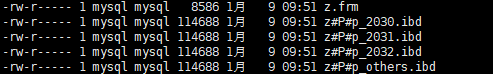

* 分区方式
  * 范围分区
  * Hash分区
  * List分区
* 分区表的优势
  * 减低B+树的层级，搜索加速
  * 将一个数据表物理上分为多个文件，方便处理
* 分区表的缺陷
  * 第一次需要访问所有分区，可能达到上限
  * 共用MDL锁
  * 分区之后，所有的分区依然位于同一节点

### 2.为什么要分库分表？

> 分表

* 垂直：按照字段分表，一般分为冷热
* 水平：按照行分表，常用范围、Hash切分
* 水平分表类似于分区表，但Server层也分了


> 分库

* 垂直：将数据表分散在多个数据库或者多个节点中
* 水平：将所有表水平拆分，每个数据库结构相同

> 分库分表的优缺点

* 优点
  * 增加隔离性
  * 提升容量与并发性能
* 缺点
  * 部分失效可能性成倍增加
  * 无法使用单点事务
  * 垂直切分后无法JOIN
  * 范围查询困难

> 分库分表后的使用方式

* 业务特殊处理
* 业务应用使用中间层
* **使用分库分表中间件**

> 总结

* 分库分表可以提升数据库性能
* 分库分表使得数据的使用方法更加复杂、数据丢失的可能性增加
* 使用分库分表中间件可以最大程度方便客户端的使用

### 3.dble比MyCat强在哪？

> 分库分表中间件的原理

* 分析SQL语句
* 根据SQL语义，将SQL拆分成多个，发送至数据节点
* 将多个数据节点的结果聚集，返回客户端

> dble

* 高性能、高可用的MySQL分库分表中间件
* 完全开源
* 基于开源项目MyCat
* dble在功能上以水平分表为主

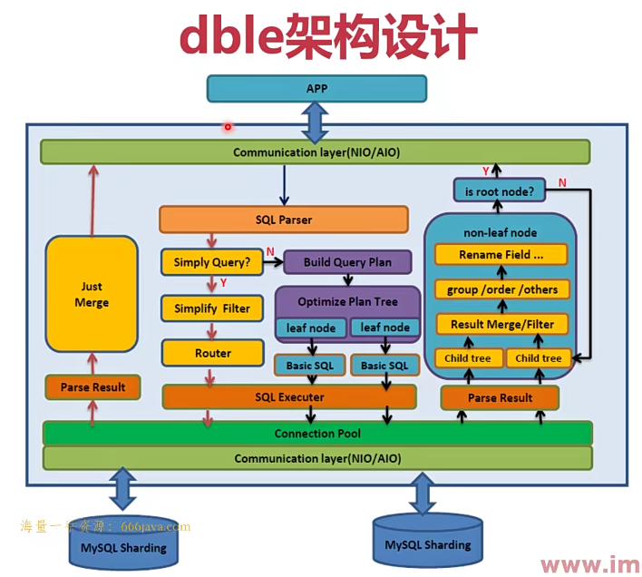

> dble的基础概念

* schema：虚拟数据库(不同于传统的schema)
* shardingTable：虚拟表(被拆分的表)
* shardingNode：虚拟节点
* dbGroup：实际的MySQL集群
* database：实际的database

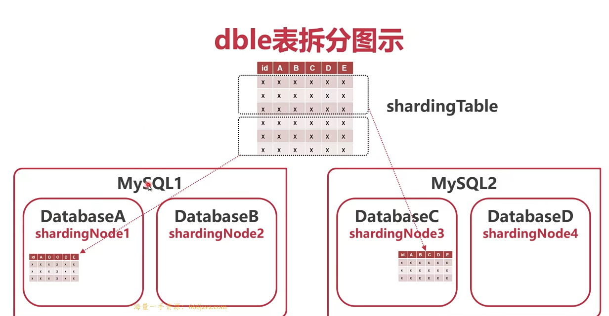

> dble表的类型

* 全局表：每个节点上有保存表的完整数据
* 拆分表：被拆分的表，存入不同节点
* 非拆分表：不拆分的表，存在单一节点

### 4.安装使用dble

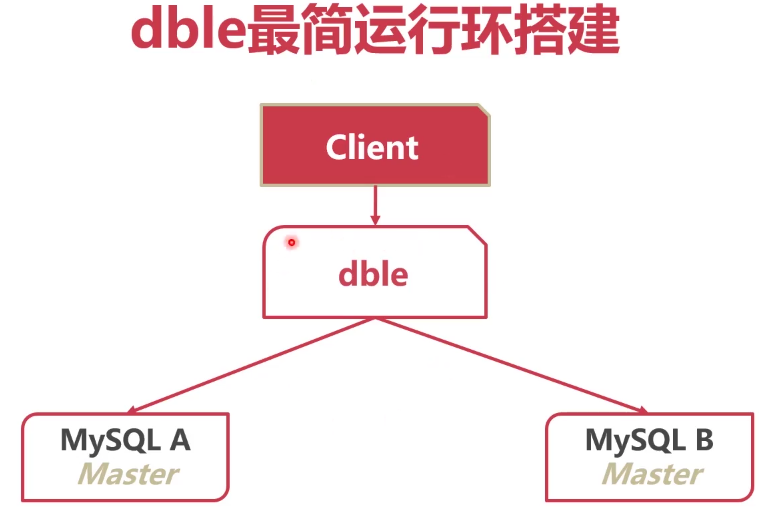

> 安装解压dble

```bash
# 先在linux上安装java
yum install java

# 配置java home变量
vim ~/.bashrc
export JAVA_HOME=/usr/lib/jvm/java-1.8.0-openjdk-1.8.0.352.b08-2.el7_9.x86_64/jre
export PATH=$PATH:$JAVA_HOME/bin
 
# 安装dble
wget https://github.com/actiontech/dble/releases/download/3.22.07.0%2Ftag/dble-3.22.07.0-20220915063524-java1.8.0_151-linux.tar.gz

# 解压dble
tar -xvf 压缩包名字 -C '/var/lib/'
```

> dble配置

* 启动配置文件需全部去除\_template
* cluster\_template.cnf：dble集群配置文件
* bootstrap\_template.cnf：JVM启动参数
*   user\_template.xml：连接dble用户配置

    ```bash
    # 配置管理员，用于管理元数据
    <managerUser name="user" usingDecrypt="true" whiteIPs="127.0.0.1,0:0:0:0:0:0:0:1" readOnly="true"
                     password="AqEkFEuIFAX6g2TJQnp4cJ2r7Yc0Z4/KBsZqKhT8qSz18Aj91e8lxO49BKQElC6OFfW4c38pCYa8QGFTub7pnw=="/>

    # 配置用户，用于管理数据
    <shardingUser name="root" password="123456" schemas="testdb" readOnly="false" blacklist="blacklist1" maxCon="20"/>
    ```
*   sharding\_template.xml：设置数据分片

    ```bash
    <?xml version="1.0"?>
    <!--
      ~ Copyright (C) 2016-2022 ActionTech.
      ~ License: http://www.gnu.org/licenses/gpl.html GPL version 2 or higher.
      -->

    <dble:sharding xmlns:dble="http://dble.cloud/" version="4.0">

        <schema name="testdb"  sqlMaxLimit="100">
            <shardingTable name="tb_enum_sharding" shardingNode="dn1,dn2" sqlMaxLimit="200" function="func_enum" shardingColumn="code"/>
            <shardingTable name="tb_range_sharding" shardingNode="dn1,dn2,dn3" function="func_range" shardingColumn="id"/>
            <!--er tables-->
            <shardingTable name="tb_hash_sharding" shardingNode="dn1,dn2" function="func_common_hash" shardingColumn="id"/>
            <shardingTable name="tb_hash_sharding_er1" shardingNode="dn1,dn2" function="func_common_hash" shardingColumn="id"/>
            <shardingTable name="tb_hash_sharding_er2" shardingNode="dn1,dn2" function="func_common_hash" shardingColumn="id2"/>
            <shardingTable name="tb_hash_sharding_er3" shardingNode="dn1,dn2" function="func_common_hash" shardingColumn="id" incrementColumn="id2"/>

            <shardingTable name="tb_uneven_hash" shardingNode="dn1,dn2,dn3" function="func_uneven_hash" shardingColumn="id"/>

            <shardingTable name="tb_mod" shardingNode="dn1,dn2,dn3,dn4" function="func_mod" shardingColumn="id" sqlRequiredSharding="true"/>

            <shardingTable name="tb_jump_hash" shardingNode="dn1,dn2" function="func_jumpHash" shardingColumn="code"/>

            <shardingTable name="tb_hash_string" shardingNode="dn1,dn2,dn3,dn4" function="func_hashString" shardingColumn="code"/>

            <shardingTable name="tb_date" shardingNode="dn1,dn2,dn3,dn4" function="func_date" shardingColumn="create_date"/>

            <shardingTable name="tb_pattern" shardingNode="dn1,dn2" function="func_pattern" shardingColumn="id"/>
            <!--global  tables-->
            <globalTable name="tb_global1" shardingNode="dn1,dn2" sqlMaxLimit="103" />
            <globalTable name="tb_global2" shardingNode="dn1,dn2,dn3,dn4" cron="0 0 0 * * ?" checkClass="CHECKSUM"/>
            <!--single node table-->
            <singleTable name="tb_single" shardingNode="dn6" sqlMaxLimit="105"/>
            <!--er tables-->
            <shardingTable name="tb_parent" shardingNode="dn1,dn2" function="func_common_hash" shardingColumn="id">
                <childTable name="tb_child1" joinColumn="child1_id" parentColumn="id" sqlMaxLimit="201">
                    <childTable name="tb_grandson1" joinColumn="grandson1_id" parentColumn="child1_id"/>
                    <childTable name="tb_grandson2" joinColumn="grandson2_id" parentColumn="child1_id2"/>
                </childTable>
                <childTable name="tb_child2" joinColumn="child2_id" parentColumn="id"/>
                <childTable name="tb_child3" joinColumn="child3_id" parentColumn="id2"/>
            </shardingTable>
        </schema>
        <!-- sharding testdb2 route to database named dn5 in localhost2  -->
        <schema name="testdb2" shardingNode="dn5"/>
        <shardingNode name="dn1" dbGroup="dbGroup1" database="db_1"/>
        <shardingNode name="dn2" dbGroup="dbGroup2" database="db_2"/>
        <shardingNode name="dn3" dbGroup="dbGroup1" database="db_3"/>
        <shardingNode name="dn4" dbGroup="dbGroup2" database="db_4"/>
        <shardingNode name="dn5" dbGroup="dbGroup1" database="db_5"/>
        <shardingNode name="dn6" dbGroup="dbGroup2" database="db_6"/>
        <!-- enum partition -->
        <function name="func_enum" class="Enum">
            <property name="mapFile">partition-enum.txt</property>
            <property name="defaultNode">0</property><!--the default is -1,means unexpected value will report error-->
            <property name="type">0</property><!--0 means key is a number, 1 means key is a string-->
        </function>
        <!-- number range partition -->
        <function name="func_range" class="NumberRange">
            <property name="mapFile">partition-number-range.txt</property>
            <property name="defaultNode">0</property><!--he default is -1,means unexpected value will report error-->
        </function>
        <!-- Hash partition,when partitionLength=1, it is a mod partition, MAX(sum(count*length[i]) must not more then 2880-->
        <function name="func_common_hash" class="Hash">
            <property name="partitionCount">2</property>
            <property name="partitionLength">512</property>
        </function>
        <!-- Hash partition,when partitionLength=1, it is a mod partition, MAX(sum(count*length[i]) must not more then 2880-->
        <function name="func_uneven_hash" class="Hash">
            <property name="partitionCount">2,1</property>
            <property name="partitionLength">256,512</property>
        </function>
        <!-- eg:  mod 4 -->
        <function name="func_mod" class="Hash">
            <property name="partitionCount">4</property>
            <property name="partitionLength">1</property>
        </function>
        <!-- jumpStringHash partition for string-->
        <function name="func_jumpHash" class="jumpStringHash">
            <property name="partitionCount">2</property>
            <property name="hashSlice">0:2</property>
        </function>
        <!-- Hash partition for string-->
        <function name="func_hashString" class="StringHash">
            <property name="partitionCount">4</property>
            <property name="partitionLength">256</property>
            <property name="hashSlice">0:2</property>
            <!--<property name="hashSlice">-4:0</property> -->
        </function>
        <!-- date partition  4 case:
        1.set sEndDate and defaultNode: input <sBeginDate ,router to defaultNode; input>sEndDate ,mod the period
        2.set sEndDate, but no defaultNode:input <sBeginDate report error; input>sEndDate ,mod the period
        3.set defaultNode without sEndDate: input <sBeginDate router to defaultNode;input>sBeginDate + (node size)*sPartionDay-1 will report error(expected is defaultNode,but can't control now)
        4.sEndDate and defaultNode are all not set: input <sBeginDate report error;input>sBeginDate + (node size)*sPartionDay-1 will report error
         -->
        <function name="func_date" class="Date">
            <property name="dateFormat">yyyy-MM-dd</property>
            <property name="sBeginDate">2015-01-01</property>
            <property name="sEndDate">2015-01-31</property> <!--if not set sEndDate,then in fact ,the sEn dDate = sBeginDate+ (node size)*sPartionDay-1 -->
            <property name="sPartionDay">10</property>
            <property name="defaultNode">0</property><!--the default is -1-->
        </function>
        <!-- pattern partition : mapFile must contains all value of 0~patternValue-1,key and value must be Continuous increase-->
        <function name="func_pattern" class="PatternRange">
            <property name="mapFile">partition-pattern.txt</property>
            <property name="patternValue">1024</property>
            <property name="defaultNode">0</property><!--contains string which is not number,router to default node-->
        </function>
    </dble:sharding>
    ```
*   db\_template.xml：配置实际处理数据分片的地址

    ```bash
    <?xml version="1.0"?>
    <!--
      ~ Copyright (C) 2016-2022 ActionTech.
      ~ License: http://www.gnu.org/licenses/gpl.html GPL version 2 or higher.
      -->

    <dble:db xmlns:dble="http://dble.cloud/" version="4.0">
    	# 设置一个数据分片
        <dbGroup name="dbGroup1" rwSplitMode="2" delayThreshold="100">
            <heartbeat>show slave status</heartbeat>
            # 设置一个用于分片的database
            <dbInstance name="instanceM1" url="ip1:3306" user="your_user" password="your_psw" maxCon="1000" minCon="10"
                        primary="true" readWeight="1" id="xx1"> 
                <property name="testOnCreate">true</property>
            </dbInstance>
            # 如果有从节点，可以设置从节点
            <!--<dbInstance name="instanceS1" url="ip3:3306" user="your_user" password="your_psw" maxCon="1000" minCon="10"  readWeight="2" disabled="true">-->
                <!--<property name="testOnCreate">false</property>-->
            <!--</dbInstance>-->
        </dbGroup>  

        <dbGroup name="dbGroup2" rwSplitMode="0" delayThreshold="100" disableHA="true">
            <heartbeat errorRetryCount="1" timeout="10" keepAlive="60">show slave status</heartbeat>
            <dbInstance name="instanceM2" url="ip2:3306" user="your_user" password="your_psw" maxCon="1000" minCon="10"
                        primary="true">
                <property name="testOnCreate">true</property>
            </dbInstance>

            <!-- can have multi read instances -->
            <!--<dbInstance name="instanceS2" url="ip4:3306" user="your_user" password="your_psw" maxCon="1000" minCon="10" usingDecrypt="true">-->
                <!--<property name="testOnCreate">true</property>-->
            <!--</dbInstance>-->
        </dbGroup>
        <!--for clickhouse-->
        <dbGroup name="dbGroup3" rwSplitMode="0" delayThreshold="100" disableHA="true">
            <heartbeat errorRetryCount="1" timeout="10" keepAlive="60">show databases</heartbeat>
            <dbInstance name="instanceM2" url="ip2:9004" user="your_user" password="your_psw" maxCon="1000" minCon="10" databaseType="clickhouse"
                        primary="true">
                <property name="testOnCreate">true</property>
            </dbInstance>
            <!-- can have multi read instances -->
            <!--<dbInstance name="instanceS2" url="ip4:9004" user="your_user" password="your_psw" maxCon="1000" minCon="10" usingDecrypt="true" databaseType="clickhouse">-->
            <!--<property name="testOnCreate">true</property>-->
            <!--</dbInstance>-->
        </dbGroup>
    </dble:db>

    ```

> dble的使用

```bash
# /var/lib/dble 开启dble
bin/dble start 

# 用mysql连接dble,若成功连接则dble正常启动
mysql -h'127.0.0.1' -uman1 -p123123 -P9066

# 创建虚拟数据库
create database @@shardingnode='dn$1-6';
```

### 5.怎样提高分库分表架构的可靠性


> 使用dble进行读写分离

* dble分析SQL语义
* 将写语句发送给主节点
* 将读语句发送给从节点

```bash
# 读写分离参数，在db.xml中配置
rwSplitMode=0：直接分发到主实例
rwSplitMode=1：读操作必须在所有从实例中均衡
rwSplitMode=2：读操作在所有实例中均衡
rwSplitMode=3：读操作尽量在所有从实例中均衡

# 从节点中的disabled参数改成false，意思为从节点不废弃

# 在mysql中设置日志
select * from mysql.general_log Order by event_time DESC;
```

### 6.分库分表之后性能反而下降，怎么办？

> 查询语句中尽可能带有拆分字段

* dble根据拆分字段，判断数据在哪个节点
* 若无法判断数据节点，只能遍历全部节点数据

> 插入语句必须带有拆分字段

* 新数据若无拆分字段，无法插入

> 拆分字段尽量等值

* 范围拆分字段会扫描过多节点
* 若使用IN字句，缩减IN字句值的数量

> 减少表的搜索遍历

* 不带拆分字段时，DISTINCT、GROUP BY、ORDER BY，尽量少出现，不要大于一种

> 减少结果集

* 分布式系统中，节点间有大量的数据交互
* 数据交互会影响查询性能
* 过大的结果集会增大数据汇集的网络交互量

> 跨节点连表

* 经常join的表使用相同的拆分规则
* 使用拆分字段作为join条件
* 尽量对驱动表添加更多的过滤条件
* 尽量少使用跨节点排序、分页等功能
* 复杂语句拆分成多条语句

## 第十章：如何解决数据库经常宕机问题

### 1.切换：保业务还是保数据

> 如何进行身份切换

* 停止备库同步
* 配置主库复制从库

> 可靠性优先策略

* 检查B库seconds\_behind\_master，不能过大
* A库只读readonly=true
* 检查seconds\_behind\_master=0
* B库关只读
* B库停止复制A库，A库开始复制B库

> - 数据无丢失
> - 有几秒的世界两个数据库均不可写
> - 若一开始未检查seconds\_behind\_master，那么不可用时间无法控制

> 可用性优先策略

* 取消等待数据一致的过程
* A库只读，B库关只读
* B库停止复制A库，A库开始复制B库

> - 系统没有不可写的时间
> - 若切换时还有未重放的relay log
> - 可能造成数据不一致

> 总结

* 普通业务执行时，尽量用可靠性优先策略
* 日志、流水等不太需要数据可靠性的，用可用性优先策略

### 2.数据库切换了，业务怎么办？

> 业务切换至新地址

* 业务预留接口，通知新的数据库地址
* 使用微服务框架通知业务


> 总结

* 业务切换至新地址：不影响性能，业务可能不支持
* 使用内部DNS：方便，需要多余的硬件资源
* VIP漂移：自动漂移，需要多余的IP资源
* 使用代理：自动更新，需要多余的资源
* dble：客户端无感知，需要被动通知

### 3.如何实现自动主从切换？

> keepalived

* 常见的高可用组件
* 可以检测节点状态
* 自动执行切换脚本
* 还有VIP漂移功能

> MHA(Master high Availability)

* 常用的MySQLl高可用组件
* 支持GTID
* binlog来不及传送时会尝试登录A库传送binlog
* 不能自动漂移VIP


* 从宕机奔溃的master抢救未传送的binlog
* 等待Slave执行中继日志，追赶Master
* 在Slave执行从Master抢救除的binlog
* 提升一个Slave为Master
* 使用其他的Slave连接新的Master进行连接

> 自研高可用组件

* 完全自主控制
* 研发代价高

> 总结

* Keepalived可以自动切换身份，但是并不完善
* MHA是较为完善的MySQL自动身份切换工具
* 若有更高级的MySQL管理需求，可以二次开发MHA或者自己开发高可用中间件

### 4.MHA自动主从切换实战

* 下载

```bash
# 在github下载mha4mysql-manager-0.58-0.el7.centos.noarch.rpm，mha4mysql-manager-0.58-0.el7.centos.noarch.rpm
# 全部装node，从节点装manager

# 先安装依赖，之后就可以安装mha了
yum install -y epel-release
yum install perl-DBD-MySQL
yum install perl-Config-Tiny
yum install perl-Log-Dispatch
yum install perl-Parallel-ForkManager

# 配置免密
vim /etc/ssh/sshd_config
PubkeyAuthentication yes  # 配置可以使用秘钥登录
PermitRootLogin yes       # 允许root账户在远程登录

# 在/root/.ssh目录下，执行ssh-keygen后，生成了两个文件：id_rsa.pub(公钥) 和 id_rsa(私 钥)
ssh-keygen  # 生成秘钥
chomd 600 ~/.ssh/know_hosts
scp -r .ssh 从节点ip   # 发送秘钥给其他主机

# 编写配置文件
vim mda.cnf  # 随便写
############ 文件内容 #############
[server default]
user=root
password=123456
manager_log=/var/log/masterha/app1/app1.log
remote_workdir=/var/log/masterha/app1

# master主机
[server1]
hostname=192.168.19.199
#########################

# 检查免密登录
masterha_check_ssh --conf /etc/mda.cnf
# 检查主从复制
masterha_check_repl --conf /etc/mda.cnf
# 检查mda运行状态
masterha_check_status --conf /etc/mda.cnf
# 开启mda
masterha_manager  --conf /etc/mda.cnf &
```

* 从dble官方下载联动脚本配置到MHA manager上即可


### 5.高可用了，集群为什么还会挂？


## 第十一章：未来的数据库怎么样

### 1.MySQL 8.0体验什么新特性？

> 窗口函数(Window Function)

* 以某个列为分隔，分为多个"窗口"
*   在窗口内执行特定函数

    

> 隐藏索引

* 暂时隐藏某个索引
* 可以通过隐藏和显示索引，来测试索引的作用


> 降序排序

* 8.0之前只有升序索引
* 对于很多本来能走索引覆盖的语句，升序索引无法覆盖
*   降序索引解决了此问题

    

> 通用表表达式(Common Table Expressions)

* 使用CTE表达式预先定义可以复杂语句中反复使用的中间结果
*   CTE可以认为是一个临时视图

    

> UTF-8编码

* utf8mb4作为MySQL的默认字符集

> DDL事务

* 8.0支持DDL事务，元数据操作可以回滚

### 2.数据库有哪些分类

> 按用途分

* OLTP(Online Transaction Processing)
  * 在线事务处理处理
  * SQL语句不复杂，大都处于事务中
  * 并发量大，对可用性要求高
  * MySQL/PostgreSQL
* OLAP(Online Analytical Processing)
  * 在线分析处理系统
  * SQL语句复杂、数据量大
  * 一般以单个事务为单位
  * Hive/SparkSQL/GreenPlum
* HTAP(Hybrid Transaction/Analytical Processing)
  * 混合事务/分析处理
  * 混合了两种数据库的特点。实现一种架构多功能

> 按存储形式分类

* 行存
* 列存
* KV


> 按架构分类

*   Shared-Everything

    
*   Shared-Memory

    
*   Shared-Disk

    
*   Shared-Noting

    

### 3.谁是单体数据库之王？

> PostgreSQL

* 与MySQL类似的功能
* 性能更好、更稳定
* 代码质量更高
* 有超赶MySQL的趋势
* 自带分库分表中间件

> PostGres-XL(OLTP)

* GTM管理每个事务的执行
* Coordinator解析SQL，制定执行计划，然后分发
* DataNode返回执行结果到Coordinator


> GreenPlum(OLAP)

* 高性能SQL优化器:GPORCA
* Slice执行模式


> 总结

* PostgreSQL是一个开源完全代替MySQL的高性能数据库
* Postgres-XL时基于Postgres的分布式事务集群
* GreenPlum时基于Postgres的分布式分析集群

### 4.MySQL能魔改成什么样？


> 总结

* PloarDB对MySQL进行了魔改
* 采用了共享存储的架构
* 将三种log简化为redo log一种

### 5.国产数据库

> TiDB

* 一键水平扩容或者缩容
* 金融级高可用
* 实时HTAP
* 云原生的分布式数据库
* 兼容MySQL5.7协议和MySQL生态


