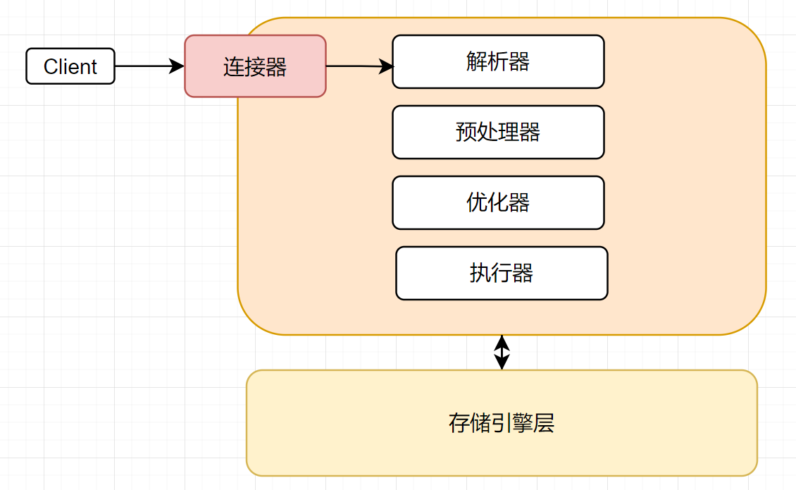

# 1 MySQL架构



- 连接器主要负责连接处理、身份验证和权限认证等
- server层包含MySQL的主要功能，包括查询解析、分析、要优化以及所有内置函数等，所有夸存储引擎的功能也在这一层实现，如存储过程、触发器、视图等
  - 解析器主要做词法分析和语法分析，然后根据语法分析结果构建出SQL语法树
  - 预处理器主要负责检查查询语句中的表或者字段是否存在
  - 优化器负责制定执行计划，如扫描表的顺序以及使用那个索引等
  - 执行器主要负责与存储引擎进行交互拿取数据
- 第三层负责数据的存储和提取，不会解析SQL，但Innodb会解析外键定义，因为MySQL服务端没有实现这个功能


# 2 性能监控

## 2.1 1.Performance_Schema

`performance_schema` 是 MySQL 提供的一个用于监控和分析数据库性能的系统数据库。默认在数据库中时开启的，且这个变量在数据库中是只读的，只能通过修改配置文件修改。

```sql
mysql> select @@performance_schema;
+----------------------+
| @@performance_schema |
+----------------------+
|                    1 |
+----------------------+
1 row in set (0.00 sec)
```

> Performance_schema表分类

```mysql
--语句事件记录表，这些表记录了语句事件信息，当前语句事件表events_statements_current、历史语句事件表events_statements_history和长语句历史事件表events_statements_history_long、以及聚合后的摘要表summary，其中，summary表还可以根据帐号(account)，主机(host)，程序(program)，线程(thread)，用户(user)和全局(global)再进行细分)
show tables like '%statement%';

--等待事件记录表，与语句事件类型的相关记录表类似：
show tables like '%wait%';

--阶段事件记录表，记录语句执行的阶段事件的表
show tables like '%stage%';

--事务事件记录表，记录事务相关的事件的表
show tables like '%transaction%';

--监控文件系统层调用的表
show tables like '%file%';

--监视内存使用的表
show tables like '%memory%';

--动态对performance_schema进行配置的配置表
show tables like '%setup%';
```


## 2.2 2.查看数据库连接

`show processlist`语句可以查询当前 MySQL 数据库中运行的线程（连接）的信息。

```sql
mysql> show processlist;
+-----+-----------------+-----------------+------+---------+--------+----------------------------------------------------------+------------------+
| Id  | User            | Host            | db   | Command | Time   | State                                                    | Info             |
+-----+-----------------+-----------------+------+---------+--------+----------------------------------------------------------+------------------+
|   5 | system user     | connecting host | NULL | Connect | 765579 | Connecting to source                                     | NULL             |
|   6 | system user     |                 | NULL | Query   | 765579 | Replica has read all relay log; waiting for more updates | NULL             |
```

如果觉得线程太多，可以手动把它杀掉：

```sql
kill ID;
```

MySQL中的`wait_timeout`参数定义了MySQL服务器等待一个连接的活动时间，如果在这段时间内没有活动，连接将被断开。

```sql
mysql> select @@wait_timeout;
+----------------+
| @@wait_timeout |
+----------------+
|          28800 |
+----------------+
1 row in set (0.00 sec)
```


# 3 数据类型优化

- 更小的通常更好：应该尽量使用正确存储数据的最小数据类型，更小的数据类型通常更快，因为它们占用更少的磁盘、内存和CPU缓存
- 简单就好：简单数据类型的操作通常需要更少的CPU周期，如
  - 整型比字符串操作代价更低，因为字符集和校对规则是字符比较比整型比较更复杂
  - 使用mysql时间类型而不是字符串来存储日期和时间
  - 用整型存储IP地址
- 尽量不使用null：如果查询中包含了可为null的列，对mysql来说是很难优化的，因为可为null的列使得索引、索引统计和值比较都更加复杂，需要特殊处理，且可空列被索引后，每条记录需要多一个字节

- 整型类型
  - 可以选择无符号整数，会比无符号范围大一倍，且性能和存储一样

  - 整型类型可以指定宽度，但只是一个规范，与实际存储没有关系

- 实数类型
  - 只有对小数进行精确计算时才使用decimal类型
  - 在一些大容量的场景可以使用bigint，避免使用decimal代价高问题

- 字符串类型优化
  - vachar根据实际内容长度保存数据
    - 使用最小的符合需求的长度
    - vachar(n)当n小于255时用一个字节保存长度，n大于255时使用额外两个字节保存长度
  - 应用场景
    - 存储长度波动较大的数据，如：文章
    - 字符串很少更新的场景，每次更新后都会重算并使用额外存储空间保存长度
    - 适合保存多字节字符，如：汉字、特殊字符等
  - char固定长度的字符串
    - 最大长度：255
    - 会自动删除末尾的空格
    - 检索效率、写效率会比varchar高，以空间换时间
  - 应用场景
    - 存储长度波动不大的数据，如：md5摘要
    - 存储短字符串、经常更新的字符串，固定长度的行不容易出现碎片
  - 二进制字符串比较会比字符串比较要快
  - 使用varchar类型最好只分配需要的长度，因为内存中会分配固定长度来存储值
- 使用枚举类型代替字符串类型：mysql存储枚举类型会非常紧凑，会根据列表值的数据压缩到一个或两个字节中，且将每个值保存为整数；查找enum会有额外查找对应关系的开销，但会被enum的小尺寸抵消
- 时间类型
  - datetime：精确到微秒，不依赖服务器时区设置
  - timestamp：依赖服务器时区，默认为not null，不指定值会默认插入当前时间

- 可以用整数类型来存储UNIX纪元，来简化MySQL处理的复杂性

在创建表时最好不要创建太多的字段，因为MySQL存储引擎API通过在服务器和存储引擎之间以行缓冲区复制行来工作，然后服务器将缓冲区解码为列。将行缓冲区转换为具有解码列的行数据结构的操作代价非常高。


## 3.1 主键的选择

- 代理主键：与业务无关的，无意义的数字序列
- 自然主键：事务属性中的自然唯一标识
- 推荐使用代理主键，不推荐使用不连续且范围较大的主键，会使得插入完全随机
  - 它们不与业务耦合，因此更容易维护
  - 一个大多数表，最好是全部表，通用的键策略能够减少需要编写的源码数量，减少系统的总体拥有成本
  - 需要为新纪录寻找合适位置，且可能导致数据库分布不够优化
  - 目标页可能已经从缓存中清除或还没有缓冲，需要先从磁盘中找到目标页并加载到缓存中，大量随机IO
  - 乱序写入会导致频繁页分裂，频繁页分裂会导致页变得稀疏且不规则填充，所有会有数据碎片
  - 所以在填入不规则数据后。最好执行一次`optimize table`来重建表并优化页的填充


## 3.2 字符集的选择

- 纯拉丁字符能表示的内容，没必要选择latin1之外的其他字符编码，这会节省大量的空间
- UTF8字符集只能存储BMP(基本多文种平面)中的字符，大约占所有UNICODE字符的90%，一些补充平面中的字符，无法使用utf8，且utf8将在未来弃用，8.0.28版本之后默认字符集为utf8mb4
- 如果不确定需要存放多种语言，就没必要非得使用utf8或其他UNICODE字符集，这会造成大量的存储空间浪费
- MySQL的数据类型可以精确到字段，所以当我们需要大型数据库中存放多字节数据的时候，可以通过对不同表不同字段设置不同的数据类型来较大程度减少数据存储量，进而减低IO操作次数并提高换成命中率

```sql
CREATE TABLE your_table (
    column1 VARCHAR(255) CHARACTER SET utf8mb4 COLLATE utf8mb4_unicode_ci,
    column2 VARCHAR(255) CHARACTER SET latin1 COLLATE latin1_swedish_ci
);
```


## 3.3 数据冗余

- 场景：被频繁引用且只能通过join多张大表的方式才能得到的独立小字段
- 这样的场景由于每次join仅仅只是为了取得某个小字段的值，join到的记录又大，会造成大量不必要的IO，完全可以通过空间换取时间的方式来进行优化。不过，冗余的同时也要保证数据的一致性不被破坏，确保更新的同时冗余字段也要更新


## 3.4 适当拆分

当表中有类似于TEXT或者是很大的VARCHAR类型的大字段的时候，如果不是很常用，那么可以把它拆分到另外的独立表中，以减少常用数据所占用的存储空间。这样能增加每个磁盘块中可以存储的数据条数，既能减少物理IO次数，也能大大提高内存中的缓存命中率


# 4 执行计划


# 5 索引优化

> 索引监控

```mysql
show status like 'Handler_read%';

/*Handler_read_first：指示从索引中读取第一条行的次数。这对于访问索引中的第一条记录很有用，例如使用 MIN() 或 MAX() 函数。
Handler_read_key：指示请求通过索引读取一行数据的次数。这是一种非常有效的读取方式，因为它是在索引中直接定位行的。
Handler_read_next：指示 MySQL 从索引中读取下一行数据的次数。这是在索引顺序扫描时使用的操作。
Handler_read_prev：指示 MySQL 从索引中读取上一行数据的次数。在某些特定情况下，MySQL 可能需要向前遍历索引，例如使用 ORDER BY ... DESC。
Handler_read_rnd：指示 MySQL 在索引中随机读取一行数据的次数。这是一种较低效的读取方式，通常发生在无法使用索引来定位行的情况下。
Handler_read_rnd_next：指示 MySQL 在索引中随机读取下一行数据的次数。这是在索引随机扫描时使用的操作。*/
```

> 索引

- 索引是在存储层实现的，所以每个存储引擎有自己的锁实现
- 可以减少扫描数量
- 可以用来避免排序和临时表

- 可以把随机io转换成顺序io
- 高性能数据库中提到了一个设计索引的三星等级
  - 一星：索引将相关记录放在一起
  - 二星：索引中的数据顺序和排序顺序一致
  - 三星：索引中的列包含了查询中所需的列

- 前缀索引

  - 在设计前缀索引时，注意前缀索引的选择性，前缀索引越短且选择性越高越高

  ```mysql
  select count(distinct substring(pro,1))/count(*) from t2;
  ```

  - 前缀索引不能做排序和分组操作，也无法覆盖索引

- 索引合并

  - 索引合并使用多个单独索引扫描并合并结果集
    - or条件的联合union
    - and条件的相交intersection
    - 组合前两种的相交或联合
  - 做联合操作的时候，通常需要再算法的缓存、排序和合并操作上耗费大量CPU和内存资源，但优化器不会把这些操作计算到查询成本中，优化器只关心随机页面读取。导致查询的成本被低估，导致该执行计划不如直接全表扫描，可以使用union优化。
  - 可以使用`optimizer_switch`关闭索引合并功能

- 创建联合索引时字段的顺序

  - 在不考虑分组和排序操作时，建议把选择性高的索引放在前面

- 当页的大小填充到15/16的时候会把下一条记录填充到新页中，为以后的修改留出空间

- 为什么有的时候按主键索引顺序插入会有问题？

  - 对于高并发场景，按顺序插入可能会导致间隙锁竞争和自增锁竞争问题，``innodb_autoinc_lock_mode`参数可以修改自增锁模式

- 当表损坏的时候，可能会报一些奇怪的错，如主键冲突

  - 可以使用``check table`检查表，并使用`repair table`修复表
  - `alter table table_name engine=Innodb`来不做任何操作的重建表

- 数据碎片
  - 行碎片：数据存储到多个地方的多个片段中
  - 行间碎片：逻辑上顺序的页在磁盘上不是顺序的
  - 剩余空间碎片：数据页中有大量空余空间，导致服务器读取大量不需要的数据
  - 通过`optimize table`和不做任何操作的重建表来整理数据


# 6 查询优化

MySQL无法对同一个进行查询和更新，可以使用生成表方式绕开这个限制。

## 6.1 优化数据访问

在数据库中拿取数据的时候，不要一次性取大量数据，而是根据需要去拿取数据

- 只查询想要的行数，使用limit限制
- 不要取出全部的列
- 不要把一个数据重复获取，可以尝试缓存起来

可以尝试将一个复杂查询换成多个简单查询，也可以尝试把一个很耗时的大操作切分为很多个小操作，如一次删除大量数据 ，可以切换为一次删除适量数据。


## 6.2 优化联接查询

可以分解联接查询，在应用程序里做联接，这样做的好处有：

1. 单个查询可以减少锁竞争
2. 可以减少对冗余数据的访问
3. 可以更好的应用程序的缓存

MySQL采用半双工模式，客户端在获取数据实际上是从库函数的缓存中获取，在执行大查询的时候可以不保存缓存而直接处理结果以减少缓存消耗，可以使用`show processlist`查看连接状态

- sleep：线程正在等待客户端发送新请求
- query：线程正在执行查询或者正在将结果发送给客户端
- locked：在MySQL服务层，该线程正在等待表锁。在存储引擎级别实现的锁，例如，Innodb的行锁不会体现在线程状态中
- Analyzing and statistics：线程正在检查存储引擎的统计信息，并优化查询
- copying to tmp table [on disk]：线程正在执行查询，并且将其结果集复制到一个临时表中，这种状态一般要么是在做group by操作，要么是在进行文件排序操作，或者是在进行union操作。如果这个状态后面还带有on disk，那么表示mysql正在将一个内存临时表放在磁盘上
- sorting result：线程正在对结果集进行排序


## 6.3 union优化

在使用UNION进行连接查询时，推荐使用`union all`，因为使用`union`时，MySQL会在查询的时候给临时表加上`distinct`关键字，这个操作的代价很高


## 6.4 自定义变量

在查询中可以使用自定义变量存储中间结果

- 限制
  - 无法使用查询缓存
  - 不能在使用常量或者标识符的地方使用，例如列名、表名或者limit字句
  - 用户自定义变量的生命周期是在一个连接中有效，所以不能用它们来做连接间的通信
  - 不能显示的声明自定义变量类型
  - mysql优化器在某些场景下可能会将这些变量优化掉，这可能导致代码不按预想的方式运行
  - 赋值符号`:=`优先级非常低，所以在使用赋值表达式的时候应该明确的使用括号
  - 使用未定义变量不会报错，在mysql把未定义变量默认为NULL

- 应用场景

  - 优化排名语句

  ```mysql
  select id,@one:=@one+1 from t1;
  # 在8.0之后可以使用窗口函数dense_rank() over()来进行排名
  ```

  - 在更新一条记录的时间戳时，赋值给自定义变量，避免重新查询刚刚更新的数据

  ```mysql
  update t1 set id=now() where id=2 and @one=now();
  ```

  - 确定取值的顺序，赋值和读取变量可能在查询的不同阶段

  ```mysql
  # 先执行where再执行select，所以会取出两条数据
  select *,@one:=@one+1 from t1 where @one<=1;
  # 让取值和赋值在同一阶段
  select *,@one from t1 where (@one:=@one+1)<=1;
  ```


## 6.5 优化器

MySQL的优化器是一个非常重要的部分，主要负责对SQL的优化和制定执行计划，但优化器也有可能会出错，如：

- 统计信息不准确，统计信息存在于存储引擎中
- 成本指标不等于实际运行成本
- 优化器基于成本选择而不是基于执行时间
- 优化器不考虑其他并发执行的查询
- 有时候会基于规则优化，如使用match子句并存在全文索引的时候会选择使用对应的全文索引
- 无法考虑不受控制的操作成本，如存储函数或用户自定义函数的成本
- 无法估计所有的执行计划

优化器的优化策略一般分为静态优化和动态优化两种：

- 静态优化：直接对语法树进行分析并完成优化，只优化一次，是一种编译时优化
- 动态优化：与查询的上下文有关，在每次查询的时候重新评估，是一种运行时优化
  - 有时候动态优化甚至在查询的时候过程中也会进行重新优化，如在联查中，对范围检查的每一行都会重新评估进行索引

**优化器有很多种优化类型**

- 重新定义联接表的顺序
  - MySQL认为每一个查询都是联接
  - Union查询中MySQL先将一系列查询结果凡在一个临时表中，然后将临时表中数据读出来完成Union查询
  - 在8.0.2之后，MySQL不再使用基于块的方式联查，而是使用哈希联接。这让联接性能变的更好，特别是数据集可以全部放在内存中的时候
  - 优化器会尝试所有的联接顺序，但在可能结果过多的时候，会使用贪婪搜索查找最优顺序。贪婪搜索是一种启发式搜索方法，它尝试通过每一步都选择当前看起来最优的选择来逐步构建解决方案。在联接查询的上下文中，贪婪搜索可能会根据一些启发式规则（如表大小、索引选择性等）来决定联接顺序，而不是尝试所有可能的联接顺序。
  - 有的查询不能重新排序，如左联接和子查询，可以通这一点减少搜索空间
- 将外联接转换为内联接
- 使用代数等价变换规则
- 优化count、min、max等
- 预估并转换为常量表达式
- 覆盖索引扫描
- 子查询优化
- 提前终止查询
- 等值传播，如果传递的列表过大可以会导致性能问题
- 列表in的比较：MySQL会把in里面的值排序，然后使用二分法来确定列表中的值是否满足条件

可以使用`explain format=tree`指令查看指令树，在查看了执行计划后，再执行`show warnings`可以查看被重构后的语句


## 6.6 排序优化

当不使用索引排序的时候，MySQL需要自己排序，如果结果集小于内存的时候，可以直接使用内存进行快速排序。如果内存不够，会将数据分块，然后对每一块在内存中进行快排，将结果集存储到磁盘中，最后在磁盘中合并，最后返回排序结果。

排序一般有两种算法：

- 两次传输排序：读取行指针和需要排序的字段对其进行排序，然后根据排序结果读取所需的数据行。第二次读取时随机IO很消耗性能。
- 单次传输排序：读取查询所需要的全部行，然后根据排序列进行排序，最后直接返回结果
- 排序时会为每一个字段分配足够的定长空间存放，如为每一个utf8mb4分配4个字节
- 如果小于max_length_for_sort_data使用单次传输，否则使用两次传输

在联接中，如果排序字段全部来自第一个表就会在处理第一个表时直接进行排序，否则都要进行完联查后再排序，limit也不例外。


# 7 分区表优化

- 分区表应用
  - 表非常大以至于无法全部都放在内存中，或者只在表的最后部分有热点数据，其他均是历史数据
  - 分区表的维护更加容易
    - 批量删除大量数据可以使用清除整个分区的方式，删除表分区是DDL操作，而删除数据时DML操作
    - 对一个独立分区进行优化、检查、修复等操作更容易
  - 分区表的数据可以分区在不同的物理设备上，从而高效的利用多个硬件设备，可以使用分区表来避免某些特殊瓶颈
    - innodb的单个索引的互斥访问
    - ext3文件系统的innode锁竞争
  - 可以备份和恢复独立的分区
- 分区表的限制
  - 一个表最多只能有1024个分区，在5.7版本的时候可以支持8196个分区
  - 在早期的mysql中，分区表达式必须是整数或者是返回整数的表达式，在mysql5.5中，某些场景可以直接使用列来进行分区
  - 如果分区字段中有主键或者唯一索引的列，那么所有主键列和唯一索引列都必须包含进来
  - 分区表无法使用外键约束

- 分区表如何使用
  - 全量扫描数据，不要任何索引
    - 使用简单的分区方式存放表，不要任何索引，根据分区规则大致定位需要的数据为止，通过使用where条件将需要的数据限制在少数分区中，这种策略适用于以正常的方式访问大量数据
  - 索引数据并分离热点
    - 如果数据有明显的热点，而且除了这部分数据，其他数据很少被访问到，那么可以将这部分热点数据单独放在一个分区中，让这个分区的数据能够有机会都缓存在内存中，这样查询就可以只访问一个很小的分区表，能够使用索引，也能够有效的使用缓存

- 分区表使用问题
  - null值会使分区过滤无效
  - 分区列和索引列不匹配，会导致分区无法进行分区过滤
  - 选择分区的成本可能很高
  - 打开并锁住所有底层表的成本可能很高
  - 维护分区的成本可能很高


# 8 锁优化


# 9 参数优化

一般mysql的配置文件位于`/etc/my.cnf`，配置文件使用INI格式，一般服务器配置位于`mysqld`块中。

在8.0之后，在命令行动态修改系统变量时，可以使用`set persist`，这将把修改过后的系统变量持久化到磁盘中，以便重启时继续使用修改过后的变量。

如果你不知道一个参数调整后会发生什么，那么你最好使用默认参数；且不要以缓存命中率。

在参数调优中应该避免**按比例调优**，比如Innodb缓冲池命中率应该高于某个百分比，如果命中率过低，应该增加缓存大小。这是非常错误的，**命中率与缓存大小无关，只与工作负载有关**

- `Innodb_buffer_pool_read_requests` 表示从缓冲池中读取数据的请求数量。
- `Innodb_buffer_pool_reads` 表示从磁盘读取数据到缓冲池的次数。
- 缓冲池命中率可以通过以下公式计算：命中率 = 1 - (Innodb_buffer_pool_reads / Innodb_buffer_pool_read_requests)。

Innodb缓冲池对于MySQL来说是很重要的，Innodb缓冲池不仅缓存索引、还缓存数据、自适应哈希、更改缓冲区、锁和其他内部结构等。Innodb还使用缓冲池来实现延迟写操作，从而可以将多个写操作合并在一起并按顺序执行。MySQL在启动时缓冲池是空的，可以搭配`Innodb_buffer_pool_dump_at_shutdown`和`Innodb_buffer_pool_load_at_startup`参数来在启动时预热数据库，但会拖慢数据库启动速度。


## 9.1 general

- datadir=/var/lib/mysql：数据文件存放目录
- socket=/var/lib/mysql/mysql.sock：套接字文件，当server和client在同一台服务器，并且使用localhost进行连接时，就会使用socket进行连接
- pid_file=/var/lib/mysql/mysql.pid：pid文件
- port=3306：mysql服务的端口号
- default_storage_engine=InnoDB：默认存储引擎
- skip-grant-tables：当忘记mysql的用户密码时，可以在mysql配置文件中配置该参数，跳过权限表验证，不需要密码即可登录
- sql_require_primary_key：
- `sql_require_primary_key` 是 MySQL 数据库中的一个参数，它控制是否要求每个表都有主键。主键是表中的一列或一组列，其值用于唯一标识表中的每一行。这个参数的值决定了在创建或修改表时是否需要定义主键。`sql_require_primary_key`是MySQL 8.0.13版本引入的一个新的参数，这个参数可以在全局或会话级别动态修改，默认值是OFF。
- lower_case_table_names：
- 系统变量lower_case_table_names有三个值：分别是0、1、2.
  1. 设置成0(Linux)：表名按你写的SQL大小写存储，大写就大写小写就小写，比较时大小写敏感。
  2. 设置成1(Windows)：表名转小写后存储到硬盘，比较时大小写不敏感。 
  3. 设置成2(macOS)：表名按你写的SQL大小写存储，大写就大写小写就小写，比较时统一转小写比较。

     > 数据库名与表名是严格区分大小写的；
     > 表的别名是严格区分大小写的；
     > 列名与列的别名在所有的情况下均是忽略大小写的；
     > 变量名也是严格区分大小写的；

- sql_mode：用于控制 MySQL 数据库服务器的 SQL 执行模式。它可以影响到 SQL 语句的语义和执行行为。如果你想引用`Group BY`字句以外的列，可以修改`ONLY_FULL_GROUP_BY`


## 9.2 character

- character_set_client：客户端数据的字符集
- character_set_connection：在处理客户端发送过来的信息时，会把这些数据转换成连接的字符集格式
- character_set_results：发送给客户端的结果集所用的字符集
- character_set_database：数据库默认字符集
- character_set_server：server默认字符集


## 9.3 connection

- max_connections：最大连接数

  ```mysql
  SHOW STATUS LIKE 'Max_used_connections';
  -- 可以查看Max_used_connections来确定服务器在峰值负载期间需要处理的最大连接数量
  ```

- max_user_connections：限制每个用户的连接个数

- back_log：mysql能够暂存的连接数量，当mysql的线程在一个很短时间内得到非常多的连接请求时，就会起作用，如果mysql的连接数量达到max_connections时，新的请求会被存储在堆栈中，以等待某一个连接释放资源，如果等待连接的数量超过back_log,则不再接受连接资源

- wait_timeout：关闭一个非交互式的连接之前需要等待的时长

- interactive_timeout：关闭一个交互连接之前需要等待的秒数

  

## 9.4 log

- log_error：错误日志名称，用于记录当mysql启动和停止时，以及服务器在运行中发生任何严重错误时的相关信息
- log_bin：指定二进制文件名称，用于记录对数据造成更改的所有查询语句
- max_binlog_size：设置binlog的最大大小，达到后触发binlog切换逻辑
- binlog_do_db：指定将更新记录到二进制日志的数据库，其他所有没有显式指定的数据库更新将忽略，不记录在日志中
- binlog_ignore_db：指定不将更新记录到二进制日志的数据库
- sync_binlog：指定多少次写日志后同步磁盘
- general_log：开启查询日志
- gerneral_log_file：指定查询日志文件名
- slow_query_log：开启慢查询日志
- slow_query_log_file：指定慢查询日志名称
- long_query_time：设置慢查询时间
- log_slow_admin_statements：是否将管理语句写入慢查询日志


## 9.5 cache

- key_buffer_size：索引缓存区的大小(只对MyISAM表起作用)
- query cache
  - query_cache_size：查询缓存大小，8版本后被删除
    - show status like '%Qcache%'：查看缓存的相关属性
    - Qcache_free_blocks：缓存中相邻内存块的个数，如果值比较大，那么查询缓存中碎片比较多
    - Qcache_free_memory：查询缓存中剩余的内存大小
    - Qcache_hits：表示有多少此命中缓存
    - Qcache_inserts：表示多少次未命中而插入
    - Qcache_lowmen_prunes：多少条query因为内存不足而被移除cache
    - Qcache_queries_in_cache：当前cache中缓存的query数量
    - Qcache_total_blocks：当前cache中block的数量
  - query_cache_limit：超出此大小的查询将不被缓存
  - query_cache_min_res_unit：缓存块最小大小
  - query_cache_type：缓存类型，决定缓存什么样的查询
    - 0：禁用
    - 1表示将缓存所有结果，除非sql语句中使用sql_no_cache禁用查询缓存
    - 2表示只缓存select语句中通过sql_cache指定需要缓存的查询
- sort_buffer_size：每个需要排序的线程分派该大小的缓冲区
- max_allowed_packet=64M：限制server接受的数据包大小
- join_buffer_size=256k：表示关联缓存的大小
- thread_cache_size
  - Thread_cached：代表当前此时此刻线程缓存中有多少空闲线程
  - Threads_connected：代表当前已经建立连接的数量
  - Threads_created：代表最近一次服务启动，已创建线程的数据，如果该值比较大，那么服务器会一直在创建线程
  - Threads_running：代表当前激活的线程数


## 9.6 Innodb

- innodb_buffer_pool_size：该参数指定大小的内存来缓存数据和索引，最大可以设置物理内存的80%

- innodb_flush_log_at_trx_commit：控制innodb将log buffer中的数据写入日志文件并flush的时间点

- innodb_thread_concurrency：设置innodb线程的并发数，默认为0不受限制，如果要设置建议跟服务器的cpu核心数一致或者是cpu核心的两倍

- innodb_log_buffer_size：确定日志文件所用的内存大小，以M为单位

- innodb_log_file_size：确定数据日志文件的大小，以M为单位

- innodb_log_files_in_group：以循环方式将日志文件写到多个文件中

- read_buffer_size：mysql读入缓冲区大小，对表进行顺序扫描的请求将分配到一个读入缓冲区

- read_rnd_buffer_size：mysql随机读的缓冲区大小

- Innodb_buffer_pool_load_at_startup：这个参数控制 MySQL 在启动时是否将之前创建的 InnoDB 缓冲池快照文件加载到内存中，从而加速数据库的启动过程。

- Innodb_buffer_pool_dump_at_shutdown：这个参数控制 MySQL 在关闭时是否将 InnoDB 缓冲池中的数据页写入到磁盘上的一个快照文件中。这个快照文件的作用是在数据库重新启动时用来加速缓冲池的加载过程。

- innodb_file_per_table：此参数确定为每张表分配一个新文件

- innodb_data_file_path：配置 InnoDB 共享表空间文件

  ```ini
  innodb_data_file_path=ibdata1:10M:autoextend:max:50G
  ```

- innodb_autoinc_lock_mode：设置锁模式

  - 0：传统模式，每个插入语句都持有一个自增锁，如果有多个事务并发的执行 `INSERT` 操作，`AUTO-INC`的存在会使得 MySQL 的性能略有下降，因为同时只能执行一条 `INSERT` 语句。
  - 1：连续模式，如果 `INSERT` 语句能够提前确定插入的数据量，则可以不用获取自增锁，举个例子，像 `INSERT INTO` 这种简单的、能提前确认数量的新增语句，就不会使用自增锁，这个很好理解，在自增值上，我可以直接把这个 `INSERT` 语句所需要的空间流出来，就可以继续执行下一个语句了。
  - 2(default)：交互模式，所有的 `INSERT` 语句，包含 `INSERT` 和 `INSERT INTO ... SELECT` ，都不会使用 `AUTO-INC` 自增锁，而是使用较为轻量的 `mutex` 锁。这样一来，多条 `INSERT` 语句可以并发的执行，这也是三种锁模式中扩展性最好的一种。交互模式在**statement格式下的binlog**，并发情况下 `INSERT` 语句的执行顺序就无法得到保障

- Innoeb_print_all_deadlocks：这个变量是个全局变量，默认关闭，可以动态调整。会在每次发生死锁后，系统会自动将死锁信息输出到错误日志中。输出的内容是`show engine innodb status`中的`LASTER DETECTED DEADLOCK`部分的内容，但`LASTER DETECTED DEADLOCK`只会显示最新的一条，且要手动执行。所以推荐开启`innodb_print_all_deadlocks`

- innodb_dedicated_server：配置在专用数据库服务器环境中，自动根据系统的可用内存调整 InnoDB 缓冲池和日志缓冲池的大小，以尽可能地利用系统的内存资源，提高性能


# 10 复制

MySQL的复制格式有三种：

- 基于语句的复制
  - 记录源服务器的所有数据变更语句，简单并紧凑
- 基于行的复制
  - 将事件记录到日志中，详细记录了该行记录发生了什么变化，日志文件会变得很大
- 混合模式
  - 大部分使用基于语句，仅在需要的时候使用基于语句的
- 推荐使用基于行

在MySQL高版本中引入了全局事务标识符GTID，它使得MySQL在复制的时候更容易跟踪复制位点，是由server_uuid和递增的事务编号组成

**复制是有可能会崩溃的，所以需要一些安全措施来保证崩溃后的数据安全**

- innodb_flush_log_at_trx_commit=1
- sync_binlog=1
- relay_log_info_repository=table
  - 这个参数告诉 MySQL 使用表作为存储中继日志信息的位置。换句话说，MySQL 会在表中存储关于中继日志的信息，而不是存储在文件中。
- relay_log_recovery=ON
  - 在副本服务器监测到崩溃后会丢弃所有本地中继日志，并从源服务器中获取丢失的数据。


## 10.1 多线程复制

MySQL多线程复制目前有三种类型，使用`replica_parallel_type`查看：

- database：按数据库并行
- logical_clock：按逻辑时钟并行
- to_group：按组并行

除了这个之外，多线程复制还有几个需要注意的参数：

- replica_parallel_works：指定从服务器在执行复制操作时可以使用的并行工作线程数量
- replica_preserve_commit_order：指定是否保持事务提交的顺序

在对复制进行监控的时候，主要应该注意：

- 监控磁盘空间，因为MySQL的Binlog及relaylog都需要磁盘空间存储，如果磁盘空间不足可能会导致复制失败
- 监控复制的状态和错误：使用`show master status`和`show slave status`可以查看主从状态
- 监控复制的实际延迟：使用`show slave status`中的`seconds_behind_master`只能粗略的查看延迟情况，建议使用心跳记录来计算延迟时间，在源上每秒更新一次时间戳
  - 副本通过当前服务器时间戳和Binlog时间戳计算出来的，因此除非有正在处理的语句，否则无法报告延迟情况
  - 如果复制线程没有运行会报告null
  - 一些错误导致的复制线程停止时，如网络不稳定时，该值将为null
  - 长事务会导致延迟时间波动

对于复制来说，最重要的就是要保证副本数据一致性，可能会有一些意外导致数据不一致，如：

- 意外写入副本，就算设置了`super_read_only=1`也有可能会有意外写入，如`flush table`等语句就会对副本写入
- 使用双源复制，双方都写入了数据
- 基于语句的复制或不确定语句
- 若持久化的数据库崩溃
- 数据库bug

以上的原因都会有可能导致数据库数据不一致，所以建议：

- 设置`super_read_only`
- 基于行复制和确定语句
- 不要同时写入复制拓扑的多台机器

以上问题都解决后，让我们来看看有那些配置会导致复制出错：

- 注意配置服务ID且注意不一样
- 当使用语句复制时，如果副本崩溃会导致所有临时表丢失，会导致所有引用临时表的语句失败
- 错误配置复制过滤器
- 复制延迟过大
  - 使用多线程复制
  - 使用分片技术，使用副本扩展度操作，使用分片扩展写操作
  - 临时减低持久化要求
- 源服务器的超大数据包，当源服务器的`max_allowed_packet`与副本设置不一样时会导致无休止报错
- 磁盘空间耗尽


# 11 23.备份

一般来说，数据库备份可以根据备份时数据库的状态、备份文件的格式和备份的内容进行分类

> 备份时数据库的状态

- 冷备份：是在数据库关闭状态下进行的备份。由于是在数据库关闭下的备份，备份期间不会有新数据写入或修改，因此一致性较高。但会影响到业务的连续性
- 温备份：是在数据库运行状态下进行的，但是在可读状态下进行备份。可能会导致数据的不一致性
- 热备份：在数据库完全正常运行的状态下备份

> 备份文件的格式

- 逻辑备份：输出文本或SQL语句
  - 可以像查看文件一样查看数据
  - 恢复简单
  - 可以在云数据库中使用
  - 逻辑备份很灵活，可以使用--where来指定记录
  - 与存储引擎无关
  - 必须由数据库完成，需要占用更多的CPU
  - 逻辑备份有些场景会比物理备份要大
  - 无法保证导出后再还原的数据是一样的
  - 从逻辑备份中还原需要MySQL加载和还原语句
- 物理备份：备份数据库底层文件
  - 基于文件备份，只需要把文件复制到其他地方就行了
  - 非常容易跨平台，但可以会有大小写的问题
  - 物理备份还原很快

> 备份内容

- 完全备份：备份完全的数据
- 增量备份：备份任意类型的上次备份后的数据进行备份
- 差异备份：对上次全量之后的所有改变部分备份


> 常用备份工具

- mysqldump：逻辑、热、全量备份
- xtrabackup：物理、热、全量+增量备份


在数据库备份时，经常会看到`还原`和`恢复`这两个术语，很多人以为这两个术语表达的是一个意思，其实是不一样的

- 还原：意味着从备份中获取数据，或将备份放到数据库指定目录
- 恢复：意味着当异常发生后对系统或其部分的拯救


> 为什么我们要进行备份？

- 灾难恢复
- 误删除数据
- 审计，可以用备份数据查看历史数据
- 测试，可以用生产环境的数据进行测试

当我们想要备份的时候，我们要先进行备份策略和恢复策略的制定，这里就需要考虑以下几个问题

- 考虑恢复点目标(PRO)和恢复时间目标(RTO)
- 可以容忍丢失多少数据
- 恢复需要多久时间，哪种类型的宕机是可以接受的、宕机时服务怎么持续
- 需要恢复什么

且注意：**复制并不是备份**

在设计备份方案的时候，有以下几个建议

- 保留多个备份集
- 在生产中，对大数据库建议使用物理备份
- 定期从备份中抽取数据进行测试
- 通过演练对整个恢复过程需要的资源进行测量


> mysqldump

```sql
# 语法
mysqldump [options] db_name [tables] > name.sql
mysqldump [options] -B/--databases db1...
mysqldump [options] -A/--all-databases
mysqldump  --databases db1 --tables a1 a2
# 不加选项只会导出数据库下面的所有表
# 输出选项
--add-drop-database 在每个数据库创建语句前加上drop database语句
--add-drop-table 在每个表创建语句前加上drop table语句
-n 不包含数据库的创建语句
-t 不包含数据库的建表语句
-d 不包含数据
-T 自动生成两个文件：一个.sql文件，创建表结构语句；一个.txt文件，数据文件
--where：根据条件备份，--where="id='1'"
-F：导出数据之后，生成一个新的binlog
--single-transaction：导出数据之前提交一个BEGIN SQL语句，BEGIN 不会阻塞任何应用程序且能保证导出时数据库的一致性状态。
--lock-tables/-l：开始导出前，锁定所有表。


# 将db01库中score表备份到/var/lib/mysql-files/目录下
mysqldump -uroot -proot -T /var/lib/mysql-files/ db01 score
# 使用mysql> show variables like '%secure_file_priv%';
+------------------+-----------------------+
| Variable_name    | Value                 |
+------------------+-----------------------+
| secure_file_priv | /var/lib/mysql-files/ |
+------------------+-----------------------+
```


> xtrabackup

- 指定模式备份

```shell
xtrabackup --user=root --password=root --backup --target-dir=/root/test
```

- 流备份

```bash
xtrabackup --user=root --password=root --backup --stream=xbstream > ./test/tt.xbstream
# 流备份可以将文件备份成一个文件
# 还原
xbstream -x < ./test/tt.xbstream 
```

- 压缩备份

```bash
xtrabackup --user=root --password=root --backup --stream=xbstream --compress > ./test/tt.xbstream

# 还原
xbstream -x < ./test/tt.xbstream 
```

- 恢复

```bash
xtrabackup --user=root --password=root --prepare --target-dir=/root/test
xtrabackup --user=root --password=root --copy-back --target-dir=/root/test
```

`在备份恢复的时候，可以使用--skip-networking和--socket参数启动数据库，防止在恢复的时候被其他应用干扰`


