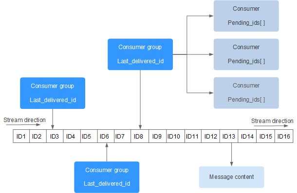
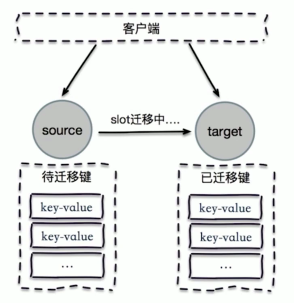
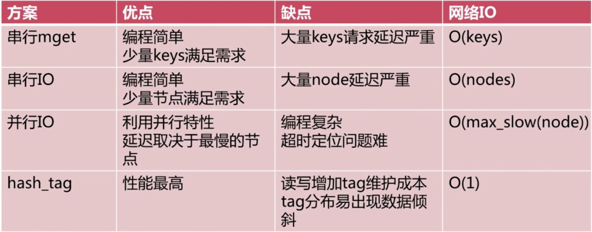
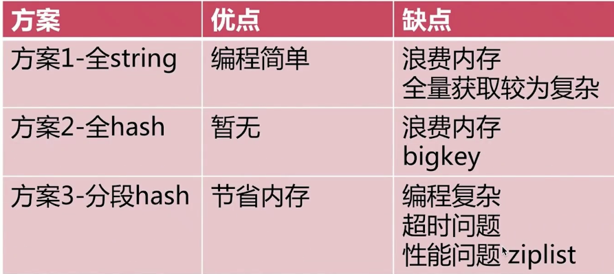

## 1.什么是Redis？

Redis诞生于2009年全称是Remote Dictionary Server，远程词典服务，是一个基于内存的键值型NOSQL数据库，基于c语言编写

**特征**：

- 键值型，value支持多种不同数据结构，功能丰富
- 单线程，每个命令具备原子性(redis6.0只有对网络请求处理才是多线程)
- 低延迟，熟读快(基于内存，IO多路复用，良好的编码)
- 支持数据持久化，可以将内存中的数据保存在磁盘中，重启的时候可以再次加载进行使用
- 支持数据的备份，即master-slava模式的数据备份
- 支持主从集群、分片集群
- 支持多语言客户端
- 开源

**优点**：

- 支持多种语言的客户端

- 性能极高-Redis读数据的速度是110000次/s,写的速度是81000次/s 
- 丰富的数据类型
- 原子-Redis的所有操作都是原子性的，意思是要么执行成功要么完全失败。单个操作是原子性的。多个操作也支持事务，即原子性，通过MULTI和EXEC指令包起来。
- 丰富的特性-Redis还支持publish/subscribe，通知，key过期等等特性

### 1.1.认识NOSQL

​																				**SQL与NOSQL的对比**

|          |                             SQL                              |                            NOSQL                             |
| :------: | :----------------------------------------------------------: | :----------------------------------------------------------: |
| 数据结构 |                      结构化(Structured)                      |                           非结构化                           |
| 数据关联 |                      关联的(Relational)                      |                           非关联的                           |
| 查询方式 |                           SQL查询                            |                            非SQL                             |
| 事务特性 |                             ACID                             |                             BASE                             |
| 存储方式 |                             磁盘                             |                             内存                             |
|  扩展性  |                             垂直                             |                             水平                             |
| 使用场景 | 1.数据结构固定               2.相关业务对数据安全性、一致性要求较高 | 1.数据结构不固定      2.对一致性、安全性要求不高      3.对性能高 |


### 1.2.Redis应用场景

- 缓存系统
- 计数器
- 消息队列系统
- 排行榜
- 社交网络
- 实时系统


## 2.Redis学习准备

Redis官网：[https://redis.io/](https://redis.io/)

Redis在线测试：[http://try.redis.io/](http://try.redis.io/)

Redis命令参考：[http://doc.redisfans.com/](http://doc.redisfans.com/)

### 2.1.Redis在Windows安装

​	[Redis官网](https://redis.io)：https://redis.io

- redis-cli：是redis提供的命令行客户端

- redis-server：是redis的服务端启动脚本
- redis-benchmark：Redis性能测试工具
- redis-check-aof：AOF文件修复工具
- redis-check-dump：RDB文件检查工具
- redis-sentinel：是redis的哨兵启动脚本
- ping：测试连接，在连接redis后，输出该命令返回PONG则连接成功


### 2.2.Redis在Linux安装

1. 下载压缩包：wget https://download.redis.io/releases/redis-3.0.7.tar.gz
2. 解压：tar -xvf redis-stable.tar.gz
3. 创建软链接：ln -s redis-stable redis
4. 编译：make
5. 安装：make install

> Redis三种启动方式

1. 最简启动
   1. redis-server
2. 动态参数启动
   1. redis-server --port 6390
3. 配置文件启动
   1. redis-server configPath

> 三种启动方式比较

1. 生产环境选择配置启动
2. 单机多实例配置文件可以用端口区分开

> Redis客户端返回值


### 2.3.配置文件配置


### 2.3.Redis客户端

安装完后，我们就可以操作Redis，实现数据的CRUD了。这需要用到客户端，包括：

- 命令行客户端
- 图形化桌面客户端
- 编程客户端

#### 2.3.1.命令行客户端

Redis安装完成后就自带了命令行客户端：redis-cli，使用方式如下：

```bash
redi-cli [options] [commonds]
```

其中常见的options有：

- `-h 127.0.0.1`:指定要连接的redis节点的IP地址，默认是127.0.0.1
- `-p 6379`:指定要连接的redis节点的端口，默认是6379
- `-a 123`:指定redis的访问密码

其中commonds就是Redis的操作命令，例如：

- `ping`:与redis服务器做心跳测试，服务器正常会返回`pong`

#### 2.3.2.图形化桌面客户端

[RedisDesktopManager]([RedisDesktopManager](https://github.com/uglide/RedisDesktopManager/releases/tag/2022.4.2)):github大神编写的客户端，直接下载安装就能用


## 3.Redis数据结构

Redis是一个key-value的数据库，key一般是hiString类型，不过value的类型多种多样：


### 3.1.key通用命令

1. help [command]：查看一个命令的具体用法

     ```bash
     KEYS pattern
      summary: Find all keys matching the given pattern
      since: 1.0.0
      group: generic
      return：符合条件的值
     # 具体模板可以去官网查看
     # 不建议在生产环境中使用
     ```

     ```bash
     DEL key [key ...]
      summary: Delete a key
      since: 1.0.0
      group: generic
      return：删除的元素数量，删除不存在的元素不计算在内
     ```

     ```bash
     EXISTS key
     summary: Determine if a key exists
     since: 1.0.0
     group: generic
     return：有返回1，无返回0
     ```

     ```bash
     EXPIRE key seconds
     summary: Set a key's time to live in seconds
     since: 1.0.0
     group: generic
     ```

     ```bash
     DBSIZE
      summary: 计算key总数
     ```
     
     ```bash
     TTL key(persist key 可以去掉过期时间)
     summary: Get the time to live for a key
     since: 1.0.0
     group: generic
     return：key过期后返回-2，-1代表永久有效
     ```
     
     > 时间复杂度
     
     | 命令   | 时间复杂度 |
     | ------ | ---------- |
     | keys   | O(n)       |
     | dbsize | O(1)       |
     | del    | O(1)       |
     | exists | O(1)       |
     | expire | O(1)       |
     | type   | O(1)       |
     
     
     
     

### 3.2.key的层级结构

Redis没有类似MYSQL中的Table的概念，我们该如何区分不同类型的key呢

- 例如需要存储用户，商品信息到redis，用户id是1，商品id也是1

- Redis的key允许有多个单词形成层级结构，多个单词之间用':'隔开，格式如下：

  > 项目名:业务名:类型:id
  >
  > 例如项目名称叫heima，有user和product两种不同类型的数据，我们可以这样定义key：
  >
  > user：heima:user:1
  >
  > product：heima:product:1
  >
  > 设置数据时： SET heima:user:1 "{'id':1, 'name':'jack', 'age':21}"
  >
  > 这样多插入几个后，会在Redis中形成层级结构
  >

### 3.3.String类型

String类型，也就是字符串类型，是Redis中最简单的存储类型

其value是字符串，不过根据字符串的格式不同，又分为3类：

- string：普通字符串
- int：整数类型，可以做自增自减
- float：副段类型，可以做自增自减

**不管是那种，底层都是字节数组形式存储，之不贵是编码方式不同。字符串类型的最大空间不能超过512m**

**String结构是将对象序列化为JSON字符串后存储，当需要修改对象的某个字段时很不方便**

#### 3.3.1.String常用命令

- SET：添加或者修改已经存在的String类型的键值对
- GET：根据key获取String类型的value

- MSET：批量添加对个String类型的键值对(O(n))
- MGET：根据对个key获取多个String类型的value(O(n))
- INCR：让一个整型的key自增1
- INCRBY：让一个整型的key自增并指定步长
- INCRBYFLOAT：让一个浮点类型的数字自增并指定步长
- SETNX：添加一个string类型的键值对，前提是这个key不存在，否则不执行
- SETEX：添加一个string类型的键值对，并且指定有效期


### 3.4.Hash类型

Hash类型，也叫散列，其value是一个无序字典，类似于java中的HashMap结构

Hash是Redis中一个string类型的field(字段)和value(值)的映射表，hash特别适合用于存储对象，每个hash可以存储2^32 -1个键值对

Hash结构可以将对象中的每个字段独立存储，可与针对单个字段做CRUD


#### 3.4.1.Hash常见命令

- HSET KEY FIELD VALUE：添加或者修改hash类型key的field的值
- HGET KEY FIELD：获取一个hash类型key的field的值
- HMSET ：批量添加多个hash类型key的field的值
- HMGET：批量获取对个hash类型key的field的值
- HGETALL：获取一个hash类型的key中的所有field和value
- HKEYS：获取一个hash类型key中的所有field
- HVALS：获取一个hash类型的key中的所有value
- HINCRBY：让一个hash类型key的字段值自增并指定步长
- HSETNX：添加一个hash类型的key的field值，前提是这个field不存在，否则不执行


### 3.5.List类型

Redis中的List类型与java中的LinkedList类似，可以看做是一个双向链表结构。支持正向检索也可以支持反向检索

一个列表最多可以包含2^32-1个元素

特征：

- 有序
- 元素可以重复
- 插入和删除快
- 查询速度一般


#### 3.5.1.List常用命令

- LPUSH KEY ELEMENT...:向列表左侧插入一个或多个元素
- LPOP KEY：移除并返回列表左侧的第一个元素，没有则返回nil
- RPUSH KEY ELEMENT...：向列表右侧插入一个或多个元素
- RPOP KEY：移除并返回列表左侧的第一个元素，没有则返回nil
- LRANGE KEY STAT END：返回一段角标范围内的所有元素
- BLPOP和BRPOP：与LPOP和RPOP类似，只不过在没有元素时等待指定时间，而不是直接返回nil


### 3.6.set类型

Redis的Set结构与java中的HashSet类型，可以看做是一个以value为null的HashMap。也是一个hash表，因此具备与HashSet类似的特征：

Redis中set最多可以为2^32 -1

- 无序
- 元素不可重复
- 查找快
- 支持交集、并集。差集等功能


#### 3.6.1.Set常见命令

- SADD key member...:向set中添加一个或多个元素
- SREM key member...:移除set中的指定元素
- SCARD key：返回set中元素的个数
- SISMEMBER key member：判断一个元素是否存在与set中
- SMEMBERS key：获取set中所有的元素
- SINTER key1 key2...:求多个List的交集
- SDIFF key1 key2....:求多个List的差集
- SUNION key1 key2....:求多个List的并集


### 3.7.SortedSet类型

Redis的SortedSet是一个可排序的set集合，与java中的TreeSet有些类似，但底层数据结构却差别很大。SortedSet中的每一个元素都带有一个score属性，可以基于对score属性对元素排序，底层的实现是一个跳表加hash表。特性如下：

- 可排序
- 元素不可重复
- 查询速度快

因为SortedSet的可排序性，**经常被用来实现排行榜这样的功能**


#### 3.7.1.SortedSet类型常用命令

- ZADD key score member...:添加一个或多个元素到SortedSet，如果已经存在则更新其score值
- ZREM key member:删除SortedSet中的一个指定元素
- ZSORE key member:获取SortedSet指定元素的score值
- ZRANK key member:获取SortedSet中指定元素的排名
- ZCARD key:获取SortedSet中的元素个数
- ZCOUNT key min max:统计score值在给定范围内的所有元素的个数
- ZINCRBY key increment member:让SortedSet中的指定元素自增，步长为指定的increment值
- ZRANGE key min max:按照score排序后，获取指定排名范围内的元素
- ZRANGEBYSCORE key min max:按照score排序后，获取指定score范围内的元素
- ZDIFF、ZINTER、ZUNION：求差集、交集、并集

所有默认排序全为`升序排序`，若要降序，则在命令的Z后面加`REV`


### 3.8.geospatial 地理位置

Redis GEO主要用于存储地理位置信息，并对存储的信息进行操作

有效的经度从-180度到180度。

有效的纬度从-85.05112878度到85.05112878度。

当坐标位置超出上述指定范围时，该命令将会返回一个错误。

**内部使用的类型为sortedset**

#### 3.8.1.GEO常见操作

- geoadd：添加地理坐标的位置
- geopos：获取地址位置的坐标
- geodist：计算两个位置之间的距离
- georadius：根据用户给定的经纬度坐标来获取指定范围内的地理位置集合
- georadiusbymember：根据存在位置集合里面的某个地点获取指定范围内的地理位置集合
- geohash：返回一个或多个位置对象的geohash值

**geoadd**

geoadd用于存储指定的地理空间位置，可以将一个或者多个经度(longitude)、纬度(latitude)、位置名称(member)添加到指定的key中

geoadd语法格式如下：

```
GEOADD key longitude latitude member [longitude latitude member ...]
```

**实例：**

```base
geoadd china:city 106.50 29.53 chongqin 114.05 22.52 shengzheng
(integer) 2
```

**geopos**

geopos用于从给定的key里返回所以指定名称的位置，不存在返回nil

geopos语法：

```base
GEOPOS key member [member ...]
```

**实例：**

```base
 geopos china:city shengzheng shanghai beijin
1) 1) "114.04999762773514"
   2) "22.520000087950386"
2) 1) "121.47000163793564"
   2) "31.229999039757836"
3) 1) "116.39999896287918"
   2) "39.900000091670925"
```

**geodist**

geodist用于返回两个给定位置之间的距离

geodist语法：

```base
GEODIST key member1 member2 [m|km|ft|mi]
```

最后一个距离单位参数说明：

- m：米，默认单位
- km：千米
- mi：英里
- ft：英尺

**实例：**

```base
geodist china:city beijin shanghai km
"1067.3788"
```

**georadius、georadiusbymember**

`georadius`以给定的经纬度为中心，返回键包含的位置元素当中，与中心的距离不超过给定最大距离的所有位置元素

`georadiusbymember`和 GEORADIUS 命令一样， 都可以找出位于指定范围内的元素，但是georadiusbymember的中心点是由给定的位置元素决定的，而不是使用经度和纬度来决定中心点

语法格式：

```base
GEORADIUS key longitude latitude radius m|km|ft|mi [WITHCOORD] [WITHDIST] [WITHHASH] [COUNT count] [ASC|DESC] [STORE key] [STOREDIST key]
GEORADIUSBYMEMBER key member radius m|km|ft|mi [WITHCOORD] [WITHDIST] [WITHHASH] [COUNT count] [ASC|DESC] [STORE key] [STOREDIST key]
```

参数说明：

- withcoord：将位置元素的经度和纬度也一并返回
- withdist：在返回位置元素的同时，将位置元素与中心之间的距离也一并返回
- withhash：以 52 位有符号整数的形式， 返回位置元素经过原始 geohash 编码的有序集合分值。 这个选项主要用于底层应用或者调试， 实际中的作用并不大。
- count：限定返回的记录数
- asc：查找结果根据距离从近到远排序
- desc：从远到近排序
- store key：将返回结果的地理位置信息保存到指定键
- storedist key：将返回结果距离中心节点的距离保存到指定键

**实例**

```base
 GEORADIUS Sicily 15 37 200 km WITHDIST
1) 1) "Palermo"
   2) "190.4424"
2) 1) "Catania"
   2) "56.4413"
redis> GEORADIUS Sicily 15 37 200 km WITHCOORD
1) 1) "Palermo"
   2) 1) "13.361389338970184"
      2) "38.115556395496299"
2) 1) "Catania"
   2) 1) "15.087267458438873"
      2) "37.50266842333162"
redis> GEORADIUS Sicily 15 37 200 km WITHDIST WITHCOORD
1) 1) "Palermo"
   2) "190.4424"
   3) 1) "13.361389338970184"
      2) "38.115556395496299"
2) 1) "Catania"
   2) "56.4413"
   3) 1) "15.087267458438873"
      2) "37.50266842333162"
      
      
redis> GEOADD Sicily 13.583333 37.316667 "Agrigento"
(integer) 1
redis> GEOADD Sicily 13.361389 38.115556 "Palermo" 15.087269 37.502669 "Catania"
(integer) 2
redis> GEORADIUSBYMEMBER Sicily Agrigento 100 km
1) "Agrigento"
2) "Palermo"
```

**geohash**

Redis GEO 使用 geohash 来保存地理位置的坐标。

geohash 用于获取一个或多个位置元素的 geohash 值。

geohash 语法格式如下：

```base
GEOHASH key member [member ...]
```

**实例**

```base
redis> GEOADD Sicily 13.361389 38.115556 "Palermo" 15.087269 37.502669 "Catania"
(integer) 2
redis> GEOHASH Sicily Palermo Catania
1) "sqc8b49rny0"
2) "sqdtr74hyu0"
```

### 3.9.HyperLogLog

Redis HyperLogLog 是用来做`基数统计`的算法，HyperLogLog 的优点是，在输入元素的数量或者体积非常非常大时，计算基数所需的空间总是`固定` 的、并且是很小的。

在 Redis 里面，每个 HyperLogLog 键只需要花费 12 KB 内存，就可以计算接近 2^64 个不同元素的基 数。这和计算基数时，元素越多耗费内存就越多的集合形成鲜明对比。

但是，因为 HyperLogLog 只会根据输入元素来计算基数，而不会储存输入元素本身，所以 HyperLogLog 不能像集合那样，返回输入的各个元素。

> HyperLogLog常用命令

- pfadd key element...:添加指定元素到HyperLogLog
  - pfcount key...:返回给定HyperLogLog的基数估算值

- pfmerge destkey sourcekey...：将多个HyperLogLog合并为一个HtperLogLog


> 使用经验

- 是否能容忍错误？(错误率：0.81%)
- 是否需要单条数据


### 3.10.Bitmaps

Redis中的位存储，可以用来统计用户信息，如：活跃状态，打卡等

bitmaps位图，数据结构。都是操作二进制位来进行记录，就只有0和1两个状态


特别节省内存

- setbit key offset value：给位图指定索引设置值，返回原先这个位置的值
- getbit key offset：获取给定偏移量的值
- bitcount key [start end]：获取位图指定范围(start-end，单位为字节，默认为全部)位值为1的个数
- bitop op destkey key...：做多个Bitmap的and(交集)、or(并集)、not(非)、xor(异或)操作并将结果保存在destkey中
- bitpos key [0-1] [start end]：计算位图指定范围第一个出现0或1的位置

```
# 记录周一到周天的打卡
setbit sign 1 0 # 设置星期一未打卡
getbit sign 1   # 查看星期一是否打卡
bitcount sign 0 1 # 统计sign中[0-1]的个数
bitop and hello op oq # 做交集放在hello中
```

### 3.11.Stream

Redis Stream是Redis 5.0版本新增加的数据结构

Redis Stream主要用于消息队列(MQ,Message Queue)，Redis本身是有一个发布订阅来实现消息队列的功能，但它有个缺点就是消息无法持久化，如果出现网络断开，Redis宕机等，消息就会被丢弃

简单来说发布订阅可以分发消息，但是无法记录历史消息

而Redis Stream提供了消息的持久化和主备复制功能，可以让任何客户端访问任何时刻的数据，并且能记住每一个客户端的访问位置，还能保证消息不丢失

Redis Stream的结构如下所示，它有一个消息链表，将所有加入的消息都串起来，每个消息都有一个唯一的ID和对应的内容



每个Stream都有唯一的名称，它就是Redis的key，在我们首次使用xadd指令追加消息时自动创建

- Consumer Group：消费组，使用XGROUP CREATE命令创建，一个消费组有多个消费者(Consumer)
- last_delivered_id：游标，每个消费组会有个游标last_delivered_id，任意一个消费组读取了消息都会使游标last_delivered_id往前移动
- pending_ids：消费组(Consumer)的状态变量，作用是维护消费组未确认的id。pending_ids记录了当前已经被客户端读取的消息，但是还没有ack(Acknowledge character：确认字符)

**消息队列相关命令**：

- XADD：添加消息到末尾
- XTRIM：对流进行修剪，限制长度
- XDEL：删除消息
- XLEN：获取流包含的元素数量，即消息长度
- XRANGE：获取消息列表，会自动过滤已经删除的消息
- XREVRANGE：反向获取消息列表，ID从大到小
- XREAD：以阻塞或非阻塞方式获取消息列表

**消费者组相关命令**：

- XGROUP CREATE:创建消费组组
- XREADGROUP GROUP：读取消费者组中的消息
- XACK：将消息标记为已处理
- XGROUP SETID：为消费者组设置新的最后传送消息ID
- XGROUP DELCONSUMER：删除消费者
- XGROUP DESTROY：删除消费者组
- XPENDING：显示待处理消息的相关信息
- XCLAIM：转移消息的归属权
- XINFO：查看流和消费者组的相关信息
- XINFO GROUPS：打印消费者组的信息
- XINFO STREAM：打印流信息

**XADD**

使用XADD向队列添加消息，如果指定的队列不存在，则创建一个队列

```
XADD key ID field value [field value...]
```

- key：队列名称
- ID：消息id，可以使用*表示由redis生成，可以自定义，但是要保证递增性
- field value：记录

**实例**：

```base
redis> XADD mystream * name Sara surname OConnor
"1601372323627-0"
redis> XADD mystream * field1 value1 field2 value2 field3 value3
"1601372323627-1"
redis> XLEN mystream
(integer) 2
redis> XRANGE mystream - +
1) 1) "1601372323627-0"
   2) 1) "name"
      2) "Sara"
      3) "surname"
      4) "OConnor"
2) 1) "1601372323627-1"
   2) 1) "field1"
      2) "value1"
      3) "field2"
      4) "value2"
      5) "field3"
      6) "value3"
```

**XTRIM**：

使用XTRIM对流进行修剪，限制长度

```
XTRIM key MAXLEN [~] count
```

- key：消息队列
- MAXLEN：长度
- count：数量

**实例**：

```base
127.0.0.1:6379> XADD mystream * field1 A field2 B field3 C field4 D
"1601372434568-0"
127.0.0.1:6379> XTRIM mystream MAXLEN 2
(integer) 0
127.0.0.1:6379> XRANGE mystream - +
1) 1) "1601372434568-0"
   2) 1) "field1"
      2) "A"
      3) "field2"
      4) "B"
      5) "field3"
      6) "C"
      7) "field4"
      8) "D"
```

**XDEL**：

使用XDEL删除消息

```
XDEL key ID [ID..]
```

**实例**：

```base
> XADD mystream * a 1
1538561698944-0
> XADD mystream * b 2
1538561700640-0
> XADD mystream * c 3
1538561701744-0
> XDEL mystream 1538561700640-0
(integer) 1
127.0.0.1:6379> XRANGE mystream - +
1) 1) 1538561698944-0
   2) 1) "a"
      2) "1"
2) 1) 1538561701744-0
   2) 1) "c"
      2) "3"
```

**XLEN**：

使用XLEN获取流包含的元素，即消息长度

```
XLEN key
```

**实例**：

```base
redis> XADD mystream * item 1
"1601372563177-0"
redis> XADD mystream * item 2
"1601372563178-0"
redis> XADD mystream * item 3
"1601372563178-1"
redis> XLEN mystream
(integer) 3
```

**XRANGE**：

使用XRANGE获取消息列表，会自动过滤已经删除的消息

```
XRANGE key start end [COUNT count]
```

- key:队列名
- start：开始值，`-`表示最小值
- end：结束值，`+`表示最大值
- count：数量

**实例**：

```base
redis> XADD writers * name Virginia surname Woolf
"1601372577811-0"
redis> XADD writers * name Jane surname Austen
"1601372577811-1"
redis> XADD writers * name Toni surname Morrison
"1601372577811-2"
redis> XADD writers * name Agatha surname Christie
"1601372577812-0"
redis> XADD writers * name Ngozi surname Adichie
"1601372577812-1"
redis> XLEN writers
(integer) 5
redis> XRANGE writers - + COUNT 2
1) 1) "1601372577811-0"
   2) 1) "name"
      2) "Virginia"
      3) "surname"
      4) "Woolf"
2) 1) "1601372577811-1"
   2) 1) "name"
      2) "Jane"
      3) "surname"
      4) "Austen"
```

**XREAD**

使用 XREAD 以阻塞或非阻塞方式获取消息列表 ，语法格式：

```
XREAD [COUNT count] [BLOCK milliseconds] STREAMS key [key ...] id [id ...]
```

- **count** ：数量
- **milliseconds** ：可选，阻塞毫秒数，没有设置就是非阻塞模式
- **key** ：队列名
- **id** ：消息 ID

**实例**：

```base
# 从 Stream 头部读取两条消息
> XREAD COUNT 2 STREAMS mystream writers 0-0 0-0
1) 1) "mystream"
   2) 1) 1) 1526984818136-0
         2) 1) "duration"
            2) "1532"
            3) "event-id"
            4) "5"
            5) "user-id"
            6) "7782813"
      2) 1) 1526999352406-0
         2) 1) "duration"
            2) "812"
            3) "event-id"
            4) "9"
            5) "user-id"
            6) "388234"
2) 1) "writers"
   2) 1) 1) 1526985676425-0
         2) 1) "name"
            2) "Virginia"
            3) "surname"
            4) "Woolf"
      2) 1) 1526985685298-0
         2) 1) "name"
            2) "Jane"
            3) "surname"
            4) "Austen"
```

**XGROUP CREATE**

使用 XGROUP CREATE 创建消费者组，语法格式：

```
XGROUP [CREATE key groupname id-or-$] [SETID key groupname id-or-$] [DESTROY key groupname] [DELCONSUMER key groupname consumername]
```

- **key** ：队列名称，如果不存在就创建
- **groupname** ：组名。
- **$** ： 表示从尾部开始消费，只接受新消息，当前 Stream 消息会全部忽略。

**实例**：

从头开始消费:

```base
XGROUP CREATE mystream consumer-group-name 0-0  
```

从尾部开始消费:

```base
XGROUP CREATE mystream consumer-group-name $
```

### 3.12.XREADGROUP GROUP

使用 XREADGROUP GROUP 读取消费组中的消息，语法格式：

```
XREADGROUP GROUP group consumer [COUNT count] [BLOCK milliseconds] [NOACK] STREAMS key [key ...] ID [ID ...]
```

- **group** ：消费组名
- **consumer** ：消费者名。
- **count** ： 读取数量。
- **milliseconds** ： 阻塞毫秒数。
- **key** ： 队列名。
- **ID** ： 消息 ID。

**实例**：

```base
XREADGROUP GROUP consumer-group-name consumer-name COUNT 1 STREAMS mystream >
```

## 4.慢查询

- 生命周期

  

  - 慢查询发生在第三阶段
  - 客户端超时不一定慢查询，但慢查询时客户端超时的一个可能因素

  

> 两个配置

- slowlog-max-len

  - 先进先出队列
  - 固定长度
  - 保存在内存内

- slowlog-log-slower-than

  - 慢查询阈值(微秒)
  - slowlog-log-slower-than=0，记录所有命令
  - slowlog-log-slower-than<0，不记录所有命令

- 配置方法

  - 默认值	

    - config get slowlog-max-len=128
    - config get slowlog-log-slower-than=10000

  - 修改配置文件重启

  - 动态配置

    - config set slowlog-max-len 1000
    - config set slowlog-log-slower-than 1000

    

> 慢查询命令

- slowlog get [n]:获取慢查询队列
- slowlog len:获取慢查询队列长度  
- slowlog reset:清空慢查询队列 


> 运维经验

- slowlog-max-len不要过小，通常设置1000左右
- slowlog-log-slower-than不要设置过大，默认10ms，通常设置1ms
- 理解生命周期
- 定期持久化慢查询


## 5.事务

Redis事务：一组命令的集合，Redis单挑命令保存原子性，但是事务不保证原子性

- 批量操作在发送exec命令前被放入队列缓存
- 收到exec命令后进入事务执行，事务中任意命令执行失败，其余的命令依然被执行
- 在事务执行过程，其他客户端提交的命令请求不会插入到事务执行命令序列中
- 一次性，顺序性，排他性

**事务流程**：

- 开始事务
- 命令入队
- 执行事务

### 5.1.事务常用命令

- discard：取消事务，放弃执行事务块内的所有命令
- exec：执行所有事务块内的命令
- multi：标记一个事务块的开始
- unwatch：取消watch命令对所有key的监视
- watch key...：监视一个或多个key，如果事务执行之前这个key被其他命令所改动，那么事务被打断

**实例**：

```base
127.0.0.1:6379> multi
OK
127.0.0.1:6379> set a 100                                                                                 <transaction>
QUEUED
127.0.0.1:6379> set b 1000                                                                                <transaction>
QUEUED
127.0.0.1:6379> get a                                                                                     <transaction>
QUEUED
127.0.0.1:6379> get b                                                                                     <transaction>
QUEUED
127.0.0.1:6379> del a b                                                                                   <transaction>
DEL will delete keys, it may cause high latency when the value is big.
Do you want to proceed? (y/n): y
Your Call!!
QUEUED
127.0.0.1:6379> exec                                                                                      <transaction>
1) "OK"
2) "OK"
3) "100"
4) "1000"
5) "2"
```

### 5.2.乐观锁

**悲观锁**：很悲观，认为什么时候都会出问题，无论做什么都会加锁

**乐观锁**：很乐观，认为什么时候都不会除问题，所以不会上锁

- 测试多线程修改值，在事务中用`watch`来实现乐观锁

## 6.Redis持久化

Redis是内存数据库，如果不将内存中的数据库状态保存到磁盘，那么一旦服务器进程退出，服务器中的数据库状态也会消失。所以Redis提供了持久化功能

redis所有数据保存在内存中，对数据的更新将异步的保存在磁盘上

### 6.1.RDB(Redis DataBase)

> 什么是RDB？

在主从复制中，rdb就是备用在从机上


在指定的时间间隔内将内存中的数据集快照写入磁盘，也就是Snapshot快照，它恢复时是将快照文件直接读到内存里。

Redis会单独创建(fork)一个子进程来进行持久化，会先将数据写入到一个临时文件中，待持久化过程都结束了，再用这个临时文件替换上次持久化好的文件。整个过程中，主进程是不进行任何IO操作的。这就确保了极高的性能。如果需要进行大规模数据的回复，且对于数据恢复的完整性不是非常敏感，那RDB方式要比AOF方式更加的高效，RDB的缺点是最后一次持久化后的数据可能丢失。默认就是RDB，一般情况下不需要修改配置

==rdb保存的文件是dump.rdb==

> 触发机制

1. 配置中设置自动持久化(执行bgsave)

   ```bash
   save 900 1 -> 900秒内至少有一次修改则触发保存操作
   save 300 10	-> 300秒内至少有10次修改则触发保存操作
   save 60 10000 -> 60秒内至少有1万次修改则触发保存操作
   dbfilename dump.rdb -> 生成的rdm文件名
   dir ./ -> 生成文件的存放路径
   stop-writes-on-bgsave-error yes -> 当写入发送错误是否停止
   rdbcompression yes -> rdb文件是否使用压缩格式
   rdbchecksum yes -> 是否对rdb文件进行校验
   ```

   

2. 全量复制

3. 执行flushall命令，也会触发rdb规则，但是得到的是一个空文件

4. 退出redis进程，也会触发(shutdown,debug reload)

> 持久化命令

- 执行save(O(n))的情况下，会自动生成rdb文件，此命令是同步命令，会堵塞其他命令,如果有老的文件则会被新文件替换。bgsave是异步的

  

> 如何恢复rdb文件

1. 只需要将rdb文件放在redis rdb存放目录，redis启动的时候回自动检测dump.rdb恢复其中的数据
2. 查看启动目录：config get dir

**优点**：

1. 适合大规模的数据恢复
2. 对数据完整性要求不高

**缺点**：

1. 需要一定的时间间隔进程操作！如果redis以外宕机了，这个最后一次修改数据就没有的了
2. fork进程的时候，会占用一定的内容空间

> 总结

1. RDB时Redis内存到硬盘的快照，用于持久化
2. save通常会阻塞Redis
3. bgsave不会阻塞redis，但是会fork新进程
4. save自动配置满足任一就会被执行
5. 有些触发机制不容忽视


### 6.2.AOF(Append Only File)

将我们的所有命令都记录下来，history，恢复的时候就再重复执行一遍

> AOF是什么


以日志的形式来记录每个写操作，将Redis执行过的所有指令记录下来(读操作不记录)，只许追加文件但不也可以改写文件，redis启动之初会读取该文件重新构建数据，换言之，redis重启的话就根据日志文件的内容将写指令从前到后执行一次以完成数据的恢复工作

==AOF保存的是appendonly.aof文件==

默认是不开启的。要开启的话将配置文件中"appendonly no"改成yes

如果aof文件有错位，这时候redis是启动不起来的，我们需要修复这个aof文件

redis给我们提供了一个工具`redis-check-aof --fix`

```base
redis-check-aof --fix appendonly.aof
# 修复appendonly.aof文件
```

> AOF三种策略

1. always

   

2. everysec(**默认**)

   

3. no

   


> AOF重写

对过期的、没有用的、重复的、可优化的数据进行化简。**可以减少硬盘占用量，加速恢复速度**


> AOF重写实现的两种方式

- bgrewriteaof命令

  

- AOF重写配置

  | 配置名                      | 含义                  |
  | --------------------------- | --------------------- |
  | auto-aof-rewrite-min-size   | AOF文件重写需要的尺寸 |
  | auto-aof-rewrite-percentage | AOF文件增长率         |

  | 统计名           | 含义                          |
  | ---------------- | ----------------------------- |
  | aof_current_size | AOF当前尺寸(字节)             |
  | zof_base_size    | AOF上次启动和重写的尺寸(字节) |

  

> AOF相关配置


**no-appendfsync-on-rewrite yes：表示在日志重写时，不进行命令追加操作，而只是将命令放在重写缓冲区里，避免与命令的追加造成磁盘 IO 上的冲突**


**优点**：

1. 每一次修改都同步
2. 默认每秒同步一次，可能会丢失一秒的数据
3. 从不同步，效率最高

**缺点**：

1. 相对于数据文件来说，aof远远大于rdb，修复的速度也比rdb慢
2. aof运行效率比rdb慢，

### 6.3.总结

1. RDB持久化方式能够在指定的时间间隔内对你的数据进行快照存储
2. AOF持久化方式记录每次对服务器写的操作，当服务器重启的时候回重新执行这些命令来恢复原始数据，AOF命令以Redis协议追加保存每次写的操作到文件末尾，Redis还能对AOF文件进行后台重写，使得AOF文件的体积不至于过大
3. 只做缓存，如果你只希望你的数据在服务器运行的时候存在，你也可以不使用任何持久化
4. 同时开启两种持久化方式
   1. 在这种情况下，当Redis重启的时候会优先载入AOF文件来恢复原始的数据，因为在通常情况下AOF文件保存的数据集要比RDB文件保存的数据要完整
   2. RDB的数据不实时，同时使用两者时服务器重启也只会找AOF文件，但是RDB更适合用于备份数据库(AOF在不断变化不好备份)，快速重启，而且不会又AOF可能潜在的Bug，留着作为一个万一的手段
5. 性能建议
   1. 因为RDB文件只用作后备用途，建议只在slave上持久化RDB文件，而且只要15分钟备份一次就够了，值保留save 900 1 这条规则
   2. 如果Enable AOF，好处是在最恶劣情况下也只会地址不超过两秒数据，启动脚本较简单只load自己的AOF文件就可以了，代价以是带来了持续的IO，而是AOF rewrite的最后将rewrite过程中产生的新数据写到新文件造成的阻塞几乎是不可避免的。只要硬盘许可，应该尽量减少AOF rewirite的频率，AOF重写的基础大小默认值64M太小，可以设到5g以上，默认超过原大小100%大小重写可以改到适当的数值
   3. 如果不Enable AOF，仅靠Master-Slave-Repllcation实现高可用性也可以，能省掉一大笔IO，也减少了rewrite时带来的系统波动。代价是如果Master/Slave同时倒掉，会丢失十几分钟的数据，启动脚本也要比较两个Master/Slave中的RDB文件，载入较新的那个，微博就是这种架构


### 6.4.Redis持久化的取舍和选择


### 6.5.Redis持久化运维常见问题

> fork操作

- 同步操作
- 与内存量息息相关：内存越大，耗时越长(与机器类型有关)
- info：latest_fork_usec

> 改善fork

- 优先使用物理机或者高效支持fork操作的虚拟化技术
- 控制Redis实例最大可用内存：maxmemory
- 合理配置Linux内存分配策略：vm.overcommit_memory=1
- 降低fork频率：例如放宽AOF重写自动触发机制时机，不必要的全量复制


> 子进程开销和优化

1. CPU
   - 开销：RDB和AOF文件生成，属于CPU密集型
   - 优化：不做CPU绑定，不和CPU密集型部署
2. 内存
   - 开销：fork内存开销，copy-on-write
   - 优化：echo never> /sys/kernel/mm/transparent_hugepage/enabled
3. 硬盘
   - 开销：AOF和RDB文件写入，可以结合iostat，iotop分析
   - 优化：
     - 不要和高硬盘负载服务部署在一起：存储服务、消息队列等
     - no-appendfsync-on-rewrite = yes
     - 根据写入量决定磁盘类型：例如ssd
     - 单机多实例持久化文件目录可以考虑分盘


> AOF追加阻塞


## 7.发布订阅

Redis发布订阅(push/sub)是一种`消息通信模式`：发送者(pub)发送消息，订阅者(sub)订阅消息。Redis客户端可以订阅任意数量的频道

下图展示了频道channel1，以及订阅这个频道的三个客户端--client2,、client5、client1之间的关系


当有新消息通过PUBLISH命令发送给频道channel1时，这个消息就会发送给订阅它的三个客户端


**实例**：

```base
# 我们打开两个redis-cli客户端
# 在第一个客户端订阅频道，为订阅端
subscribe runoobChat
# 结果：subscribe from runoobChat: 1
# 在第二个客户端发送消息，为发送端
publish runoobChat 'redis publish test'
(integer) 1
127.0.0.1:6379> publish runoobChat 'learn redis by runoob.com'
(integer) 1

# 在订阅端会显示
message   from runoobChat: redis publish test
message   from runoobChat: learn redis by runoob.com
```

### 7.1.订阅常用命令

- PSUBSCRIBE pattern...:订阅一个或多个符合给定模式的频道
- PUBSUB subcommand [argument...]:查看订阅与发布系统状态
- PUBLISH channel message：将消息发送到指定的频道，返回订阅者数量
- PUNSUBSCRIBE [pattern...]：退订所有给定模式的频道
- SUBSCRIBE channel...：订阅给定的一个或多个频道的信息
- UNSUBSCRIBE [channel...]：退订给定的频道

### 7.2.原理

Redis是使用c实现的，通过分析Redis源码里的pubsub.c文件，可以了解发布与订阅机制的底层实现

Redis通过PUBLISH、SUBSCRIBE等命令实现发布和订阅功能

通过SUBSCRIBE命令订阅某频道后，redis-server里维护了一个字典，字典的键就是一个个channel，而字典的值则是一个链表，链表中保存了所有订阅这个channel的客户端。SUBSCRIBE命令的关键，就是将客户端添加到给定channel的订阅链表中

通过PUBLISH命令向订阅者发送消息，redis-server会使用给定的频道作为键，在它维护的channel字典中查找记录了订阅这个频道的所有客户端的链表，遍历这个链表，将消息发布给所有订阅者

PUB/SUB从字面上理解就是发布(publish)与订阅(subscribe),在redis中，你可以设定对某一个key值进行消息发布及消息订阅，当一个key值上进行了消息发布后，所有订阅它的客户端都会收到响应的消息。这一功能最明显的语法就是用作实时消息系统

## 8.Redis连接命令

Redis 连接命令主要是用于连接 redis 服务。

- AUTH password：验证密码是否正确
- ECHO message：打印字符串
- PING：查看服务是否运行，正常会返回PONG
- QUIT：关闭当前连接
- SELECT index：切换到指定的数据库

## 9.Redis服务器

Redis 服务器命令主要是用于管理 redis 服务。


```
# 查看是否设置了密码
 config get required

# 设置密码
 config set required 'runoob'

# 验证密码
AUTH runoob
```


## 10.Redis客户端连接

Redis 通过监听一个 TCP 端口或者 Unix socket 的方式来接收来自客户端的连接，当一个连接建立后，Redis 内部会进行以下一些操作：

- 首先，客户端 socket 会被设置为非阻塞模式，因为 Redis 在网络事件处理上采用的是非阻塞多路复用模型。
- 然后为这个 socket 设置 TCP_NODELAY 属性，禁用 Nagle 算法
- 然后创建一个可读的文件事件用于监听这个客户端 socket 的数据发送

**最大连接数**

在 Redis2.4 中，最大连接数是被直接硬编码在代码里面的，而在2.6版本中这个值变成可配置的。

maxclients 的默认值是 10000，你也可以在 redis.conf 中对这个值进行修改。

```
config get maxclients

1) "maxclients"
2) "10000"
```

**实例**

以下实例我们在服务启动时设置最大连接数为 100000：

```base
redis-server --maxclients 100000
```


## 11.Redis 性能测试

Redis性能测试使通过同时执行多个命令实现的。

redis性能测试的基本命令：

```
redis-benchmark [option] [option value]
```

**注意**：该命令是在redis目录下执行

**实例**：

```base
redis-benchmark -n 100 -q
PING_INLINE: 25000.00 requests per second
PING_BULK: 20000.00 requests per second
SET: 20000.00 requests per second
GET: 25000.00 requests per second
INCR: 25000.00 requests per second
LPUSH: 561.80 requests per second
RPUSH: 20000.00 requests per second
LPOP: 20000.00 requests per second
RPOP: 25000.00 requests per second
SADD: 25000.00 requests per second
SPOP: 20000.00 requests per second
LPUSH (needed to benchmark LRANGE): 25000.00 requests per second
LRANGE_100 (first 100 elements): 12500.00 requests per second
LRANGE_300 (first 300 elements): 10000.00 requests per second
LRANGE_500 (first 450 elements): 9090.91 requests per second
LRANGE_600 (first 600 elements): 12500.00 requests per second
MSET (10 keys): 20000.00 requests per second
```


## 12.Redis管道技术(pipeline)

Redis是一种基于客户端-服务端模型以及请求/响应协议的TCP服务。这意味着通常情况下一个请求会遵循以下步骤：

- 客户端向服务端发送一个查询请求，并监听Socket返回，通常是以阻塞模式，等待服务端响应
- 服务端处理命令，并将结果返回给客户端

| 命令   | N个命令操作     | 1次pipeline(n个命令) |
| ------ | --------------- | -------------------- |
| 时间   | n次网络+n次命令 | 1次网络+n次命令      |
| 数据量 | 1一条命令       | n条命令              |

**Redis的命令时间是微秒级别。pipeline每次条数要控制(网络)**

Redis管道技术可以在服务端未响应时，客户端可以继续向服务端发送请求，并最终一次性读取所有服务端的响应，管道技术显著提高了redis服务的性能

```base
# 查看 redis 管道，只需要启动 redis 实例并输入以下命令：

$(echo -en "PING\r\n SET runoobkey redis\r\nGET runoobkey\r\nINCR visitor\r\nINCR visitor\r\nINCR visitor\r\n"; sleep 10) | nc localhost 6379

+PONG
+OK
redis
:1
:2
:3
```

> 使用建议

1. 注意每次pipeline携带数据量
2. pipeline每次只能作用在一个Redis节点上
3. M操作与pipeline区别


## 13.Redis主从复制

**概念**

主从复制，是指将一台Redis服务器的数据，复制到其他的Redis服务器，前者称为主节点(master/leader)，后者称为从节点(slave/follower)；数据的赋值是**单向**的，只能由主节点到从节点。**Master以写为主，Slave以读为主**

默认情况下，每台Redis服务器都是主节点；且一个主节点可以有多个从节点或没有从节点，但一个从节点只能有一个主节点。

主从复制的作用包括：

1. **数据冗余**：主从复制实现了数据的热备份，是持久化之外的一种数据冗余方式
2. **故障恢复**：当主节点出现问题时，可以由从节点提供服务，实现快速的故障恢复；实际上是一种服务的冗余
3. **负载均衡**：在主从复制的基础上，配合读写分离，可以由主节点提供写服务，由从节点提供读服务(即写Redis数据时应用连接主节点，读Redis数据时应用连接从节点)，分担服务器负载；尤其在写少读多的场景下，通过多个从节点分担负载，可以大大提高Redis服务器的并发量
4. **高可用基石**：除了上述作用外，主从复制还是哨兵和机群能实施的基础，一次说主从复制是Redis高可用性的基础


一般来说，要将Redis运用于工程项目中，只使用一台redis是不可能的(宕机，一主二从)，因为：

1. 从结构上，单个Redis服务器会发生单点故障，并且一台服务器需要处理所有的请求负载，压力较大
2. 从容量上，单个Redis服务器内存容量有限，就算一台Redis服务器内存容量为256g，也不能将所有内存用作Redis存储内存，一般来说，单台Redis最大使用内存不应该超过20g


### 13.1.基础

```base
# 环境配置

info REPLICATION # 查看当期库的信息
# Replication
role:master  # 角色
connected_slaves:0  # 没有从机
master_repl_offset:0
repl_backlog_active:0
repl_backlog_size:1048576
repl_backlog_first_byte_offset:0
repl_backlog_histlen:0

'''
在一台机器模拟主从需要开启三个服务，则需要三个配置文件
且相对于的服务的配置文件要进行相应的修改
port 6379  # 对应的端口号要改
daemonize yes # 后台服务要开启
pidfile /var/run/redis-6379.pid # 后台进程文件修改
logfile # 日志文件配置
dbfilename dump.rdb  # 持久化文件修改
'''

# 一主二从配置
# 只配置从机，不用配置主机
# 在从机中使用此命令指认主机
# 也可以在配置文件中配置此命令设置主机
slaveof ip port
# slaveof no one 命令可以在从节点断开主节点连接
slave-read-only #配置从节点只读
```


> 细节

主机可以写，从机只能读。主机中的所有信息和数据，都会被自动保存在从机。

当没有配置哨兵而主机挂了的时候，从机任然是从机，除非手动修改配置，只要一变成从机，立马就会从主机中拿到数据

> 赋值原理

Slave启动成功连接到master后会发送一个sync同步命令

master接到命令，启动后台的存盘进程，同时收集所有接受到的用于修改数据集命令，在后台进程执行完毕之后，master将传送整个数据文件到slave，并完成一次同步

`全量复制`：而slave服务在接受到数据库文件数据后，将其存盘并加载到内存中

`增量复制`：master继续将新的所有收集到的修改命令依次传给slave，完成同步

但是只要是重新连接master，一次**完全同步**(全量复制)将被自动执行


> 全量复制开销

1. bgsave时间
2. RDB文件网络传输时间
3. 从节点清空数据时间
4. 从节点加载RDB的时间
5. 可能的AOF重写时间


主从可以有多种模式

1. **同步模式（Synchronous Replication）：**
   - 在同步模式下，主节点在写入数据后等待所有从节点确认接收到数据，然后再向客户端发送成功响应。这确保了数据在主从节点之间的一致性，但也可能导致一些性能开销，尤其是在从节点与主节点之间的网络延迟较大时。
2. **异步模式（Asynchronous Replication）：**
   - 在异步模式下，主节点将写入的数据立即返回给客户端，而不等待从节点确认。从节点会在后台异步地复制主节点的数据。这种模式可以提高写入性能，但在某些情况下可能导致主从节点之间的数据稍有延迟。
3. **半同步模式（Semi-Synchronous Replication）：**
   - 半同步模式是同步模式和异步模式的一种折中。主节点等待至少一个从节点确认接收到数据后才响应客户端。这种方式在一定程度上保持了一致性，并减少了一些异步模式的延迟。
4. **无磁盘复制（Diskless Replication）：**
   - 在无磁盘复制模式下，从节点不会将复制的数据写入磁盘，而是直接保存在内存中。这可以提高从节点的复制性能，但在从节点重启时会导致数据丢失。
5. **断点续传（Resumable Replication）：**
   - Redis 6.0 引入了断点续传功能，允许从节点在复制时断开连接，然后在网络重新连接后继续从断点处进行复制，而不是重新开始。这可以提高复制的可靠性。


> 运维中常见问题

1. 读写分离
   - 复制数据延迟
   - 从节点故障
2. 主从配置不一致
   - 例如maxmemory不一致：丢失数据
   - 例如数据结构优化参数(hash-max-ziplist-entries)：内存不一致
3. 规避全量复制
   - 第一次全量复制不可避免：小主节点、低峰
   - 节点运行ID不匹配
     - 主节点重启(运行ID变化)
     - 故障转移，例如哨兵或集群
   - 复制积压缓冲区不足
     - 网络中断，部分复制无法满足
     - 增大复制缓冲区配置rel_backlog_size，网络增强
4. 规避复制风暴
   - 单节点复制风暴
     - 问题：主节点重启，多从节点复制
     - 解决：更换复制拓扑


### 13.2.Redis Sentinel架构

自动选举老大的模式

> 概述

主从切换技术的方法是，当主服务器宕机后，需要手动把一台从服务器切换为主服务器，这就需要人工干预，费时费力，还会造成一段时间内服务不可用。所以Redis从2.8开始正式提供了Sentinel(哨兵)架构来解决这个问题

哨兵能够自动监控主机是否故障，如果故障了**根据投票数自动将从库转换成主库**


> 作用步骤

1. 多个sentinel发现并确认master有问题 
2. 选举除一个sentinel作为领导
3. 选出一个slave作为master
4. 通知其他salve成为新的master的slave
5. 通知客户端主从变化
6. 等待老的master复活成为新master的slave


哨兵模式是一种特殊的模式，首先Redis提供了哨兵的命令，哨兵是一个独立的进程，作为进程，它会独立运行。其原理是**哨兵通过发送命令，等待Redis服务器响应，从而监控运行的多个Redis实例**


这里哨兵有两个作用：

- 通过发送命令，让Redis服务器返回监控其运行状态，包括主服务器和从服务器
- 当哨兵监测到master宕机，会自动将slave切换成master，然后通过发布订阅模式通知其他的从服务器，修改配置文件，让它们切换主机

然而一个哨兵进程对Redis服务器进行监控，可能会出现问题，为此，我们可以使用多个哨兵进行监控。各个哨兵之间还会进行监控，这样就形成了多哨兵模式


假设服务器宕机，哨兵1先检测到这个结果，系统并不会马上进行failover过程，仅仅是哨兵1主观的认为主服务器不可用，这个现象称为`主观下线`。当后面的哨兵也检测到主服务器不可用，并且数量达到一定值时，那么哨兵之间就会进行一次投票(投票算法)，投票的结果由一个哨兵发起，进行failover[故障转移]操作。切换成功后，就会通过发布订阅模式，让各个哨兵把自己监控的从服务器实现切换主机，这个过程称为`客观下线`


> 三个定时任务

1. **每10s**每个sentinel对master和slave执行info
   - 发现slave节点
   - 确认主从关系
2. **每2s**每个sentinel通过master节点的channel交换信息(pub/sub)
   - 通过\_\_sentinel\_\_:hello频道交互
   - 交互对节点的“看法”和自身信息
3. **每1s**每个sentinel对其他sentinel和redis执行ping
   - 心跳检测，失败判定依据


**哨兵启动步骤**：

1. **哨兵环境配置**

```bash
# 在安装目录下新建sentinel.conf
# Example sentinel.conf
 
# 哨兵sentinel实例运行的端口 默认26379
port 26379
 
# 哨兵sentinel的工作目录
dir /tmp
# 配置守护进程启动和日志
daemonize yes
logfile “26379.log”

# 哨兵sentinel监控的redis主节点的 ip port 
# master-name  可以自己命名的主节点名字 只能由字母A-z、数字0-9 、这三个字符".-_"组成。
# quorum 配置多少个sentinel哨兵统一认为master主节点失联 那么这时客观上认为主节点失联了
# sentinel monitor <master-name> <ip> <redis-port> <quorum>
  sentinel monitor mymaster 127.0.0.1 6379 2
 
# 当在Redis实例中开启了requirepass foobared 授权密码 这样所有连接Redis实例的客户端都要提供密码
# 设置哨兵sentinel 连接主从的密码 注意必须为主从设置一样的验证密码
# sentinel auth-pass <master-name> <password>
sentinel auth-pass mymaster MySUPER--secret-0123passw0rd
 
 
# 指定多少毫秒之后 主节点没有应答哨兵sentinel 此时 哨兵主观上认为主节点下线 默认30秒
# sentinel down-after-milliseconds <master-name> <milliseconds>
sentinel down-after-milliseconds mymaster 30000
 
# 这个配置项指定了在发生failover主备切换时最多可以有多少个slave同时对新的master进行 同步，
# 这个数字越小，完成failover所需的时间就越长，
# 但是如果这个数字越大，就意味着越 多的slave因为replication而不可用。
# 可以通过将这个值设为 1 来保证每次只有一个slave 处于不能处理命令请求的状态。
# sentinel parallel-syncs <master-name> <numslaves>
sentinel parallel-syncs mymaster 1
 
 
 
# 故障转移的超时时间 failover-timeout 可以用在以下这些方面： 
#1. 同一个sentinel对同一个master两次failover之间的间隔时间。
#2. 当一个slave从一个错误的master那里同步数据开始计算时间。直到slave被纠正为向正确的master那里同步数据时。
#3.当想要取消一个正在进行的failover所需要的时间。  
#4.当进行failover时，配置所有slaves指向新的master所需的最大时间。不过，即使过了这个超时，slaves依然会被正确配置为指向master，但是就不按parallel-syncs所配置的规则来了
# 默认三分钟
# sentinel failover-timeout <master-name> <milliseconds>
sentinel failover-timeout mymaster 180000
 
# SCRIPTS EXECUTION
 
#配置当某一事件发生时所需要执行的脚本，可以通过脚本来通知管理员，例如当系统运行不正常时发邮件通知相关人员。
#对于脚本的运行结果有以下规则：
#若脚本执行后返回1，那么该脚本稍后将会被再次执行，重复次数目前默认为10
#若脚本执行后返回2，或者比2更高的一个返回值，脚本将不会重复执行。
#如果脚本在执行过程中由于收到系统中断信号被终止了，则同返回值为1时的行为相同。
#一个脚本的最大执行时间为60s，如果超过这个时间，脚本将会被一个SIGKILL信号终止，之后重新执行。
 
#通知型脚本:当sentinel有任何警告级别的事件发生时（比如说redis实例的主观失效和客观失效等等），将会去调用这个脚本，
#这时这个脚本应该通过邮件，SMS等方式去通知系统管理员关于系统不正常运行的信息。调用该脚本时，将传给脚本两个参数，
#一个是事件的类型，
#一个是事件的描述。
#如果sentinel.conf配置文件中配置了这个脚本路径，那么必须保证这个脚本存在于这个路径，并且是可执行的，否则sentinel无法正常启动成功。
#通知脚本
# sentinel notification-script <master-name> <script-path>
  sentinel notification-script mymaster /var/redis/notify.sh
 
# 客户端重新配置主节点参数脚本
# 当一个master由于failover而发生改变时，这个脚本将会被调用，通知相关的客户端关于master地址已经发生改变的信息。
# 以下参数将会在调用脚本时传给脚本:
# <master-name> <role> <state> <from-ip> <from-port> <to-ip> <to-port>
# 目前<state>总是“failover”,
# <role>是“leader”或者“observer”中的一个。 
# 参数 from-ip, from-port, to-ip, to-port是用来和旧的master和新的master(即旧的slave)通信的
# 这个脚本应该是通用的，能被多次调用，不是针对性的。
# sentinel client-reconfig-script <master-name> <script-path>
 sentinel client-reconfig-script mymaster /var/redis/reconfig.sh

```

2. 启动哨兵

   ```base
   redis-sentinel 配置文件路径
   ```


**优点**：

1. 哨兵集群，基于主从复制模式，所有的主从配置优点都有
2. 主从可以切换，故障可以转移，系统的可用性就会更好
3. 哨兵模式就是主从模式的升级，手动到自动，更加健壮

**缺点**：

1. Redis不好在线扩容，集群容量一旦到达上限，在线扩容会十分麻烦
2. 实现哨兵模式的配置其实是很麻烦的，里面有很多选择


> 节点运维问题

1. 节点下线
   1. 机器下线：例如过保等情况
   2. 机器性能不足：例如CPU、内存、硬盘、网络等
   3. 节点自身故障：例如服务不稳定等
   4. 从节点：临时下线还是永久下线，例如是否做一些清理工作。但是要考虑读写分离情况
   5. sentinel节点同上
2. 节点上线
   1. 主节点：sentinel failover进行替换
   2. 从节点：slaveof即可，sentinel节点可以感知
   3. sentinel节点：参考其他sentinel节点启动即可

### 13.3.总结

- Redis Sentinel是Redis的高可用实现方案：故障发现、故障自动转移、配置中心、客户端通知
- Redis Sentinel从2.8版本开始使用
- 尽可能在不同物理机上部署Redis Sentinel所有节点
- Redis Sentinel中的节点个数应该大于等于三，且最好为奇数
- Redis Sentinel中的数据节点与普通数据节点没有区别
- 客户端初始化时连接的是Sentinel节点集合，不再是具体的Redis节点，但Sentinel只是配置中心不是代理
- Redis Sentinel实现读写分离高可用可以依赖Sentinel节点的消息通知，获取Redis数据节点的状态变化


## 14.Redis Cluster

> 为什么需要集群？

- 需要更高的并发量(OPS)
- 需要更多的数据量


### 14.1.数据分布


> 顺序分区和哈希分区

- 哈希分布

  1. 节点取余分区

     - 当采用节点取模时，如果节点扩容了，会导致**数据大规模迁移**(80%)；所以采用节点取模时，扩容最好采用多倍扩容(增加原节点数的倍数),这能**有效减低数据迁移**(50%)

     

  2. 一致性哈希分区

     - 客户端分片：哈希+顺时针(优化取余)
     - 当采用此方法时扩容，只会导致一个临近节点的数据迁移
     - 翻倍伸缩：保证最小迁移数据和负载均衡

     

  3. 虚拟槽分区

     - 预设虚拟槽：每个槽映射一个数据子集，一般比节点数大
     - 良好的哈希函数：例如CRC16
     - 服务端管理节点、槽、数据：例如Redis Cluster


### 14.2.Redis Cluster架构

> 单机架构


> 分布式架构


- 节点

  - 启动集群模式：cluster-enabled：yes

- meet

  - 所有节点共享消息

  

- 指派槽

  - 客户端只需计算key

  


> Redis Cluster特性

- 复制
- 高可用
- 分片


### 14.3.Redis Cluster安装

> 原生命令安装

1. 配置开启节点

   

   ```bash
   cluster-enabled yes  #  开启集群模式
   cluster-node-timeout 15000   # 超时时间
   cluster-config-file “nodes.conf”  # 集群配置文件
   cluster-require-full-coverage yes # 是否全部节点都提供服务才认为集群正常工作
   ```

2. meet

   

3. 指派槽

   

4. 主从

   

- 相关命令

  ```
  redis-cli cluster info # 查看cluster信息
  redis-cli cluster nodes # 查看cluster节点信息
  ```

> 官方工具安装

- Ruby环境准备

  - 下载编译安装Ruby

    

  - 安装rubygem redis

    

  - 安装redis-trib.rb

    

- 使用redis-trib.rb配置集群

  1. 开启redis服务

  2. 一键开启

     

     - --replicas：每个主节点有几个从节点

> 总结

1. 原生命令安装
   - 理解Redis Cluster架构
   - 生产环境不使用
2. 官方工具安装
   - 高效、准确
   - 生产环境可以使用
3. 其他
   - 可视化部署


### 14.4.集群伸缩

> 集群伸缩原理

集群伸缩=槽和数据在节点之间的移动


> 扩容集群

- 准备新节点

  - 集群模式
  - 配置与其他节点统一
  - 启动后是孤儿节点

- 加入集群

  - 作用：
    - 为它迁移槽和数据实现扩容
    - 作为从节点负责故障转移

  

  

- 迁移槽和数据

  - 槽迁移计划

    

  - 迁移数据

    

    

    ```bash
    redis-trib.rb reshard 127.0.0.1:6379
    #指定任意一个节点即可。
    #它首先会提示需要迁移多个槽
    #接着它会提示需要将槽迁移到哪个节点，这里必须写节点ID。
    #紧跟着它会提示槽从哪些节点中迁出。
    #如果指定为all，则待迁移的槽在剩余节点中平均分配，在这里，127.0.0.1:6379和127.0.0.1:6381各迁移100个槽出来。
    #也可从指定节点中迁出，这个时候，必须指定源节点的节点ID，最后以done结束
    ```

  - 添加从节点


> 收缩集群

- 下线迁移槽

- 忘记节点

  

- 关闭节点

  


### 14.5.客户端路由

> moved重定向


> ask重定向




> moved和ask

- 两者都是客户单重定向
- moved：槽已经确定迁移
- ask：槽还在迁移中


> smart客户端

- 追求性能
- python客户端：redis-py-cluster
- 从集群中选一个可运行节点，使用cluster slots初始化槽和节点映射
- 将cluster slots的结果映射到本地
- 准备执行命令


### 14.6.如何实现批量操作

mget mset所有key必须在一个槽

> 四种批量优化的方法

1. 串行mget

   - 使用循环遍历每个操作

   

2. 串行IO

   - 将操作分组，分好组以后只需要执行对应集群节点数的pipeline

   

3. 并行IO

   - 将操作分组，分好组以后开启多线程进行操作

   

4. hash_tag

   - 对key进行hash_tag包装，保证所有key在一个节点

   




### 14.7.故障转移

> 故障发现

- 通过ping/pong消息实现故障发现：不需要sentinel

- 主观下线

  - 定义：某个节点认为另一个节点不可用

  

- 客观下线

  - 当半数以上持有槽的主节点都编辑某节点主观下线

  


> 故障恢复

- 资格检查

  - 每个从节点检查与故障主节点的短线时间
  - 超过cluster-node-timeout * cluster-slave-validity-factor取消资格
  - cluster-slave-validity-factor默认是10

- 准备选举时间

  

- 选举投票

  

- 替换主节点

  - 当前从节点取消复制变为主节点(slaveof no one)
  - 执行clusterDelSlot撤销故障主节点负责的槽，并执行clusterAddSlot把这些槽分配给自己
  - 向集群广播自己的pong消息，表明已经替换了故障从节点


### 14.8.Redis Cluster常见问题

> 集群完整性

- cluster-require-full-coverage默认为yes
  - 集群中16384个槽全部可用：保证集群完整性
  - 节点故障或者正在故障转移：(error)CLUSTERDOWN The cluster is down
- 大多数业务无法容忍，建议设置为no


> 带宽消耗


- 消息发送频率：节点发现与其他节点最后通信时间超过cluster-node-timeout/2时会直接发送ping消息
- 消息数据量：slots槽数组(2KB空间)和整个集群1/10的状态数据(10个节点状态数据约1KB)
- 节点部署的机器规模：集群分布的机器越多且每台机器划分的节点数约均匀，则集群内整体的可用带宽越高

- 优化
  - 避免“大”集群：避免多业务使用一个集群，大业务可用多集群
  - cluster-node-timeout：带宽和故障转移速度的均衡
  - 尽量均匀分配到多机器上：保证高可用和带宽


> Pub/Sub广播

- 问题：publish在集群中每个节点广播：加重带宽
- 解决：单独“走”一套Redis Sentinel


> 集群倾斜

- 数据倾斜：内存不均

  

  - 节点和槽分配不均

    

  - 不同槽对应的键值数量差异较大

    

  - 包含bigkey

    

  - 内存相关配置不一致

    

- 请求倾斜：热点

  


> 集群读写分离

- 只读模式：集群模式的从节点不接受任何读请求

  - 重定向到负责槽的主节点
  - readonly命令可以读：连接级别命令

- 读写分离：更加复杂

  - 同样的问题：复制延迟、读取过期数据、从节点故障
  - 修改客户端：cluster slaves {nodeId}

  - 不建议在集群模式下使用读写分离


> 数据迁移


> 集群vs单机


### 14.9.集群总结


## 15.缓存

> 缓存的收益与成本

1. 收益
   - 加速读写
     - 通过缓存加速读写速度：CPU L1/L2/L3 Cache、Linux page Cache加速硬盘读写、浏览器缓存、Ehcache缓存数据库结果
   - 降低后端负载
     - 后端服务器通过前端缓存降低负载：业务端使用Redis降低后端MySQL负载等
2. 成本
   - 数据不一致：缓存层和数据层有时间窗口不一致，和更新策略有关
   - 代码维护成本：多了一层缓存逻辑
   - 运维成本：例如Redis Cluster
3. 使用场景
   - 降低后端负载
     - 对高消耗的SQL：join结果集/分组统计结果缓存
   - 加速请求响应
     - 利用redis/Memcache优化IO响应时间
   - 大量写合并为批量写
     - 如计数器先Redis累加再批量写DB


> 缓存更新策略

- LRU/LFU/FIFO算法剔除：例如maxmemory-policy
- 超时剔除：例如expire
- 主动更新：开发控制生命周期


> 缓存更新建议

- 底一致性：最大内存和淘汰策略
- 高一致性：超时剔除和主动更新结合，最大内存和淘汰策略兜底


> 缓存粒度控制

- 通用性：全量属性更好
- 占用空间：部分属性更好
- 代码维护：表面上全量属性更好


### 15.1.Redis缓存穿透

Redis缓存的使用，极大的提升了应用程序的性能和效率，特别是数据查询方面。但同时，它也带来了一些问题。其中，最重要的问题，就是数据的一致性问题，从严格意义上讲，这个问题无解。如果对数据的一致性要求很高，那么就不能使用缓存

另外一些典型问题就是缓存穿透、缓存雪崩和缓存击穿

> 概念

缓存穿透的概念很简单，用户想要查询一个数据，发现redis内存数据库没有，也就是缓存没有命中，于是向存储层数据库查询。发现也没有，于是本次查询失败。当用户很多的时候，缓存都没有命中，于是都去请求了存储层数据库。这会给存储层数据库造成很大的压力，这时候就相当于出现了缓存穿透

> 原因

- 业务代码自身问题
- 恶意攻击、爬虫等

> 如何发现

- 业务的相应时间
- 业务本身问题
- 相关指标：中调用书、缓存层命中数、存储层命中数

> 解决方案

1. **布隆过滤器**

布隆过滤器是一种数据结构，对所有可能查询的参数以hash形式存储，在控制层先进行校验，不符合则丢弃，从而避免了对底层存储系统的查询压力


2. **缓存空对象**

当存储层不命中后，即使返回的空对象也将其缓存起来，同时会设置一个过期时间，之后再访问这个数据将会从缓存中或区域，保护了后端数据源


但是这种方法会存在两个问题：

1. 如果空值能被缓存起来，这就意味着缓存需要更多的空间存储更多的键，意味着当中可能会有很多的空值的键
2. 即使对空值设置了过期时间，还是会存在缓存层和存储层的数据会有一点时间窗口的不一致，着对于需要保持一致性的业务会有影响

**缓存击穿**

> 概述

这里需要注意和缓存穿透的区别，缓存击穿，是指一个key非常热点，在不停的杠着大并发，大并发集中对着一个点进行访问，当这个key在失效的瞬间，持续的大并发就穿破缓存，直接请求数据库，就像在屏障上凿开了一个洞

当某个key在过期的瞬间，有大量的请求并发访问，这类数据一般是热点数据，由于缓存过期，会同时访问数据库来查询最新数据，并且回写缓存，会导致数据库瞬间压力过大


> 解决方案

**设置热点数据永不过期**

从缓存层面来看，没有设置过期时间，所以不会出现热点key过期后产生的问题

**加互斥锁**

分布式锁：使用分布式锁，保证对于每个key同时只有一个线程去查询后端服务，其他线程没有获得分布式锁的权限，一次只需要等待即可。这种方式将高并发的压力转移到了分布式锁，因此对分布式锁的考验很大


### 15.2.Redis缓存雪崩

> 概念

缓存雪崩，是指在某一个时间段，缓存集中过期失效，或由于cache服务承载大量请求，当cache服务异常/脱机，流量直接压向后端组件，造成级联故障

产生雪崩的原因之一，比如在写文本的时候，马上就要到双十二零点，很快就会迎来一波抢购，这波商品时间比较集中的放入了缓存，假设缓存一小时。那么到了凌晨一点钟的时候，这批商品的缓存就都过期了。而这对这批商品的访问查询，都落到了数据库上，对于数据库而言，就会产生周期性的压力波峰。于是所有的请求都会达到存储层，存储层的调用量会暴增，造成存储层也会挂掉的情况


其实集中过期，倒不是非常致命，比较致命的缓存雪崩，是缓存服务器某个节点宕机或断网。因为自然形成的缓存雪崩，一定是在某个时间段集中创建缓存，这个时候，数据库也是可以顶住压力的。无非就是对数据库产生周期性的压力而已。而缓存服务节点宕机，对数据库造成的压力是不可预知的，很有可能瞬间就把数据库压垮

> 解决方案

**redis高可用**

这个思想的含义是，既然redis有可能挂掉，那我多增设几台redis，这样一台挂掉之后其他的还可以继续工作，其实就是搭建的集群

**限流降级**

这个解决方案的思想是，在缓存失效后，通过加锁或者队列来控制读数据库写缓存的线程数量。比如对某个key只允许一个线程查询数据和写缓存，其他线程等待

**数据预热**

数据加热的含义就是在正式部署之前，我先把可能会访问的数据先预先访问一边，这样部分可能大量访问的数据就会加载到缓存中。在即将发送大并发访问前手动除法加载缓存不同的key，设置不同的过期时间，让缓存失效的时间尽量均匀


### 15.3.无底洞问题

"加"机器性能没有提升，反而下降了


> 优化IO

- 命令本身优化：例如慢查询keys
- 减少网络通信次数
- 降低接入成本：例如客户端长连接/连接池、NIO等


### 15.4.热点key重建优化


- 三个目标：

  - 减少重建缓存的次数
  - 数据尽可能一致
  - 减少潜在危险

- 两个解决

  - 互斥锁(mutex key)

    

  - 永不过期

    - 缓存层面：没有设置过期时间

    - 功能层面：为每个value添加逻辑过期时间，但发现超过逻辑过期时间后，会使用单独的线程去构建缓存

      


## 16.Redis云平台Cachecloud

### 16.1.Redis规模化困扰

> 遇到的问题

- 发布构建繁琐，私搭乱盖
- 节点&机器等运维成本
- 监控报警初级

> CacheCloud

- 一键开启Redis(Standalone、Sentinel、Cluster)
- 机器、应用、实例监控和报警
- 客户端：透明使用、性能上报
- 可视化运维：配置、扩容、Failover、机器/应用/实例上下线
- 已经存在Redis直接接入和数据迁移
- 开源地址：[cachecloud](https://github.com/sohutv/cachecloud)

> 使用场景

- 全量视频缓存(视频播放API)：跨机房高可用
- 消息队列同步(RedisMQ中间件)
- 分布式布隆过滤器(百万QPS)
- 计数系统：计数(播放量)
- 其他：排行榜、社交(直播)、实时计算(反作弊)等


## 17.基于Redis的分布式布隆过滤器

> 现在有50亿个电话号码，现有10万个电话号码，要快速准确判断这些电话号码是否已经存在？

- 通过数据库查询：实现快速有点难
- 数据预防在集合中：50亿 * 8字节 ≈ 40GB(内存浪费)
- hyperloglog：准确有点难

> 应用场景

- 垃圾邮件过滤
- 文字处理软件错误单词检测
- 网络爬虫重复url检测
- Hbase行过滤


### 17.1.布隆过滤器原理


### 17.2.误差率


- 与m/n与误差率成反比，k与误差率成正比


### 17.3.布隆过滤器


## 18.Redis开发规范

### 18.1.键值设计

> key设计


> value设计

- 拒绝bigkey

  

  - 危害

    - 网络阻塞
    - 集群节点数据不均衡
    - Redis阻塞
    - 频繁序列化：应用服务器CPU消耗

  - bigkey发现

    - 应用异常

      

    - redis-cli --bigkeys

      

    - scan+debug object

      

    - 主动报警：网络流量监控、客户端监控

      

    - 内核热点key问题优化

      

  - bigkey删除

    

    

    

- 选择合适的数据结构

  

  

  

  

  

  

  

- 过期设计

  


### 18.2.命令优化


### 18.3.客户端优化


## 19.内存管理

> redis内存优化

- 内存消耗
- 内存管理
- 内存优化

### 19.1.Redis内存消耗

- 内存使用统计

  

  

  

  

- 内存消耗划分

  

  

  

  

  

  - 使用命令`client list`可以查看全部客户端状态

  - **复制缓冲区**

    

  - **AOF缓冲区**

    

  - **对象内存**

    

  - **内存碎片**

    

- 子进程内存消耗

  


### 19.2.内存管理

- 设置内存上限

  

  

- 动态调整内存上限

  

- 内存回收策略

  - 删除过期键值

    

    

  - 内存溢出策略

    

    


### 19.3.内存优化

> 一次内存暴增


> 客户端溢出


> 总结


## 20.开发运维常见坑

### 20.1.Linux内核优化

- vm.overcommit_memory

  

  

  

- swappiness

  

  

  

- THP(Transparent huge page)

  

- OOM killer

  

- NTP(Net Time Protocol)

  - 进程的对时器

  

- ulimit

  - 文件句柄数
  - 最好为最大句柄数-32。因为除了客户端连接外，redis本身也需要句柄

- TCP backlog

  - tcp握手队列


### 20.2.安全的Redis


### 20.3.热点key

> 寻找方法

- 客户端

  

- 代理

   

- 服务端

  

- 机器端

   


## 21.Redis的python客户端

[Clients | Redis](https://redis.io/docs/clients/)：Redis官方提供的各种语言的客户端

在这里选择下载redis-py：pip install redis[hiredis]

下载完成后，在python中`import redis`即可使用


## 22.python使用Redis

### 22.1.python连接redis

redis-py提供两个类Redis和StrictRedis用于实现Redis的命令，StrictRedis用于大部分官方的命令，并使用官方的语法和命令，Redis是StrictRedis的子类

```python
import redis

r = redis.Redis(host='localhost', port=6379,db=0)
r.set('name', 'zhangsan')   #添加
print (r.get('name'))   #获取
```


### 22.2.连接池

redis-py使用`connectionPool`来管理对一个redis server的所有连接，避免每次建立、释放连接的开销。默认每个Redis实例都会维护一个自己的连接池。可以直接建立一个连接池，然后作为参数Redis，这样就可以实现多个Redis实例共享一个连接池

```python
import redis
pool = redis.ConnectionPool(host='localhost', port=6379)
r = redis.Redis(connection_pool=pool)
```


### 22.3.管道

 redis-py默认在执行每次请求都会创建(连接池申请连接)和断开(归还连接池)一次连接操作，如果想要在一次请求中指定多个命令，可以使用pipline实现一次请求多个命令，并且默认情况下一次pipline是原子性操作

```python
import redis
pool = redis.ConnectionPool(host='192.228.0.110', port=6379)
r = redis.Redis(connection_pool=pool)

# 开启管道并实例化管道对象
pipe = r.pipeline(transaction=True)

r.set('name', 'zhangsan')
r.set('name', 'lisi')

# 执行操作
pipe.execute()
```


### 22.4.发布与订阅

```python
# 定义一个发布与订阅类
import redis

class RedisHelper:
    def __init__(self):
        self.__conn = redis.Redis(host='localhost', port=6379)
        self.channel = 'moniitor' # 定义名称

    def publish(self,msg): # 定义发布方法
        self.__conn.publish(self.channel, msg)
        return True

    def subscribe(self): # 定义订阅方法
        pub = self.__conn.pubsub()
        pub.subscribe(self.channel)
        pub.parse_response()
        return pub
    
# 发布端
from RedisHelper import  RedisHelper

obj = RedisHelper()
obj.publish('123') # 发布

# 订阅端
from RedisHelper import RedisHelper

obj = RedisHelper()
redis_sub = obj.subscribe()

while True:
    msg = redis_sub.parse_response() # 获取发布的信息
    print(msg)
```


### 22.5.哨兵


```python
from redis.sentinel import Sentinel


sentinel_list = [
			("192.168.233.1", "26379"),
			("192.168.233.2", "26379"),
			("192.168.233.3", "26379")
		]
mySentinel = Sentinel(sentinel_list)
master = mySentinel.master_for("mymaster", db=0)
slave = mySentinel.slave_for("mymaster", db=0)


# 使用master进行写的操作，使用slave进行读的操作
master.hset("key_name", "filed", "value")
slave.hget("key_name", "filed")
slave.hgetall("key_name")

```


### 22.6.集群

```bash
from rediscluster import StrictRedisCluster

cluster_nodes = [{"host": "192.168.233.1", "port": "9001"},
                 {"host": "192.168.233.1", "port": "9002"},
                 {"host": "192.168.233.1", "port": "9003"},
                 {"host": "192.168.233.2", "port": "9004"},
                 {"host": "192.168.233.2", "port": "9005"},
                 {"host": "192.168.233.2", "port": "9006"}]
password = "root"
conn = StrictRedisCluster(
			startup_nodes=cluster_nodes,
			decode_response=True,
			password=password,
			max_connection=300
		)

# 写入值，获取值
conn.set("key_name", "value")
conn.get("key_name")

```


