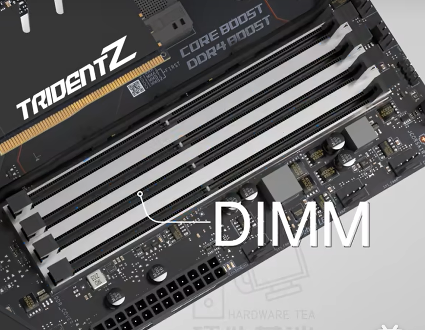
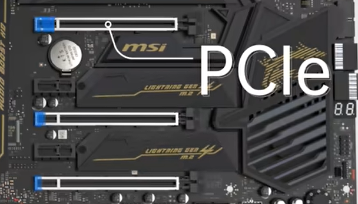

# 装机

电脑介绍

一台电脑主要包括

- CPU：大脑，负责全部的数据处理和运算
  - AMD/inter
- 主板：工作台，连接各部分硬件
  - AMD的主板必须搭配ADM的主板才能使用
    - 锐龙5000及以前用的是AM4插槽主板
    - 锐龙7000使用AM5
  - inter的主板必须搭配inter的主板才能使用
    - 10/11使用LGA1200
    - 12/13LGA1700
  - 使用主板DIMM插槽
- 内存：负责临时存放当前正在运行和计算的数据
  - DDR4
  - 使用主板DIMM插槽

- 显卡：渲染图像并输出给显示器
  - PCle插槽

- 机械/固态
  - 机械硬盘：速度较慢，较为廉价
    - 常见有3.5寸和2.5寸的
    - 接口使用主板sata接口
- 散热
- 电源
- 机箱