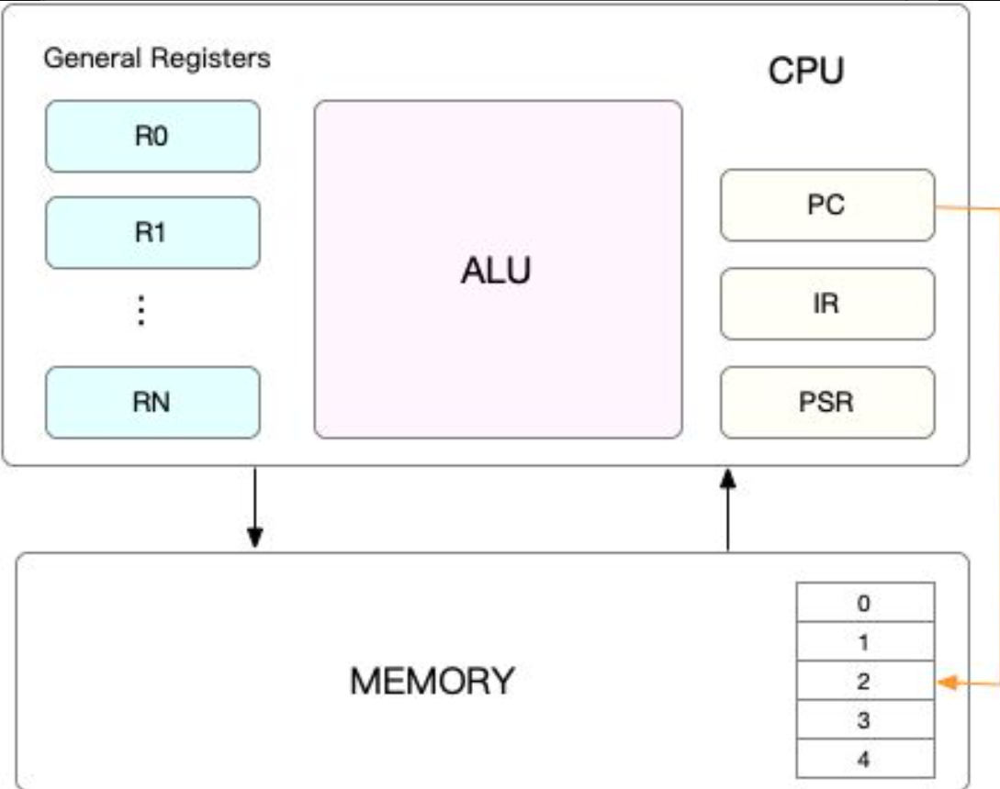
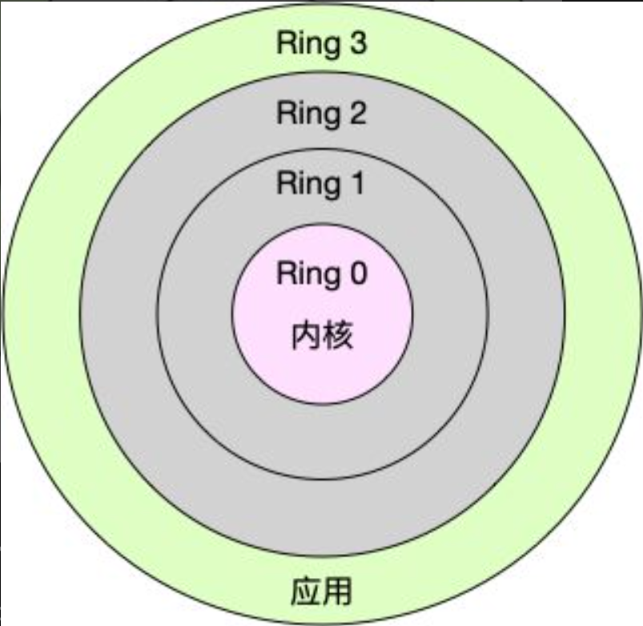

> 本章内容包括：
> - CPU上下文是什么
> - 上下文切换类型
> - 上下文切换与系统调用区别
> - 上下文切换如何影响系统性能
> - 什么时候会发生CPU上下文切换
> - 如何查看系统上下文切换情况


在上一节中讲解了怎么理解平均负载(Load Average)，并用三个案例展示了不同场景下平均负载升高的分析方法。这其中，多个进程竞争就是一个经常被我们忽视的问题。

我想你一定很好奇，进程在竞争 CPU 的时候并没有真正运行，为什么还会导致系统的负载升高呢？看到今天的主题，你应该已经猜到了，CPU 上下文切换就是罪魁祸首。
# 1 CPU上下文

我们都知道，**Linux 是一个多任务操作系统，它支持远大于 CPU 数量的任务同时运行。当然，这些任务实际上并不是真的在同时运行，而是因为系统在很短的时间内，将 CPU 轮流分配给它们，造成多任务同时运行的错觉**。

而在每个任务运行前，**CPU都需要知道任务从哪里运行，也就是说，需要系统事先帮它设置好CPU寄存器和程序计数器(Program Counter，PC)**。

CPU寄存器，是CPU内置的容量小、但速度极快的内存，用于存储正在处理的数据和指令。而程序计数器，则是用来存储CPU正在执行的指令位置、或者即将执行的下一条指令位置。**它们都是CPU在运行任何任务前，必须的依赖环境，因此也被叫做CPU上下文**。


知道了什么是CPU上下文，我想你也很容易理解CPU上下文切换。**CPU上下文切换，就是先把前一个任务的CPU上下文(也就是CPU寄存器和程序计数器)保存起来，然后加载新任务的上下文到这些寄存器和程序计数器，最后再跳转到程序计数器所指向的新位置，运行新任务**。

而这些保存下来的上下文，会存储在系统内核中，并在任务重新调度执行时再次加载进来。这样就能保证任务原来的状态不受影响，让任务看起来还是连续运行。**一般来说会前一个任务的上下文会被存储在该任务的进程控制块(Process Control Block,PCB)或线程控制块(Thread Control Block,TCB)中**。
1. **进程控制块（PCB）**：
    - 每个进程在操作系统中都有一个PCB，PCB是操作系统用来管理进程的主要数据结构。
    - PCB中包含了进程的各种信息，包括进程ID、进程状态、优先级、调度信息、内存管理信息、打开的文件描述符列表、以及CPU上下文（如寄存器值、程序计数器、堆栈指针等）。
2.  **线程控制块（TCB）**：
    - 在多线程环境中，每个线程也有一个TCB，TCB是操作系统用来管理线程的主要数据结构。
    - TCB中包含了线程的各种信息，包括线程ID、线程状态、优先级、调度信息、以及CPU上下文。
# 2 上下文切换类型

我猜肯定会有人说，CPU 上下文切换无非就是更新了 CPU 寄存器的值嘛，但这些寄存器，本身就是为了快速运行任务而设计的，为什么会影响系统的 CPU 性能呢？

在回答这个问题前，不知道你有没有想过，操作系统管理的这些“任务”到底是什么呢？

也许你会说，任务就是进程，或者说任务就是线程。是的，进程和线程正是最常见的任务。但是除此之外，还有没有其他的任务呢？

不要忘了，硬件通过触发信号，会导致中断处理程序的调用，也是一种常见的任务。

所以，根据任务的不用，CPU的上下文切换就可以分为几个不同的场景，也就是**进程上下文切换、线程上下文切换以及中断上下文切换**。
## 2.1 进程上下文切换

Linux按照特权等级，把进程的运行空间分为内核空间和用户空间，分别对应着下图中，CPU特权等级的**Ring 0和Ring 3**。


**内核空间（Ring 0）具有最高权限，可以直接访问所有资源；**

**用户空间（Ring 3）只能访问受限资源，不能直接访问内存等硬件设备，必须通过系统调用陷入到内核中，才能访问这些特权资源。**
> 在计算机系统中，特权等级（Privilege Levels）用于控制不同代码段的访问权限和执行权限，以确保系统的安全性和稳定性。特权等级通常与处理器的硬件支持和操作系统的设计密切相关。在Linux系统中，特权等级主要由处理器的环（Ring）机制来实现。
> 
> 特权等级的主要作用是提供一种机制来隔离和保护系统的不同部分，防止低特权级别的代码（如用户态应用程序）直接访问或修改高特权级别的代码和数据（如内核态代码和数据）。这种隔离机制有助于提高系统的安全性和稳定性。

在x86架构中，特权等级分为四个环（Ring），从Ring 0到Ring 3，特权等级依次降低：

1. **Ring 0**：
    
    - 最高特权级别，通常用于操作系统内核。
    - 可以执行所有指令，包括特权指令，访问所有硬件资源。
    - 在Linux中，内核代码运行在Ring 0。
2. **Ring 1**：
    
    - 次高特权级别，通常用于操作系统服务或驱动程序。
    - 现代操作系统（包括Linux）通常不使用这个级别，而是将所有内核代码都放在Ring 0。
3. **Ring 2**：
    
    - 中等特权级别，类似于Ring 1，通常用于操作系统服务或驱动程序。
    - 现代操作系统通常不使用这个级别。
4. **Ring 3**：
    
    - 最低特权级别，通常用于用户态应用程序。
    - 只能执行非特权指令，不能直接访问硬件资源。
    - 在Linux中，用户态应用程序运行在Ring 3。

换个角度看，也就是说，进程既可以在用户空间运行，又可以在内核空间中运行。进程在用户空间运行时，被称为**进程的用户态**，而陷入内核空间的时候，被称为**进程的内核态**。

**从用户态到内核态的转变，需要通过系统调用来完成**。比如，当我们查看文件内容时，就需要多次系统调用来完成：首先调用 open() 打开文件，然后调用 read() 读取文件内容，并调用write() 将内容写到标准输出，最后再调用close() 关闭文件。

那么，系统调用的过程有没有发生 CPU 上下文的切换呢？答案自然是肯定的。

**CPU 寄存器里原来用户态的指令位置，需要先保存起来。接着，为了执行内核态代码，CPU 寄存器需要更新为内核态指令的新位置。最后才是跳转到内核态运行内核任务。**

而系统调用结束后，CPU寄存器需要恢复原来保存的用户态，然后再切换到用户空间，继续运行进程。所以，**一次系统调用的过程，其实是发生了两次 CPU 上下文切换**。

> **当一个进程在内核态执行系统调用时，内核态代码会在同一个进程的上下文中运行**。不同的系统调用处理函数之间的切换不会涉及到进程级别的上下文切换，因为它们都在同一个进程的内核栈上运行。
> 
> 如果在内核态执行系统调用期间，内核需要切换到另一个进程（例如，由于时间片用尽或等待I/O操作），那么会发生进程级别的上下文切换。这种情况下，当前进程的内核态上下文会被保存到进程控制块（PCB）中，调度器会选择另一个进程运行，并恢复该进程的上下文。

不过，需要注意的是，**系统调用过程中，并不会涉及到虚拟内存等进程用户态的资源，也不会切换进程**。这跟我们通常所说的进程上下文切换是不一样的：
- 进程上下文切换，是指一个进程切换到另一个进程运行。
- 而系统调用过程中一直是同一个进程在运行。

所以**系统调用过程通常被称为特权模式切换，而不是上下文切换。但实际上，系统调用过程中，CPU的上下文切换还是无法避免的。**

那么，进程上下文切换跟系统调用又有什么区别呢？

首先，你需要知道，**进程是由内核来管理和调度的，进程的切换只能发生在内核态。所以，进程的上下文不仅包括了虚拟内存、栈、全局变量等用户空间的资源，还包括了内核堆栈、寄存器等内核空间的状态**。

因此，进程的上下文切换就比系统调用时多了一步：在保存当前进程的内核状态和CPU寄存器之前，需要先把该进程的虚拟内存、栈等保存下来；而加载了下一进程的内核态后，还需要刷新进程的虚拟内存和用户栈。

如下图所示，保存上下文和恢复上下文的过程并不是“免费”的，需要内核在 CPU 上运行才能完成。


根据 Tsuna 的测试报告，**每次上下文切换都需要几十纳秒到数微秒的 CPU 时间**。这个时间还是相当可观的，特别是在进程上下文切换次数较多的情况下，**很容易导致 CPU 将大量时间耗费在寄存器、内核栈以及虚拟内存等资源的保存和恢复上，进而大大缩短了真正运行进程的时间**。这也正是上一节中我们所讲的，导致平均负载升高的一个重要因素。

另外，我们知道， **Linux 通过 TLB（Translation Lookaside Buffer）来管理虚拟内存到物理内存的映射关系。当虚拟内存更新后，TLB 也需要刷新，内存的访问也会随之变慢。特别是在多处理器系统上，缓存是被多个处理器共享的，刷新缓存不仅会影响当前处理器的进程，还会影响共享缓存的其他处理器的进程**。
### 2.1.1 什么时候会发生进程上下文切换

知道了进程上下文切换潜在的性能问题后，我们再来看，究竟什么时候会切换进程上下文。

显然，进程切换时才需要切换上下文，换句话说，只有在进程调度的时候，才需要切换上下文。Linux 为每个 CPU 都维护了一个就绪队列，将活跃进程（即正在运行和正在等待CPU的进程）按照优先级和等待 CPU 的时间排序，然后选择最需要 CPU 的进程，也就是优先级最高和等待CPU时间最长的进程来运行。

那么，进程在什么时候才会被调度到 CPU 上运行呢？

**最容易想到的一个时机，就是进程执行完终止了，它之前使用的CPU会释放出来，这个时候再从就绪队列里，拿一个新的进程过来运行。其实还有很多其他场景，也会触发进程调度，在这里我给你逐个梳理下**。

其一，为了保证所有进程可以得到公平调度，CPU时间被划分为一段段的时间片，这些时间片再被轮流分配给各个进程。这样，当某个进程的时间片耗尽了，就会被系统挂起，切换到其它正在等待 CPU 的进程运行。

其二，进程在系统资源不足（比如内存不足）时，要等到资源满足后才可以运行，这个时候进程也会被挂起，并由系统调度其他进程运行。
> 当系统资源不足时，可能会发生OOM killer。OOM Killer的目的是通过终止一个或多个进程来释放内存，以便系统能够继续运行。OOM Killer会选择一些进程进行终止，以尽量减少对系统和用户的影响。

其三，当进程通过睡眠函数 sleep 这样的方法将自己主动挂起时，自然也会重新调度。

其四，当有优先级更高的进程运行时，为了保证高优先级进程的运行，当前进程会被挂起，由高优先级进程来运行。

最后一个，发生硬件中断时，CPU上的进程会被中断挂起，转而执行内核中的中断服务程序。

了解这几个场景是非常有必要的，因为一旦出现上下文切换的性能问题，它们就是幕后凶手。

当系统内存不足且无法通过页面回收和交换机制解决时，内核会检测到OOM状态，进而触发OOM Killer机制。OOM Killer选择要终止的进程时，会综合考虑多个因素。主要的选择策略包括：

1. **内存使用量**：
    
    - OOM Killer倾向于终止那些占用大量内存的进程，因为这样可以一次性释放较多的内存。
2. **进程优先级（oom_score）**：
    
    - 每个进程都有一个`oom_score`值，表示该进程被OOM Killer选中的可能性。`oom_score`值越高，进程越有可能被终止。
    - `oom_score`的计算基于进程的内存使用量、进程的运行时间、进程的优先级等因素。
3. **用户配置（oom_adj 和 oom_score_adj）**：
    
    - 系统管理员可以通过调整`oom_adj`或`oom_score_adj`值来影响OOM Killer的选择。`oom_adj`的值可以在-17到15，`oom_score_adj`值可以在-1000到1000之间，值越高，进程越有可能被终止。
    - 例如，可以将关键系统进程的`oom_score_adj`值设置为-1000，以防止它们被OOM Killer终止。oom_score_adj的值会覆盖oom_adj的值。可以在`/proc/<pid>/oom_score_adj`中配置。
4. **进程类型**：
    
    - OOM Killer通常会优先选择终止用户态进程，而不是内核态进程或系统关键进程。
## 2.2 线程上下文切换

说完了进程的上下文切换，我们再来看看线程相关的问题。

线程与进程最大的区别在于，**线程是调度的基本单位，而进程则是资源拥有的基本单位**。说白了，所谓内核中的任务调度，实际上的调度对象是线程；而进程只是给线程提供了虚拟内存、全局变量等资源。所以，对于线程和进程，我们可以这么理解：
- 当进程只有一个线程时，可以认为进程就等于线程。
- 当进程拥有多个线程时，这些线程会共享相同的虚拟内存和全局变量等资源。这些资源在上下文切换时是不需要修改的。
- 另外，线程也有自己的私有数据，比如栈和寄存器等，这些在上下文切换时也是需要保存的。

这么一来，线程的上下文切换其实就可以分为两种情况：
- 第一种， 前后两个线程属于不同进程。此时，因为资源不共享，所以切换过程就跟进程上下文切换是一样。
- 第二种，前后两个线程属于同一个进程。此时，因为虚拟内存是共享的，所以在切换时，虚拟内存这些资源就保持不动，只需要切换线程的私有数据、寄存器等不共享的数据。

到这里你应该也发现了，虽然同为上下文切换，但同进程内的线程切换，要比多进程间的切换消耗更少的资源，而这，也正是多线程代替多进程的一个优势。
## 2.3 中断上下文切换

除了前面两种上下文切换，还有一个场景也会切换 CPU 上下文，那就是**中断**。

**为了快速响应硬件的事件，中断处理会打断进程的正常调度和执行，转而调用中断处理程序，响应设备事件。而在打断其他进程时，就需要将进程当前的状态保存下来，这样在中断结束后，进程仍然可以从原来的状态恢复运行**。

跟**进程上下文不同，中断上下文切换并不涉及到进程的用户态**。所以，即便中断过程打断了一个正处在用户态的进程，也不需要保存和恢复这个进程的虚拟内存、全局变量等用户态资源。中断上下文，其实只包括内核态中断服务程序执行所必需的状态，包括CPU 寄存器、内核堆栈、硬件中断参数等。

对**同一个 CPU 来说，中断处理比进程拥有更高的优先级，所以中断上下文切换并不会与进程上下文切换同时发生**。同样道理，由于中断会打断正常进程的调度和执行，所以大部分中断处理程序都短小精悍，以便尽可能快的执行结束。

另外，跟进程上下文切换一样，中断上下文切换也需要消耗CPU，切换次数过多也会耗费大量的CPU，甚至严重降低系统的整体性能。所以，当你发现中断次数过多时，就需要注意去排查它是否会给你的系统带来严重的性能问题。
# 3 怎么查看系统上下文切换情况

通过前面学习我们知道，过多的上下文切换，会把CPU 时间消耗在寄存器、内核栈以及虚拟内存等数据的保存和恢复上，缩短进程真正运行的时间，成了系统性能大幅下降的一个元凶。

既然上下文切换对系统性能影响那么大，你肯定迫不及待想知道，到底要怎么查看上下文切换呢？在这里，我们可以使用 vmstat 这个工具，来查询系统的上下文切换情况。

**vmstat 是一个常用的系统性能分析工具，主要用来分析系统的内存使用情况，也常用来分析 CPU 上下文切换和中断的次数**。

比如，下面就是一个 vmstat 的使用示例：
```bash
# 5秒输出一组数据
$ vmstat 5                                                                                        
procs -----------memory---------- ---swap-- -----io---- -system-- ------cpu-----
 r  b   swpd   free   buff  cache   si   so    bi    bo   in   cs us sy id wa st
 2  0      0 24243528 460672 6242752    0    0     0     6    0    0  3  0 97  0  0
 1  0      0 24241460 460672 6242760    0    0     0   418 4334 5964  6  0 94  0  0
 1  0      0 24242088 460672 6242776    0    0     0    24 4276 5675  6  0 93  0  0
 1  0      0 24241904 460672 6242780    0    0     0    82 4244 5826  6  0 94  0  0
```
在这里，我重点强调下，需要特别关注的四列内容：
- cs(context switch)是每秒上下文切换的次数。
- in(interrupt)则是每秒中断的次数。
- r(Running or Runnable)就绪队列的长度，也就是正在运行和等待CPU的进程数。
- b(Blocked)则是处于不可中断睡眠状态的进程数。

vmstat 只给出了系统总体的上下文切换情况，要想查看每个进程的详细情况，就需要使用我们前面提到过的 pidstat 了。给它加上 -w 选项，你就可以查看每个进程上下文切换的情况了。
```bash
# 每隔5秒输出1组数据 
$ pidstat -w 5 
Linux 4.15.0 (ubuntu) 09/23/18 _x86_64_ (2 CPU) 
08:18:26 UID PID cswch/s nvcswch/s Command 
08:18:31 0 1 0.20 0.00 systemd 
08:18:31 0 8 5.40 0.00 rcu_sched ...
```
这个结果中有两列内容是我们的重点关注对象。一个是 cswch ，表示每秒自愿上下文切换（voluntary context switches）的次数，另一个则是 nvcswch ，表示每秒非自愿上下文切换（non voluntary context switches）的次数。

这两个概念你一定要牢牢记住，因为它们意味着不同的性能问题：

所谓**自愿上下文切换，是指进程无法获取所需资源，导致的上下文切换。比如说， I/O、内存等系统资源不足时，就会发生自愿上下文切换**。

而**非自愿上下文切换，则是指进程由于时间片已到等原因，被系统强制调度，进而发生的上下文切换。比如说，大量进程都在争抢 CPU 时，就容易发生非自愿上下文切换**。
# 4 案例分析

知道了怎么查看这些指标，另一个问题又来了，上下文切换频率是多少次才算正常呢？别急着要答案，同样的，我们先来看一个上下文切换的案例。通过案例实战演练，你自己就可以分析并找出这个标准了。

今天的案例，我们将使用 sysbench 来模拟系统多线程调度切换的情况。

sysbench 是一个多线程的基准测试工具，一般用来评估不同系统参数下的数据库负载情况。当然，在这次案例中，我们只把它当成一个异常进程来看，作用是模拟上下文切换过多的问题。

预先安装 sysbench 和 sysstat 包。

安装完成后，你可以先用 vmstat 看一下空闲系统的上下文切换次数：
```bash
# 间隔1秒后输出1组数据 
$ vmstat 1 1 
procs -----------memory---------- ---swap-- -----io---- -system-- ------cpu----- 
r b swpd free buff cache si so bi bo in cs us sy id wa st 
0 0 0 6984064 92668 830896 0 0 2 19 19 35 1 0 99 0 0
```
这里你可以看到，现在的上下文切换次数 cs 是35，而中断次数 in 是19，r和b都是0。因为这会儿我并没有运行其他任务，所以它们就是空闲系统的上下文切换次数。
## 4.1 操作和分析

首先，在第一个终端里运行 sysbench ，模拟系统多线程调度的瓶颈：
```bash
# 以10个线程运行5分钟的基准测试，模拟多线程切换的问题 
$ sysbench --threads=10 --max-time=300 threads run
```

接着，在第二个终端运行 vmstat ，观察上下文切换情况：
```bash
# 每隔1秒输出1组数据（需要Ctrl+C才结束） 
$ vmstat 1 procs -----------memory---------- ---swap-- -----io---- -system-- ------cpu----- 
r b swpd free buff cache si so bi bo in cs us sy id wa st 
6 0 0 6487428 118240 1292772 0 0 0 0 9019 1398830 16 84 0 0 0 
8 0 0 6487428 118240 1292772 0 0 0 0 10191 1392312 16 84 0 0 0
```
你应该可以发现，cs 列的上下文切换次数从之前的 35 骤然上升到了 139 万。同时，注意观察其他几个指标：
- r 列：就绪队列的长度已经到了 8，远远超过了系统 CPU 的个数 2，所以肯定会有大量的 CPU 竞争。
- us（user）和 sy（system）列：这两列的CPU 使用率加起来上升到了 100%，其中系统 CPU 使用率，也就是 sy 列高达 84%，说明 CPU 主要是被内核占用了。
- in 列：中断次数也上升到了1万左右，说明中断处理也是个潜在的问题。

综合这几个指标，我们可以知道，系统的就绪队列过长，也就是正在运行和等待CPU的进程数过多，导致了大量的上下文切换，而上下文切换又导致了系统 CPU 的占用率升高。

那么到底是什么进程导致了这些问题呢？

我们继续分析，在第三个终端再用 pidstat 来看一下， CPU 和进程上下文切换的情况：
```bash
# 每隔1秒输出1组数据（需要 Ctrl+C 才结束） 
# -w参数表示输出进程切换指标，而-u参数则表示输出CPU使用指标 
$ pidstat -w -u 1 
08:06:33 UID PID %usr %system %guest %wait %CPU CPU Command 
08:06:34 0 10488 30.00 100.00 0.00 0.00 100.00 0 sysbench 
08:06:34 0 26326 0.00 1.00 0.00 0.00 1.00 0 kworker/u4:2 

08:06:33 UID PID cswch/s nvcswch/s Command 
08:06:34 0 8 11.00 0.00 rcu_sched 
08:06:34 0 16 1.00 0.00 ksoftirqd/1 
08:06:34 0 471 1.00 0.00 hv_balloon 
08:06:34 0 1230 1.00 0.00 iscsid 
08:06:34 0 4089 1.00 0.00 kworker/1:5 
08:06:34 0 4333 1.00 0.00 kworker/0:3 
08:06:34 0 10499 1.00 224.00 pidstat 
08:06:34 0 26326 236.00 0.00 kworker/u4:2 
08:06:34 1000 26784 223.00 0.00 sshd
```
从pidstat的输出你可以发现，CPU 使用率的升高果然是 sysbench 导致的，它的 CPU 使用率已经达到了 100%。但上下文切换则是来自其他进程，包括非自愿上下文切换频率最高的 pidstat ，以及自愿上下文切换频率最高的内核线程kworker 和 sshd。

不过，细心的你肯定也发现了一个怪异的事儿：pidstat 输出的上下文切换次数，加起来也就几百，比 vmstat 的 139 万明显小了太多。这是怎么回事呢？难道是工具本身出了错吗？

别着急，在怀疑工具之前，我们再来回想一下，前面讲到的几种上下文切换场景。其中有一点提到， Linux 调度的基本单位实际上是线程，而我们的场景 sysbench 模拟的也是线程的调度问题，那么，是不是 pidstat 忽略了线程的数据呢？

通过运行 man pidstat ，你会发现，pidstat 默认显示进程的指标数据，加上 -t 参数后，才会输出线程的指标。

所以，我们可以在第三个终端里， Ctrl+C 停止刚才的 pidstat 命令，再加上 -t 参数，重试一下看看：
```bash
# 每隔1秒输出一组数据（需要 Ctrl+C 才结束） 
# -wt 参数表示输出线程的上下文切换指标 
$ pidstat -wt 1 
08:14:05 UID TGID TID cswch/s nvcswch/s Command 
... 
08:14:05 0 10551 - 6.00 0.00 sysbench 
08:14:05 0 - 10551 6.00 0.00 |__sysbench 
08:14:05 0 - 10552 18911.00 103740.00 |__sysbench 
08:14:05 0 - 10553 18915.00 100955.00 |__sysbench 
08:14:05 0 - 10554 18827.00 103954.00 |__sysbench ...
```
现在你就能看到了，虽然 sysbench 进程（也就是主线程）的上下文切换次数看起来并不多，但它的子线程的上下文切换次数却有很多。看来，上下文切换罪魁祸首，还是过多的 sysbench 线程。

我们已经找到了上下文切换次数增多的根源，那是不是到这儿就可以结束了呢？

当然不是。不知道你还记不记得，前面在观察系统指标时，除了上下文切换频率骤然升高，还有一个指标也有很大的变化。是的，正是中断次数。中断次数也上升到了1万，但到底是什么类型的中断上升了，现在还不清楚。我们接下来继续抽丝剥茧找源头。

既然是中断，我们都知道，它只发生在内核态，而 pidstat 只是一个进程的性能分析工具，并不提供任何关于中断的详细信息，怎样才能知道中断发生的类型呢？

没错，那就是从 /proc/interrupts 这个只读文件中读取。/proc 实际上是 Linux 的一个虚拟文件系统，用于内核空间与用户空间之间的通信。/proc/interrupts 就是这种通信机制的一部分，提供了一个只读的中断使用情况。

我们还是在第三个终端里， Ctrl+C 停止刚才的pidstat 命令，然后运行下面的命令，观察中断的变化情况：
```bash
# -d 参数表示高亮显示变化的区域 
$ watch -d cat /proc/interrupts CPU0 CPU1 ... 
RES: 2450431 5279697 Rescheduling interrupts ...
```
观察一段时间，你可以发现，变化速度最快的是重调度中断（RES）​，这个中断类型表示，唤醒空闲状态的 CPU 来调度新的任务运行。这是多处理器系统（SMP）中，调度器用来分散任务到不同 CPU 的机制，通常也被称为处理器间中断（Inter-Processor Interrupts，IPI）​。

所以，这里的中断升高还是因为过多任务的调度问题，跟前面上下文切换次数的分析结果是一致的。

**现在再回到最初的问题，每秒上下文切换多少次才算正常呢？**

**这个数值其实取决于系统本身的 CPU 性能**。如果系统的上下文切换次数比较稳定，那么从数百到一万以内，都应该算是正常的。但当上下文切换次数超过一万次，或者切换次数出现数量级的增长时，就很可能已经出现了性能问题。

这时，你还需要根据上下文切换的类型，再做具体分析。比方说：

自愿上下文切换变多了，说明进程都在等待资源，有可能发生了 I/O 等其他问题；

非自愿上下文切换变多了，说明进程都在被强制调度，也就是都在争抢 CPU，说明 CPU 的确成了瓶颈；

中断次数变多了，说明 CPU 被中断处理程序占用，还需要通过查看 /proc/interrupts 文件来分析具体的中断类型。