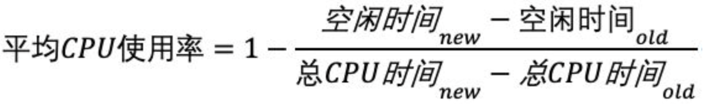

# 1 节拍率
Linux 作为一个多任务操作系统，将每个 CPU 的时间划分为很短的时间片，再通过调度器轮流分配给各个任务使用，因此造成多任务同时运行的错觉。

为了维护 CPU 时间，Linux 通过事先定义的节拍率（内核中表示为 HZ）​，触发时间中断，并使用全局变量 Jiffies 记录了开机以来的节拍数。每发生一次时间中断，Jiffies 的值就加 1。

节拍率 HZ 是内核的可配选项，可以设置为100、250、1000 等。不同的系统可能设置不同数值，你可以通过查询 /boot/config 内核选项来查看它的配置值。例如，我的系统中就是1000，代表着每秒触发1000次时间中断。
```bash
$ sudo grep "CONFIG_HZ=" /boot/config-$(uname -r)
CONFIG_HZ=1000
```

同时，正因为节拍率 HZ 是内核选项，所以用户空间程序并不能直接访问。为了方便用户空间程序，内核还提供了一个用户空间节拍率USER_HZ，它总是固定为 100，也就是1/100秒。这样，用户空间程序并不需要关心内核中 HZ 被设置成了多少，因为它看到的总是固定值USER_HZ。一般来说，该值记录在内核头文件`/usr/include/asm/param.h`中。
```bash
$ sudo grep 'HZ' /usr/include/asm/param.h 
#ifndef HZ
#define HZ 100
```
# 2 CPU使用率

CPU 使用率，就是除了空闲时间外的其他时间占总 CPU 时间的百分比。

Linux 通过 /proc 虚拟文件系统，向用户空间提供了系统内部状态的信息，而 /proc/stat 提供的就是系统的 CPU 和任务统计信息。常用的性能查询工具中的CPU使用率就是通过这里的信息进行计算的。
```bash
$ sudo grep "^cpu" /proc/stat
cpu  211127928 655 33380145 11066886901 1142825 0 645558 0 0 0
cpu0 2612512 68 1712618 702004008 75464 0 423290 0 0 0
cpu1 4290320 32 2569654 700641068 52328 0 107432 0 0 0
```
第一列是CPU的编号，cpu则是所有CPU的总和，后面几列则是不同场景下CPU的累加节拍数，详细信息可以在`man proc`中找到`/proc/stat`部分进行查看。

因为USER_HZ一般都是100，所以每秒钟各个cpu中的`Jiffiles`会增加100，而性能工具计算的时候一般会取间隔几秒，然后计算。不然stat文件中是开机以来的总节拍数，如果直接计算，计算出来的是开机以来的平均CPU使用率。

# 3 CPU使用率过高怎么办？

通过一些常用的性能工具，如top、pidstat能很轻松的排查出CPU使用率较高的进程，但如果想知道究竟是代码中的哪个函数占用较高，需要用到GDB和perf这两个工具。

GDB（The GNU Project Debugger）​， 这个功能强大的程序调试利器在调试程序错误方面很强大。但是GDB调试程序的过程会中断程序运行，不能轻易在线上环境使用，一般要先找到出问题的大致函数后才能在线下进一步调试函数内部的问题。

而想找到出问题的大致函数，就要使用到perf工具了。perf 是 Linux 2.6.31以后内置的性能分析工具。它以性能事件采样为基础，不仅可以分析系统的各种事件和内核性能，还可以用来分析指定应用程序的性能问题。下面介绍两种常见用法。

第一种常见用法是 perf top，类似于 top，它能够实时显示占用 CPU 时钟最多的函数或者指令，因此可以用来查找热点函数，使用界面如下所示：
```
$ perf top 
Samples: 833 of event 'cpu-clock', Event count (approx.): 97742399 
Overhead Shared Object Symbol 
7.28% perf [.] 0x00000000001f78a4 
4.72% [kernel] [k] vsnprintf 
4.32% [kernel] [k] module_get_kallsym 
3.65% [kernel] [k] _raw_spin_unlock_irqrestore ...
```
输出结果中，第一行包含三个数据，分别是采样数（Samples）、事件类型（event）和事件总数量（Event count）​。比如这个例子中，perf 总共采集了 833 个 CPU 时钟事件，而总事件数则为 97742399。

采样数要特别注意，如果采样数过少，那么参考价值就会大大减低。

再往下看是一个表格式样的数据，每一行包含四列，分别是：
- Overhead：该符号的性能事件在所有采样中的比例
- Shared：该函数或指令所在的动态共享对象，如内核、进程名、动态链接库名、内核模块名等。
- Object：动态共享对象的类型。比如[.] 表示用户空间的可执行程序、或者动态链接库，而 [k] 则表示内核空间。
- Symbol：最后一列 Symbol 是符号名，也就是函数名。当函数名未知时，用十六进制的地址来表示。

接着再来看第二种常见用法，也就是 perf record 和 perf report。 perf top 虽然实时展示了系统的性能信息，但它的缺点是并不保存数据，也就无法用于离线或者后续的分析。而 perf record 则提供了保存数据的功能，保存后的数据，需要你用 perf report 解析展示。
```bash
perf record -p 370213 -g -- sleep 100  # 收集100s数据
perf report -i perf.data --stdio > perf_report.txt  # 解析生成的数据导出为文件
```


