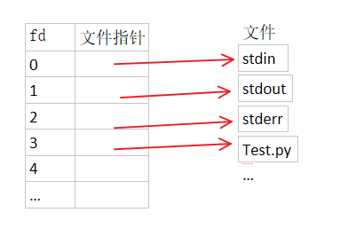
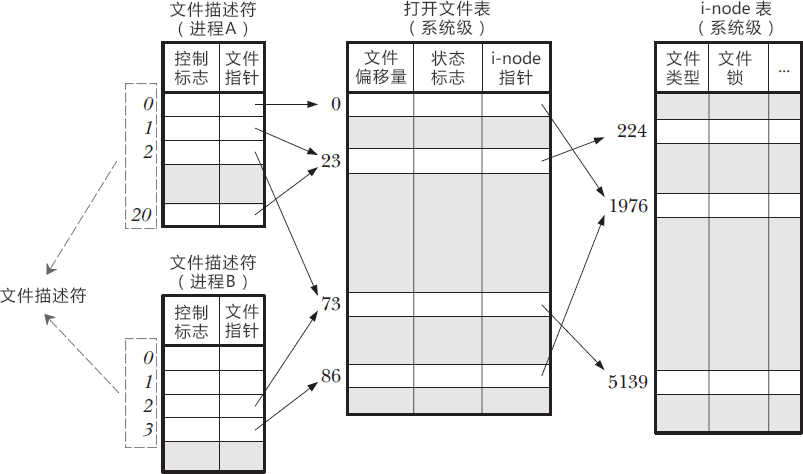

**​文件描述符（File Descriptor, fd）本身是一个用户态可见的整数标识符，但它本质上是一个指向内核态资源的“句柄”

# 1 fd是用户态和内核态之间的桥梁

- ​**​用户态视角​**​：fd 是一个非负整数（如 `0`, `1`, `2`, `3`, ...），由进程通过 `open()`, `socket()`, `accept()`, `pipe()`等系统调用获得。进程使用这个整数作为参数，通过系统调用（如 `read()`, `write()`, `close()`）来操作对应的资源（文件、套接字、管道等）。
    
- ​**​内核态视角​**​：这个整数 ​**​不是资源本身​**​，而是进程用来索引其​**​进程级文件描述符表​**​的​**​下标​**​。这张表是内核为​**​每个进程​**​单独维护的。
# 2 Linux中的文件描述符

我们知道在Linux系统中一切皆可以看成是文件，文件又可分为：普通文件、目录文件、链接文件和设备文件。在操作这些所谓的文件的时候，我们每操作一次就找一次名字，这会耗费大量的时间和效率。所以Linux中规定每一个文件对应一个索引，这样要操作文件的时候，我们直接找到索引就可以对其进行操作了。

文件描述符（file descriptor）就是内核为了高效管理这些已经被打开的文件所创建的索引，其是一个非负整数（通常是小整数），用于指代被打开的文件，所有执行I/O操作的系统调用都通过文件描述符来实现。同时还规定系统刚刚启动的时候，0是标准输入，1是标准输出，2是标准错误。这意味着如果此时去打开一个新的文件，它的文件描述符会是3，再打开一个文件文件描述符就是4……

Linux内核对所有打开的文件有一个文件描述符表格，里面存储了每个文件描述符作为索引与一个打开文件相对应的关系，简单理解就是下图这样一个数组，文件描述符（索引）就是文件描述符表这个数组的下标，数组的内容就是指向一个个打开的文件的指针。


**上面只是简单理解，实际上关于文件描述符，Linux内核维护了3个数据结构**：

- 进程级的文件描述符表
- 系统级的打开文件描述符表
- 文件系统的i-node表

一个 Linux 进程启动后，会在内核空间中创建一个 PCB 控制块，PCB 内部有一个文件描述符表（File descriptor table），记录着当前进程所有可用的文件描述符，也即当前进程所有打开的文件。进程级的描述符表的每一条记录了单个进程所使用的文件描述符的相关信息，进程之间相互独立，一个进程使用了文件描述符**3**，另一个进程也可以用**3**。除了进程级的文件描述符表，系统还需要维护另外两张表：打开文件表、i-node 表。这两张表存储了每个打开文件的打开文件句柄（open file handle）。一个打开文件句柄存储了与一个打开文件相关的全部信息。

**系统级的打开文件描述符表：**

- 当前文件偏移量（调用read()和write()时更新，或使用lseek()直接修改）
- 打开文件时的标识（open()的flags参数）
- 文件访问模式（如调用open()时所设置的只读模式、只写模式或读写模式）
- 与信号驱动相关的设置
- 对该文件i-node对象的引用，即i-node 表指针

**文件系统的i-node表：**

- 文件类型（例如：常规文件、套接字或FIFO）和访问权限
- 一个指针，指向该文件所持有的锁列表
- 文件的各种属性，包括文件大小以及与不同类型操作相关的时间戳



```bash
# 系统级文件描述符限制
$ sudo sysctl -p|grep fs
fs.file-max = 3260276

# 用户级文件描述符限制
$ ulimit -n             
204800
```
# 3 实际场景
## 3.1 删除文件

**场景：** 有时候在我们删除一个文件后，使用 `df -h` 命令去查看磁盘空间发现没变。

> 删除原理

在Linux中有两个计数器用来控制文件是否能被删除，i_count和i_nlink。

- i_count：表示当前文件被调用的数量。

- i_nlink：表示当前inode的硬链接数。

在Linux使用rm命令删除一个文件，所做的其实就两步：

1. 减少inode中的硬链接数。

2. 清除对应的目录项。（实际就是减少硬链接数）

Linux删除文件的实质实际上是清除对应的目录项，并且把系统维护的inode位图和块位图把该文件使用的数据块标志为可用。在删除文件时，Linux会判断i_count和i_nlink计数器是否为0，如果为0才会把inode位图和块位图标志为可用。

当我们使用rm删除一个文件时，只是减少了i_nlink计数器的值，但i_count计数器的值不为0的话，Linux同样不会把inode位图和块位图标志为可用，这就导致了磁盘空间并没有被实际清理成功。

那块位图和df命令显示的磁盘空间使用率之间有什么关系呢？

df 命令显示的磁盘可用率基于文件系统元数据结构（例如超级块）来报告总块数、已用块数和可用块数。但超级块中的可用块数是根据块位图（block bitmap）来更新的，所以一旦文件被进程所占用，就算使用rm命令对其进行删除，底层的数据块也不会被释放，df命令显示的磁盘使用率仍然不会下降。

> 解决

1. kill 掉进程释放占用
2. lsof +L1 | grep deleted 查看占用但被删除的文件
    1. 使用 > 进行清空
    2. trancate -s 0 清空