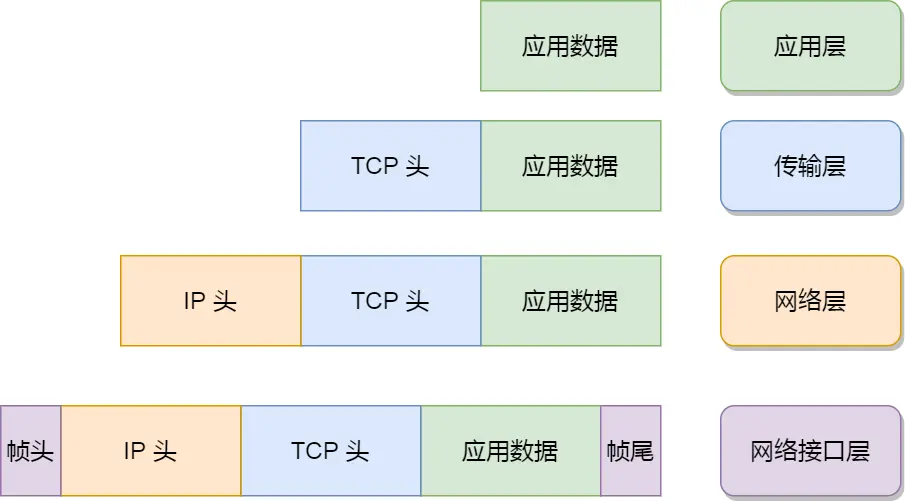
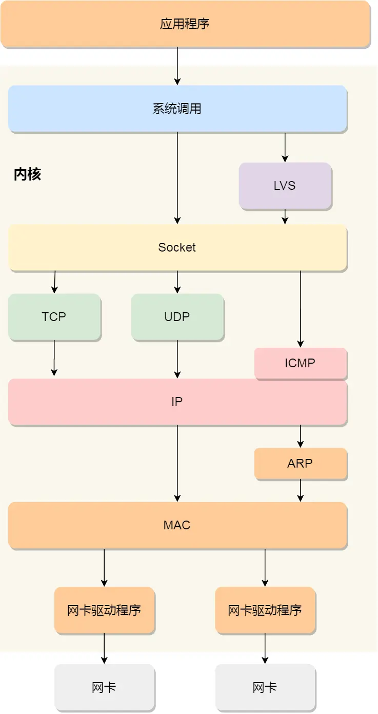

# 网络分层

为了使得多种设备能通过网络相互通信，和为了解决各种不同设备在网络互联中的兼容性问题，国际标准化组织制定了开放式系统互联通信参考模型（Open System Interconnection Reference Model），也就是 OSI 网络模型，该模型主要有 7 层，分别是应用层、表示层、会话层、传输层、网络层、数据链路层以及物理层。 每一层负责的职能都不同，如下： 

- 应用层，负责给应用程序提供统一的接口； 
- 表示层，负责把数据转换成兼容另一个系统能识别的格式； 
- 会话层，负责建立、管理和终止表示层实体之间的通信会话；
- 传输层，负责端到端的数据传输； 
- 网络层，负责数据的路由、转发、分片；
- 数据链路层，负责数据的封帧和差错检测，以及 MAC 寻址； 
- 物理层，负责在物理网络中传输数据帧；

OSI七层模型只提出了理论，没有具体的实践。用的最多的TCP/IP四层模型，从上到下分别是：应用层、传输层、网络层、网络接口层。

- 应用层：提供具体的应用，如http，ftp，dns等
- 传输层：提供端到端通信，有tcp、udp等
- 网络层：负责网络包的封装、切片、路由、转发，有ip，icmp等
- 网络接口层：负责网络包在物理网络中的传输，提供网络包封帧、mac寻址、差错检测，以及通过网卡传输网络帧。
# Linux网络协议栈

应用数据会从应用层一层一层往下封装，如下图所示：

每一层封装都会加对应的头部或尾部信息。都有固定的格式。每次封装都会增加包的长度，但物理网络中并不能允许无限制大小的包传输，而是有一个限定大小 `MTU`，目前默认的大小为1500字节，超过就得切片。这就形成了一个个的网络包，如果 `MTU` 太小导致切分的包过多就会导致网络吞吐效率下降，反之提升。

Linux网络协议栈大概长如下图所示：

- 本图分为两个部分，白色的用户空间和黄色的内核空间。
- 当应用程序发送请求时，需要请求系统调用从用户空间到系统空间。
- socket是应用程序与网络协议栈之间的​**​标准抽象接口​**​。无论程序使用何种协议（TCP/UDP），它都通过Socket来操作，由Socket层来决定将数据分发给后面的哪条处理路径。
- socket会判断Socket类型，来将数据分发给不同的传输层协议。ICMP这是一种特殊的​**​网络层​**​协议，并非由应用程序直接发起，而是由内核自身用于传递​**​控制​**​和​**​错误消息​**​（如 `ping` 命令用的回显请求）。
- 由传输层处理后的数据包会交给IP协议进行处理。
- 封装好IP头后，会将数据交给网络接口层。如果本机没有记录目标主机的MAC地址，会触发ARP协议请求MAC地址（ARP只有在触发的时候生效）。
- 最终数据由网卡驱动程序交由网卡进行物理网络的传输。

​**​LVS (Linux Virtual Server)​**​ 是一个特殊路径，它代表了Linux内核提供的​**​负载均衡​**​功能。

- 它位于内核中，同样通过​**​系统调用​**​接口接受指令。
- 它的流量​**​不经过​**​本机完整的TCP/UDP协议栈进行处理，而是由LVS模块直接根据预设的负载均衡规则（如NAT、DR、TUN等模式）进行转发，直接交给 ​**​IP​**​ 层发送出去。
- 这条路径表明，本机不仅可以作为网络的​**​终点​**​（应用程序处理数据），还可以作为网络的​**​中转站​**​（转发数据）。
# Linux接收网络包的流程

网卡是计算机中的一个硬件，专门用来收发网络包。当收到一个网络包后，会通过DMA技术将包数据复制到内存，也就是 `ring buffer` 中。

> CPU如何知道有数据到达？

最简单的方式是使用中断，一个网络包来了后发送中断给CPU，让CPU知道有网络包达到。但问题是在高网络并发场景下，会有很多网络包到来，如果每一个网络包到来都发送中断给CPU，那将会拖慢系统整体的处理效率。

> CPU硬件设计上，中断的优先级高于任何用户态和内核的指令。当CPU接收到一个中断后，会在当前指令结束后立刻停止该线程的执行，无论时间片是否用完。

所以LInux在2.6时引入 `NAPI` 机制进行处理。这个方法采用的是 【中断+轮询】的方式进行，它的核心概念就是**不采用中断的方式读取数据**，而是首先采用中断唤醒数据接收的服务程序，而后使用 `poll` 方式来轮询数据。

当网卡接收到网络包后，会使用DMA把数据写到指定内存中，然后网卡会发送硬件中断给CPU，CPU接收到中断后会根据中断表去调用注册的中断处理函数。

- 暂时屏蔽中断，告诉网卡内存中已经有数据了，下次有包来直接往内存中写即可，不需要再发送中断给CPU了
- 恢复屏蔽的中断

到这里硬件中断做的事情就结束了，接下来是软中断要处理的事情了。

> 软中断

内核中的ksoftirqd线程专门用来出来软中断的处理。当ksoftirqd接收到软中断后，就会轮询处理数据。

ksoftirqd 线程会从 Ring Buffer 中获取一个数据帧，用 sk_buff 表示，从而可以作为一个网络包交给网络协议栈进行逐层处理。

> 网络协议栈对网络包的处理

