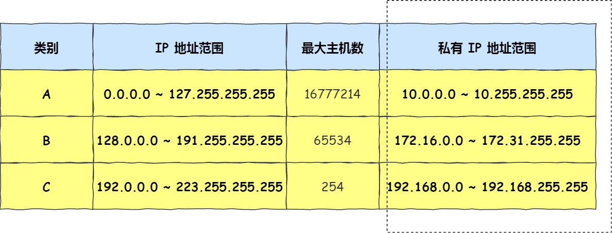

当在命令行执行`ping baidu.com`命令并返回结果的时候，这个过程中具体都发生了什么呢？

大致分为以下几个步骤：

1. **域名解析**：
   - 首先，操作系统会将域名`baidu.com`转换为IP地址。这个过程通常是通过DNS解析完成的，操作系统会查询本地DNS缓存或者向本地DNS服务器发起DNS查询请求来获取`baidu.com`的IP地址。
2. **建立ICMP连接**：
   - 一旦获取到`baidu.com`的IP地址（假设为`220.181.38.148`），操作系统会使用ICMP（Internet Control Message Protocol，互联网控制报文协议）来执行ping命令，即发送ICMP Echo Request消息到目标IP地址。
   - ICMP是一种网络协议，用于在IP网络上发送控制消息，比如ping命令就是通过ICMP来实现的。
3. **发送ICMP Echo Request**：
   - 操作系统构造一个ICMP Echo Request消息，并将其封装在一个IP数据包中。这个IP数据包的目标IP地址为`220.181.38.148`，源IP地址为本地计算机的IP地址。
   - 操作系统使用网络接口（如以太网卡）将封装好的IP数据包发送到本地网络。
4. **路由选择**：
   - 网络设备（如路由器）根据目标IP地址`220.181.38.148`进行路由选择，决定将数据包发送到互联网上。
5. **传输到目标主机**：
   - 经过一系列的路由跳转，IP数据包最终到达`220.181.38.148`对应的主机，即百度的服务器。
6. **处理ICMP Echo Request**：
   - 目标主机收到ICMP Echo Request消息后，会生成一个ICMP Echo Reply消息作为响应。
   - 目标主机使用自己的IP地址作为源地址，将ICMP Echo Reply消息封装在一个IP数据包中，并发送回源IP地址，即本地计算机的IP地址。
7. **接收和解析ICMP Echo Reply**：
   - 本地计算机的操作系统接收到来自目标主机的ICMP Echo Reply消息。
   - 操作系统解析ICMP Echo Reply消息，检查其中的信息，比如响应时间、TTL（Time to Live，生存时间）等。
8. **显示结果**：
   - 操作系统将解析得到的信息呈现给用户，包括目标主机的IP地址、响应时间、TTL等信息。

大致是以上步骤，接下来我们说说每个步骤的细节

### DNS解析

DNS通信可以使用UDP或TCP协议。通常情况下，DNS查询使用UDP，只有在传输大量数据或响应包超过512字节时才回使用TCP。

DNS查询使用递归查询方式，先查询本地DNS服务器，如果没有，则递归向根域名服务器，TLD服务器和权威域名服务器。


### 公私网划分

公网IPv4地址范围是从1.0.0.0到223.255.255.255（除去保留地址和特殊用途地址）。

IPv4私网地址范围是：

- 10.0.0.0 到 10.255.255.255（CIDR表示为10.0.0.0/8）
- 172.16.0.0 到 172.31.255.255（CIDR表示为172.16.0.0/12）
- 192.168.0.0 到 192.168.255.255（CIDR表示为192.168.0.0/16）



### Supervisor

Supervisor是一个进程管理工具，可以通过配置文件或者命令行来管理进程。

通常在/etc/supervisor/supervisord.conf可以在这里根据自己需求编辑，指定要管理的进程以及相应的配置参数

在Supervisor配置文件中，你需要添加你要管理的进程的配置。每个进程通常由一个 `[program:名称]` 区块来定义。例如：

```
[program:myapp]
command=/path/to/your/app --option1 value1
directory=/path/to/your/app/directory
autostart=true
autorestart=true
user=myuser
```

然后通过`supervisorctl`

```
supervisorctl start myapp
```


在 CentOS 中，可以通过修改 `/etc/nsswitch.conf` 文件来改变系统对 hosts 文件的解析方式。

```
hosts:      files dns myhostname
```


