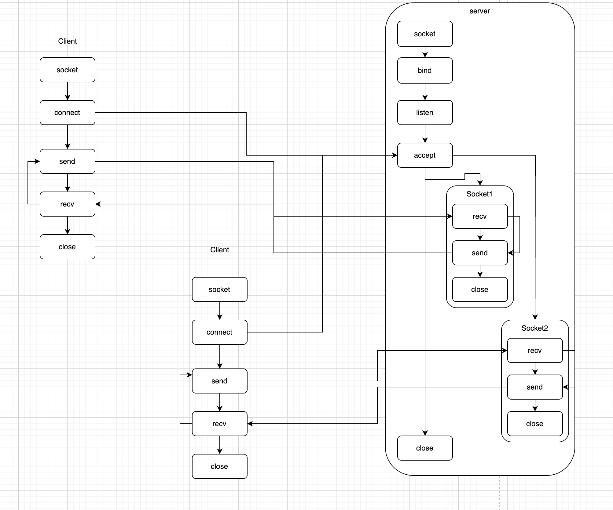

- 网络通信解决的是什么问题？
    - 解决应用程序之间的通信问题
    - 每个应用程序都要有自己的socket对象

- c/s模型
    - clent：主动发送请求
    - server：被动接收请求，响应有组织的数据

- TCP：传输控制协议
- UDP：报文传输协议
 
 - socket是什么？
    - 套接字
    - 一般应用程序会起一个监听socket
    - 对每个连接会创建一个已连接socket
    - 每个socket会有自己的文件描述符
    - 主要设计理念是为了提高并发能力

一般来说socket编程分为以下几个步骤

server

- 创建socket对象
- 绑定ip和端口
- 监听
- accetp从连接队列中取连接
- recv/senf数据
- 关闭监听socket

client：

- 创建socket对象
- 向指定地址发送连接请求
- recv/senf数据
- 关闭连接socket

socket五元组：

∙协议 (Protocol)​​：TCP 或 UDP。

∙源 IP 地址 (Source IP Address)​​：本地主机的 IP。

∙源端口号 (Source Port)​​：本地应用程序使用的端口。

∙目标 IP 地址 (Destination IP Address)​​：通信对象的 IP。

∙目标端口号 (Destination Port)​​：通信对象应用程序监听的端口。

监听socket只有前面三个，因为不需要知道目标IP和端口，目的就是为了等一个连接。socket虽然有fd，但跟磁盘上的文件还是不太一样的，fd直接指向的是底层的连接信息，是在操作内核中的数据结构。通过让文件描述符指向一个特殊的 inode，而这个 inode 又关联到内核 Socket 对象，Linux 实现了用操作文件的接口（read/write）来操作网络连接。这简化了编程模型。

为什么不关闭已连接socket？

- 一般来说，小程序在最后才会关闭监听socket，而整个主线程的结束会导致所有连接关闭，已连接socket也会随之关闭
- 但如果是长时间运行的程序，必须手动关闭每一个已连接socket。否则会导致fd资源耗尽

客户端的主动断开只会触发TCP协议层的连接终止流程（四次挥手），这会改变服务端内核中对应Socket的状态，并通知正在读写该Socket的服务端应用程序。但是，​**​服务端应用程序仍然必须主动调用 `close()`函数来释放这个Socket所占用的资源（文件描述符和内存）。​**

- 连接过程图



- 全连接和半连接队列
    - 半连接队列：在接收到客户端SYN请求后操作系统会放入半连接队列
    - 全连接队列：服务端发送ACK并接收到客户端ACK后会放入全连接队列等待应用程序accept函数取连接
    - [Linux半连接队列和全连接队列](Linux半连接队列和全连接队列.md)

- 如果不从连接队列中拿连接会怎么样？
    - ​**​在 `accept`函数调用之前，等待的连接是以“数据结构”的形式存在于操作系统内核的TCP协议栈中
    - **它们是以 `struct request_sock`或 `struct sock`等内核数据结构的形式，存在于操作系统内核协议栈的TCP模块中的两个队列里。**
    - 客户端的IP地址和端口号
    - 本地（服务器）的IP地址和端口号
    - TCP的状态序列号（SEQ, ACK numbers）
    - 各种TCP定时器
# B/S编程

- B/**Browser**：浏览器
- S/**Server**：服务端

B/S 架构严格依赖于 ​**​HTTP​**​ 或 ​**​HTTPS​**​ 协议进行通信。

Response：header\r\n\r\nbody
 
- 纯文本协议
- header:第一行\r\n其他行
    - 第一行：协议 status status说明
    - 头信息说明：
- body

- 第一版：多线程+阻塞IO
    - connect peer thread
    - 遇到IO会阻塞
    - 线程的创建/销毁开销很大
        - 线程池 复用线程
            - 预加载：在任务提交之前，线程池就提前创建并初始化所有核心线程。
            - 懒加载：核心线程只有在有任务提交时才会被创建，而不是在线程池创建时就初始化。对用户不太友好
            - 不能解决大量请求同时响应问题：IO多路复用
    - 线程的内存分配
    - 线程的切换成本

```python
# testwebserverbythread.py
import random  
import socket  
import threading  
import time  
  
response="""\  
HTTP/1.1 200 OK  
Content-Type: text/html  
Content-Length: {}  
X-Server: testwebserverbythread  
Connection: keep-alive  
  
"""  
  
def get_response():  
    with open("index.html","rb") as f:  
        response_body = f.read()  
        html = response_body.replace(b"{{}}",str(random.randint(1,100)).encode())  
        return response.format(len(html)).replace("\n","\r\n").encode()+html  
  
def fn3(conn: socket.socket):  
    try:  
        data  = conn.recv(1024)  
        if not data:  
            print(conn.getpeername(),"closed")  
            return  
        print(str(data))  
        conn.sendall(get_response())  
    except Exception as e:  
        print(e)  
    finally:  
        conn.close()  
  
  
def fn2(s: socket.socket):  
    while True:  
  
        conn, raddr = s.accept()  
  
        threading.Thread(target=fn3,args=(conn,),daemon=True,name="recv").start()  
  
  
if __name__ == '__main__':  
    server = socket.socket()  
    server.bind(('127.0.0.1',8088))  
    server.listen()  
  
    threading.Thread(target=fn2,args=(server,),name="accept").start()  
  
  
    while True:  
        time.sleep(20)  
        print([ t.name for t in threading.enumerate() ])
```

- 第二版：线程池

1. **​资源高效利用​**​：通过线程复用降低系统开销
    
2. ​**​响应速度提升​**​：任务无需等待线程创建
    
3. ​**​系统稳定性增强​**​：防止资源耗尽和系统过载
    
4. ​**​功能丰富​**​：支持多种任务执行策略和调度方式
    
5. ​**​可管理性提高​**​：提供统一的线程管理和监控接口

```python
import concurrent.futures  
import random  
import socket  
import threading  
import time  
  
response="""\  
HTTP/1.1 200 OK  
Content-Type: text/html  
Content-Length: {}  
X-Server: testwebserverbythread  
Connection: keep-alive  
  
"""  
  
def get_response():  
    with open("index.html","rb") as f:  
        response_body = f.read()  
        html = response_body.replace(b"{{}}",str(random.randint(1,100)).encode())  
        return response.format(len(html)).replace("\n","\r\n").encode()+html  
  
def fn3(conn: socket.socket):  
    try:  
        data  = conn.recv(1024)  
        if not data:  
            print(conn.getpeername(),"closed")  
            return  
        print(str(data))  
        conn.sendall(get_response())  
    except Exception as e:  
        print(e)  
    finally:  
        conn.close()  
  
  
def fn2(s: socket.socket):  
    while True:  
  
        conn, raddr = s.accept()  
  
        # threading.Thread(target=fn3,args=(conn,),daemon=True,name="recv").start()  
        pool.submit(fn3,conn)  
  
if __name__ == '__main__':  
    pool = concurrent.futures.ThreadPoolExecutor(max_workers=100) # 创建线程池,懒加载  
  
    server = socket.socket()  
    server.bind(('127.0.0.1',8088))  
    server.listen()  
  
    pool.submit(fn2,server)  
  
    while True:  
        time.sleep(20)  
        print([ t.name for t in threading.enumerate() ])
```
# IO

IO过程分为两个阶段：

1. 把数据从设备复制到内核空间缓冲区
2. 把数据从内核空间缓冲区复制到用户空间进程缓冲区

应用程序被加载到内存成为程序的时候会分配一些内存空间

- 一些内存空间只能操作系统使用，小一些，内核态，编译后的指令叫特权指令。
- 一些内存空间程序使用，大一些，用户态，编译后的指令叫用户指令
ring0环，ring0特权级别，可以访问所有内存，用户指令在ring3，只能访问用户态

以读取f.read()为例，底层调用syscall系统调用函数。编程语言的操作系统函数（通常称为​**​系统调用​**​）的本质，就是应用程序向操作系统内核发出的一个​**​正式请求或通知​**​，要求操作系统代表它执行一个它自己无权直接执行的特权操作。

1. 把慢外设的数据复制到内核态 DMA完成，完成后中断通知CPU
2. CPU把数据复制到用户态


同步/异步：看最终结果
    同步：当下直接拿最终结果
    异步：拿最终结果，但给了一个凭据，可以在后面某一个时段拿数据，至于拿不拿程序自己决定

阻塞/非阻塞：看行为卡不卡
    阻塞：没有拿到预期结果，卡住，不做其他事情，直到拿到预期结果
    非阻塞：没有拿到预期结果，不卡住，可以做其他事情

同步/异步/阻塞/非阻塞又能形成四种组合：
    同步阻塞：不拿到最终结果就一直卡住。多线程可以解决
    同步非阻塞：不拿到最终结果不卡住，但没有后续加工数据，重复要最终结果。不推荐
    异步阻塞：给凭据也一直卡住，直到拿到最终数据。不推荐
    异步非阻塞：给凭据后不卡住。
        可以一直询问是否有最终数据：轮询
        可以等叫号凭据取数据：订阅
        可以留预案好了之后执行：回调callback